# Kalustokuvasto

## havittajat-ja-torjuntakoneet

### Sukhoi Su-35S
#### Kuvamateriaali

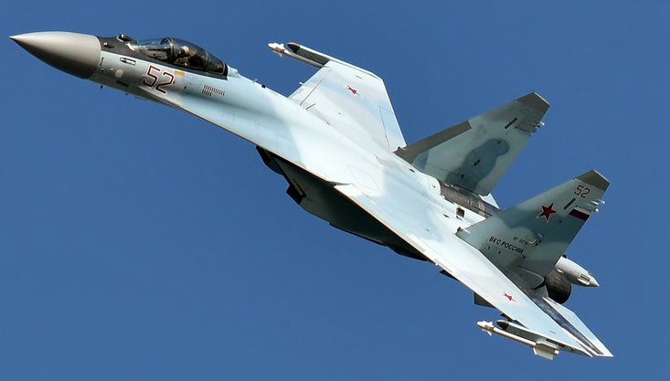

#### Kalustokuvaus
Raskas monitoimihävittäjä, jonka päärooli on ilmaherruuden saavuttaminen, saattotehtävät ja pitkän kantaman ilmataistelu. Kone yhdistää suuren toimintamatkan, korkean kuorman ja superohjautuvuuden, mutta ei ole aidosti matalahavaittava viidennen sukupolven kone.

#### Suorituskyvyt
Pääaseistukseen kuuluu ilma-ilma-aseistus, kuten R-77 (Р-77) ja pitkän kantaman R-37M (Р-37М), sekä ilma-maa-aseistus eri ohjus- ja pommiperheistä. ODINin mukaan R-77:n kantama on noin 90–100 km ja R-37M:n yli 300 km; käytännön osumatodennäköisyys riippuu sensorifuusiosta, maalinosoituksesta ja vastatoimista.

#### Huomioitava analyysiin
Su-35S on Venäjän käytännössä tärkein ei-stealth-ilmaherruusalusta ja toimii usein myös pitkän kantaman ohjuslavettina. Avoimissa lähteissä suorituskykyä korostetaan, mutta todellinen vaikutus riippuu vahvasti tutkaverkosta, A-50/A-50U -tuesta ja asevarastojen laadusta.

#### Operatiiviset rajoitteet
Suuri tutkapinta-ala tekee koneesta näkyvämmän kuin matalahavaittavat vastustajat. Pitkän kantaman taistelukyky heikkenee, jos verkotettu tilannekuva, AWACS-tuki tai nykyaikainen ohjuskalusto eivät ole käytettävissä.

#### L?hteet
- [ODIN: Su-35S (Flanker-M) Russian Air Superiority Fighter](https://odin.tradoc.army.mil/WEG/Asset/fec6885d1280b773496ffd94dcb226a2)
- [ODIN: R-37M (AA-X-13/AA-13 Arrow) Russian Air-to-Air Missile](https://odin.tradoc.army.mil/WEG/Asset/59940359ebacd5953098f01ece89c21e)
- [ODIN: R-77 (AA-12A Adder) Russian Air-to-Air Missile](https://odin.tradoc.army.mil/WEG/Asset/70822f0f2e8de125f5a54a9c42a022ba)

### Sukhoi Su-57
#### Kuvamateriaali
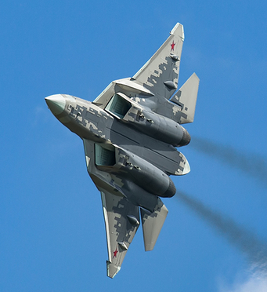
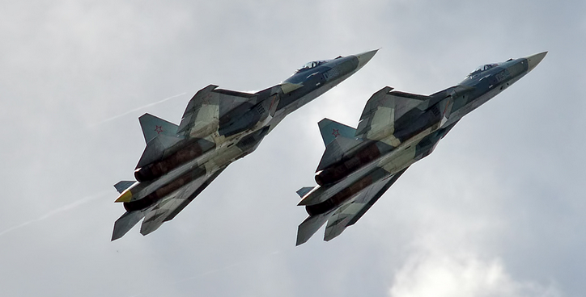

#### Kalustokuvaus
Viidennen sukupolven monitoimihävittäjä, jonka tarkoitus on yhdistää matalahavaittavuus, verkottunut tilannekuva ja moniroolinen aseenkäyttö. Se on Venäjän teknologisesti edistynein hävittäjä, mutta avoimissa lähteissä tuotantomäärät ja todellinen operatiivinen massa näyttävät edelleen rajallisilta.

#### Suorituskyvyt
Su-57 on tarkoitettu käyttämään pitkän kantaman ilma-ilma-aseita sekä moderneja täsmäaseita, kuten Kh-69 (Х-69) ja Kh-38 (Х-38) -sarjoja. ODINin mukaan Kh-69 on noin 290 km luokan ilmasta laukaistava risteilyohjus; tarkat integraatio- ja varastomäärät eivät kuitenkaan ole avoimissa lähteissä täysin läpinäkyviä.

#### Huomioitava analyysiin
Su-57:n merkitys on suhteellisesti suurempi kuin pelkkä lukumäärä, koska se toimii myös teknologian, sensorifuusion ja uusien aseiden käyttöalustana. Analyysissa on syytä erottaa suunniteltu suorituskyky todistetusta taistelukäytöstä.

#### Operatiiviset rajoitteet
Pieni määrä koneita rajoittaa vaikutusta koko ilmasodankäyntiin. Avoin tieto koneen stealth-tasosta, sensorifuusiosta ja tuotantokyvystä on osin ristiriitaista, joten arviot on pidettävä varovaisina.

#### L?hteet
- [ODIN: Su-57 (Felon) Russian Stealth Fighter](https://odin.tradoc.army.mil/WEG/Asset/0dabf5bc7b5370a11075350ea11f38aa)
- [ODIN: Kh-69 (AS-22 Kazoo) Russian Air-Launched Cruise Missile](https://odin.tradoc.army.mil/WEG/Asset/1fd10606b6cd4508495fa1153cd91e87)
- [ODIN: Kh-38 (Kh-38M) Russian Air-to-Surface Missile](https://odin.tradoc.army.mil/WEG/Asset/98140b4781be52bc912e2b5c423a0f76)

### Mikoyan MiG-31
#### Kuvamateriaali

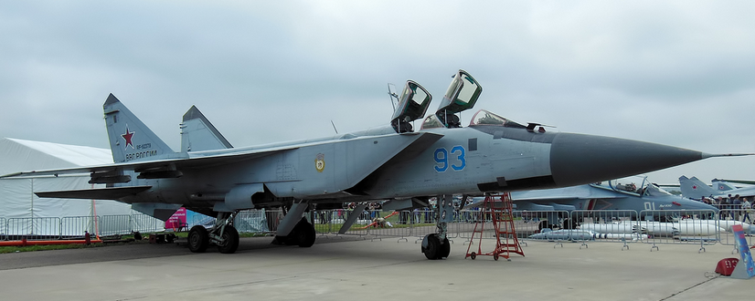

#### Kalustokuvaus
Raskas torjuntahävittäjä, jonka päätehtävä on pitkän kantaman ilmapuolustus, suurten alueiden valvonta ja nopea reagointi korkealla lentäviin maaleihin. Alusta on edelleen relevantti erityisesti nopeuden, korkeussuorituskyvyn ja raskaan ohjuskuorman takia.

#### Suorituskyvyt
MiG-31 käyttää pitkän kantaman ilma-ilma-ohjuksia, erityisesti R-37M (Р-37М), jonka ODIN ilmoittaa yli 300 km kantaman luokkaan. Osaa MiG-31-varianttien rooleista on laajennettu myös erikoisaseiden kuljetukseen, mutta tämä ei koske kaikkia perusmallin koneita.

#### Huomioitava analyysiin
MiG-31 on ennen kaikkea ilmatilan sulkija ja pitkän kantaman torjunta-alusta, ei moniroolihävittäjä länsimaisessa merkityksessä. Sen arvo kasvaa, kun se toimii verkottuneena maa- ja ilmavalvonnan kanssa.

#### Operatiiviset rajoitteet
Suuri koko ja näkyvyys rajoittavat selviytymistä moderneja vastustajia vastaan ilman tukea. Koneen tehokkuus riippuu vahvasti tutkasta, datalinkistä ja pitkän kantaman ohjusten saatavuudesta.

#### L?hteet
- [ODIN: MiG-31 (Foxhound) Russian Interceptor/Attack Aircraft](https://odin.tradoc.army.mil/WEG/Asset/a4669ef1dd64227e040b5bfc32b11855)
- [ODIN: R-37M (AA-X-13/AA-13 Arrow) Russian Air-to-Air Missile](https://odin.tradoc.army.mil/WEG/Asset/59940359ebacd5953098f01ece89c21e)

### Mikoyan MiG-29
#### Kuvamateriaali
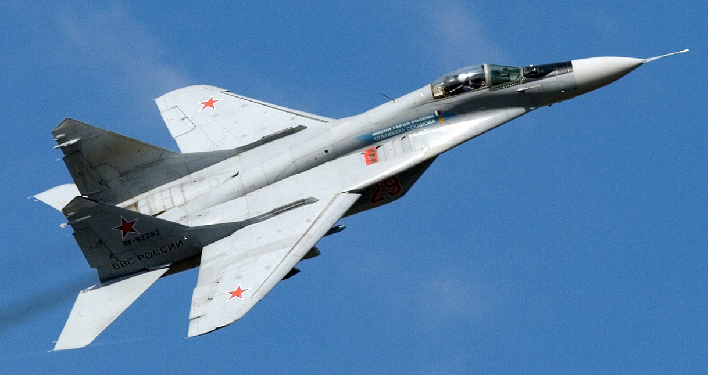

#### Kalustokuvaus
Neljännen sukupolven kaksimoottorinen hävittäjä, jota on käytetty ensisijaisesti ilmaherruuden saavuttamiseen ja lähialueen ilmapuolustukseen. Venäjän käytössä se edustaa vanhempaa mutta edelleen käyttökelpoista Fulcrum-perhettä, jonka rooli on osin väistynyt uudemmille MiG-31-, Su-30- ja Su-35-koneille.

#### Suorituskyvyt
Suunniteltu lyhyen ja keskipitkän kantaman ilmataisteluun sekä rajattuun ilma-maa-käyttöön. Aseistus ja avionics vaihtelevat voimakkaasti alaversioittain, joten suorituskyky pitää arvioida aina varianttikohtaisesti.

#### Huomioitava analyysiin
Avoimissa lähteissä MiG-29:n venäläiskäyttö kuvataan usein sekoittuneena SMT-, UB- ja muiden modernisoitujen versioiden kanssa. Pelkkä “MiG-29” ei siksi vielä kerro sensoritasosta, aseintegraatioista tai yksikön todellisesta taisteluarvosta.

#### Operatiiviset rajoitteet
Vanhemmat rungot, lyhyempi toimintasäde ja rajallisempi modernisointitaso heikentävät käyttöä verrattuna uudempaan Flanker-perheeseen. Huollon, varaosien ja modernisointistandardien vaihtelu voi näkyä yksikkökohtaisesti.

#### L?hteet
- [ODIN WEG: MiG-29 (Fulcrum) Russian Multirole Fighter Aircraft](https://odin.tradoc.army.mil/WEG/Asset/8e5ee70c6f22f4df21b8514ebc3a68e9)
- [ODIN WEG – pääsivu](https://odin.tradoc.army.mil/WEG)

### Mikoyan MiG-35
#### Kuvamateriaali
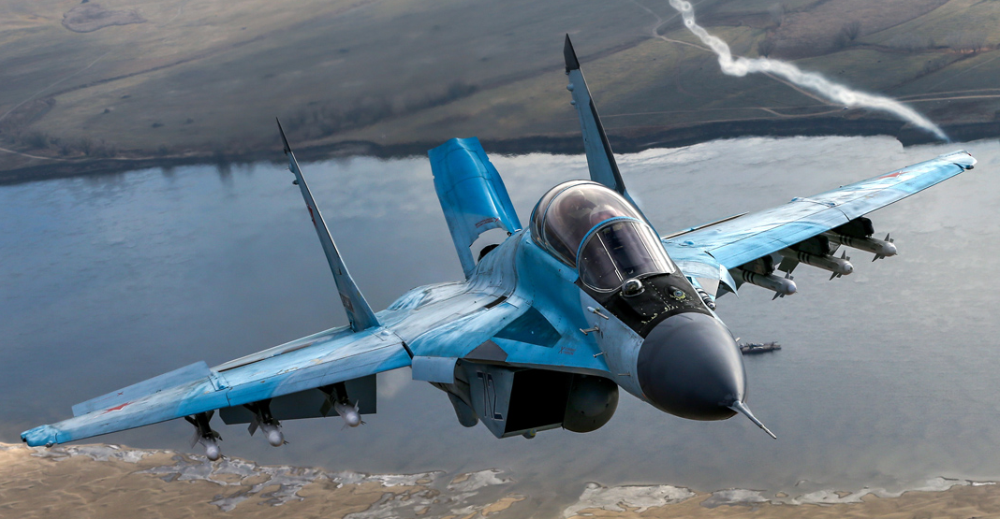

#### Kalustokuvaus
MiG-29-perheen 4++-sukupolven jatkokehitelmä, joka on tarkoitettu monitoimihävittäjäksi korkean intensiteetin toimintaympäristöön. Alusta on suunniteltu taistelemaan ilma-, maa- ja merimaaleja vastaan kaikissa sääoloissa.

#### Suorituskyvyt
Valmistajan mukaan kone kykenee käyttämään moderneja aseita, tekemään tiedustelua ja toimimaan myös ryhmäjohtamisen solmuna. UAC ilmoittaa APAA-tutkan havaitsevan ilmamaaleja enintään noin 160 kilometrin etäisyydeltä, mutta käytännön suorituskyky riippuu maalista ja taisteluympäristöstä.

#### Huomioitava analyysiin
MiG-35 on teknisesti kyvykäs, mutta avoimen lähdeaineiston perusteella sen käyttöönoton mittakaava on jäänyt rajalliseksi verrattuna Su-30/35-linjoihin. Siksi se on analyysissa enemmän niche-kyky kuin VKS:n määrällinen selkäranka.

#### Operatiiviset rajoitteet
Pieni laivuekoko rajoittaa vaikutusta koko ilmavoiman tasolla. Avoimissa lähteissä tuotanto- ja käyttömäärät ovat usein ristiriitaisia, joten operatiivista painoarvoa ei pidä yliarvioida.

#### L?hteet
- [UAC: MiG-35](https://uacrussia.ru/en/aircraft/lineup/military/mig-35/)
- [United Aircraft Corporation – pääsivu](https://uacrussia.ru/en/)

### Sukhoi Su-27
#### Kuvamateriaali
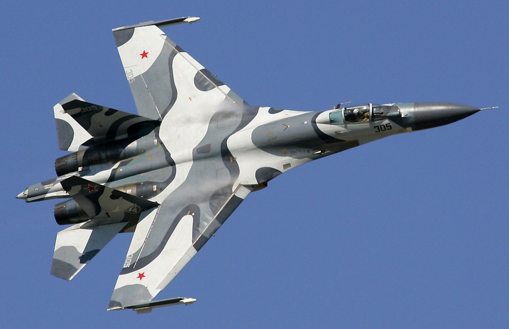

#### Kalustokuvaus
Raskas kaksimoottorinen ilmaherruushävittäjä, joka muodostaa suuren osan venäläisen Flanker-perheen teknisestä perustasta. Sitä on käytetty erityisesti ilmatilan hallintaan, torjuntaan ja pitkän kantaman partiointiin.

#### Suorituskyvyt
Kone tarjoaa hyvän nopeuden, nousukyvyn ja ohjattavuuden erityisesti ilmataistelussa. Vanhemmissa perusversioissa avioniikka ja monitoimisuus jäävät kuitenkin selvästi Su-30-, Su-35- ja Su-57-kaluston alapuolelle.

#### Huomioitava analyysiin
Su-27-perhe on laaja, ja avoimissa lähteissä perus-Su-27, UB, SM ja SM3 voivat esiintyä saman otsikon alla. Analyysissa kannattaa erottaa puhdas ilmaherruuskäyttö modernisoiduista monitoimiversioista.

#### Operatiiviset rajoitteet
Ikääntyvä runkokanta ja osin vanhentunut järjestelmäarkkitehtuuri rajoittavat kasvupotentiaalia. Kone on edelleen relevantti, mutta sen suhteellinen merkitys pienenee modernisoidumman Flanker-kaluston rinnalla.

#### L?hteet
- [ODIN WEG: Su-27 (Flanker) Russian Multirole Fighter Aircraft](https://odin.tradoc.army.mil/WEG/Asset/Su-27_%28Flanker%29_Russian_Multirole_Fighter_Aircraft)
- [ODIN WEG – pääsivu](https://odin.tradoc.army.mil/WEG)

### Sukhoi Su-30
#### Kuvamateriaali
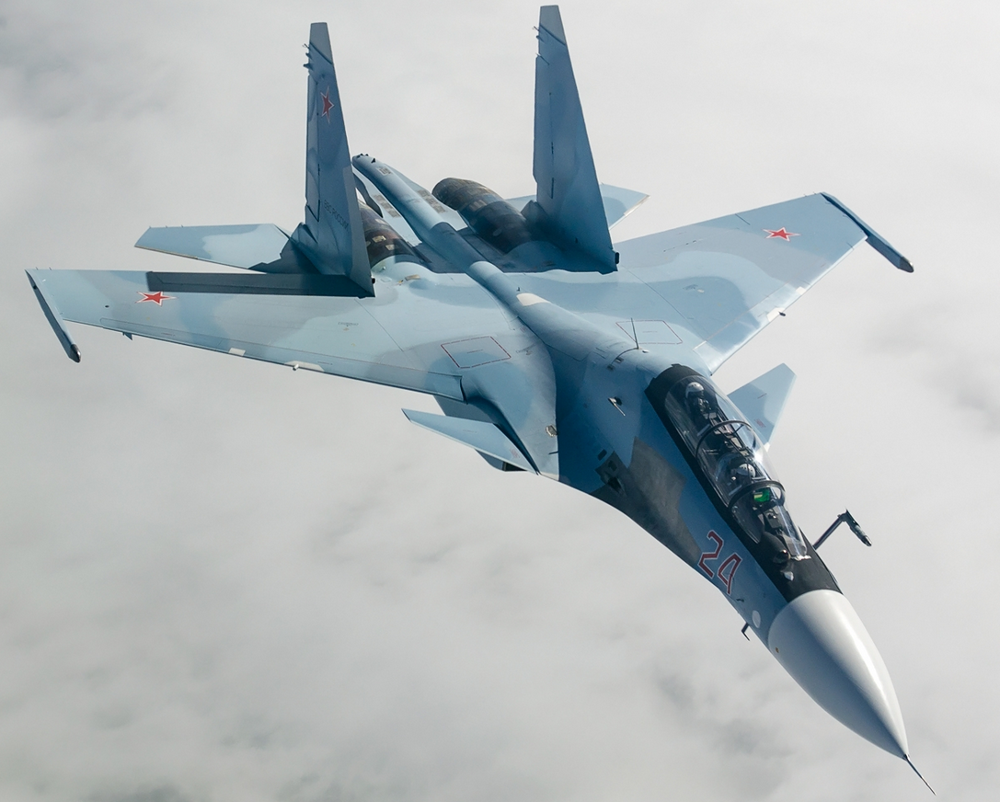

#### Kalustokuvaus
Kaksipaikkainen raskas monitoimihävittäjä, joka yhdistää ilmataistelun, pitkän toimintasäteen ja iskuroolin samaan alustaan. Venäjän käytössä erityisesti Su-30SM/SM2 toimii joustavana yleiskoneena useisiin tehtäväkokonaisuuksiin.

#### Suorituskyvyt
Alus kykenee ilma-ilma- ja ilma-maa-tehtäviin, pitkään partiointiin ja ryhmätoimintaan kahden hengen miehistön ansiosta. Sen vahvuus on monipuolisuus eikä yksittäinen huippuominaisuus, mikä tekee siitä käyttökelpoisen useissa operatiivisissa profiileissa.

#### Huomioitava analyysiin
Su-30 on käytännössä yksi VKS:n tärkeimmistä monitoimialustoista. Variantit ja modernisointitasot vaikuttavat olennaisesti sensoreihin, aseisiin ja verkottumiseen, joten “Su-30” on analyysissa liian yleinen nimike ilman alaversiota.

#### Operatiiviset rajoitteet
Suuri koko ja korkea arvo tekevät koneesta merkittävän tappioherkkyyden näkökulmasta. Suorituskyvyn täysimääräinen hyödyntäminen edellyttää myös toimivaa huoltoa, asevarantoa ja koulutettua miehistöä.

#### L?hteet
- [ODIN WEG: Su-30 (Flanker-C) Russian Multirole Fighter Aircraft](https://odin.tradoc.army.mil/WEG/Asset/Su-30_%28Flanker-C%29_Russian_Multirole_Fighter_Aircraft)
- [UAC: Su-30SME](https://uacrussia.ru/en/aircraft/lineup/military/su-30sme/)

## isku-ja-rynnakkokoneet

### Sukhoi Su-34
#### Kuvamateriaali

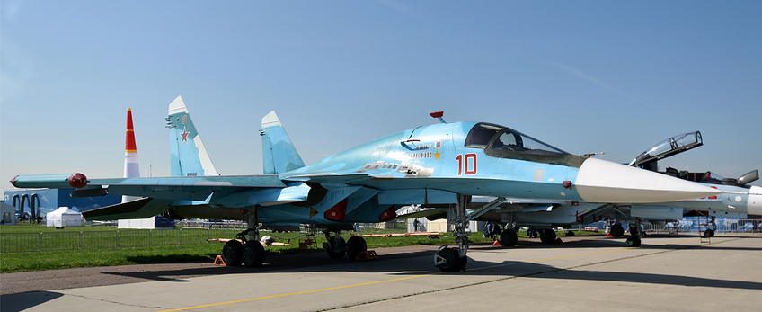

#### Kalustokuvaus
Kaksipaikkainen hävittäjäpommittaja, joka on suunniteltu syvyyssuuntaisiin isku-, pommitus- ja merimaalirooleihin. Alusta painottuu asekuormaan, toimintamatkaan ja huonon sään iskukykyyn enemmän kuin lähitaistelun ilmaherruuteen.

#### Suorituskyvyt
Su-34 kykenee käyttämään ohjattuja pommeja, risteilyohjuksia ja taktisia ilmasta-maahan-ohjuksia, mukaan lukien Kh-38 (Х-38) -sarjan aseet. ODINin mukaan Kh-38 on tarkoitettu erityisesti modernien venäläisten iskuhävittäjien aseeksi; kantama vaihtelee versiosta riippuen, joten avoin lähdeaineisto ei tue yhtä varmaa arvoa kaikille alaversioille.

#### Huomioitava analyysiin
Su-34 on yksi Venäjän keskeisistä taktisen syväiskun alustoista. Analyysissa kannattaa erottaa rungon oma suorituskyky siitä, mitä aseita, maalinosoitusta ja elektronista suojautumista kullakin lennolla oikeasti on mukana.

#### Operatiiviset rajoitteet
Kone ei ole matalahavaittava ja sen selviytyminen riippuu pitkälti stand-off-aseista, häirinnästä ja ilmapuolustuksen aukkojen hyödyntämisestä. Avoimissa lähteissä yksittäisten asepakettien ja sensorikokonaisuuksien tiedot ovat osin puutteellisia.

#### L?hteet
- [ODIN: Su-34 (Fullback) Russian Fighter-Bomber Aircraft](https://odin.tradoc.army.mil/WEG/Asset/Su-34%20%28Fullback%29%20Russian%20Fighter-Bomber%20Aircraft)
- [ODIN: Kh-38 (Kh-38M) Russian Air-to-Surface Missile](https://odin.tradoc.army.mil/WEG/Asset/98140b4781be52bc912e2b5c423a0f76)
- [ODIN: KAB-500 Series of Russian Fire and Forget Bombs](https://odin.tradoc.army.mil/WEG/Asset/KAB-500_Series_of_Russian_Fire_and_Forget_Bombs)

### Sukhoi Su-24
#### Kuvamateriaali
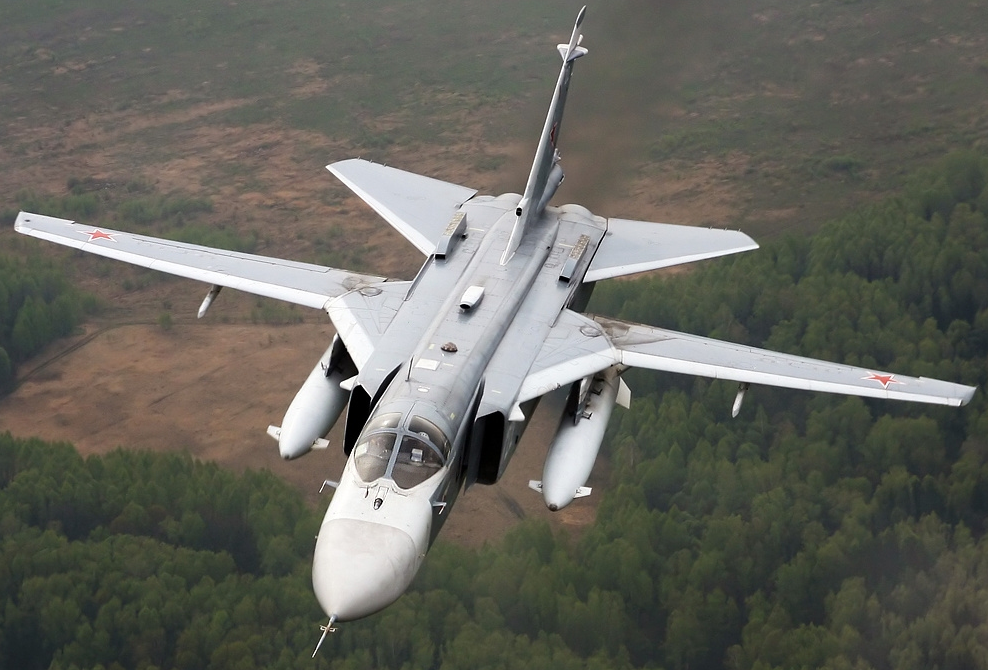

#### Kalustokuvaus
Muuttuvasiipinen taktinen pommittaja ja iskuhävittäjä, joka on suunniteltu matalalla suoritettaviin all-weather-iskuihin. Se edustaa vanhempaa mutta edelleen käyttökelpoista syväisku- ja interdiktioalustaa.

#### Suorituskyvyt
Kone kykenee kantamaan laajaa pommi- ja ohjuskuormaa sekä toimimaan huonossakin säässä. Sen vahvuus on iskujärjestelmän kantama ja kuormankantokyky, mutta ei nykyaikaisen monitoimihävittäjän sensorifuusio tai selviytymiskyky.

#### Huomioitava analyysiin
Su-24 on yhä relevantti silloin, kun painopiste on massassa, asekuormassa ja pitkään vakiintuneissa iskuprofiileissa. Avoimissa lähteissä modernisoidut Su-24M/M2-versiot pitää erottaa vanhemmista koneista.

#### Operatiiviset rajoitteet
Ikääntyvä suunnittelu, suurempi havaittavuus ja korkea haavoittuvuus nykyaikaista ilmatorjuntaa vastaan rajoittavat käyttöä korkeauhkaympäristössä. Se soveltuu paremmin tilanteisiin, joissa vastapuolen ilmapuolustus on jo kulutettu tai hajautettu.

#### L?hteet
- [ODIN WEG: Su-24 (Fencer) Russian Attack Aircraft](https://odin.tradoc.army.mil/WEG/Asset/659cb131aaa8324369448bfc5ba60c7e)
- [ODIN WEG – pääsivu](https://odin.tradoc.army.mil/WEG)

### Sukhoi Su-25
#### Kuvamateriaali
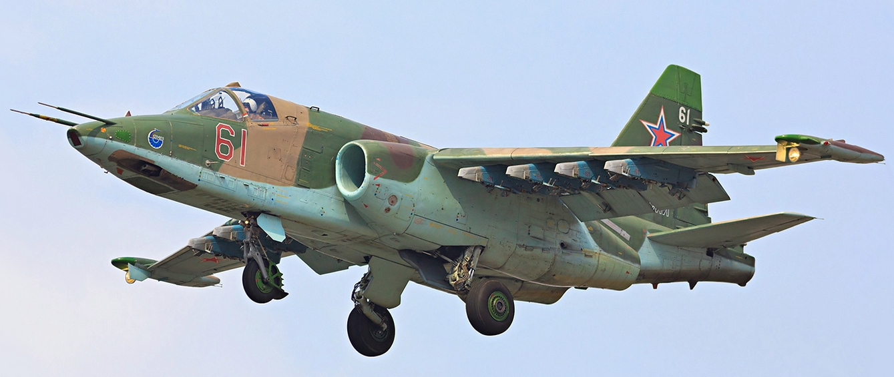

#### Kalustokuvaus
Panssaroitu lähitukikone, joka on suunniteltu tukemaan maavoimia suoraan taistelukentän läheisyydessä. Sen ydinrooli on iskujen antaminen maaleihin, joita vastaan tarvitaan kestävä ja yksinkertainen hyökkäysalusta.

#### Suorituskyvyt
Kone kantaa tyypillisesti raketteja, pommeja, tykkiaseistusta ja osassa versioita täsmäaseita. Sen vahvuus on kyky operoida vaativissa kenttäolosuhteissa ja kestää taisteluvaurioita paremmin kuin moni nopeampi hävittäjä.

#### Huomioitava analyysiin
Su-25:n arvo syntyy erityisesti CAS-roolissa, mutta avoimissa lähteissä eri modernisointitasot kuten SM- ja SM3-versiot menevät usein sekaisin. Varianttitunnistus on tärkeä, koska se vaikuttaa suuresti tähtäys- ja omasuojakykyyn.

#### Operatiiviset rajoitteet
Hidas ja matalalla toimiva profiili altistaa koneen MANPADS- ja lyhyen kantaman ilmatorjuntauhille. Ilman tehokasta SEAD-/DEAD-tukea tappioriski kasvaa nopeasti.

#### L?hteet
- [Britannica: Sukhoi](https://www.britannica.com/topic/Sukhoi)
- [Britannica: Attack aircraft](https://www.britannica.com/technology/attack-aircraft)

## strategiset-pommittajat

### Tupolev Tu-160
#### Kuvamateriaali
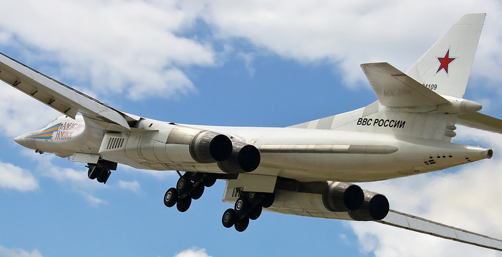
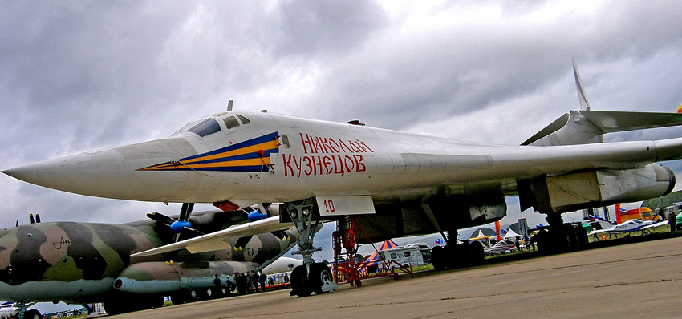

#### Kalustokuvaus
Strateginen yliäänipommikone, jonka päätehtävä on pitkän kantaman risteilyohjusiskut ja ydinpelotteen ilmakomponentin tukeminen. Alusta tarjoaa suuren asekuorman ja pitkän toimintasäteen, mutta sen käyttö painottuu stand-off-aseisiin eikä tunkeutumiseen vahvasti suojattuun ilmatilaan.

#### Suorituskyvyt
Tu-160 käyttää pitkän kantaman ilmasta laukaistavia risteilyohjuksia, joilla voidaan iskeä kaukaa ilman tunkeutumista kohdealueen ilmapuolustukseen. Koneen vahvuus on suuri asekuorma ja korkea nopeus, mutta avoin lähdeaineisto ei aina erittele luotettavasti käytössä olevia ohjusmääriä tai modernisointitason mukaista aseintegraatiota.

#### Huomioitava analyysiin
Tu-160 on ennen kaikkea strateginen ohjuslavetti eikä taktinen pommittaja. Sen operatiivinen arvo liittyy kykyyn tuottaa pitkän kantaman iskupainetta useita uhkasuuntia pitkin.

#### Operatiiviset rajoitteet
Korkean arvon ja pienen määrän järjestelmänä kone on altis valikoidulle kulumiselle, huoltokuormitukselle ja tukikohtariippuvuudelle. Selviytyminen perustuu aseiden kantamaan, ei koneen omaan matalahavaittavuuteen.

#### L?hteet
- [ODIN: Tu-160 (Blackjack) Russian Strategic Bomber](https://odin.tradoc.army.mil/WEG/Asset/2eedc66c20000a6ebf19307d5db7582a)
- [UAC: Tu-160](https://uacrussia.ru/en/aircraft/lineup/strategic/tu-160/)

### Tupolev Tu-95MS
#### Kuvamateriaali

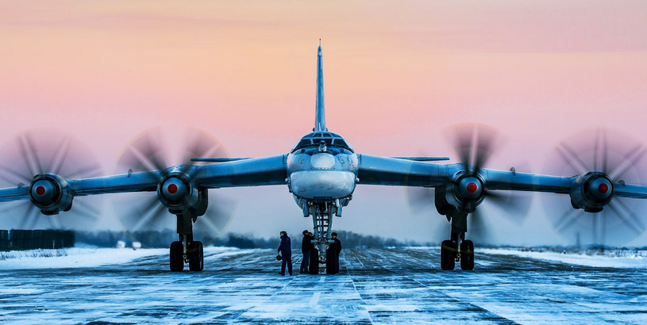

#### Kalustokuvaus
Potkuriturbiininen strateginen pommikone, jota käytetään ennen kaikkea pitkän kantaman risteilyohjusalustana. Vaikka alusta on iäkäs, se säilyttää merkityksensä suurena ja suhteellisen taloudellisena stand-off-iskujen kantolaitteena.

#### Suorituskyvyt
Tu-95MS:n ydinsuorituskyky on pitkän kantaman risteilyohjusten kuljettaminen ja laukaisu turvallisemmalta etäisyydeltä. Koneen omat lento-ominaisuudet eivät tee siitä modernia läpimurtoalustaa, mutta suuri toimintamatka ja asekuorma tukevat strategista iskuroolia.

#### Huomioitava analyysiin
Tu-95MS on edelleen relevantti, koska asejärjestelmä on tärkeämpi kuin rungon ikä. Analyysissa painopiste kannattaa pitää ohjuskuormassa, laukaisuprofiileissa ja tukikohtaketjussa.

#### Operatiiviset rajoitteet
Hidas ja helposti havaittava alusta ei sovellu korkean uhan ilmatilan läpäisyyn. Iäkäs kalusto lisää huolto- ja käytettävyysriskejä, vaikka modernisoidut aseet voivat pitää vaikutuksen edelleen merkittävänä.

#### L?hteet
- [ODIN: Tu-95 (Bear) Russian Strategic Bomber Aircraft](https://odin.tradoc.army.mil/WEG/Asset/Tu-95_%28Bear%29_Russian_Strategic_Bomber_Aircraft)
- [UAC: Tu-95МС](https://uacrussia.ru/en/aircraft/lineup/strategic/tu-95ms/)

### Tupolev Tu-22M3
#### Kuvamateriaali

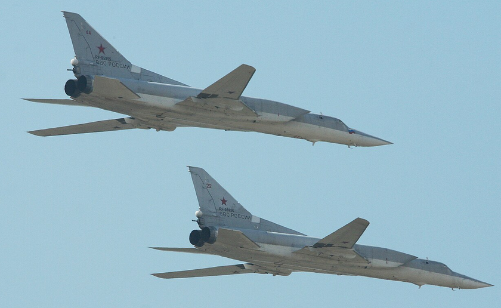

#### Kalustokuvaus
Pitkän kantaman yliääninen pommittaja ja ohjuskantaja, jonka pääroolit ovat merimaali- ja maaiskut sekä operatiivis-strateginen tulenkäyttö. Järjestelmä sijoittuu taktisen ja strategisen ilmasodan väliin ja tarjoaa nopeasti käyttöön saatavan raskaan iskukyvyn.

#### Suorituskyvyt
UAC:n mukaan Tu-22M3 on suunniteltu meri- ja maamaalien tuhoamiseen ohjuksilla ja pommeilla jopa 2 200 km etäisyydellä tukikohdasta. Modernisoiduissa käyttöprofiileissa siihen liitetään myös pitkän kantaman iskuaseita, mutta kaikkien varianttien aseintegraatiot eivät ole avoimissa lähteissä täysin varmistettuja.

#### Huomioitava analyysiin
Tu-22M3 on merkittävä etenkin merellisen iskukyvyn ja operatiivisen syvyystulen näkökulmasta. Analyysissa on tärkeää erottaa vanhempi Tu-22M3 ja modernisoitu Tu-22M3M toisistaan.

#### Operatiiviset rajoitteet
Kone ei ole matalahavaittava ja tarvitsee joko aseiden kantamaa tai suojattua lähestymisprofiilia. Osa suorituskykytiedoista liittyy modernisointisuunnitelmiin eikä välttämättä koko käytössä olevaan laivastoon.

#### L?hteet
- [UAC: Tu-22M3](https://uacrussia.ru/en/aircraft/lineup/military/tu-22m3/)
- [ODIN: Kh-47M2 Kinzhal (Dagger) Russian Air-Launched Ballistic Missile](https://odin.tradoc.army.mil/WEG/Asset/Kh-47M2_Kinzhal_%28Dagger%29_Russian_Air-Launched_Ballistic_Missile.)

## valvonta-, johto- ja erikoiskoneet

### Beriev A-50U
#### Kuvamateriaali
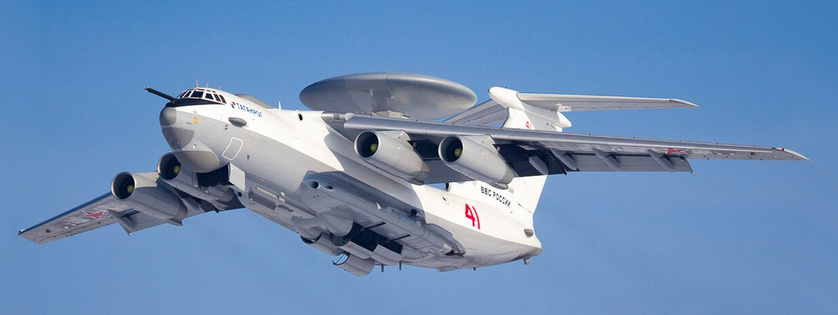
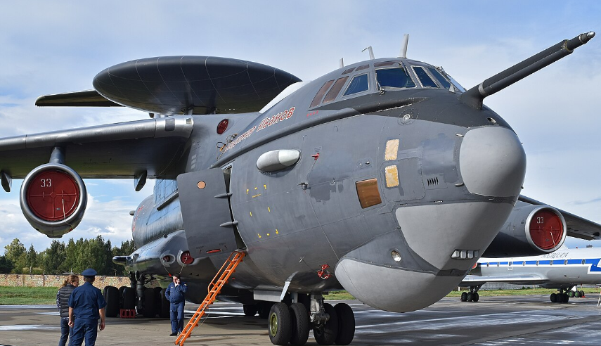

#### Kalustokuvaus
Ilmasta varhaisvaroitus- ja johtamiskone, jonka tehtävä on muodostaa laaja ilmatilannekuva ja tukea hävittäjien sekä ilmatorjunnan johtamista. A-50U on A-50:n modernisoitu versio, mutta avoimissa lähteissä yksityiskohtaiset erot eri koneiden välillä eivät aina ole täysin läpinäkyviä.

#### Suorituskyvyt
ODINin A-50-tiedon mukaan havaintoetäisyys on noin 650 km ilmakohteisiin ja noin 300 km maakohteisiin, ja kone voi johtaa jopa kymmentä hävittäjää. A-50U:n päivitykset liittyvät erityisesti elektroniikkaan ja työasemien modernisointiin, mutta kaikkia tarkkoja suoritusarvoja ei julkaista avoimesti.

#### Huomioitava analyysiin
A-50U on korkean arvon mahdollistaja, koska se kasvattaa muiden alustojen tehokkuutta enemmän kuin oma aseistus antaisi ymmärtää. Harvalukuisena järjestelmänä jokainen tappio tai pitkä huoltojakso vaikuttaa verkotettuun ilmasodankäyntiin suhteettoman paljon.

#### Operatiiviset rajoitteet
Suuri ja helposti havaittava alusta tarvitsee etäisyyttä ja suojaa. Avoin lähdeaineisto A-50U:n käytettävissä olevasta määrästä ja kunnosta on osin ristiriitaista, joten numeerisia arvioita on käsiteltävä varoen.

#### L?hteet
- [ODIN: A-50 (Mainstay) Russian Airborne Early Warning and Control Aircraft](https://odin.tradoc.army.mil/WEG/Asset/959b91ef93e87a6027da20d3a2ff9b0c)
- [Airforce Technology: A-50U Airborne Early Warning and Control Aircraft](https://www.airforce-technology.com/projects/a-50u-airborne-early-warning-and-control-aewc-aircraft/)

### Ilyushin Il-78
#### Kuvamateriaali
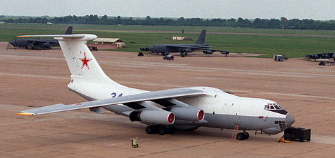
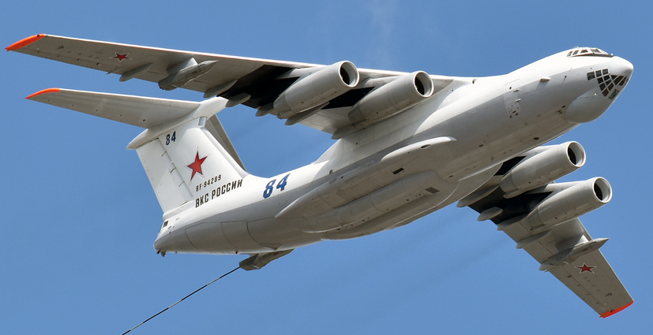

#### Kalustokuvaus
Ilmatankkauskone, jonka rooli on pidentää hävittäjien, pommittajien ja erikoiskoneiden toimintasädettä sekä tukea pitkän kantaman ilmaoperaatioita. Se on keskeinen mahdollistaja etenkin strategisen ja operatiivisen tason isku- ja torjuntatehtäville.

#### Suorituskyvyt
Rosoboronexportin mukaan Il-78MK-90A kykenee tankkaamaan lennossa yhtä raskasta tai kahta taktista konetta samanaikaisesti, ja siirrettävä polttoainemäärä 1 000 km etäisyydellä on 78 tonnia. Lisäksi järjestelmä voi jakaa polttoainetta maassa ja toimia rajatusti myös kuljetuskoneena.

#### Huomioitava analyysiin
Il-78:n merkitys näkyy välillisesti muiden alustojen kantaman, partioajan ja asekuorman käytettävyydessä. Ilmatankkauskyvyn rajallisuus voi muodostaa pullonkaulan koko ilmaoperaation laajuudelle.

#### Operatiiviset rajoitteet
Suuri ja hidas tukialusta tarvitsee turvallisen ilmatilan tai suojatun takatilan. Avoimissa lähteissä venäläisen käytössä olevan laivaston tarkka koko ja palveluskelpoisuus eivät ole täysin yhtenäisiä.

#### L?hteet
- [Rosoboronexport: IL-78MK-90A](https://roe.ru/en/production/aerospace-forces/aircraft/military-transport-and-special-purpose-aircraft/il-78/?theme=theme-lightblue)
- [UAC: IL-76MD-90A / IL-78M-90A](https://uacrussia.ru/en/aircraft/lineup/transport/IL-76MD-90A/)

### Ilyushin Il-20/22
#### Kuvamateriaali
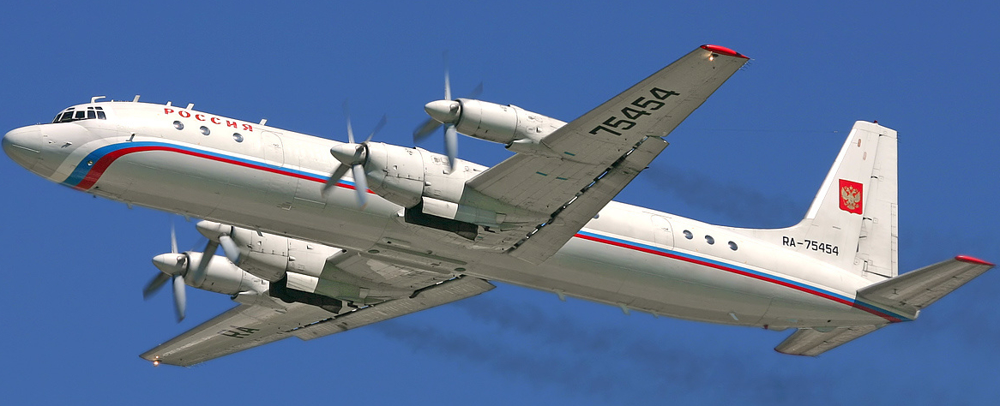

#### Kalustokuvaus
Il-18-runkoon perustuva tiedustelu-, elektroninen tiedonhankinta- ja komentokoneryhmä. Näitä alustoja on käytetty signaalitiedusteluun, viestien välitykseen ja ilmassa toimivina johto- tai relay-ratkaisuina.

#### Suorituskyvyt
Il-20 tarjoaa tilaa erikoisantureille ja pitkähkön lentoajan tiedusteluun, kun taas Il-22/22M toimii komentopaikka- ja viestinvälitysalustana. Perhe tarjoaa hyödyllisen erikoiskyvyn, vaikka se perustuu vanhaan runkoon.

#### Huomioitava analyysiin
Il-20/22-alustojen arvo on suhteettoman suuri niiden lukumäärään nähden, koska ne tukevat komentoa, tilannekuvaa ja tiedustelua. Avoimissa lähteissä alaversioiden erottelu on tärkeää, sillä tehtävät eroavat merkittävästi.

#### Operatiiviset rajoitteet
Suuri koko, vähäinen omasuoja ja vanha runko tekevät koneista haavoittuvia kiistanalaisessa ilmatilassa. Ne soveltuvat parhaiten ilmatilaan, jossa uhkataso on hallittavissa tai etäisyys rintamasta riittävä.

#### L?hteet
- [Air Vectors: Ilyushin Il-18 & Il-38](https://www.airvectors.net/avil18.html)
- [UAC – pääsivu](https://uacrussia.ru/en/)

### Ilyushin Il-80
#### Kuvamateriaali
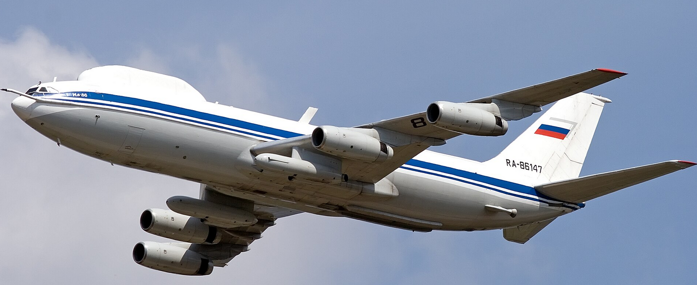

#### Kalustokuvaus
Ilmassa toimiva komentokone, jonka tehtävä on tukea valtion ja asevoimien johtamista poikkeusoloissa. Se kuuluu venäläisen airborne command post -kyvyn ytimeen eikä tavalliseen kuljetus- tai tiedustelukalustoon.

#### Suorituskyvyt
Il-80 tarjoaa suojatun johtamis- ja viestintäympäristön strategisen tason päätöksenteon tueksi. Avoimissa lähteissä yksityiskohtaiset järjestelmätiedot ovat tarkoituksella niukkoja, mutta rungon rooli komentopaikkana on selvä.

#### Huomioitava analyysiin
Il-80 on korkean arvon strateginen alusta, jonka vaikutus perustuu johtamiskykyyn eikä määrään. Tämän tyyppisen kaluston havaittu aktivointi voi olla indikaattori kohonneesta strategisesta valmiudesta, mutta yksittäisiä havaintoja ei pidä ylitulkita.

#### Operatiiviset rajoitteet
Avoin lähdeaineisto on niukkaa, joten tarkkoja järjestelmäarvioita tulee käsitellä varoen. Koneen harvalukuisuus tekee siitä myös korostetun kriittisen resurssin.

#### L?hteet
- [Air Vectors: Ilyushin Il-18 & Il-38](https://www.airvectors.net/avil18.html)
- [UAC – pääsivu](https://uacrussia.ru/en/)

### Tupolev Tu-214
#### Kuvamateriaali
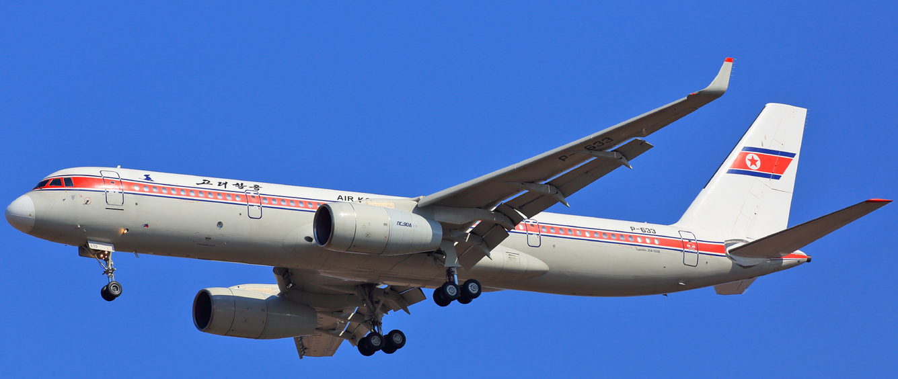

#### Kalustokuvaus
Keskimatkan kaksimoottorinen suihkukone, jonka perusalusta on siviilikäyttöinen mutta josta on johdettu myös erikoisversioita. Venäläisessä turvallisuus- ja sotilaskäytössä sitä liitetään erityisesti tiedustelu-, valvonta- ja erikoistehtävämuunnoksiin.

#### Suorituskyvyt
Perusrunko tarjoaa hyvän toimintasäteen, matkustamo- ja järjestelmätilan sekä hyödyllisen alustan erikoisvarustelulle. Avoimissa lähteissä sotilasvarianttien tarkat sensorit ja järjestelmät ovat kuitenkin osin epäselviä tai varianttikohtaisia.

#### Huomioitava analyysiin
Tu-214 kannattaa analysoida alustaperheenä eikä yhtenä yhtenäisenä “sotilaskoneena”. Erikoisversiot voivat painottua tiedusteluun, avoimen taivaan tarkastuksiin, relay-toimintaan tai muuhun valtion käyttöön.

#### Operatiiviset rajoitteet
Avoin lähdetieto sotilasvarianttien todellisista kokoonpanoista on paikoin niukkaa. Siksi pelkkä Tu-214-havainto ei riitä kertomaan tehtäväprofiilia ilman lisäkontekstia.

#### L?hteet
- [UAC: Tu-214](https://uacrussia.ru/en/aircraft/lineup/civil/tu-214/)
- [UAC – model range](https://uacrussia.ru/en/aircraft/)

## kuljetuskoneet

### Ilyushin Il-76MD-90A
#### Kuvamateriaali
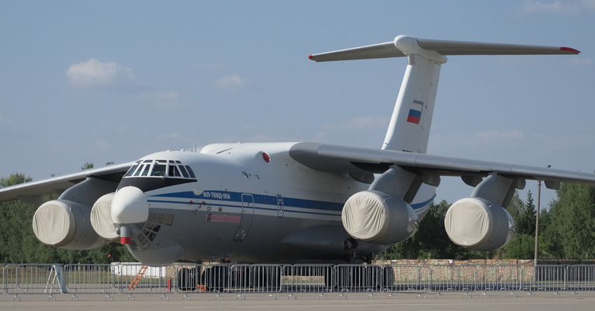
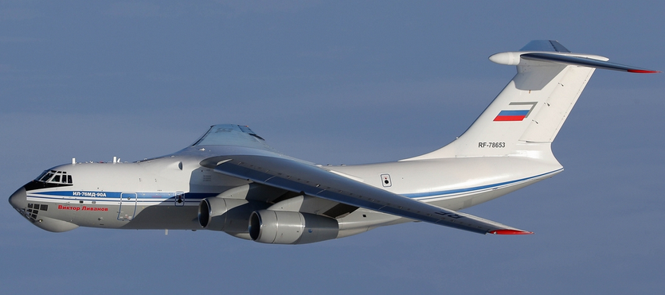

#### Kalustokuvaus
Raskas sotilaskuljetuskone, joka on tarkoitettu joukkojen, ajoneuvojen, huollon ja erikoiskuormien siirtoon sekä laskuvarjo- ja laskuoperaatioihin. Se muodostaa Venäjän sotilaskuljetuskyvyn rungon pitkän matkan tehtävissä.

#### Suorituskyvyt
Rosoboronexportin mukaan Il-76MD-90AE kuljettaa enintään 60 tonnin kuorman, lentää 750–800 km/h nopeudella ja saavuttaa noin 4 000 km toimintamatkan 60 tonnin hyötykuormalla. Kone voi operoida myös valmistelemattomilta kentiltä ja tukea autonomista purku- ja lastaustoimintaa.

#### Huomioitava analyysiin
Il-76MD-90A on logistinen mahdollistaja, ei taistelualusta, mutta sen vaikutus näkyy nopeasti siirrettävässä reservissä, huollossa ja erikoisjoukkojen liikkuvuudessa. Modernisoitu versio on myös perusta useille erikoiskonemuutoksille.

#### Operatiiviset rajoitteet
Suuri kuljetuskone on haavoittuva modernissa ilmapuolustusympäristössä ilman riittävää suojaa. Avoin tieto tuotantotahdista ja todellisesta käyttöönsaannista vaihtelee lähteittäin.

#### L?hteet
- [Rosoboronexport: IL-76MD-90AE](https://roe.ru/en/production/aerospace-forces/aircraft/military-transport-and-special-purpose-aircraft/il-76/?theme=theme-lightblue)
- [UAC: IL-76MD-90A / IL-78M-90A](https://uacrussia.ru/en/aircraft/lineup/transport/IL-76MD-90A/)

### Antonov An-12
#### Kuvamateriaali
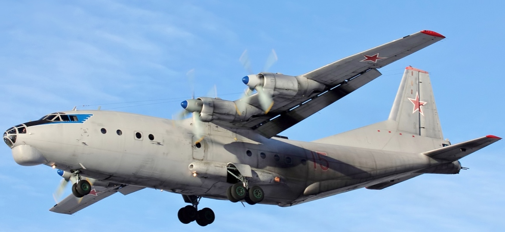

#### Kalustokuvaus
Keskiraskas potkuriturbiinikuljetuskone, jota on käytetty joukkojen, rahdin ja laskuvarjokuormien siirtoihin. Se oli pitkään neuvosto- ja venäläisen sotilaskuljetusilmailun perusalusta.

#### Suorituskyvyt
Antonovin mukaan kone kykenee kuljettamaan enintään noin 20 tonnia kuormaa ja toimimaan jopa noin 6 000 kilometrin lentomatkalla. Tärkein vahvuus on yksinkertainen sotilaskuljetuskyky takaramppineen eikä moderni avionics.

#### Huomioitava analyysiin
An-12 on edelleen hyödyllinen logistinen työjuhta, mutta sen analyysiarvo liittyy enemmän kapasiteettiin kuin selviytymiskykyyn. VKS-käytössä rungon ikä ja huollettavuus ovat usein olennaisempia kuin nimellinen suoritusarvo.

#### Operatiiviset rajoitteet
Ikääntyvä kalusto kasvattaa kunnossapito- ja käytettävyysriskiä. Kone ei sovellu korkean uhkan ilmatilaan ilman suojaa ja ilmaherruutta.

#### L?hteet
- [Antonov: AN-12](https://www.antonov.com/en/history/an-12)
- [Antonov – pääsivu](https://www.antonov.com/en)

### Antonov An-26
#### Kuvamateriaali
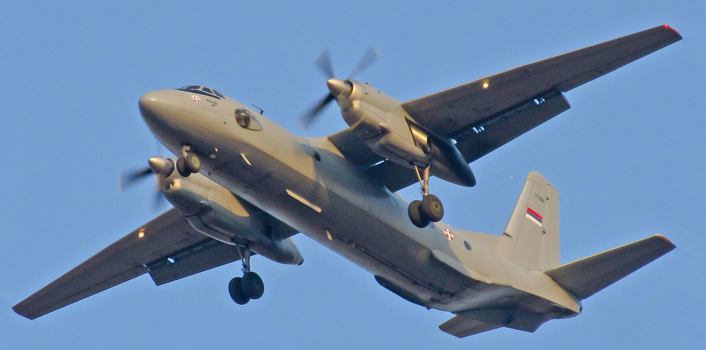

#### Kalustokuvaus
Kevyt kaksimoottorinen kuljetuskone, jota on käytetty henkilöstö-, rahti- ja lääkintäkuljetuksiin sekä rajattuihin laskuvarjotehtäviin. Se on pienempi ja joustavampi kuin An-12, mutta myös kuormaltaan selvästi vaatimattomampi.

#### Suorituskyvyt
Antonovin mukaan suuri rahtiovi ja ramppi mahdollistavat nopean lastauksen, kuorman pudotukset ja henkilöstön siirrot. Kone soveltuu lyhyemmille ja vaatimattomammille kentille kuin raskaammat kuljetuskoneet.

#### Huomioitava analyysiin
An-26 on analyysissa enemmän taktinen kuljetus- ja yhteyskone kuin operatiivinen vaikutusalusta. Sen merkitys näkyy erityisesti hajautetussa logistiikassa, yhteyskonekäytössä ja pienemmissä kuljetuserissä.

#### Operatiiviset rajoitteet
Pieni kuormakapasiteetti rajoittaa raskaan kaluston siirtoa. Ikääntyvä runkokanta ja rajallinen suojaus tekevät koneesta haavoittuvan kiistanalaisessa ilmatilassa.

#### L?hteet
- [Antonov: AN-26](https://www.antonov.com/en/history/an-26)
- [Antonov – pääsivu](https://www.antonov.com/en)

### Antonov An-72
#### Kuvamateriaali
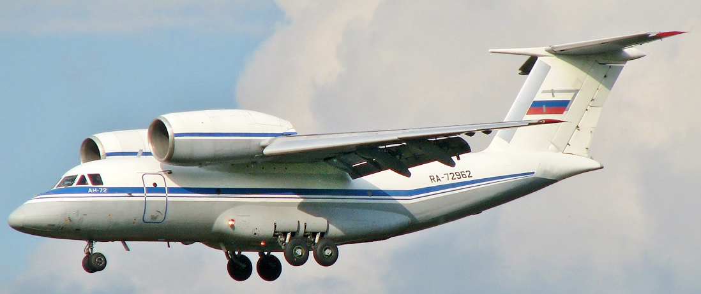

#### Kalustokuvaus
STOL-ominaisuuksiin painottuva suihkukäyttöinen kuljetuskone, joka on suunniteltu toimimaan lyhyiltä ja heikosti varustetuilta kiitoteiltä. Se tarjoaa venäläiselle käyttäjälle erikoistuneen kuljetuskyvyn hankaliin kenttäolosuhteisiin.

#### Suorituskyvyt
Antonovin mukaan kone on tarkoitettu noin 600 metrin epävalmistelluille kiitoteille, ja moottorien sijoitus siiven yläpuolelle tukee lyhyen nousun ja laskun suorituskykyä. Tämä tekee siitä käyttökelpoisen alueilla, joilla tavalliset kuljetuskoneet ovat rajoittuneempia.

#### Huomioitava analyysiin
An-72:n arvo syntyy nimenomaan kenttäkelpoisuudesta eikä suuresta kuljetusmassasta. Se voi olla hyödyllinen syrjäisillä alueilla, arktisissa tehtävissä tai tilanteissa, joissa infrastruktuuri on rajallinen.

#### Operatiiviset rajoitteet
Kapasiteetti jää selvästi raskaampien kuljetuskoneiden alapuolelle. Avoimissa lähteissä venäläiskäytön laajuus on rajallisempi kuin yleisempien Il-76- ja An-12/26-perheiden kohdalla.

#### L?hteet
- [Antonov: AN-72](https://www.antonov.com/en/history/an-72)
- [Antonov – pääsivu](https://www.antonov.com/en)

### Antonov An-124
#### Kuvamateriaali
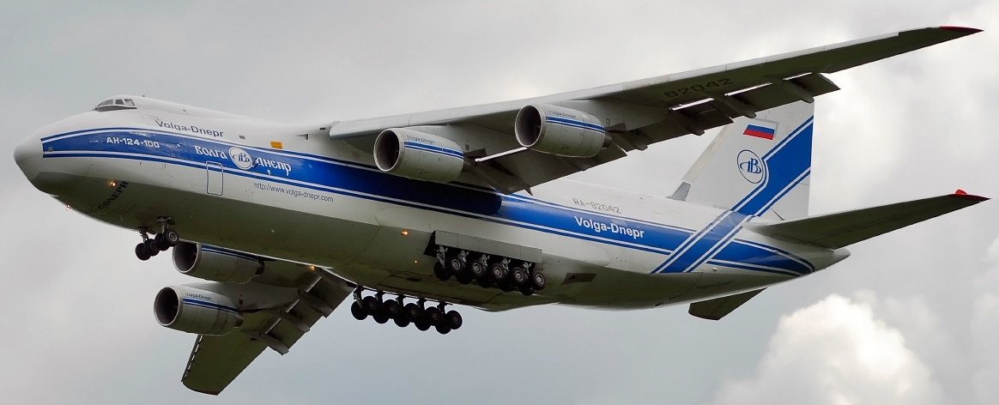

#### Kalustokuvaus
Raskas strateginen kuljetuskone, joka on suunniteltu suurikokoisten ja erittäin raskaiden kuormien siirtämiseen. Se on yksi harvoista alueen alustoista, joilla voidaan kuljettaa poikkeuksellisen raskasta kalustoa pitkillä etäisyyksillä.

#### Suorituskyvyt
Antonovin mukaan An-124 kykenee kuljettamaan enintään noin 150 tonnia kuormaa ja käyttämään etu- sekä takaramppia raskaan rahdin lastaamiseen. Sen suorituskyvyn ydin on strateginen ilmakuljetus eikä taktinen kenttätoiminta.

#### Huomioitava analyysiin
An-124 on korkeaarvoinen niukkuusresurssi, jonka merkitys on logistiikassa, erikoiskuormissa ja nopeasti siirrettävässä raskaassa materiaalissa. Yksittäisten koneiden käytettävyys vaikuttaa koko kykyyn enemmän kuin määrällisesti suuremmissa kalustotyypeissä.

#### Operatiiviset rajoitteet
Suuri koko, pieni määrä ja korkea huoltotarve rajoittavat käyttöä. Kone edellyttää käytännössä turvallista ilmatilaa ja sopivaa infrastruktuuria.

#### L?hteet
- [Antonov: AN-124 Ruslan](https://www.antonov.com/en/history/an-124-ruslan)
- [Antonov – pääsivu](https://www.antonov.com/en)

### Antonov An-140
#### Kuvamateriaali
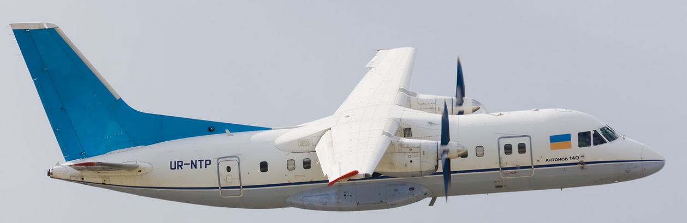

#### Kalustokuvaus
Kevyt tai keskiluokan alueellinen potkuriturbiinikone, jota voidaan käyttää henkilöstö- ja kevyisiin kuljetustehtäviin. Sotilaskäytössä sen arvo liittyy enemmän yhteys- ja kuljetusrooliin kuin varsinaiseen taistelutehtävään.

#### Suorituskyvyt
Kone tarjoaa modernimpaa aluekuljetuskykyä kuin vanhemmat neuvostoajan työjuhdat ja soveltuu lyhyillekin alueellisille reiteille. Avoimissa lähteissä venäläinen sotilasrooli jää kuitenkin varsin epäselväksi verrattuna puhtaasti sotilaskoneisiin.

#### Huomioitava analyysiin
An-140:n sisällyttäminen VKS-listoihin perustuu usein sekakäyttöön, koulutus-, yhteys- tai ministeriötason tehtäviin. Operatiivinen painoarvo on todennäköisesti rajallinen.

#### Operatiiviset rajoitteet
Avoin lähdeaineisto venäläisestä sotilaskäytöstä on niukkaa ja osin vanhentunutta. Tämän vuoksi alustaa ei pidä analyysissa käsitellä raskaan sotilasilmakuljetuksen runkokalustona.

#### L?hteet
- [Antonov An-140 – Encyclopaedia Britannica](https://www.britannica.com/topic/Antonov-Design-Bureau)
- [Antonov – pääsivu](https://www.antonov.com/en)

### Antonov An-148
#### Kuvamateriaali
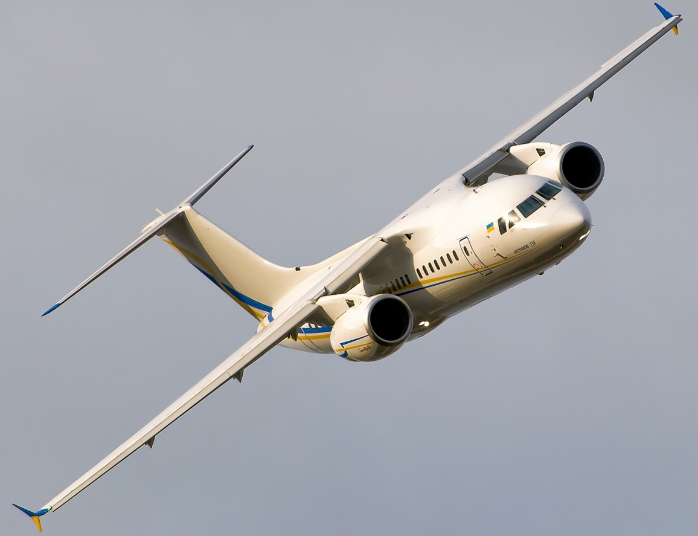

#### Kalustokuvaus
Suihkukäyttöinen alueellinen kuljetus- ja yhteyslentokone, jota voidaan käyttää henkilöstösiirtoihin ja valtionhallinnollisiin kuljetuksiin. Sotilaskäytössä se on enemmän hallinnollinen tai tukiroolin alusta kuin taistelukentän kuljetuskone.

#### Suorituskyvyt
Kone tarjoaa nopeamman ja mukavamman aluekuljetusratkaisun kuin vanhemmat potkuriturbiinikoneet. Avoin lähdeaineisto ei kuitenkaan osoita sille merkittävää taktisen ilmakuljetuksen roolia VKS:ssa.

#### Huomioitava analyysiin
An-148:n merkitys on analyysissa rajallinen, ellei tarkastelun kohteena ole valtionjohto-, henkilöstö- tai erikoiskuljetus. Sen sotilaallinen käyttö on avoimissa lähteissä selvästi vähemmän näkyvä kuin Il-76- tai An-12-perheillä.

#### Operatiiviset rajoitteet
Rajallinen sotilaallinen rooli ja niukka avoin lähdeaineisto vaikeuttavat tarkkaa arviointia. Alustaa ei pidä tulkita varsinaiseksi etulinjan kuljetuskyvyksi ilman lisänäyttöä.

#### L?hteet
- [Antonov – pääsivu](https://www.antonov.com/en)
- [UAC – civil aircraft lineup](https://uacrussia.ru/en/aircraft/lineup/civil/)

### Ilyushin Il-18/Il-20/Il-22
#### Kuvamateriaali
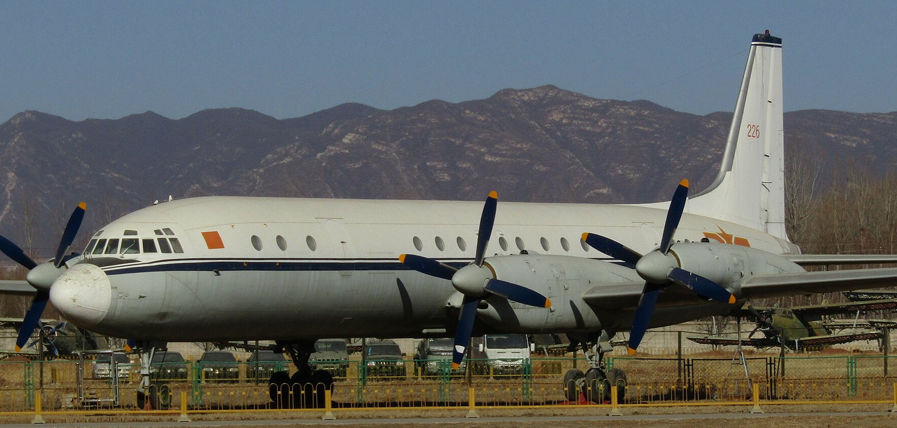

#### Kalustokuvaus
Nelimoottorinen potkuriturbiinikone, jota on käytetty kuljetus-, koulutus- ja erikoistehtävien alustana. Venäläisessä kontekstissa sen merkitys liittyy erityisesti erikoisversioihin ja johdannaisiin, ei enää moderniin yleiskuljetukseen.

#### Suorituskyvyt
Perusalusta tarjoaa pitkähkön toiminta-ajan ja suuren rungon erilaisille sisäisille järjestelmäratkaisuille. Tämän vuoksi Il-18-perhe on ollut hyödyllinen myös tiedustelu- ja valvontajohdannaisissa.

#### Huomioitava analyysiin
Il-18:n arvo syntyy enemmän alustaperheestä kuin alkuperäisestä matkustaja- tai kuljetusversiosta. Pelkkä “Il-18” voi avoimissa lähteissä toimia sateenvarjokäsitteenä johdannaisille, joilla on hyvin erilainen tehtäväprofiili.

#### Operatiiviset rajoitteet
Perusrakenne on vanha, eikä kone edusta modernia sotilaskuljetusratkaisua. Tiedot aktiivisesta venäläiskäytöstä painottuvat usein johdannaisiin, eivät perusmalliin.

#### L?hteet
- [Air Vectors: Ilyushin Il-18 & Il-38](https://www.airvectors.net/avil18.html)
- [UAC – pääsivu](https://uacrussia.ru/en/)

### Ilyushin Il-62
#### Kuvamateriaali
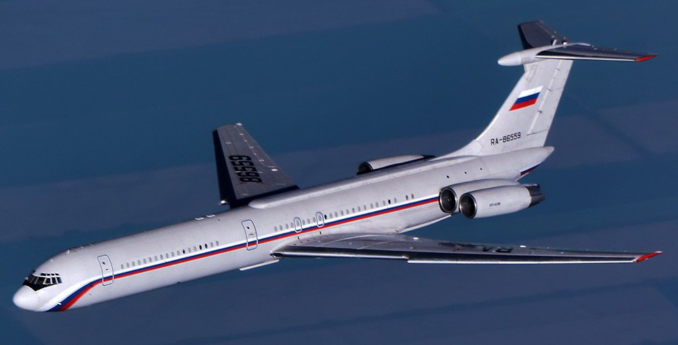

#### Kalustokuvaus
Pitkän matkan suihkukone, jota on käytetty henkilöstö-, VIP- ja hallinnollisiin kuljetuksiin. Sotilasroolissa se liittyy enemmän valtion ja asevoimien strategiseen henkilöstöliikkuvuuteen kuin taistelukentän logistiikkaan.

#### Suorituskyvyt
Kone tarjoaa pitkän kantaman ja suuren matkustajakapasiteetin. Sen vahvuus on strateginen henkilökuljetus, ei taktinen joustavuus tai suojattu toiminta korkean uhkan alueella.

#### Huomioitava analyysiin
Il-62 näkyy analyysissa lähinnä silloin, kun tarkastellaan esikunta-, delegaatio- tai valtionhallinnollista liikkuvuutta. Se ei ole VKS:n ydintaistelukykyä, vaikka se voi olla tärkeä tukitoimintojen näkökulmasta.

#### Operatiiviset rajoitteet
Vanha matkustajakonerunko rajoittaa kasvupotentiaalia ja käytettävyyttä. Sen käyttö edellyttää turvallista ilmatilaa ja asianmukaista lentokenttäinfrastruktuuria.

#### L?hteet
- [Encyclopaedia Britannica: Ilyushin Design Bureau](https://www.britannica.com/topic/Ilyushin)
- [UAC – pääsivu](https://uacrussia.ru/en/)

### Tupolev Tu-134
#### Kuvamateriaali
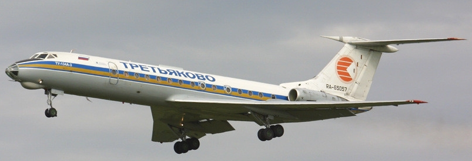

#### Kalustokuvaus
Kevyt tai keskikokoinen suihkukäyttöinen matkustaja- ja yhteyskone, jota on käytetty myös koulutus- ja erikoistehtävissä. Sotilaskäytössä se on ollut ennen kaikkea henkilöstö- ja järjestelmäalusta.

#### Suorituskyvyt
Koneen suorituskyky riittää alueelliseen henkilöstö- ja yhteysliikenteeseen sekä joissain versioissa koulutus- tai tukitehtäviin. Sen arvo ei perustu kuormankantoon tai taistelunkestoon vaan saatavilla olevaan runkoon ja yksinkertaiseen käyttöön.

#### Huomioitava analyysiin
Tu-134 voi esiintyä avoimissa lähteissä koulutus- tai erityisversiona, jolloin perusnimike ei kerro koko tehtäväkuvaa. Siksi kone kannattaa analyysissa nähdä enemmän tukiroolin alustana kuin yleisilmakuljetuksen avainkykynä.

#### Operatiiviset rajoitteet
Ikääntyvä kalusto ja rajallinen sotilasrelevanssi pienentävät merkitystä. Avoimissa lähteissä aktiivinen VKS-käyttö voi myös olla määrällisesti vähäistä.

#### L?hteet
- [Encyclopaedia Britannica: Tupolev](https://www.britannica.com/topic/Tupolev)
- [UAC – pääsivu](https://uacrussia.ru/en/)

### Tupolev Tu-154
#### Kuvamateriaali
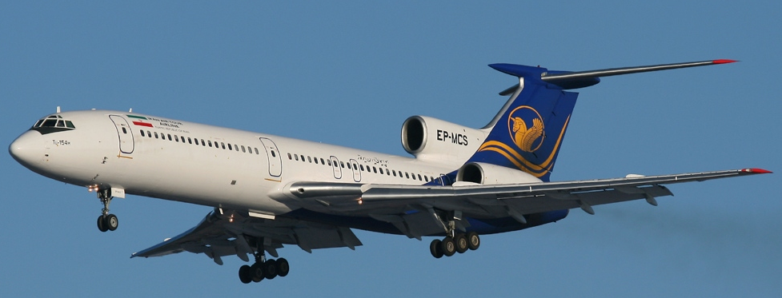

#### Kalustokuvaus
Kolmimoottorinen keskipitkän matkan suihkukone, jota on käytetty myös sotilas- ja hallintokuljetuksiin. Venäläisessä sotilaskäytössä sen rooli liittyy lähinnä henkilöstön ja delegaatioiden siirtoihin.

#### Suorituskyvyt
Kone tarjoaa suuren matkustajakapasiteetin ja käyttökelpoisen toimintasäteen. Se ei kuitenkaan ole taktinen sotilaskuljetuskone eikä tarjoa merkittävää kenttäkelpoisuutta tai omasuojausta.

#### Huomioitava analyysiin
Tu-154:n sotilaallinen arvo on hallinnollinen ja logistinen, ei taistelullinen. Jos tarkastelun painopiste on varsinaisessa sotilasoperaatiossa, sen merkitys jää toissijaiseksi.

#### Operatiiviset rajoitteet
Vanha rakenne, huoltotarve ja rajallinen sotilaallinen erikoistuminen kaventavat käyttöä. Kone ei sovellu korkean uhkan toimintaympäristöön.

#### L?hteet
- [Encyclopaedia Britannica: Tupolev](https://www.britannica.com/topic/Tupolev)
- [UAC – pääsivu](https://uacrussia.ru/en/)

### Let L-410 Turbolet
#### Kuvamateriaali
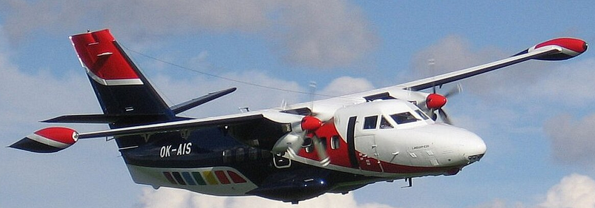

#### Kalustokuvaus
Kevyt kaksimoottorinen potkuriturbiinikone, jota voidaan käyttää yhteys-, koulutus- ja kevyisiin kuljetustehtäviin. Se on pieni mutta käytännöllinen alusta lyhyille yhteys- ja henkilöstölennolle.

#### Suorituskyvyt
Kone soveltuu lyhyille kiitoteille ja pienille kuormille sekä rajattuun koulutus- tai yhteyskäyttöön. Sen suorituskyvyn ydin on yksinkertainen alueellinen liikkuvuus eikä sotilaallinen erikoiskyky.

#### Huomioitava analyysiin
L-410:n merkitys sotilaslistoissa on yleensä marginaalinen verrattuna varsinaisiin kuljetus- tai taistelualustoihin. Se on hyödyllinen tuki- ja yhteyskone, mutta ei muuta kokonaiskuvaa VKS:n iskukyvystä.

#### Operatiiviset rajoitteet
Pieni koko ja hyötykuorma rajoittavat käyttöä. Avoimissa lähteissä venäläisen sotilaskäytön laajuus on rajallinen ja voi painottua erillisiin yksiköihin.

#### L?hteet
- [LET Aircraft Industries: L-410 NG](https://www.let.cz/en/l-410-ng)
- [LET Aircraft Industries – pääsivu](https://www.let.cz/en)

### Antonov An-30
#### Kuvamateriaali
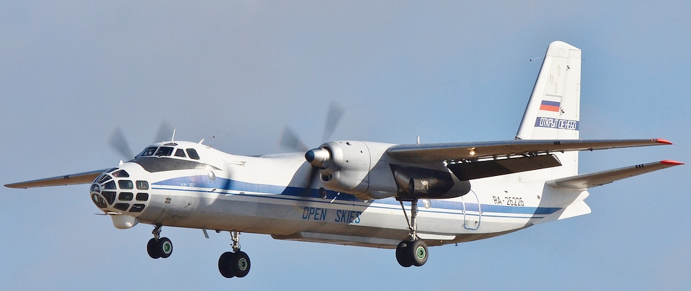

#### Kalustokuvaus
Ilmakuvaukseen ja kartoitukseen suunniteltu erikoisversio An-24-perheestä. Sen päärooli on ollut ilmakuvauksen, tiedonkeruun ja havaintotoiminnan tukeminen.

#### Suorituskyvyt
Antonovin mukaan koneen etuosan laaja näkyvyys, kameraluukut ja eri kuvauskorkeudet tukevat topografista kuvausta ja kartoitusta. Kyseessä ei ole taistelukone vaan erikoistiedonhankinnan alusta.

#### Huomioitava analyysiin
An-30 on analyysissa relevantti lähinnä silloin, kun tarkastellaan ilmakuvaus- ja valvontakykyä tai vanhemman polven tiedonhankintaa. Sen painoarvo nykyoperaatioissa on todennäköisesti rajallinen.

#### Operatiiviset rajoitteet
Vanha erikoisalusta ja kapea tehtäväprofiili rajoittavat käyttöä. Avoin lähdeaineisto aktiivisesta venäläiskäytöstä on niukkaa.

#### L?hteet
- [Antonov: AN-30](https://antonov.com/en/history/an-30)
- [Antonov – pääsivu](https://www.antonov.com/en)

## helikopterit

### Kamov Ka-52
#### Kuvamateriaali
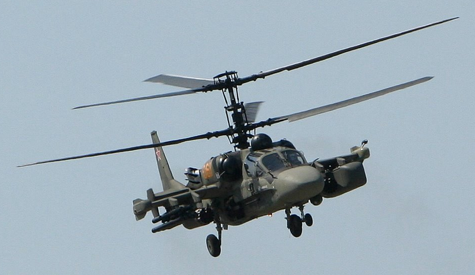
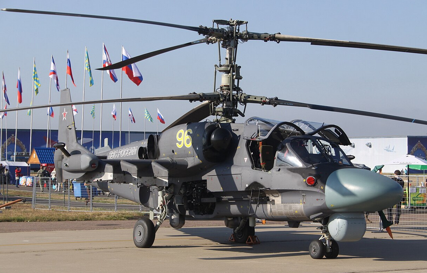

#### Kalustokuvaus
Taisteluhelikopteri, joka on suunniteltu aseelliseen tiedusteluun, lähitulitukeen ja panssarintorjuntaan. Alusta painottuu liikkuvaan tulenkäyttöön, sensorikykyyn ja kykyyn tukea maajoukkoja matalalla korkeudella.

#### Suorituskyvyt
ODINin mukaan Ka-52 on aseellinen tiedustelu- ja taistelualusta, joka soveltuu rynnäkköön, lähitulitukeen, saattosuojaukseen ja tiedusteluun. Tyypillinen aseistus koostuu tykistä, raketeista ja panssarintorjuntaohjuksista; tarkka ampumaetäisyys riippuu käytetystä ohjuksesta ja sensorikokoonpanosta.

#### Huomioitava analyysiin
Ka-52:n tehokkuus riippuu paljon siitä, käytetäänkö sitä itsenäisenä hyökkäysalustana vai verkotettuna osana tulenjohto- ja tiedusteluketjua. Avoimissa lähteissä tappiot ja kuluminen viittaavat siihen, että korkea tekninen suorituskyky ei yksin takaa selviytymistä kylläisessä ilmatorjuntaympäristössä.

#### Operatiiviset rajoitteet
Helikopteri on altis lyhyen kantaman ilmatorjunnalle ja kannettaville ohjuksille, jos se joutuu toimimaan liian lähellä etulinjaa. Ase- ja sensorialaversioiden erot tekevät yksittäisten koneiden vertailusta osin epävarmaa.

#### L?hteet
- [ODIN: Ka-52 Alligator (Hokum B) Russian Attack Helicopter](https://odin.tradoc.army.mil/WEG/Asset/Ka-52_Alligator_%28Hokum_B%29_Russian_Attack_Helicopter)
- [Rosoboronexport: Ka-52 Alligator](https://roe.ru/en/production/aerospace-forces/helicopters/ka-52-alligator/)

### Mil Mi-8AMTSh
#### Kuvamateriaali

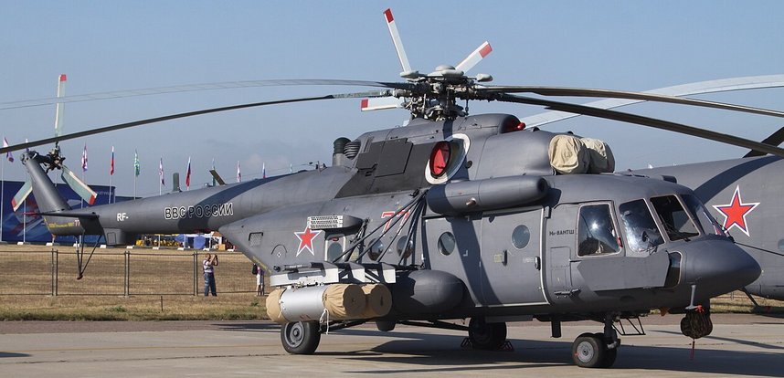

#### Kalustokuvaus
Aseistettu kuljetushelikopteri, jota käytetään joukkojen siirtoon, huoltoon, lääkintäevakuointiin ja tulituen tukitehtäviin. Se on monikäyttöinen työjuhta, jonka arvo perustuu määrään, joustavuuteen ja kykyyn toimia etulinjan lähellä.

#### Suorituskyvyt
ODINin Mi-8AMT-tiedon mukaan alusta on suunniteltu matkustajien ja rahdin kuljetukseen, ulkoisen kuorman siirtoon sekä etsintä- ja pelastustehtäviin; aseistetut versiot kykenevät myös raketti- ja konekivääritukeen. Suorituskyky vaihtelee alaversion mukaan, joten kaikki Mi-8AMTSh-koneet eivät ole identtisiä varustelultaan.

#### Huomioitava analyysiin
Mi-8AMTSh:n merkitys on ennen kaikkea operatiivinen: se mahdollistaa joukkojen liikkuvuuden, huollon ja nopean reagoinnin. Yksinkertaisempanakin alustana sen vaikutus voi olla suurempi kuin teknisesti kehittyneemmillä mutta harvalukuisilla järjestelmillä.

#### Operatiiviset rajoitteet
Keskikokoinen helikopteri on haavoittuva ilmatorjunnalle, erityisesti matalalla ja hitaassa profiilissa. Avoimissa lähteissä Mi-8AMT-, Mi-17- ja Mi-8AMTSh-perheiden tiedot limittyvät osin toisiinsa.

#### L?hteet
- [ODIN: Mi-8AMT Russian Multi-Role Helicopter](https://odin.tradoc.army.mil/WEG/Asset/778cd1dacfc0ff864a40c7fc5225652c)
- [ODIN: Mi-8 (Hip) Russian Medium Transport Helicopter](https://odin.tradoc.army.mil/WEG/Asset/Mi-8_%28Hip%29_Russian_Medium_Transport_Helicopter)

## ilmatorjunta

### S-400 Triumf
#### Kuvamateriaali

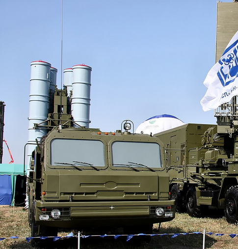

#### Kalustokuvaus
Pitkän kantaman ilmatorjunta- ja ohjuspuolustusjärjestelmä, jonka tehtävä on suojata laajoja alueita lentokoneilta, risteilyohjuksilta ja tietyiltä ballistisilta maaleilta. Järjestelmä muodostaa Venäjän kerroksellisen ilmapuolustuksen rungon strategisesti tärkeillä alueilla.

#### Suorituskyvyt
ODINin mukaan S-400 käyttää useita eri ohjuksia eri kantamille ja maalityypeille. Avoimissa lähteissä yleisimmin mainitaan 40N6-ohjuksen noin 400 km maksimikantama ja 48N6-sarjan lyhyempi mutta edelleen pitkän kantaman torjuntakyky; todellinen vaikutus riippuu sensoriverkosta, maaston peitteestä ja maaliprofiilista.

#### Huomioitava analyysiin
S-400:n todellinen arvo on järjestelmäarkkitehtuurissa, ei vain yksittäisessä laukaisuyksikössä. Se on parhaimmillaan verkotettuna muiden tutkien, johtokeskusten ja lyhyemmän kantaman suojajärjestelmien kanssa.

#### Operatiiviset rajoitteet
Järjestelmä ei ole kaikkivoipa, ja sen tehokkuus laskee matalalla lentäviä, kyllästäviä tai monivektorisia hyökkäyksiä vastaan. Avoin tieto käytössä olevista ohjusmääristä, tutkaversioista ja valmiusasteesta on rajallista.

#### L?hteet
- [ODIN: S-400 Triumph (SA-21 Growler) Russian Long-Range Air Defense Missile System](https://odin.tradoc.army.mil/WEG/Asset/73ac9d16614d8cece773d91b8da86801)
- [Rosoboronexport: S-400 Triumf](https://roe.ru/en/production/air-defence-systems-and-missiles/air-defense-systems/s-400-triumf/)
