# Kalustokuvasto

## 2S25 Sprut-SD
### Kuvamateriaali
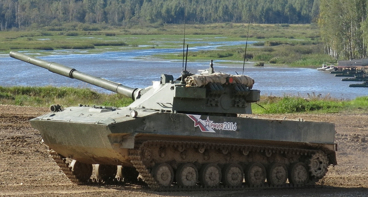
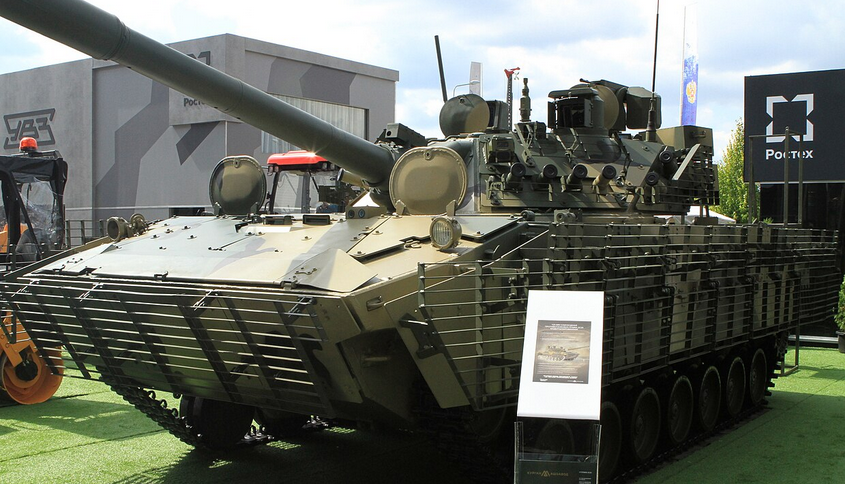

### Kalustotiedot

## 2S9 Nona-S
### Kuvamateriaali
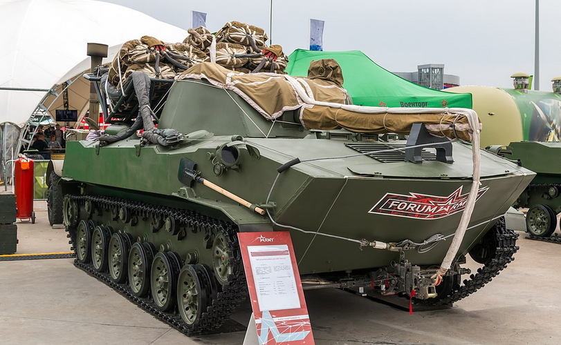
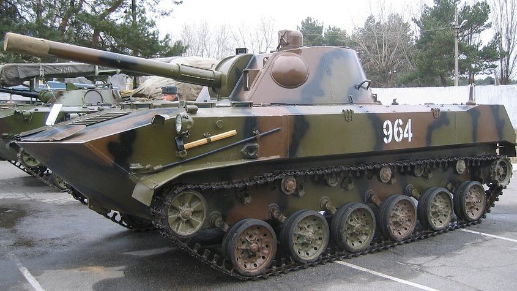

### Kalustotiedot

## BMD-2
### Kuvamateriaali
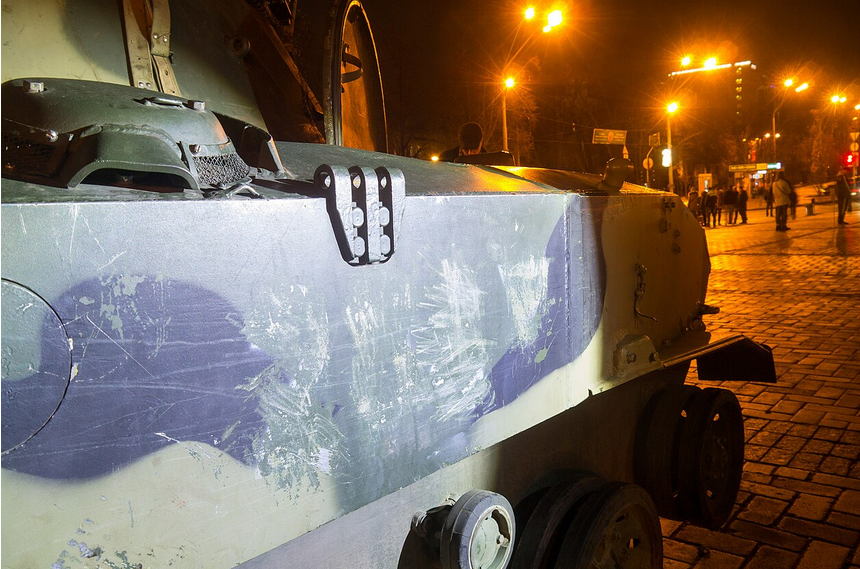
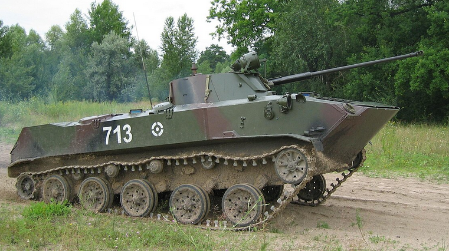

### Kalustotiedot

## BMD-4M
### Kuvamateriaali
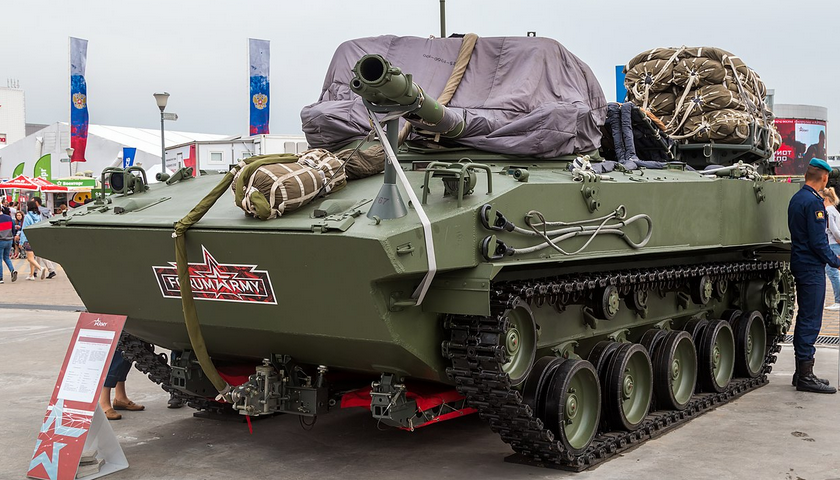
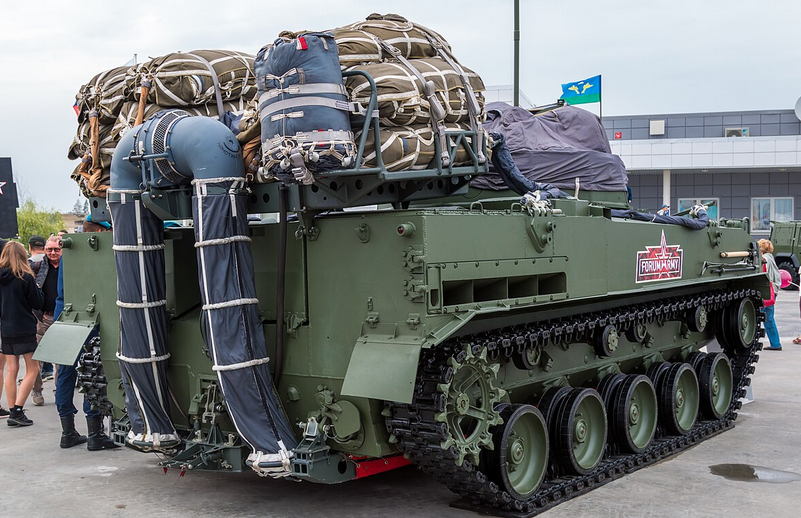

### Kalustotiedot

## BTR-D
### Kuvamateriaali
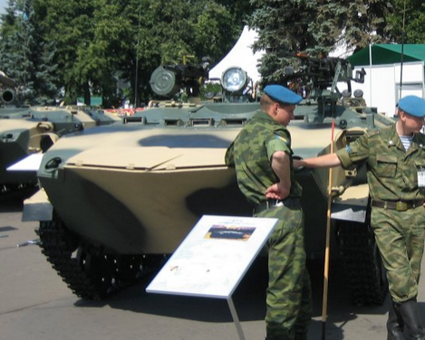
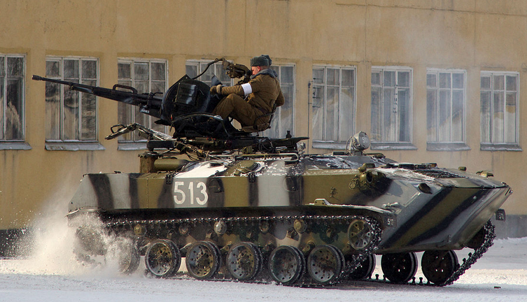

### Kalustotiedot

## BTR-MDM (Rakushka)
### Kuvamateriaali
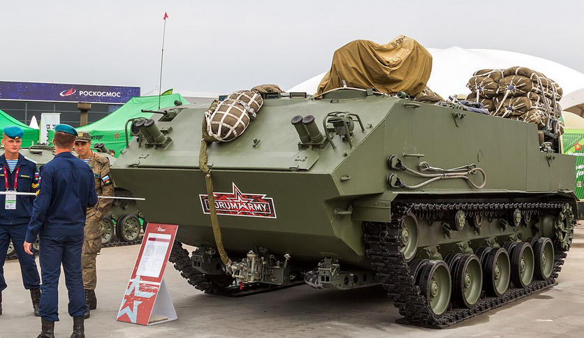
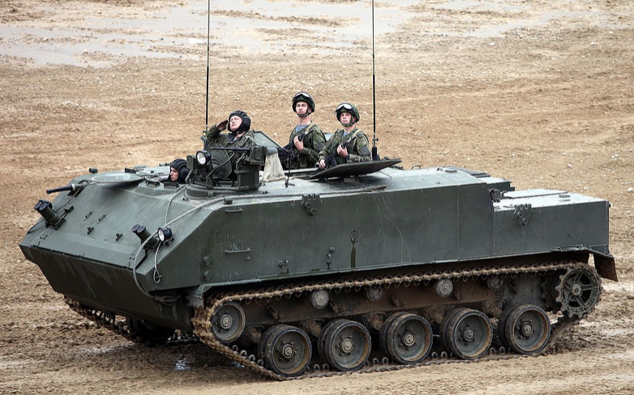

### Kalustotiedot

