# Kalustokuvasto

## taisteluajoneuvot

### BMO-T
#### Kalustokuva
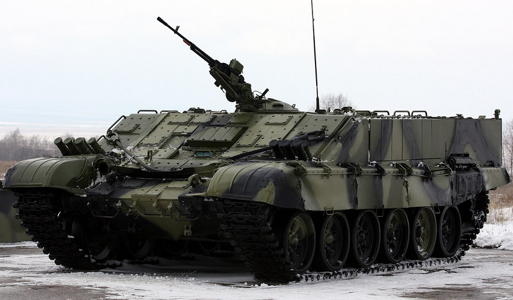

#### Kalustokuvaus
Raskas liekinheitinjoukkojen kuljetus- ja taistelutukiajoneuvo, joka perustuu T-72-alustaan ja on tarkoitettu erityisesti RPO-sarjan aseistettuja joukkueita varten. Järjestelmä painottaa suojaa ja kykyä kuljettaa hyökkäysosasto panssaritaistelun välittömään läheisyyteen.

#### Suorituskyvyt
- Kuljetus- ja suojakyky (БМО-Т): raskaan panssarisuojan ansiosta järjestelmä kestää paremmin etulinjan sirpale- ja pienaseuhkaa kuin kevyemmät miehistönkuljetusajoneuvot. Tarkat suojaustasot vaihtelevat, mutta T-72-pohjainen runko on sen keskeinen suorituskykyetu.
- Ajoneuvon omasuoja-aseistus (НСВТ / ПКТ): omasuojana käytetään tyypillisesti raskasta konekivääriä tai runko-/koaksiaaliaseistusta. Omasuoja soveltuu lähietäisyyden torjuntaan, ei varsinaiseen panssarintorjuntaan.

#### Huomioita analyysiin
Erikoistunut järjestelmä, jonka arvo syntyy panssaroidun suojan ja RCB-suojajoukkojen liekinheitin-/termobaarisen jalkaväen yhteiskäytöstä. Harvalukuinen kalusto tekee siitä enemmän niche-kyvyn kuin laajamittaisen mekanisoidun perusratkaisun.

#### Operatiiviset rajoitteet
Ajoneuvo ei korvaa varsinaista IFV:tä, koska sen päärooli on suojattu kuljetus eikä monipuolinen jalkaväen taistelutuki. Teho riippuu vahvasti siitä, että mukana oleva jalkaväki kykenee käyttämään omia erikoisaseitaan maastossa.

#### Lähteet
- [Military Today – BMO-T heavy armored personnel carrier](https://www.militarytoday.com/apc/bmo_t.htm)
- [ODIN – search: BMO-T](https://odin.tradoc.army.mil/Search/WEG/BMO-T)

### BMP-1
#### Kalustokuva
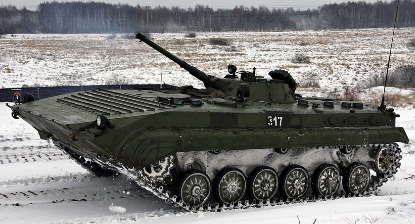

#### Kalustokuvaus
Varhaisen sukupolven jalkaväen taisteluajoneuvo, joka yhdistää miehistön kuljetuksen, rajallisen panssarisuojan ja orgaanisen tulituen. Järjestelmä mahdollistaa mekanisoidun jalkaväen etenemisen panssarivaunujen mukana, mutta sen suoja- ja tulivoimataso on nykyympäristössä vanhentunut.

#### Suorituskyvyt
- 73 mm matalapainekanuuna (2A28 Grom / 2А28 «Гром»): pääase soveltuu kevyesti panssaroituja maaleja ja tuliasemia vastaan. Käytännön ampumaetäisyys on lyhyt verrattuna uudempiin 30 mm ja 100/30 mm asejärjestelmiin.
- PST-ohjus (9M14 Malyutka / 9М14 «Малютка», varhaisissa versioissa): varhainen panssarintorjuntaohjus antoi ajoneuvolle kyvyn vaikuttaa panssarivaunuihin. Kantama on noin 3 km, mutta ohjuksen käyttö on hidas ja altis häirinnälle sekä käyttäjävirheille.
- Koaksiaalinen 7,62 mm konekivääri (ПКТ): lähisuoja jalkaväkeä ja pehmeitä maaleja vastaan. Vaikutus on taktinen eikä muuta ajoneuvon kokonaisheikkouksia.

#### Huomioita analyysiin
BMP-1:n arvo nykyisin liittyy määrään, saatavuuteen ja kykyyn toimia edelleen kuljetus- tai tulitukialustana matalamman uhan ympäristössä. Suuri osa ajoneuvoista on eri modernisointi- tai improvisaatiotasoilla, mikä vaikeuttaa yhtenäistä suorituskykyarviota.

#### Operatiiviset rajoitteet
Suoja on heikko nykyaikaisia pst-aseita, tykistön sirpalevaikutusta ja drone-uhkaa vastaan. Pääaseen rajallinen tarkkuus, elevointi ja läpäisykyky heikentävät käyttöä nykyaikaisella taistelukentällä.

#### Lähteet
- [ODIN – BMP-1 Russian Amphibious Infantry Fighting Vehicle](https://odin.tradoc.army.mil/WEG/Asset/cf0e6eb4267d8a3e60d66101379a8149)
- [ODIN – 2A28 Grom](https://odin.tradoc.army.mil/WEG/Asset/SPG-9_Kopye)

### BMP-2
#### Kalustokuva
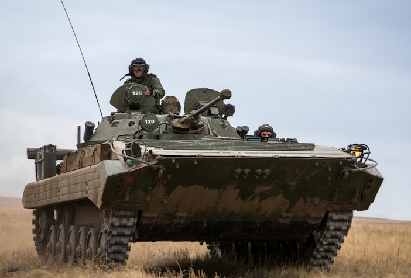
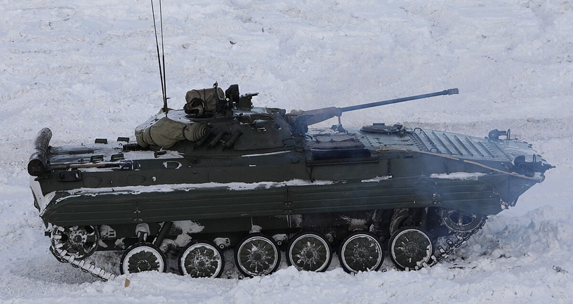
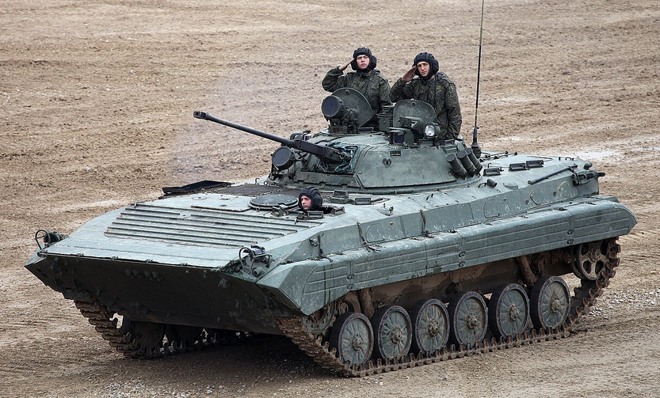

#### Kalustokuvaus
Toisen sukupolven jalkaväen taisteluajoneuvo, joka paransi BMP-1:n tulivoimaa erityisesti korkeakulmaisen 30 mm automaattikanuunan avulla. Järjestelmä mahdollistaa jalkaväen kuljetuksen ja tulituen myös ilmamaaleja, kevyitä ajoneuvoja ja rakennettuja kohteita vastaan paremmin kuin BMP-1.

#### Suorituskyvyt
- 30 mm automaattikanuuna (2A42 / 2А42): antaa selvästi paremman tulinopeuden, kantaman ja korkeuskulman kuin BMP-1:n 73 mm ase. Tehokas vaikutusetäisyys kevyitä panssarimaaleja vastaan on tyypillisesti noin 1,5–2 km ja pehmeitä maaleja vastaan pidempi.
- PST-ohjus (9M113 Konkurs / 9М113 «Конкурс»): mahdollistaa panssarintorjunnan usean kilometrin etäisyydelle. Tyypillisesti ilmoitettu kantama on noin 4 km.
- Koaksiaalinen 7,62 mm konekivääri (ПКТ): tukee lähietäisyyden maalien torjuntaa. Merkitys korostuu jalkaväkeä vastaan rakennetussa maastossa.

#### Huomioita analyysiin
BMP-2 on edelleen käyttökelpoinen määräkalustona, koska sen 30 mm ase tarjoaa relevanttia tulitukea myös nykytaistelukentällä. Uudemmat Berezhok- ja muut modernisoinnit voivat nostaa suorituskykyä merkittävästi verrattuna perusversioon.

#### Operatiiviset rajoitteet
Panssarointi ja miinasuoja ovat riittämättömiä korkean uhan ympäristössä. Havaittavuus, sisätilan ergonomia ja sensoritaso jäävät jälkeen uudemmista IFV-järjestelmistä.

#### Lähteet
- [ODIN – BMP-2 Russian Amphibious Infantry Fighting Vehicle](https://odin.tradoc.army.mil/WEG/Asset/0463e5419617d63ff6dc58ed40babd01)
- [ODIN – 2A42 Russian 30mm Autocannon](https://odin.tradoc.army.mil/WEG/Asset/e0a5f71786edd42722b653cc28aa4b75)
- [ODIN – 9M113 Konkurs](https://odin.tradoc.army.mil/WEG/Asset/9M113_Konkurs)

### BMP-3
#### Kalustokuva
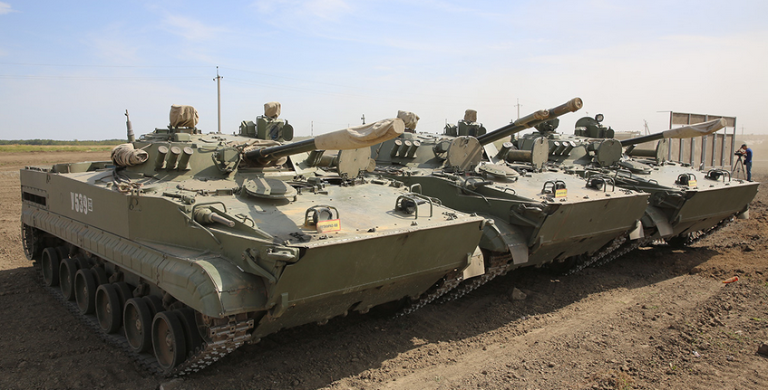
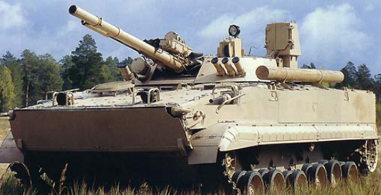
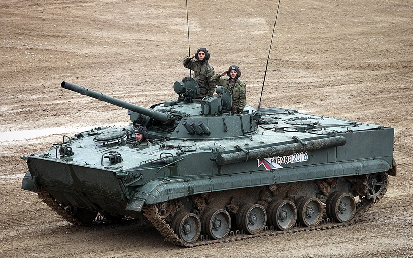

#### Kalustokuvaus
Raskaammin aseistettu jalkaväen taisteluajoneuvo, joka yhdistää 100 mm matalapaineaseen, 30 mm automaattikanuunan ja ohjuskyvyn yhteen torniin. Järjestelmä mahdollistaa joustavan tulituen jalkaväkeä, kevyitä panssarimaaleja, linnoitteita ja tietyissä versioissa myös panssarivaunuja vastaan.

#### Suorituskyvyt
- 100 mm ase (2A70 / 2А70): voi ampua HE-sirpalekranaatteja rakennuksia, asemia ja pehmeitä maaleja vastaan. Suora tulivaikutus on hyödyllinen etenkin rakennetussa maastossa.
- 30 mm automaattikanuuna (2A72 / 2А72): täydentää 100 mm asetta nopealla ja tarkalla tulella. Se soveltuu kevyitä panssaroituja maaleja vastaan noin 1,5–2 km etäisyydelle.
- Putkilaukaistava PST-ohjus (9M117 Bastion / 9М117): mahdollistaa panssarintorjunnan pidemmälle kuin pelkkä tykkiaseistus. Yleisesti ilmoitettu kantama on noin 4–5,5 km versiosta riippuen.
- Koaksiaalinen ja runkokonekivääriaseistus (ПКТ): tukee lähietäisyyden jalkaväkitorjuntaa. Tulitiheys on hyvä, mutta suoja ei silti vastaa raskaampia IFV-ratkaisuja.

#### Huomioita analyysiin
BMP-3:n vahvuus on poikkeuksellisen monipuolinen aseistus suhteessa kokoluokkaan. Modernisoidut versiot, kuten BMP-3M, voivat sisältää parempia sensoreita, palonhallintaa ja ohjusratkaisuja kuin peruskalusto.

#### Operatiiviset rajoitteet
Vaikka tulivoima on korkea, suojataso ei tee siitä raskasta IFV:tä. Monimutkainen aseistus kasvattaa huollon ja miehistön koulutuksen vaatimuksia.

#### Lähteet
- [ODIN – BMP-3K Russian Amphibious Infantry Fighting Vehicle](https://odin.tradoc.army.mil/WEG/Asset/6ac606f54dcf2c71ebc8ac084cf3ccc2)
- [ODIN – BMP-3M Russian Amphibious Infantry Fighting Vehicle](https://odin.tradoc.army.mil/WEG/Asset/2ea59c4af80de5a7044ab9172d73eb15)
- [ODIN – 2A72 Russian 30mm Autocannon](https://odin.tradoc.army.mil/WEG/Asset/2A72_Russian_30mm_Autocannon)

### BMPT Terminator
#### Kalustokuva
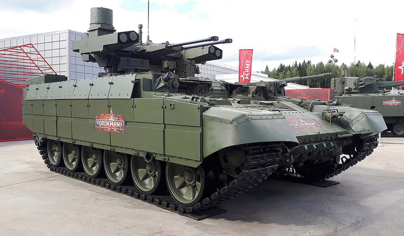

#### Kalustokuvaus
Panssarivaunujen tukiajoneuvo, joka on suunniteltu erityisesti suojaamaan panssariosastoja lähitorjuntauhkilta, jalkaväeltä ja kevyiltä ajoneuvoilta. Järjestelmä mahdollistaa korkean tulitiheyden useilla asejärjestelmillä yhtä aikaa ilman, että käytetään varsinaista jalkaväen kuljetustilaa.

#### Suorituskyvyt
- 30 mm automaattikanuunat (2A42 / 2А42): kaksoiskanuunaratkaisu tuottaa suuren tulitiheyden. Teho korostuu jalkaväkeä, kevyitä ajoneuvoja ja matalalla lentäviä maaleja vastaan.
- PST-ohjukset (Ataka / «Атака», tai joissain versioissa vaihtoehtoiset): tarjoavat kyvyn vaikuttaa raskaampiin panssarimaaleihin. Tyypillinen kantama on noin 5–6 km.
- 30 mm kranaatinheittimet ja 7,62 mm konekivääri: parantavat lähialueen tulipeittoa. Erityisesti rakennetussa maastossa ne tukevat panssarien suojausta.

#### Huomioita analyysiin
BMPT on konseptina tarkoitettu ratkaisemaan panssarien lähisuojan ongelmaa, mutta sen doktriininen asema on ollut vaihteleva. Taistelukentällä se voi toimia tehokkaana tulitukialustana, mutta vain rajatuissa määrissä.

#### Operatiiviset rajoitteet
Järjestelmä ei kuljeta jalkaväkeä, joten se ei korvaa IFV:tä eikä poista tarvetta dismount-joukoille. Harvalukuisuus, korkea siluetti ja riippuvuus muun osaston yhteistoiminnasta rajoittavat vaikutusta.

#### Lähteet
- [ODIN – BMPT Terminator Russian Heavy Fire Support Combat Vehicle](https://odin.tradoc.army.mil/WEG/Asset/9f1db2b58ba9e52eb202ed082e26720c)
- [ODIN – BMPT-72 Terminator 2](https://odin.tradoc.army.mil/WEG/Asset/BMPT-72_Terminator_2_Russian_Tank_Support_Armored_Fighting_Vehicle)

### BTR-50
#### Kalustokuva
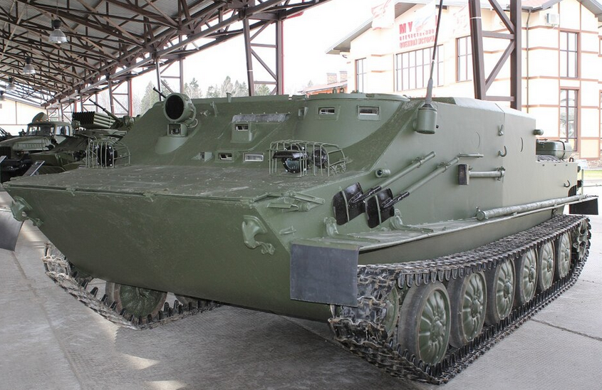

#### Kalustokuvaus
Vanha telakuorma-alustainen miehistönkuljetusajoneuvo, jonka vahvuus on yksinkertainen rakenne ja amfibinen liikkuvuus. Järjestelmä mahdollistaa joukkojen ja kevyen kuorman siirron vaikeakulkuisessa maastossa, mutta ei tarjoa nykyaikaista suojaa.

#### Suorituskyvyt
- Kuljetuskyky (БТР-50): ajoneuvo kykenee siirtämään jalkaväkeä, johtamis- tai erikoiskuormia maastossa ja vesistön yli. Suorituskyvyn ydin on kuormankantokyky, ei orgaaninen tulivoima.
- Kevyt omasuoja-aseistus (esim. SGMB/PK): rajoittuu lähisuojaan. Varsinainen taisteluteho on vähäinen.

#### Huomioita analyysiin
BTR-50:n merkitys on lähinnä vanhan varastokaluston, apu- ja erikoisversioiden sekä toissijaisen käytön kautta. Sitä voidaan edelleen hyödyntää niukoissa oloissa, joissa modernimpaa kalustoa ei ole saatavilla.

#### Operatiiviset rajoitteet
Suoja, ergonomia ja tulivoima ovat heikkoja. Ajoneuvo on erittäin haavoittuva panssarintorjunnalle, tykistölle ja drooneille.

#### Lähteet
- [ODIN – search: BTR-50](https://odin.tradoc.army.mil/Search/WEG/BTR-50)
- [Military Today – BTR-50](https://www.militarytoday.com/apc/btr_50.htm)

### BTR-60
#### Kalustokuva
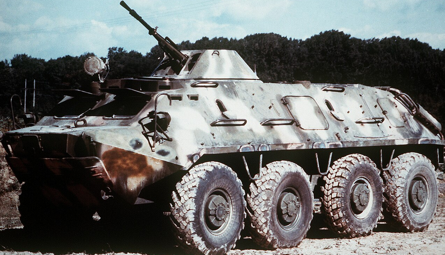

#### Kalustokuvaus
Ensimmäisen sukupolven 8x8-pyöräalustainen miehistönkuljetusajoneuvo, joka toi neuvostokalustoon hyvän strategisen liikkuvuuden ja amfibisen kyvyn. Järjestelmä mahdollistaa joukkojen nopean siirron, mutta sen suojaus ja ergonomia ovat selvästi vanhentuneita.

#### Suorituskyvyt
- 14,5 mm raskas konekivääri (KPV / КПВ): antaa kyvyn vaikuttaa kevyitä ajoneuvoja ja tuliasemia vastaan. Tehokas kantama on tyypillisesti noin 1–2 km maaleista riippuen.
- 7,62 mm koaksiaalinen konekivääri (ПКТ): tukee lähietäisyyden torjuntaa. Tulivoima on riittävä pehmeitä maaleja vastaan, mutta rajallinen modernia suojaa vastaan.

#### Huomioita analyysiin
BTR-60:n operatiivinen arvo liittyy yhä määrään ja saatavuuteen, ei moderniin suorituskykyyn. Monissa käyttäjämaissa se esiintyy johtamis-, viesti- tai muunnetuissa erikoisrooleissa.

#### Operatiiviset rajoitteet
Polttomoottoriratkaisu, ohut panssarointi ja heikko miinasuoja tekevät ajoneuvosta riskialttiin nykytaistelussa. Jalkaväen poistuminen sivuluukuista on taktinen heikkous tulen alla.

#### Lähteet
- [ODIN – BTR-60 Russian 8x8 Amphibious Armored Personnel Carrier](https://odin.tradoc.army.mil/WEG/Asset/547812768252900f3a32aaebe26dc418)
- [ODIN – KPV-14.5 Russian Heavy Machine Gun](https://odin.tradoc.army.mil/WEG/Asset/c5e014534c8fe3def0ef6d81f491bfb7)

### BTR-70
#### Kalustokuva
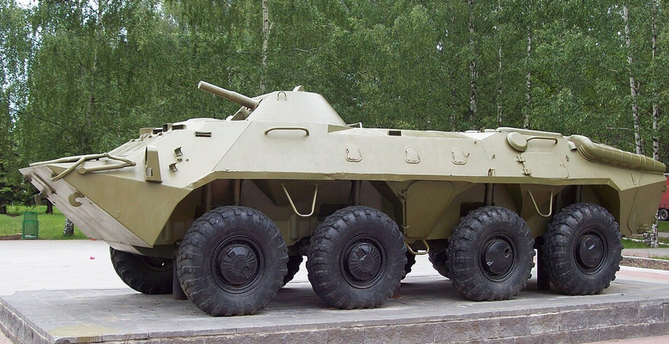

#### Kalustokuvaus
BTR-60:n kehitysversio, jossa pyrittiin parantamaan liikkuvuutta ja osin taistelunkestävyyttä. Järjestelmä mahdollistaa edelleen kevyen mekanisoidun jalkaväen liikkuvuuden, mutta suoja- ja käyttömukavuusongelmat säilyvät.

#### Suorituskyvyt
- 14,5 mm raskas konekivääri (KPV / КПВ): perusaseistus kevyitä ajoneuvoja ja jalkaväkeä vastaan. Käytännön vaikutusalue pysyy noin 1–2 km luokassa maalityypistä riippuen.
- 7,62 mm koaksiaalinen konekivääri (ПКТ): täydentävä lähisuoja-ase. Se soveltuu lähietäisyydelle eikä muuta ajoneuvon roolia kuljetuspainotteisena.

#### Huomioita analyysiin
BTR-70 on edelleen käyttökelpoinen matalan uhan ympäristöissä ja toissijaisissa rooleissa. Sen suurin etu on pyöräalustainen liikkuvuus ja olemassa oleva kalustomassa.

#### Operatiiviset rajoitteet
Kaksimoottorijärjestelmä, heikko miinasuoja ja vaikea poistuminen tekevät siitä ongelmallisen nykyaikaisessa lähitaistelussa. Ajoneuvo on altis sekä pst-aseille että improvisoiduille uhille.

#### Lähteet
- [ODIN – BTR-70 Russian 8x8 Amphibious Armored Personnel Carrier](https://odin.tradoc.army.mil/WEG/Asset/146a46d960de31b2409f05b05df2ed2d)
- [ODIN – KPV-14.5 Russian Heavy Machine Gun](https://odin.tradoc.army.mil/WEG/Asset/c5e014534c8fe3def0ef6d81f491bfb7)

### BTR-82A
#### Kalustokuva
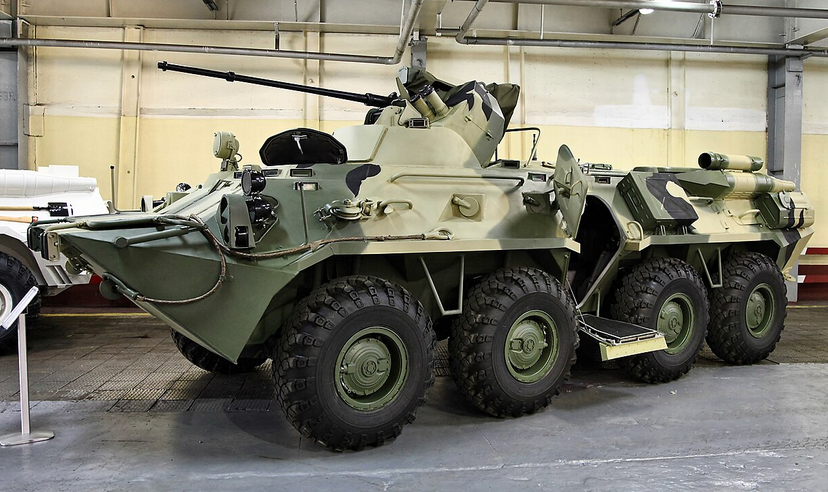
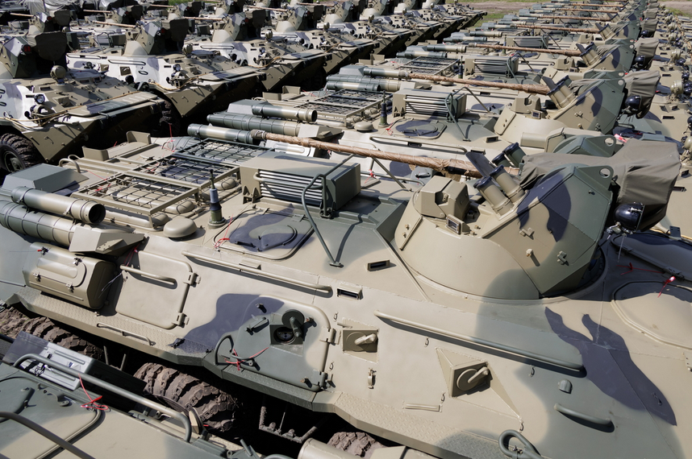
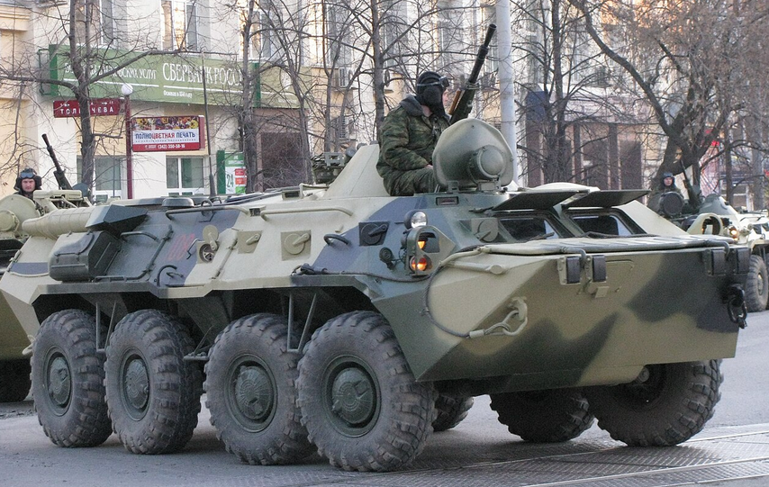

#### Kalustokuvaus
BTR-80-perheen modernisoitu versio, jossa on parempi 30 mm aseistus, uusi voimansiirto ja parannettu sisäinen suojaus. Järjestelmä mahdollistaa pyöräalustaisen jalkaväen siirron ja tulituen modernimpana ratkaisuna kuin vanhat BTR-60/70-sarjat.

#### Suorituskyvyt
- 30 mm automaattikanuuna (2A72 / 2А72): nostaa tulivoiman selvästi perinteistä 14,5 mm konekivääriratkaisua korkeammalle. Se on tehokas kevyitä panssarimaaleja, tuliasemia ja matalia ilma- tai UAV-maaleja vastaan noin 1,5–2 km etäisyydelle.
- 7,62 mm koaksiaalinen konekivääri (ПКТМ): tukee lähisuojaa ja pehmeiden maalien torjuntaa. Hyödyllinen etenkin rakennetussa maastossa.

#### Huomioita analyysiin
BTR-82A on ollut laajasti käytetty, koska se tarjoaa suhteellisen edullisen tavan nostaa vanhan BTR-perheen käyttökelpoisuutta. Se on kuitenkin yhä pyöräalustainen APC eikä raskas IFV.

#### Operatiiviset rajoitteet
Suoja ei riitä korkean uhan panssaritaisteluun eikä miina-/IED-ympäristöön raskaiden MRAP-ajoneuvojen tavoin. Sivuluukkujen ja sisätilan ratkaisut rajoittavat jalkaväen taistelullista käyttöä.

#### Lähteet
- [ODIN – BTR-82 Russian 8x8 Amphibious Armored Personnel Carrier](https://odin.tradoc.army.mil/WEG/Asset/a27afe2e5a4fe5a7a2ef8df88c926c9d)
- [ODIN – 2A72 Russian 30mm Autocannon](https://odin.tradoc.army.mil/WEG/Asset/2A72_Russian_30mm_Autocannon)

### BTR-90
#### Kalustokuva
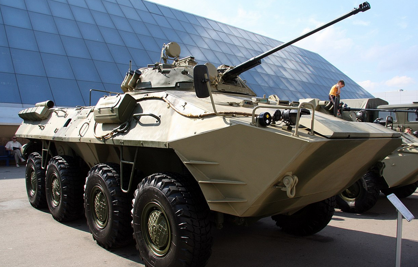

#### Kalustokuvaus
Raskaampi ja kunnianhimoisempi BTR-kehityslinja, jonka tarkoitus oli nostaa pyöräalustaisen miehistönkuljetusajoneuvon tulivoimaa ja liikkuvuutta. Järjestelmä mahdollistaa paremman tulituen kuin aiemmat BTR-sarjat, mutta sitä valmistettiin rajallisesti.

#### Suorituskyvyt
- 30 mm automaattikanuuna (2A42 / 2А42): tuo IFV-tyyppistä tulivoimaa pyöräalustalle. Kantama ja vaikutus ovat samalla tasolla BMP-2:n kanssa kevyitä panssarimaaleja vastaan.
- PST-ohjusvaihtoehdot (joissain konsepteissa): järjestelmään on liitetty kykyä vaikuttaa raskaampiin panssarimaaleihin. Käytännön varustelu vaihtelee, eikä kalusto ole laajasti standardoitunut.
- 7,62 mm konekivääri (ПКТ): täydentävä lähisuoja. Tukee ajoneuvon käyttöä kuljetus- ja tiedustelutyyppisissä tehtävissä.

#### Huomioita analyysiin
BTR-90 on analyytikolle tärkeä enemmän kehityspolkuna kuin laajasti käytettynä perusjärjestelmänä. Se osoittaa pyrkimyksen tuoda enemmän tulivoimaa ja suojaa pyöräalustaan ennen Bumerang-sukupolvea.

#### Operatiiviset rajoitteet
Rajallinen tuotanto ja käyttö vähentävät operatiivista merkitystä. Se ei ratkaissut pyöräalustan perusheikkouksia korkean uhan ympäristössä.

#### Lähteet
- [ODIN – BTR-90 Russian 8x8 Amphibious Armored Personnel Carrier](https://odin.tradoc.army.mil/WEG/Asset/dfb3fe7c03ab89c970fa8fa57d02f350)
- [ODIN – 2A42 Russian 30mm Autocannon](https://odin.tradoc.army.mil/WEG/Asset/e0a5f71786edd42722b653cc28aa4b75)

### Kamaz Typhoon
#### Kalustokuva
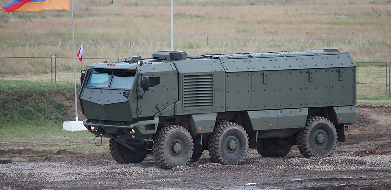

#### Kalustokuvaus
MRAP-tyyppinen suojattu pyöräajoneuvo, joka on suunniteltu henkilöstön kuljetukseen miina- ja väijytysuhkien ympäristössä. Järjestelmä mahdollistaa turvallisemman liikkeen tieverkossa ja toissijaisilla reiteillä verrattuna vanhempiin APC-ratkaisuihin.

#### Suorituskyvyt
- Miina- ja ballistinen suoja (Тайфун-К): rungon ja istuinratkaisujen tarkoitus on pienentää IED- ja miinavaikutusta. Tarkka suojaustaso riippuu alaversiosta, mutta koko konseptin ydin on selviytymiskyky.
- Etäaseasema-/konekiväärivarustus (variantista riippuen): ajoneuvo voidaan aseistaa omasuojaa varten. Aseistus on yleensä lähisuojapainotteinen eikä tee järjestelmästä varsinaista taisteluajoneuvoa.

#### Huomioita analyysiin
Typhoon-perhe edustaa siirtymää kohti suojattua kuljetusta, jota tarvitaan erityisesti epäsymmetrisissä uhkissa ja pitkissä tiekuljetuksissa. Se täydentää eikä korvaa varsinaisia IFV- tai APC-järjestelmiä.

#### Operatiiviset rajoitteet
Korkea profiili ja rajallinen maastokelpoisuus suhteessa telakalustoon rajoittavat käyttöä etulinjan läpäisyssä. Suoja on hyvä epäsymmetrisessä ympäristössä, mutta ei sama kuin raskaalla panssarikalustolla.

#### Lähteet
- [Rostec – Typhoon-K](https://rostec.ru/en/product/taifun-k/)
- [ODIN – search: Typhoon-K](https://odin.tradoc.army.mil/Search/WEG/Typhoon-K)

### KAMAZ-5350-379
#### Kalustokuva
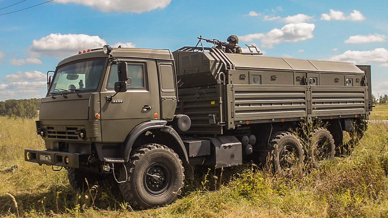

#### Kalustokuvaus
Sotilaskuorma-autoalusta, jota käytetään joukko-, huolto- ja erikoisjärjestelmien kantolavana. Järjestelmä mahdollistaa logistisen liikkuvuuden ja toimii monien ase- ja johtamisjärjestelmien perusalustana.

#### Suorituskyvyt
- Kuljetus- ja kuormankantokyky (КАМАЗ-5350): mahdollistaa henkilöstön, tarvikkeiden, viestivälineiden tai erikoislaitteiden siirron. Arvo syntyy alustafleksibiliteetistä, ei orgaanisesta aseistuksesta.
- Maastoliikkuvuus 6x6-alustalla: kykenee toimimaan huolto- ja tukitehtävissä tieverkon ulkopuolella. Käytännön suoritus riippuu kuormasta, renkaista ja sääoloista.

#### Huomioita analyysiin
KAMAZ-5350-379 on analyytikolle tärkeä ennen kaikkea alustana, johon voidaan asentaa useita eri järjestelmiä. Sen esiintyminen viittaa usein logistiseen tai johtamis-/tukikykyyn eikä itsenäiseen taistelurooliin.

#### Operatiiviset rajoitteet
Ballistinen suoja on perusversioissa vähäinen tai olematon. Ajoneuvo tarvitsee suojatun toimintaympäristön tai saattosuojan korkean uhan alueella.

#### Lähteet
- [KAMAZ – 5350 family](https://kamaz.ru/en/production/serial/special-vehicles/)
- [ODIN – search: KAMAZ 5350](https://odin.tradoc.army.mil/Search/WEG/KAMAZ%205350)

### MT-LB
#### Kalustokuva
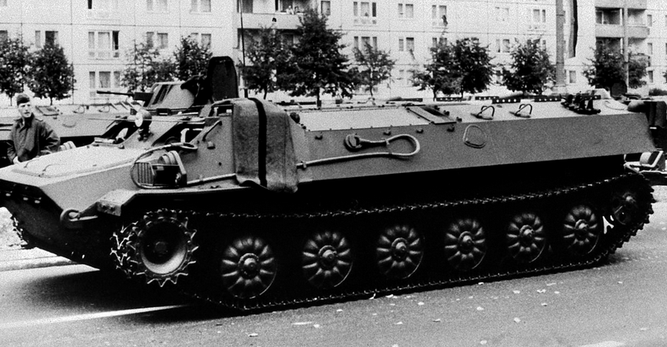
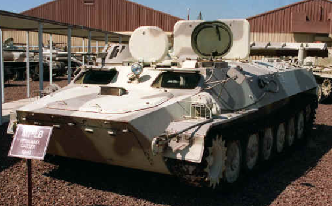
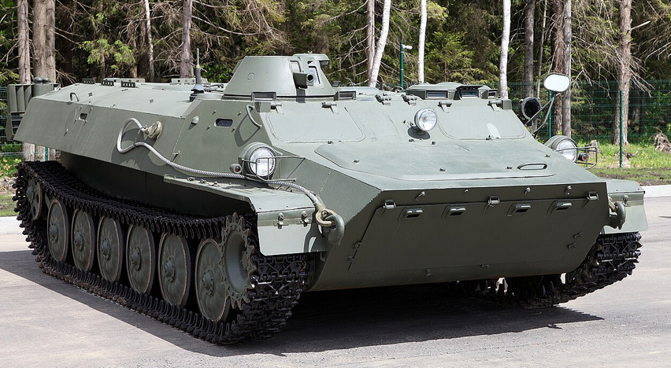

#### Kalustokuvaus
Monikäyttöinen kevyt telakuorma-ajoneuvo, jota käytetään kuljetukseen, vetoon, johtamiseen ja lukemattomien erikoisjärjestelmien alustana. Järjestelmä mahdollistaa hyvän maastoliikkuvuuden ja amfibisen käytön, mutta suoja- ja ergonomiataso ovat kevyitä.

#### Suorituskyvyt
- Kuljetus- ja alustakyky (МТ-ЛБ): ajoneuvo toimii miehistönkuljetuksessa, vetokalustona sekä sensorien, EW- ja ilmatorjuntajärjestelmien alustana. Sen tärkein suorituskyky on moniroolisuus.
- 7,62 mm omasuoja-aseistus (ПКТ): tarjoaa rajallisen lähisuojan. Taistelullinen vaikutus jää pieneksi ilman erikoisvarustusta.

#### Huomioita analyysiin
MT-LB:n arvo on sen laajassa saatavuudessa ja soveltuvuudessa erikoisversioihin. Sen käyttö kertoo usein resurssijoustosta tai tarpeesta kenttäkelpoiselle yleisalustalle.

#### Operatiiviset rajoitteet
Kevyt panssarointi tekee ajoneuvosta haavoittuvan lähes kaikille nykyaikaisille uhkille. Tulivoima puuttuu perusversiossa lähes kokonaan.

#### Lähteet
- [ODIN – MT-LB Russian Amphibious Armored Personnel Carrier](https://odin.tradoc.army.mil/WEG/Asset/MT-LB_Russian_Amphibious_Armored_Personnel_Carrier_%28APC%29)

### SBA-60K2 Bulat
#### Kalustokuva
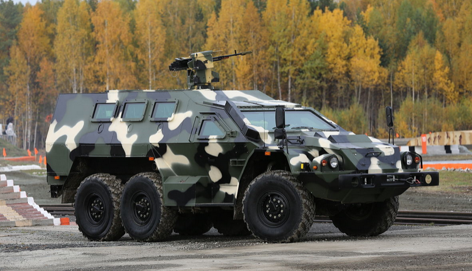

#### Kalustokuvaus
Suojattu pyöräalustainen joukkoajoneuvo, joka sijoittuu APC- ja MRAP-ratkaisujen väliin. Järjestelmä mahdollistaa henkilöstön kuljetuksen paremman miina- ja ballistisen suojan turvin kuin vanhat BTR-sarjat tietyissä tehtävissä.

#### Suorituskyvyt
- Miina- ja ballistinen suoja (Булат): tarkoitettu suojaamaan miehistöä epäsymmetrisiltä uhkilta ja pienaseilta. Tarkat tasot vaihtelevat lähteittäin, mutta rooli on selvästi suojattu kuljetus.
- Konekivääri-/etäaseasemavaihtoehto: mahdollistaa omasuojan partio- ja saattuetehtävissä. Aseistus ei muuta ajoneuvoa varsinaiseksi IFV:ksi.

#### Huomioita analyysiin
Bulat kuuluu suojattujen kuljetusalustojen kenttään, jossa selviytymiskyky tieverkolla korostuu. Sitä kannattaa tarkastella enemmän turvallisena kuljetusvälineenä kuin hyökkäysajoneuvona.

#### Operatiiviset rajoitteet
Raskas rakenne heikentää maastoliikkuvuutta suhteessa telakalustoon. Suojataso ei tee siitä immuunia raskaalle pst-tulelle tai suurelle tykistövaikutukselle.

#### Lähteet
- [Military Today – SBA-60K2 Bulat](https://www.militarytoday.com/apc/sba_60k2_bulat.htm)
- [ODIN – search: Bulat SBA-60K2](https://odin.tradoc.army.mil/Search/WEG/Bulat%20SBA-60K2)

### T-54/T-55
#### Kalustokuva
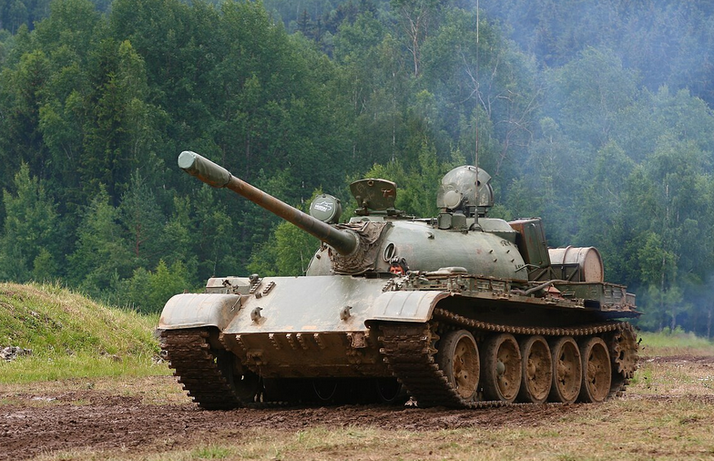

#### Kalustokuvaus
Kylmän sodan panssarivaunuperhe, jota on käytetty erittäin laajasti eri maiden asevoimissa ja myöhemmin myös modernisoitu moniin tukirooleihin. Järjestelmä mahdollistaa edelleen tulituen ja panssarivaunutehtävät matalamman uhan ympäristössä, mutta perusrakenne on vanhentunut.

#### Suorituskyvyt
- 100 mm panssarivaunukanuuna (D-10T / Д-10Т): edelleen käyttökelpoinen kevyempiä panssarimaaleja, asemia ja rakennuksia vastaan. Teho moderneja MBT-maaleja vastaan on rajallinen ilman erikoisammuksia.
- Konekivääriaseistus (ПКТ / DShK-variantit): omasuoja jalkaväkeä ja pehmeitä maaleja vastaan. Vaikutus on taktinen eikä kompensoi sensorivajetta.

#### Huomioita analyysiin
T-54/55 on analyysissä relevantti lähinnä massan, varastokaluston ja improvisoitujen modernisointien kautta. Sen käyttö kertoo usein kalustopaineesta tai tehtävästä, jossa määrällä korvataan laatua.

#### Operatiiviset rajoitteet
Suoja, pimeätoiminta, ergonomia ja ampumajohto jäävät kauas nykyaikaisista MBT-järjestelmistä. Ajoneuvo on haavoittuva moderneille pst-aseille, tykistölle ja yläsektorin uhille.

#### Lähteet
- [ODIN – search: T-55](https://odin.tradoc.army.mil/Search/WEG/T-55)
- [Military Today – T-55](https://www.militarytoday.com/tanks/t55.htm)

### T-62
#### Kalustokuva
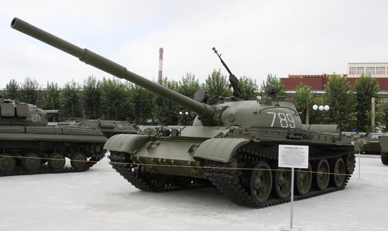

#### Kalustokuvaus
Varhaisen kylmän sodan jälkipuoliskon panssarivaunu, joka toi käyttöön 115 mm sileäputkisen pääaseen mutta jäi muuten myöhempien MBT-sukupolvien varjoon. Järjestelmä mahdollistaa edelleen suoran tulituen ja panssaroidun massan lisäämisen, erityisesti toissijaisilla rintamilla.

#### Suorituskyvyt
- 115 mm sileäputkinen kanuuna (U-5TS / У-5ТС): soveltuu panssaroituja maaleja vastaan, mutta nykyaikaisia MBT-järjestelmiä vastaan teho on rajallinen. Ammusvalikoima vaikuttaa merkittävästi todelliseen suorituskykyyn.
- Konekivääriaseistus (ПКТ / DShKM): omasuoja jalkaväkeä ja kevyitä maaleja vastaan. Täydentävä, ei ratkaiseva suorituskyky.

#### Huomioita analyysiin
T-62:n palauttaminen käyttöön kertoo usein saatavuus- ja määräpainotteisesta ratkaisusta. Modernisoidut lämpötähtäin- ja suojalisäykset voivat parantaa käyttöarvoa, mutta eivät muuta perustasoa.

#### Operatiiviset rajoitteet
Suojaus ja sensorit jäävät selvästi jälkeen T-72B3/T-80BVM/T-90M -tasosta. Ajoneuvo on erityisen altis moderneille pst-ohjuksille ja top-attack-aseille.

#### Lähteet
- [ODIN – search: T-62](https://odin.tradoc.army.mil/Search/WEG/T-62)
- [Military Today – T-62](https://www.militarytoday.com/tanks/t62.htm)

### T-64
#### Kalustokuva
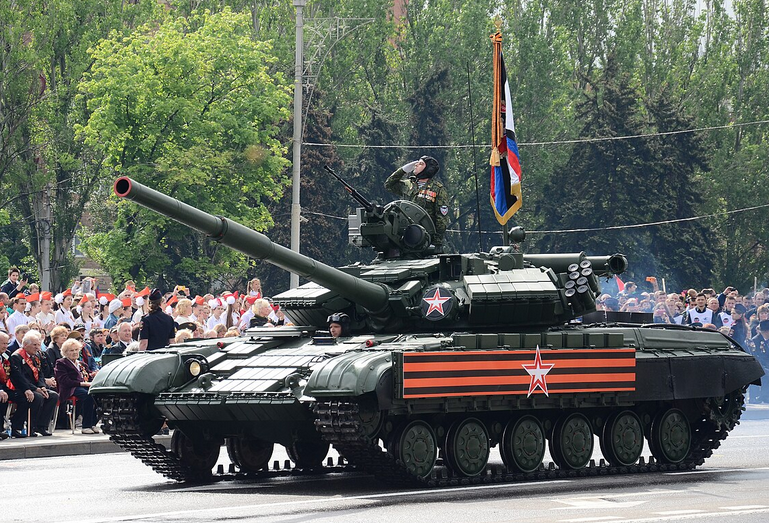

#### Kalustokuvaus
Neuvostoliiton teknisesti edistyksellinen mutta monimutkainen panssarivaunu, joka toimi myöhempien T-72- ja T-80-sukupolvien kehityspohjana. Järjestelmä mahdollistaa edelleen MBT-tason tulivoiman, mutta käytettävyys ja ylläpito ovat haastavampia kuin uudemmissa ratkaisuissa.

#### Suorituskyvyt
- 125 mm sileäputkinen kanuuna (2A46 / 2А46 -perhe): antaa edelleen relevantin suoran tulen kyvyn useimpia maamaaleja vastaan. Ammus- ja tähtäinratkaisut määrittävät todellisen suorituskyvyn.
- Koaksiaalinen ja ilmatorjuntakonekivääri: tukevat lähisuojaa. Niiden merkitys on toissijainen verrattuna pääaseeseen.

#### Huomioita analyysiin
T-64 on tärkeä analyysissä, koska sen teknologinen perintö näkyy myöhemmissä neuvosto-/venäläisissä MBT-ratkaisuissa. Käytössä olevat ajoneuvot ovat usein yksilöllisesti eri tasoisia modernisoinneiltaan.

#### Operatiiviset rajoitteet
Huoltoherkkyys, vanhentuneet sensorit ja suojaus heikentävät selviytymistä nykytaistelussa. Suorituskyky vaihtelee paljon alaversioiden välillä.

#### Lähteet
- [ODIN – search: T-64](https://odin.tradoc.army.mil/Search/WEG/T-64)
- [Military Today – T-64](https://www.militarytoday.com/tanks/t64.htm)

### T-72B3
#### Kalustokuva
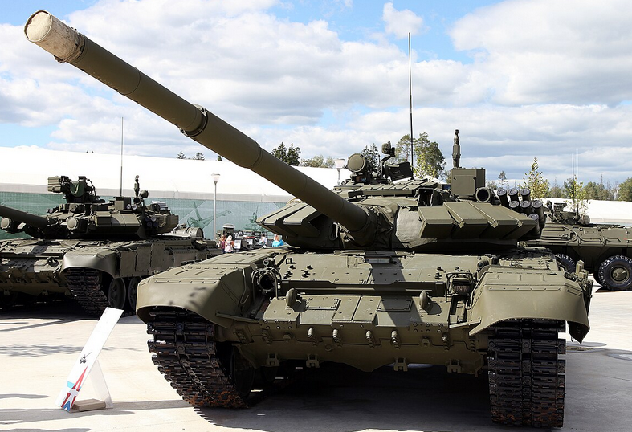
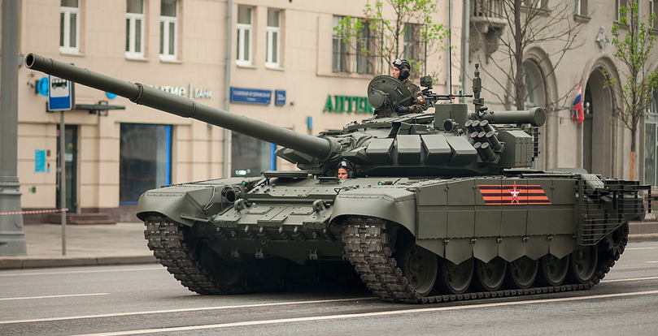
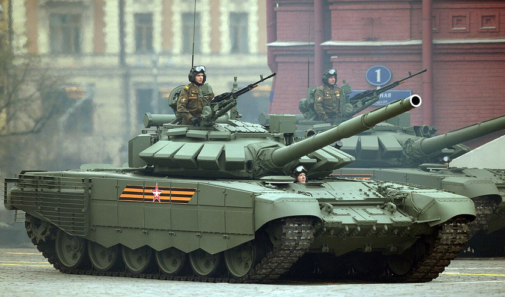

#### Kalustokuvaus
Venäjän laajasti käyttämä modernisoitu T-72-versio, jossa painopiste on parannetussa tähtäimessä, palonhallinnassa ja osin suojassa. Järjestelmä mahdollistaa edelleen massamaisen MBT-kyvyn suhteellisen kustannustehokkaasti.

#### Suorituskyvyt
- 125 mm sileäputkinen kanuuna (2A46M / 2А46М): pääase mahdollistaa vaikutuksen panssarimaaleihin, linnoitteisiin ja muihin maamaaleihin. Ammustyypistä riippuen käytännön suoran tulen etäisyydet ovat useita kilometrejä.
- Putkilaukaistava PST-ohjus (Refleks / «Рефлекс»): antaa panssarintorjuntavaikutuksen pidemmälle kuin perusammukset. Yleisesti ilmoitettu kantama on noin 5 km.
- Suojapäivitykset (esim. Kontakt-5 tai lisäpanssarointi, versiosta riippuen): parantavat selviytymiskykyä verrattuna vanhempiin T-72-malleihin. Suojaus ei silti poista haavoittuvuutta modernille top-attack-aseistukselle.

#### Huomioita analyysiin
T-72B3 on määrällisesti keskeinen venäläinen MBT-tyyppi, joten sen läsnäolo kertoo usein päätaisteluvoiman rungosta. Modernisointierot, kuten B3 vs B3M, ovat analyysissä olennaisia.

#### Operatiiviset rajoitteet
Perusrakenne on vanha, ja miehistön suojaus ammusjärjestelyjen vuoksi on rajoittunut. Yläsektorin suoja ja drone-/loitering-uhka ovat merkittäviä heikkouksia.

#### Lähteet
- [ODIN – T-72 Russian Main Battle Tank](https://odin.tradoc.army.mil/WEG/Asset/T-72_Russian_Main_Battle_Tank_%28MBT%29)
- [ODIN – search: T-72B3](https://odin.tradoc.army.mil/Search/WEG/T-72B3)

### T-80BVM
#### Kalustokuva
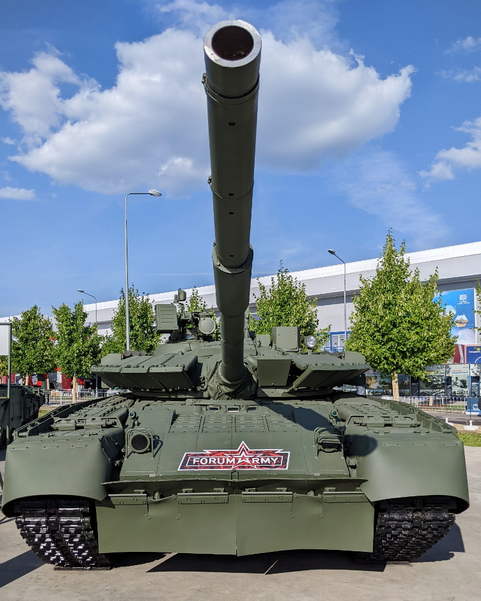
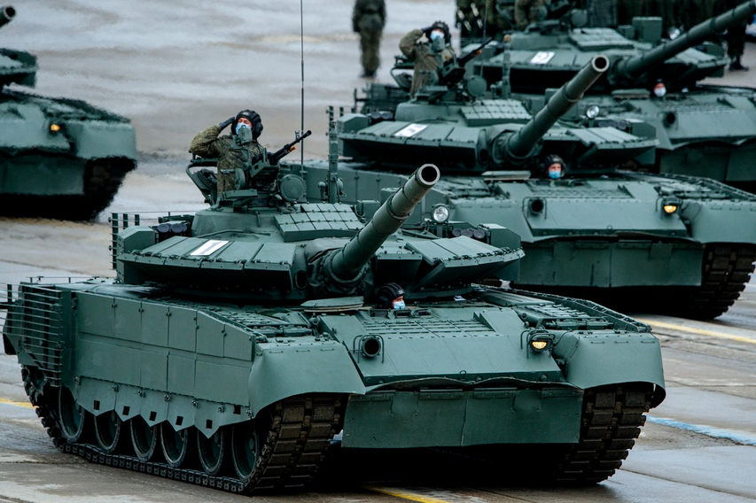
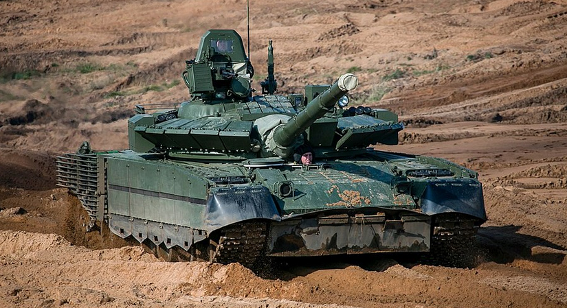

#### Kalustokuvaus
Kaasuturbiinikäyttöinen modernisoitu T-80-versio, jonka vahvuus on hyvä liikkuvuus, kylmäkelpoisuus ja parannettu suojaus. Järjestelmä mahdollistaa nopean panssarivaunutoiminnan erityisesti olosuhteissa, joissa liikkeen ja kiihtyvyyden merkitys korostuu.

#### Suorituskyvyt
- 125 mm sileäputkinen kanuuna (2A46M-4 / 2А46М-4): antaa MBT-tason suoran tulen kyvyn laajaa maalikirjoa vastaan. Tulenhallinnan ja ampumatarvikkeiden taso ratkaisee todellisen etulyöntiaseman.
- Putkilaukaistava PST-ohjus (Refleks / «Рефлекс»): ulottaa panssarintorjunnan noin 5 km luokkaan. Ohjuskyky säilyttää etävaikutuksen myös liikkeestä riippuen.
- Relikt ERA -suoja (Реликт): parantaa suojaa ontelopanoksia ja osaa kineettisistä uhista vastaan. Lisäsuoja kasvattaa selviytymiskykyä, mutta ei tee ajoneuvosta immuunia nykyaikaisille pst-järjestelmille.

#### Huomioita analyysiin
T-80BVM on tärkeä erityisesti eliitti- ja pohjoisen alueen yksiköissä, joissa T-80-perheen ominaisuuksia arvostetaan. Kaasuturbiini tekee siitä doktriiniltaan ja huolloltaan erilaisen kuin T-72-linja.

#### Operatiiviset rajoitteet
Polttoaineenkulutus ja huoltotarve ovat korkeammat kuin dieselpohjaisessa kalustossa. Vaikka suojaa on parannettu, yläsektorin haavoittuvuus ja vanhan rungon rajoitteet säilyvät.

#### Lähteet
- [ODIN – T-80BVM Russian Main Battle Tank](https://odin.tradoc.army.mil/WEG/Asset/T-80BVM_Russian_Main_Battle_Tank_%28MBT%29)

### T-90M
#### Kalustokuva
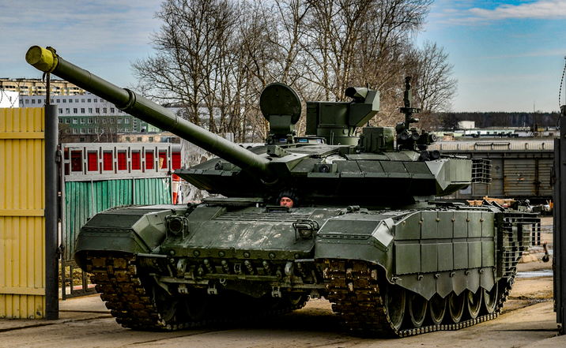
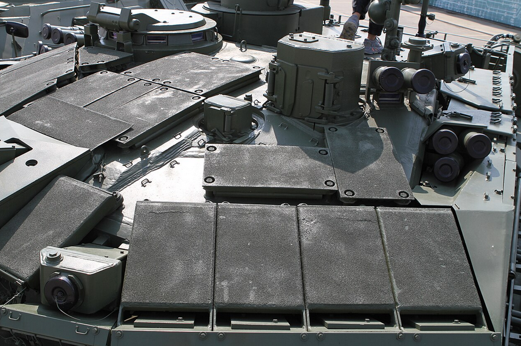

#### Kalustokuvaus
Venäjän nykyisen MBT-kehityslinjan kehittyneimpiin kuuluva sarjaversio, jossa yhdistyvät parempi suojaus, sensorit ja miehistön tilannetietoisuus. Järjestelmä mahdollistaa aiempaa tehokkaamman tulenkäytön, havaintokyvyn ja selviytymisen verrattuna vanhempiin T-72/T-80-modernisointeihin.

#### Suorituskyvyt
- 125 mm sileäputkinen kanuuna (2A46M-5 / 2А46М-5): tarjoaa modernin MBT-tason tulivoiman. Yhdistelmä ammusvalikoimaa, vakautusta ja tähtäimiä nostaa osumatodennäköisyyttä liikkeestä.
- Putkilaukaistava PST-ohjus (Refleks / «Рефлекс»): mahdollistaa vaikutuksen panssarimaaleihin noin 5 km etäisyydelle. Ohjus täydentää pääaseen suorituskykyä etenkin avoimessa maastossa.
- Suojaratkaisut (Relikt ERA / «Реликт», parannettu tornisuoja): lisäävät selviytymiskykyä edeltäjiin nähden. Käytännön suoja riippuu kuitenkin lisäsuojista, häkeistä ja kenttämodifikaatioista.

#### Huomioita analyysiin
T-90M on tärkeä indikaattori joukon prioriteetista ja modernisointitasosta. Sen läsnäolo voi kertoa korkeammasta valmiudesta tai panostetusta muodostelmasta verrattuna vanhempaan T-72-kalustoon.

#### Operatiiviset rajoitteet
Vaikka T-90M on kehittynyt, se ei ole immuuni yläsektorin iskuaseille, pst-ohjuksille tai drooniuhalle. Kappalemäärä on pienempi kuin T-72-perheellä, mikä rajoittaa strategista massavaikutusta.

#### Lähteet
- [ODIN – T-90M Russian Main Battle Tank](https://odin.tradoc.army.mil/WEG/Asset/T-90M_Russian_Main_Battle_Tank_%28MBT%29)
- [ODIN – T-90 Russian Main Battle Tank](https://odin.tradoc.army.mil/WEG/Asset/T-90_Russian_Main_Battle_Tank_%28MBT%29)

### Ural Typhoon
#### Kalustokuva
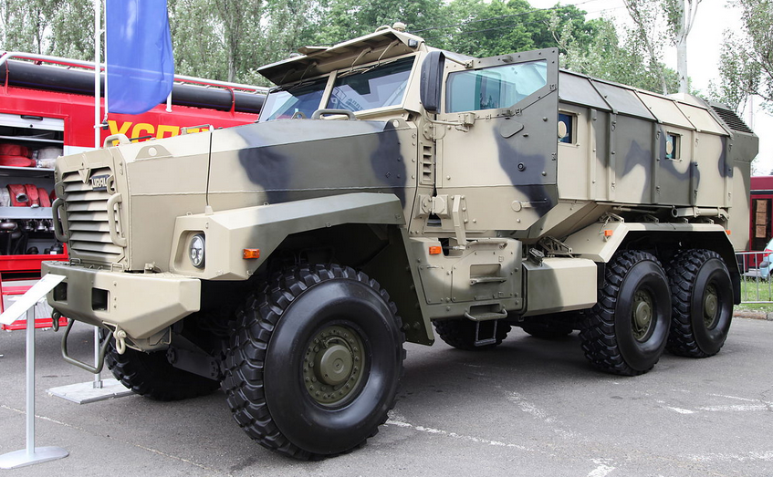

#### Kalustokuvaus
Ural-alustainen MRAP/suojattu kuljetusajoneuvo, jonka tehtävä on henkilöstön turvallisempi kuljetus epäsymmetrisessä uhkaympäristössä. Järjestelmä mahdollistaa paremman miina- ja väijytyssuojan kuin perinteiset kuorma-autot ja vanhat APC-ratkaisut tietyissä tehtävissä.

#### Suorituskyvyt
- Miina- ja ballistinen suoja (Тайфун-У): suojaus on järjestelmän pääsuorituskyky, ei raskas aseistus. Ajoneuvo on suunniteltu suojaamaan miehistöä tieverkolla ja partioinnissa.
- Konekivääri-/RWS-varustus (variantista riippuen): antaa omasuojakykyä. Se ei muuta järjestelmää varsinaiseksi taisteluajoneuvoksi.

#### Huomioita analyysiin
Typhoon-U täydentää suojatun liikkuvuuden portfoliota siellä, missä MRAP-logiikka on hyödyllinen. Se on erityisen relevantti saattue-, vartiointi- ja henkilöstökuljetustehtävissä.

#### Operatiiviset rajoitteet
Rakenne on vähemmän sopiva suoraan etulinjan panssaritaisteluun kuin telakalusto. Korkea siluetti ja pyöräalusta voivat rajoittaa käyttöä vaikeassa maastossa.

#### Lähteet
- [Rostec – Typhoon-U family](https://rostec.ru/en/product/taifun-u/)
- [ODIN – search: Typhoon-U](https://odin.tradoc.army.mil/Search/WEG/Typhoon-U)

## tiedustelu-valvonta-kalusto

### 1L122 Garmony
#### Kalustokuva
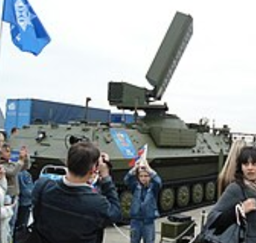

#### Kalustokuvaus
Kevyt tai siirrettävä ilmavalvontatutka, jonka rooli on matalan ja keskitason ilmatilannekuvan tuottaminen eteen työnnetyille joukoille. Järjestelmä mahdollistaa varhaisen varoituksen erityisesti matalalla lentävistä ilma-aluksista ja UAV-kohteista.

#### Suorituskyvyt
- Ilmavalvontatutka (1Л122 «Гармонь»): tarkoitettu havaitsemaan ja seuraamaan ilmakohteita taistelukentän tai paikallisen ilmapuolustuksen tarpeisiin. Raportoidut kantamat vaihtelevat versiosta riippuen, mutta rooli on lyhyen/keskipitkän kantaman valvonta, ei strateginen kaukovalvonta.

#### Huomioita analyysiin
1L122 täydentää paikallista ilmatilannekuvaa ja tukee etenkin lyhyen kantaman ilmatorjuntaa. Sen arvo kasvaa, kun järjestelmä on verkotettu johtamis- ja ilmatorjuntasolmuihin.

#### Operatiiviset rajoitteet
Pieni tai keskitason kantama rajoittaa peittoa ilman hajautettua verkkoa. Tutka on altis elektroniselle häirinnälle, vastatiedustelulle ja vastatykistölle, jos sen sijainti paljastuu.

#### Lähteet
- [Rosoboronexport – 1L122E Garmon](https://roe.ru/eng/catalog/aerospace-systems/air-defense-systems/1l122e-garmon/)
- [ODIN – search: 1L122 Garmony](https://odin.tradoc.army.mil/Search/WEG/1L122%20Garmony)

### 9s15 Obzor 01
#### Kalustokuva
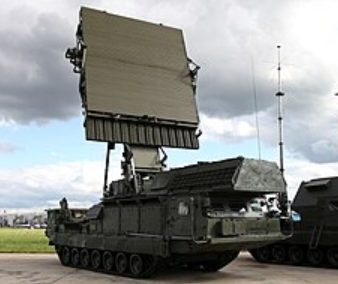

#### Kalustokuvaus
S-300V-perheen taistelunjohtoon liittyvä valvontatutka, jonka tehtävä on laajan ilmatilannekuvan muodostaminen ja maalien osoittaminen. Järjestelmä mahdollistaa ilmatorjuntajoukon tilannekuvan ja pitkän kantaman torjunnan ennakkovalmistelun.

#### Suorituskyvyt
- Valvontatutka (9С15 «Обзор-3»): havaitsee ja seuraa useita ilmakohteita samanaikaisesti. Raportoidut havaitsemisetäisyydet ovat pitkän kantaman luokkaa ja riippuvat maalityypistä, korkeudesta sekä järjestelmäkokoonpanosta.

#### Huomioita analyysiin
9S15 on tärkeä nimenomaan osana S-300V-kokonaisuutta, ei yksinään. Sen läsnäolo viittaa suuremman ilmatorjuntajärjestelmän toimintaan tai valmisteluun alueella.

#### Operatiiviset rajoitteet
Suurikokoinen tutkajärjestelmä on näkyvä ja arvokas maali. Vaikuttaminen sähkösodan, SEAD-toiminnan tai pitkän kantaman tulen keinoin voi heikentää koko verkon suorituskykyä.

#### Lähteet
- [ODIN – S-300V (SA-12b Giant) Russian Long-Range Air Defense Missile System](https://odin.tradoc.army.mil/WEG/Asset/S-300V_%28SA-12b_Giant%29_Russian_Long-Range_Air_Defense_Missile_System)
- [ODIN – search: 9S15 Obzor](https://odin.tradoc.army.mil/Search/WEG/9S15%20Obzor)

### BRDM-2
#### Kalustokuva
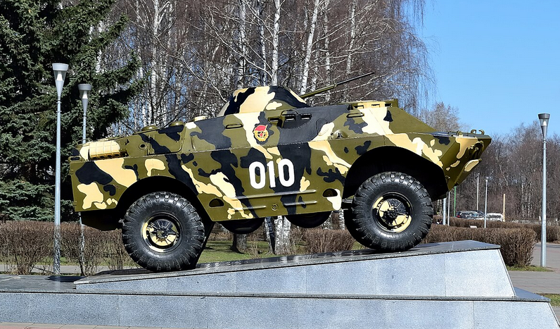

#### Kalustokuvaus
Kevyt 4x4-amfibinen tiedusteluajoneuvo, jonka vahvuus on liikkuvuus, pieni koko ja soveltuvuus partiointiin. Järjestelmä mahdollistaa tiedustelu-, vartiointi- ja kevyen turvallisuustehtävän, mutta ei kestä modernia tulivaikutusta.

#### Suorituskyvyt
- 14,5 mm raskas konekivääri (KPV / КПВ): antaa kyvyn vaikuttaa kevyisiin ajoneuvoihin ja tuliasemiin. Tehokas vaikutusalue on tyypillisesti noin 1–2 km.
- 7,62 mm koaksiaalinen konekivääri (ПКТ): lähisuoja pehmeitä maaleja vastaan. Täydentävä aseistus tiedusteluajoneuvolle.

#### Huomioita analyysiin
BRDM-2 on edelleen yleinen, koska se on yksinkertainen ja helposti ylläpidettävä. Monissa joukoissa se toimii myös erikoisversioiden, kuten pst- tai johtamismuunnosten, alustana.

#### Operatiiviset rajoitteet
Suoja ja sensorit ovat nykyaikaan nähden vaatimattomat. Ajoneuvo on erityisen haavoittuva drooneille, miinoille ja raskaille konekivääreille.

#### Lähteet
- [ODIN – BRDM-2 Russian 4x4 Amphibious Armored Scout Car](https://odin.tradoc.army.mil/WEG/Asset/3563edc1754294260097f7d8266974d5)
- [ODIN – KPV-14.5 Russian Heavy Machine Gun](https://odin.tradoc.army.mil/WEG/Asset/c5e014534c8fe3def0ef6d81f491bfb7)

### BRM-1K
#### Kalustokuva
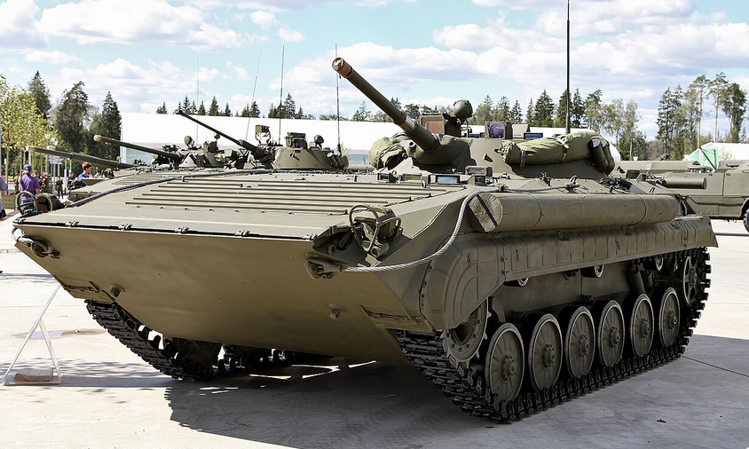

#### Kalustokuvaus
BMP-1-alustainen tiedusteluajoneuvo, johon on integroitu tiedustelusensoreita ja lisäviestivälineitä. Järjestelmä mahdollistaa tiedustelun etulinjan tuntumassa paremman maastokelpoisuuden ja sensorituen avulla kuin BRDM-2-tyyppinen ajoneuvo.

#### Suorituskyvyt
- Sensori- ja tiedustelukokonaisuus (БРМ-1К): sisältää maalinhavaitsemiseen, havainnointiin ja raportointiin liittyviä välineitä. Avoimissa lähteissä tarkat sensorikantamat vaihtelevat, mutta rooli on taktinen tiedustelu, ei syvä tiedustelu.
- 73 mm 2A28 Grom ja 7,62 mm PKT: omasuoja- ja rajallinen tulitukikyky. Aseistus mahdollistaa kevyiden maalien torjunnan, mutta ei tee ajoneuvosta etulinjan tulivoima-alustaa.

#### Huomioita analyysiin
BRM-1K:n arvo syntyy kyvystä tuottaa havaintoja mekanisoidun joukon mukana. Vanha alusta heikentää selviytymistä, mutta järjestelmä voi silti olla käyttökelpoinen, jos vastassa ei ole voimakasta tulivaikutusta.

#### Operatiiviset rajoitteet
Sensori- ja suojataso on nykyaikaan nähden vaatimaton. Ajoneuvo joutuu toimimaan lähellä etulinjaa, mikä kasvattaa tappioriskiä.

#### Lähteet
- [ODIN – BRM-1K Russian Amphibious Combat Reconnaissance Vehicle](https://odin.tradoc.army.mil/WEG/Asset/4136bc85abbcc246b4b606de0e585cc2)

### K-612-O / KDKhR-1N
#### Kalustokuva
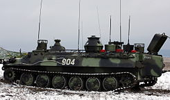

#### Kalustokuvaus
Kemialliseen, biologiseen ja säteilytiedusteluun tarkoitettu erikoisajoneuvo, joka tuottaa havaintoja saastuneista alueista ja tukee joukkojen suojautumista. Järjestelmä mahdollistaa CBRN-ympäristön tunnistamisen ja reittien, kohteiden tai vaikutusalueiden arvioinnin.

#### Suorituskyvyt
- CBRN-tiedustelulaitteisto (КДХР-1Н): havaitsee ja mittaa saastumista sekä tukee näytteenottoa ja raportointia. Tarkat sensorityypit vaihtelevat kokoonpanosta riippuen, mutta suorituskyvyn ydin on vaarallisen ympäristön karakterisointi.

#### Huomioita analyysiin
Tällaiset ajoneuvot ovat tärkeitä, koska ne mahdollistavat joukkojen toiminnan NBC-uhassa ja tukevat päätöksentekoa suojautumisessa. Niiden läsnäolo voi viitata joko todelliseen uhka-arvioon tai varautumiseen riskialueella.

#### Operatiiviset rajoitteet
Avoin lähdeaineisto yksityiskohdista on niukkaa. Järjestelmä on erikoisalusta, jonka käyttöarvo riippuu vahvasti koulutetusta henkilöstöstä ja koko CBRN-prosessin toimivuudesta.

#### Lähteet
- [ODIN – search: KDKhR-1N](https://odin.tradoc.army.mil/Search/WEG/KDKhR-1N)
- [Army Recognition – KDKhR-1N CBRN reconnaissance vehicle](https://armyrecognition.com/russian_russia_army_wheeled_armoured_vehicle_uk/kdhr-1n_cbrn_reconnaissance_vehicle_technical_data_sheet_specifications_pictures_video.html)

### Nebo-SV/S / Nebo-M
#### Kalustokuva
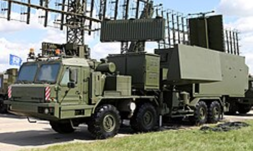

#### Kalustokuvaus
Monitaajuus- ja pitkän kantaman ilmavalvontatutkaperhe, jonka tehtävä on tuottaa laaja ilmatilannekuva myös vaikeasti havaittavista kohteista. Järjestelmä mahdollistaa kerroksellisen ilmatorjunnan varhaisen varoituksen ja maalinosoituksen laajalla alueella.

#### Suorituskyvyt
- Monikaistainen ilmavalvontatutka (Небо-М / Небо-СВ): yhdistää eri taajuusalueiden sensoreita kohteiden havaitsemiseksi ja seuraamiseksi. Julkisesti raportoidut kantamat ovat satojen kilometrien luokkaa, mutta suoritus riippuu maalityypistä ja verkottamisesta.

#### Huomioita analyysiin
Nebo-perheen merkitys on erityisen suuri osana integroitua ilmapuolustusta ja vastastealth-keskustelua. Se on korkeaarvoinen sensori, jonka sijainti ja toimintarytmi kiinnostavat analyytikkoa voimakkaasti.

#### Operatiiviset rajoitteet
Suuri koko, korkea sähkömagneettinen näkyvyys ja riippuvuus verkotuksesta tekevät järjestelmästä houkuttelevan maalin. Siirtyminen, käyttöönottoaika ja logistinen jalanjälki rajoittavat täydellistä joustavuutta.

#### Lähteet
- [Rosoboronexport – Nebo-SVU / Nebo-ME family](https://roe.ru/eng/catalog/aerospace-systems/air-defense-systems/55zh6ume-nebo-me/)
- [ODIN – search: Nebo-M](https://odin.tradoc.army.mil/Search/WEG/Nebo-M)

### Zoopark-1
#### Kalustokuva
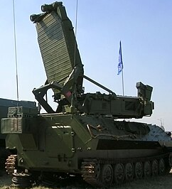

#### Kalustokuvaus
Vastatykistö- ja maalinosoitustutka, joka on tarkoitettu paikantamaan kranaatinheittimien, putkitykistön, raketinheittimien ja joidenkin ohjuslaukaisujen tuliasemia. Järjestelmä mahdollistaa nopean vastatykistövaikuttamisen ja tuliyksiköiden suojan varhaisella varoituksella.

#### Suorituskyvyt
- Vastatykistötutka (1L219 / 1Л219 «Зоопарк-1»): seuraa ammuksen lentorataa taaksepäin ja arvioi laukaisupaikan. Ilmoitetut havaitsemisetäisyydet vaihtelevat maalityypin mukaan, mutta järjestelmä on nimenomaan taktisen vastatykistötaistelun työkalu.

#### Huomioita analyysiin
Zoopark-1 on tärkeä indikaattori siitä, että vastapuoli pyrkii järjestelmälliseen vastatykistötoimintaan. Sen vaikutus kasvaa, jos se on yhdistetty nopeasti reagoivaan tykistö- ja johtamisverkkoon.

#### Operatiiviset rajoitteet
Tutkan oma säteily tekee siitä havaittavan ja altistaa vastatoimille. Hajautus, nopea asemanvaihto ja suoja ovat keskeisiä järjestelmän selviytymiselle.

#### Lähteet
- [ODIN – 1L219 Zoopark-1 Russian Mobile Counter-Battery Radar](https://odin.tradoc.army.mil/WEG/Asset/100a6d9e7cd19b088a28e2ec49760597)
- [ODIN – 1L260 Zoopark-1M Russian Mobile Counter-Battery Radar](https://odin.tradoc.army.mil/WEG/Asset/920eac58bd79be1781d419f0a6c04f42)

## elso-kalusto

### 1L267 Moskva-1
#### Kalustokuva
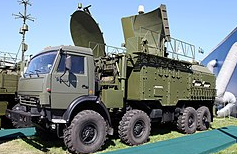

#### Kalustokuvaus
Passiivinen tai pääosin passiivisiin sensoreihin nojaava EW-/ilmatilannejärjestelmä, joka on tarkoitettu havaitsemaan, seuraamaan ja tukemaan ilmauhkaan vaikuttamista ilman jatkuvaa omaa säteilyä. Järjestelmä mahdollistaa laajan ilmatilannekuvan ja tukee muita ilmatorjunta- tai häirintäjärjestelmiä.

#### Suorituskyvyt
- Passiivinen elektroninen tiedustelu ja ilmatilannekuva (Москва-1): järjestelmä kykenee havaitsemaan ja seuraamaan ilmakohteita sekä jakamaan maalitietoa muille järjestelmille. ODIN raportoi jopa noin 400 km luokan havaintoa tietyissä olosuhteissa, mutta käytännön teho riippuu kohteesta ja elektromagneettisesta ympäristöstä.

#### Huomioita analyysiin
Moskva-1 on arvokas, koska se tukee sensori- ja häirintäverkkoa ilman jatkuvaa aktiivista tutkasäteilyä. Se parantaa verkottuneen ilmapuolustuksen tilannekuvaa ja kohteiden priorisointia.

#### Operatiiviset rajoitteet
Järjestelmä ei yksin tuota torjuntavaikutusta, vaan tarvitsee kytkennän muihin ase- tai häirintäjärjestelmiin. Passiivinen järjestelmäkin on haavoittuva paikannukselle, jos sen viesti- ja tukirakenne paljastuu.

#### Lähteet
- [ODIN – Moskva-1 Russian Electronic Warfare Vehicle](https://odin.tradoc.army.mil/WEG/Asset/Moskva-1_)

### 1L269 Krasukha-2
#### Kalustokuva
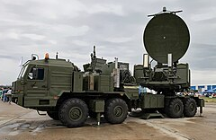

#### Kalustokuvaus
Pitkän kantaman elektronisen häirinnän järjestelmä, jonka tehtävä on vaikuttaa erityisesti ilmavalvonta- ja tiedustelujärjestelmiin. Järjestelmä mahdollistaa vastapuolen sensoriketjun häirinnän operatiivisella syvyydellä.

#### Suorituskyvyt
- Tutka- ja sensorihäirintä (Красуха-2 / 1Л269): tarkoitettu erityisesti ilmassa olevien valvonta- ja tiedustelujärjestelmien häirintään. Julkiset kantama-arviot vaihtelevat suuresti, joten niitä on käsiteltävä varovaisesti; olennaista on pitkän kantaman standoff-häirintärooli.

#### Huomioita analyysiin
Krasukha-2:n operatiivinen merkitys on vastapuolen ISR- ja ilmakuvaketjun heikentäminen. Se on korkean arvon EW-resurssi ja usein osa laajempaa elektronisen sodankäynnin kokonaisuutta.

#### Operatiiviset rajoitteet
Avoin lähdeaineisto yksityiskohdista on rajallinen ja osin propagandaväritteinen. Suurikokoinen järjestelmä tarvitsee suojaa, siirtymiskykyä ja hyvää emissiohallintaa selviytyäkseen.

#### Lähteet
- [ODIN – search: 1L269 Krasukha-2](https://odin.tradoc.army.mil/Search/WEG/1L269%20Krasukha-2)
- [ODIN – search: krasukha](https://odin.tradoc.army.mil/Search/WEG/krasukha)

### 1RL257 Krasukha-4
#### Kalustokuva
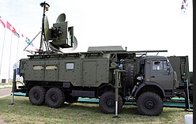

#### Kalustokuvaus
Laajakaistainen liikkuva häirintäjärjestelmä, jonka tarkoitus on häiritä tutkia, tiedustelujärjestelmiä ja joitakin satelliitti- tai ilma-alustaisia sensoreita. Järjestelmä mahdollistaa vastapuolen ISR- ja tarkkuusaseketjun heikentämisen erityisesti operatiivisella tasolla.

#### Suorituskyvyt
- Monitoimihäirintä (Красуха-4 / 1РЛ257): suunniteltu häiritsemään ilmassa ja avaruudessa olevia tiedustelusensoreita sekä AWACS-tyyppisiä järjestelmiä. ODIN kuvaa sen laajakaistaisena jammerina; tarkat kantamat vaihtelevat lähteittäin eikä avoimien lähteiden lukuja tule pitää varmoina.

#### Huomioita analyysiin
Krasukha-4 on tunnetuimpia venäläisiä EW-järjestelmiä ja sillä on huomattava psykologinen sekä operatiivinen arvo. Sen todellinen vaikutus riippuu kuitenkin kohdejärjestelmästä, käyttötaidosta ja verkottamisesta.

#### Operatiiviset rajoitteet
Häirintäjärjestelmät voivat paljastaa sijaintinsa emissioiden kautta. Vaikutus ei ole universaali kaikkiin sensoreihin, ja vastatoimet sekä taajuushyppely heikentävät tehoa.

#### Lähteet
- [ODIN – 1RL257E Krasukha-4 Russian 8x8 Mobile Multifunctional Jammer](https://odin.tradoc.army.mil/WEG/Asset/f039dd3d04fa0226088d1257319579a7)

### Borisoglebsk 2
#### Kalustokuva
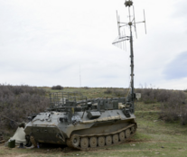

#### Kalustokuvaus
Monialustainen taktisen tason EW-järjestelmä, joka on tarkoitettu viesti- ja radioverkkojen häirintään sekä signaalitiedusteluun. Järjestelmä mahdollistaa useiden taajuusalueiden samanaikaisen seurannan ja häirinnän liikkuvassa taistelussa.

#### Suorituskyvyt
- Monitoimihäirintä ja suuntiminen (Борисоглебск-2 / РБ-301Б): järjestelmä pystyy havaitsemaan, analysoimaan ja häiritsemään radioviestintää useilla taajuuksilla. Avoimissa lähteissä kantamat riippuvat alajärjestelmästä, maastosta ja kohde-emissiosta.

#### Huomioita analyysiin
Borisoglebsk-2 on taktisesti erittäin relevantti, koska se voi heikentää joukkotason viestintää ja koordinaatiota. Järjestelmä sopii hyvin liikkuvien maajoukkojen tukemiseen.

#### Operatiiviset rajoitteet
Vaikutus on taajuus-, maasto- ja kohderiippuvainen. Järjestelmä tarvitsee osaavaa operaattoritoimintaa ja suojaa vastatiedustelulta sekä vastatulelta.

#### Lähteet
- [ODIN – Borisoglebsk-2 (RB-301B) Russian Amphibious Multipurpose Jamming Complex](https://odin.tradoc.army.mil/WEG/Asset/Borisoglebsk-2_%28RB-301B%29_Russian_Amphibious_Multipurpose_Jamming_Complex)

### Leer-2
#### Kalustokuva
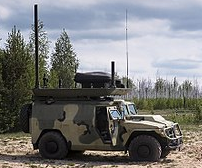

#### Kalustokuvaus
Kevyempi liikkuva EW-ajoneuvo, jonka rooli on radio- ja viestiliikenteeseen vaikuttaminen taktisen tason ympäristössä. Järjestelmä mahdollistaa paikallisen häirinnän ja signaalitiedustelun erityisesti liikkuvia maajoukkoja tukien.

#### Suorituskyvyt
- Viestihäirintä ja SIGINT (Леер-2): suorituskyky kohdistuu paikalliseen radioverkon häirintään ja emissioiden tunnistamiseen. Avoimen lähdeaineiston mukaan järjestelmä on tarkoitettu lähinnä taktiseen eikä operatiivisen syvyyden häirintään.

#### Huomioita analyysiin
Leer-2 on kiinnostava, koska se täydentää raskaampia EW-järjestelmiä kevyemmällä ja liikkuvammalla muodolla. Sen käyttö voi viitata tarpeeseen häiritä etulinjan tai paikallisen alueen viestiliikennettä.

#### Operatiiviset rajoitteet
Avoin lähdeaineisto on melko niukkaa, mikä rajoittaa yksityiskohtaista arviota. Kevyempi järjestelmä tarjoaa yleensä lyhyemmän kantaman ja pienemmän tehon kuin raskaammat EW-kompleksit.

#### Lähteet
- [ODIN – search: Leer-2](https://odin.tradoc.army.mil/Search/WEG/Leer-2)
- [ODIN – search: leer](https://odin.tradoc.army.mil/Search/WEG/leer)

### R-330Zh Zhitel / R-330M1P "Diabazol"
#### Kalustokuva
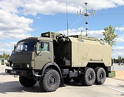

#### Kalustokuvaus
Matkapuhelin-, satelliitti- ja radioviestinnän häirintään sekä suuntimiseen tarkoitettu EW-järjestelmä. Järjestelmä mahdollistaa viestiliikenteen katkaisun, kohteiden paikannuksen ja elektronisen tilanteen hallinnan taktisen-operatiivisella rajapinnalla.

#### Suorituskyvyt
- Viestihäirintä ja suuntiminen (Р-330Ж «Житель»): järjestelmä on tarkoitettu satelliitti- ja solukkoviestinnän havaitsemiseen, analysointiin, suuntimiseen ja häirintään. ODIN kuvaa sen nimenomaan cellular/satcom-jammeriksi; kantama riippuu maastosta, kohteesta ja antennikonfiguraatiosta.
- EW-johtaminen / verkottaminen (Р-330М1П «Диабазол»): tukee EW-alajärjestelmien hallintaa ja tiedon jakamista. Se parantaa kokonaisuuden vaikutusta enemmän johtamisen kuin oman häirintätehon kautta.

#### Huomioita analyysiin
Zhitel on erityisen relevantti, koska mobiili- ja satelliittiviestintä ovat nykyaikaisessa sodankäynnissä keskeisiä. Diabazol-tyyppinen johtamiskerros nostaa yksittäisen jammerin vaikutuksen järjestelmävaikutukseksi.

#### Operatiiviset rajoitteet
Häirinnän teho riippuu vastapuolen taajuushallinnasta, varayhteyksistä ja signaalikurista. EW-ajoneuvot ovat myös itse paikannettavissa, jos emissiohallinta epäonnistuu.

#### Lähteet
- [ODIN – R-330Zh Zhitel Russian Cellular Jamming and Direction Finding System](https://odin.tradoc.army.mil/WEG/Asset/R-330Zh_Zhitel_Russian_Cellular_Jamming_and_Direction_Finding_System)
- [ODIN – search: Diabazol](https://odin.tradoc.army.mil/Search/WEG/Diabazol)

### RB-341V Leer-3
#### Kalustokuva
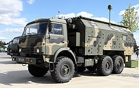

#### Kalustokuvaus
UAV-pohjainen EW-järjestelmä, joka yhdistää ajoneuvoalustan ja Orlan-10-tyyppiset lennokit viestihäirintään, psykologiseen vaikuttamiseen ja tilannekuvaan. Järjestelmä mahdollistaa häirinnän ja vaikuttamisen myös alueille, joihin maassa oleva jammer ei helposti ulotu.

#### Suorituskyvyt
- UAV-avusteinen viestihäirintä (РБ-341В «Леер-3»): Orlan-10-lennokit voivat kuljettaa häirintä- tai viestivaikutuskuormia ja kohdistaa vaikutuksen paikallisesti. ODIN kuvaa järjestelmän kykenevän erityisesti cellular network -vaikuttamiseen; kantama riippuu lennokin toimintaetäisyydestä ja tehtäväprofiilista.

#### Huomioita analyysiin
Leer-3 on merkittävä, koska se tuo elektronisen vaikuttamisen ilmakerrokseen ja yhdistää tiedustelun, häirinnän ja informaatio-operaation elementtejä. Se on tyypillinen esimerkki venäläisestä verkotetusta taktisen tason EW:stä.

#### Operatiiviset rajoitteet
Lennokkeihin perustuva ratkaisu on haavoittuva ilmatorjunnalle ja elektroniselle vastavaikuttamiselle. Vaikutus riippuu UAV-kaluston saatavuudesta, datalinkistä ja operaattoriosaamisesta.

#### Lähteet
- [ODIN – Leer-3 Russian 6x6 Mobile Drone-Based Electronic Warfare System](https://odin.tradoc.army.mil/WEG/Asset/Leer-3_Russian_6x6_Mobile_Drone-Based_Electronic_Warfare_%28EW%29_System)

## johtamiskalusto

### 1B110
#### Kalustokuva
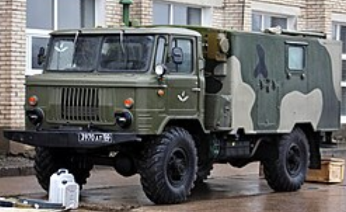

#### Kalustokuvaus
Tykkitulen tai tulenjohtamisen komentopaikkajärjestelmä, joka tukee havaintojen, maalitiedon ja tulikäskyjen käsittelyä. Järjestelmä mahdollistaa tykistön tai tulitukijärjestelmän nopeamman reagoinnin verrattuna puhtaasti manuaaliseen menettelyyn.

#### Suorituskyvyt
- Tulenjohto- ja johtamiskyky (1Б110): järjestelmä kokoaa, välittää ja käsittelee tulenkäytön kannalta olennaista tietoa. Avoimissa lähteissä tarkat laitekokoonpanot vaihtelevat, mutta ydin on tykistön johtamisen automatisointi.

#### Huomioita analyysiin
Tällaiset johtamisajoneuvot ovat kriittisiä, vaikka ne eivät ole näkyviä “asejärjestelmiä”. Ne lyhentävät sensori–päätös–vaikutus-ketjua ja nostavat koko tulijärjestelmän tehoa.

#### Operatiiviset rajoitteet
Avoin lähdeaineisto yksityiskohdista on rajallista. Vaikutus riippuu vahvasti siitä, miten hyvin järjestelmä on integroitu sensoreihin, viestiverkkoon ja ampumayksiköihin.

#### Lähteet
- [ODIN – search: 1B110](https://odin.tradoc.army.mil/Search/WEG/1B110)

### 9S737M Ranzhir-M
#### Kalustokuva
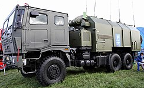

#### Kalustokuvaus
Lyhyen kantaman ilmatorjunnan liikkuva komentopaikka, joka koordinoi yksittäisten torjuntayksiköiden toimintaa ja maalijakoa. Järjestelmä mahdollistaa hajautettujen SHORAD-järjestelmien tehokkaamman yhteistoiminnan.

#### Suorituskyvyt
- Ilmatorjunnan johtaminen ja maalinjako (9С737М «Ранжир-М»): järjestelmä ottaa vastaan ilmatilannetietoa, käsittelee sitä ja jakaa maalit alaisille järjestelmille. Se parantaa reaktioaikaa ja vähentää päällekkäistä tulenkäyttöä.

#### Huomioita analyysiin
Ranzhir-M on arvokas, koska se nostaa yksittäisten Osa-, Tor- tai Tunguska-tyyppisten järjestelmien yhteisvaikutusta. Sen läsnäolo viittaa organisoituun ja kerrokselliseen lähialueen ilmapuolustukseen.

#### Operatiiviset rajoitteet
Komentopaikka ei tuota itse torjuntavaikutusta. Jos tietoliikenne katkeaa tai komentopaikka paikannetaan, alajärjestelmien yhteisvaikutus heikkenee nopeasti.

#### Lähteet
- [ODIN – 9S737 Ranzhir Russian 6x6 Mobile Command Center](https://odin.tradoc.army.mil/WEG/Asset/7d584a609ecda7c3d6d55d6eb13fe80c)

### Akatsiya-ME
#### Kalustokuva
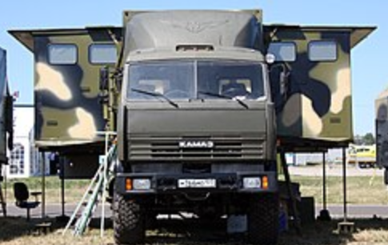

#### Kalustokuvaus
Automatisoitu viesti- ja johtamisjärjestelmä, joka on tarkoitettu joukkojen eri tasojen komentoverkon yhdistämiseen. Järjestelmä mahdollistaa käskyjen, tilannetiedon ja raportoinnin nopeamman käsittelyn kuin perinteinen analoginen johtaminen.

#### Suorituskyvyt
- C2-automaatio (Акация-МЕ): järjestelmä tukee tilannekuvan muodostamista, käskyjen jakamista ja tiedonsiirtoa. Suorituskyvyn ydin on verkottaminen eikä orgaaninen aseistus.

#### Huomioita analyysiin
Akatsiya-ME-tyyppiset järjestelmät ovat tärkeitä siksi, että ne vaikuttavat koko joukon päätöksentekonopeuteen. Niiden todellinen arvo näkyy vain, jos viesti- ja sensoriarkkitehtuuri toimii yhtenä kokonaisuutena.

#### Operatiiviset rajoitteet
Avoimissa lähteissä tekniset yksityiskohdat ovat rajallisia. Verkkoriippuvuus tekee järjestelmästä herkän elektroniselle häirinnälle ja viestikatkoille.

#### Lähteet
- [Rosoboronexport – command and control systems catalogue](https://roe.ru/eng/catalog/land-forces/command-and-control-systems/)
- [ODIN – search: Akatsiya-ME](https://odin.tradoc.army.mil/Search/WEG/Akatsiya-ME)

### AM-1/Medovukha and P-230T/P-234PMB
#### Kalustokuva
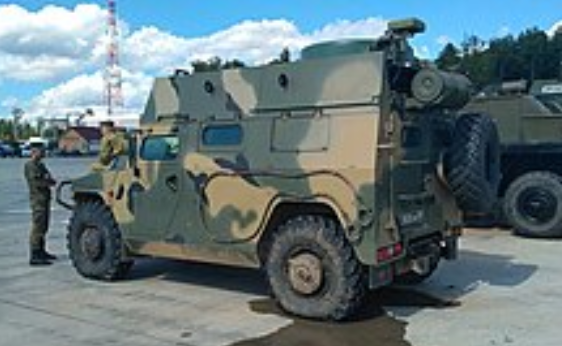

#### Kalustokuvaus
Liikkuvia viesti- ja retranslaatiojärjestelmiä, joiden tehtävä on ylläpitää komentoverkon yhteyksiä liikkuvassa taistelussa. Järjestelmä mahdollistaa radiosillan, komentoliikenteen ja joukkojen hajautetun johtamisen.

#### Suorituskyvyt
- Viesti- ja retranslaatiokyky (П-230Т / П-234ПМБ / «Медовуха»): järjestelmä ylläpitää radiolinkkejä ja viestiyhteyksiä eri joukkojen välillä. Kantama riippuu antenneista, maastosta ja verkon rakenteesta, eikä avoin lähdetieto anna yhtä vakiolukua.

#### Huomioita analyysiin
Tämän ryhmän järjestelmät ovat “hiljaisia mahdollistajia”, jotka ratkaisevat, toimiiko johtaminen käytännössä vai ei. Niiden läsnäolo kertoo usein liikkuvan komentopaikan tai tuliyksikön viestivalmiudesta.

#### Operatiiviset rajoitteet
Vaikutus on epäsuora eikä näy ilman verkottunutta kokonaisuutta. Viestijärjestelmät ovat herkkiä häirinnälle, antennien paljastumiselle ja fyysiselle tuhoamiselle.

#### Lähteet
- [ODIN – search: P-230T](https://odin.tradoc.army.mil/Search/WEG/P-230T)
- [ODIN – search: P-234PMB](https://odin.tradoc.army.mil/Search/WEG/P-234PMB)
- [ODIN – search: Medovukha](https://odin.tradoc.army.mil/Search/WEG/Medovukha)

### Barnaul-T
#### Kalustokuva
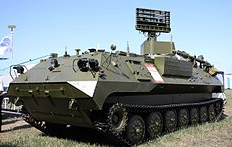

#### Kalustokuvaus
Taktisen tason ilmatorjunnan johtamisjärjestelmä, joka on suunniteltu yhdistämään sensorit, komentopaikat ja lyhyen kantaman torjuntajärjestelmät. Järjestelmä mahdollistaa ilmakohteiden nopean havaitsemisen, priorisoinnin ja maalinjaon hajautetulle ilmatorjunnalle.

#### Suorituskyvyt
- Ilmatorjunnan C2 (Барнаул-Т): järjestelmä tukee ilmakohteiden havaitsemista, käsittelyä ja kohteiden osoittamista joukkotason ilmatorjunnalle. ODIN kuvaa sitä nimenomaan integrated troop and weapon management -ratkaisuna.

#### Huomioita analyysiin
Barnaul-T lisää lyhyen kantaman ilmatorjunnan järjestelmävaikutusta ja voi huomattavasti parantaa SHORAD-verkoston reaktioaikaa. Se on keskeinen “liima” sensori- ja torjuntasolmujen välillä.

#### Operatiiviset rajoitteet
Järjestelmä ei itse ammu maaleja, joten sen vaikutus riippuu alaisista torjuntayksiköistä ja datayhteyksistä. Elektroninen häirintä tai komentopaikan tuhoaminen heikentää koko verkon suorituskykyä.

#### Lähteet
- [ODIN – Barnaul-T Russian Air Defense Command and Control System](https://odin.tradoc.army.mil/WEG/Asset/4bf367106a4dba1bd6c8c013a572c2fc)
- [ODIN – 1L122-1E Barnaul-T Mobile Air Defense Radar](https://odin.tradoc.army.mil/WEG/Asset/70c211acc4acd82f24c49e03b0107e8a)

### MPPU
#### Kalustokuva
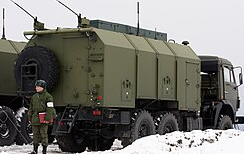

#### Kalustokuvaus
Liikkuva kenttäjohtamis- tai viestikeskus, jonka tehtävä on tukea yksiköiden komentamista taistelukentällä. Järjestelmä mahdollistaa komentopaikan perustamisen nopeasti ilman kiinteää infrastruktuuria.

#### Suorituskyvyt
- Kenttäjohtamisen ja viestinnän tuki (МППУ): järjestelmä tarjoaa työasemat, viestiyhteydet ja komentotoiminnan vaatiman perusinfrastruktuurin. Suorituskyvyn arvo on organisaation johtokyvyn ylläpitämisessä.

#### Huomioita analyysiin
MPPU-tyyppinen järjestelmä on keskeinen, vaikka sen tekniset tiedot eivät ole näyttäviä. Se kertoo johtamisen hajautuksesta ja kyvystä toimia liikkeessä.

#### Operatiiviset rajoitteet
Avoin lähdeaineisto on niukkaa, joten tarkka alaversio ratkaisee paljon. Järjestelmä on haavoittuva, jos komentopaikka paikannetaan tai viestit häiritään.

#### Lähteet
- [ODIN – search: MPPU](https://odin.tradoc.army.mil/Search/WEG/MPPU)

### PPRU-1 Ovod-M-SV
#### Kalustokuva
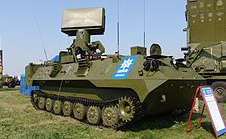

#### Kalustokuvaus
Lyhyen kantaman ilmatorjunnan tiedustelu- ja johtamisajoneuvo, joka tuottaa maalitietoa ja tukee torjuntayksiköiden tulenkäyttöä. Järjestelmä mahdollistaa etummaisen ilmatilannekuvan erityisesti joukkoja suojaavalle ilmatorjunnalle.

#### Suorituskyvyt
- Ilmakohteiden maalinosoitus ja johtaminen (ППРУ-1 «Овод-М-СВ» / 9С80): järjestelmä käyttää omaa tutkaa ja viestivälineitä maalikuvauksen jakamiseen. ODIN kuvaa sitä target-acquisition radar / reconnaissance and control vehicle -roolissa.

#### Huomioita analyysiin
PPRU-1 on tärkeä siksi, että se yhdistää sensorin ja johtamisen samalle alustalle eteen työnnetyssä muodossa. Se tukee erityisesti lyhyen kantaman ilmatorjunnan reaktioaikaa.

#### Operatiiviset rajoitteet
Rooli on kapea ja sidottu ilmatorjunnan kokonaisuuteen. Ajoneuvo on altis vastatulelle ja elektroniselle paikannukselle.

#### Lähteet
- [ODIN – PPRU-1 (Dog Ear) Russian Mobile Reconnaissance and Control Vehicle](https://odin.tradoc.army.mil/WEG/Asset/PPRU-1)
- [ODIN – 9S80 (Dog Ear) Russian Target Acquisition Radar System](https://odin.tradoc.army.mil/WEG/Asset/9S80_%28Dog_Ear%29_Russian_Target_Acquisition_Radar_System)

### R-145BM/1/A
#### Kalustokuva
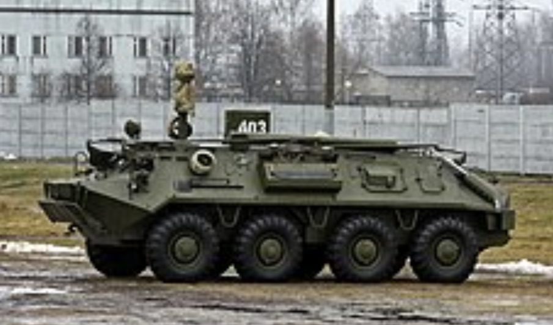

#### Kalustokuvaus
Vanhempi panssaroitu johtamis- ja viestiajoneuvoperhe, joka perustuu BTR-60-sarjaan. Järjestelmä mahdollistaa liikkuvan komentopaikan perustamisen yksikkötasolla tilanteissa, joissa tarvitaan panssaroitua viestiyhteyttä.

#### Suorituskyvyt
- Viesti- ja komentokyky (Р-145БМ): useat radiot, antennit ja komentotilat mahdollistavat johtamisen liikkeessä. Suoritus riippuu käytetystä radiokalustosta ja verkon rakenteesta, ei aseistuksesta.

#### Huomioita analyysiin
R-145BM kertoo usein vanhemman johtamiskaluston jatkokäytöstä. Se on hyödyllinen resurssina, mutta edustaa analogisempaa sukupolvea kuin uudemmat digitaaliset C2-järjestelmät.

#### Operatiiviset rajoitteet
Vanha alusta ja viestiteknologia heikentävät selviytymistä ja suojattua tiedonsiirtoa. Järjestelmä on altis häirinnälle ja fyysiselle paikannukselle.

#### Lähteet
- [ODIN – BTR-60-R-145BM Russian 8x8 Command Post and Communication Center Vehicle](https://odin.tradoc.army.mil/WEG/Asset/BTR-60-R-145BM_Russian_8x8_Command_Post_and_Communication_Center_Vehicle)

### R-149AKSh
#### Kalustokuva
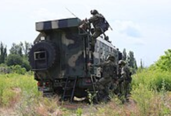

#### Kalustokuvaus
Uudempi liikkuva johtamis- ja viestiajoneuvo, jonka tehtävä on tarjota digitaalisempi komentopaikka joukkotasolle. Järjestelmä mahdollistaa komentamisen, viestinnän ja tilannekuvan ylläpidon liikkuvassa operaatiossa.

#### Suorituskyvyt
- Johtamis- ja viestijärjestelmä (Р-149АКШ): yhdistää työasemat, radiot ja datasiirron samaan alustaan. Vaikutus näkyy nopeampana käskyjen ja tilannetiedon välityksenä, ei suorana tulivaikutuksena.

#### Huomioita analyysiin
R-149AKSh on tärkeä indikaattori joukkojen digitalisoidusta johtamiskyvystä. Se nostaa erityisesti liikkuvien prikaati- ja pataljoonatason muodostelmien toimintakykyä.

#### Operatiiviset rajoitteet
Tarkat suoritusarvot riippuvat asennetusta viestikalustosta ja salausratkaisuista. Järjestelmä on verkko- ja sähköriippuvainen sekä herkkä EW-vaikutukselle.

#### Lähteet
- [ODIN – search: R-149AKSh](https://odin.tradoc.army.mil/Search/WEG/R-149AKSh)

### R-149BMR
#### Kalustokuva
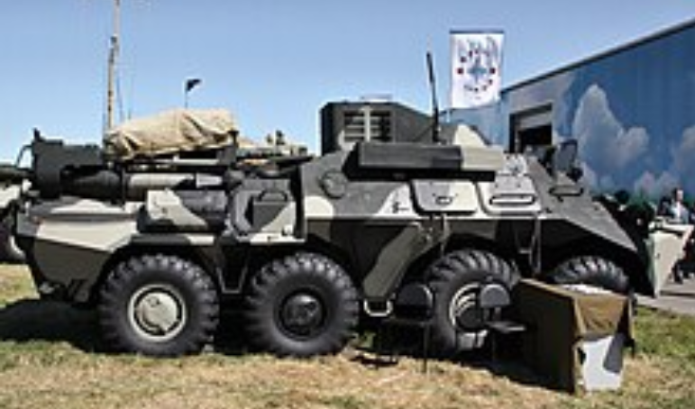

#### Kalustokuvaus
Panssaroitu komentopaikka-ajoneuvo, joka on suunniteltu johtamisen ja viestiliikenteen ylläpitämiseen etulinjan läheisyydessä. Järjestelmä mahdollistaa komentoelementin siirtämisen panssaroidussa muodossa muun taisteluosaston mukana.

#### Suorituskyvyt
- Johtamis- ja viestikyky (Р-149БМР): tarjoaa komento-, radio- ja tiedonsiirtokyvyn suojatulla alustalla. Suoritus perustuu verkotukseen ja liikkuvuuteen, ei asejärjestelmiin.

#### Huomioita analyysiin
Tällaiset komentopaikka-ajoneuvot ovat olennaisia taistelun jatkuvuuden kannalta. Niiden avulla komentoelementti voidaan pitää lähempänä etulinjaa kuin pehmeillä alustoilla.

#### Operatiiviset rajoitteet
Ajoneuvon taisteluarvo on epäsuora ja riippuvainen koko C2-verkon toiminnasta. Paikannus ja tulivaikutus komentopaikkaan voi aiheuttaa suhteettoman suurta haittaa joukolle.

#### Lähteet
- [ODIN – search: R-149BMR](https://odin.tradoc.army.mil/Search/WEG/R-149BMR)

### R-149MA1/A3
#### Kalustokuva
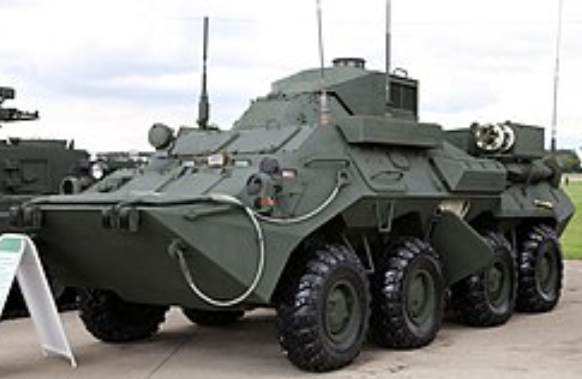

#### Kalustokuvaus
BTR-80-alustainen komento- ja viestiajoneuvoperhe, joka tarjoaa liikkuvan johtamiskyvyn joukkotasoille. Järjestelmä mahdollistaa komentamisen, tilannekuvan ylläpidon ja viestiliikenteen panssaroidulla alustalla.

#### Suorituskyvyt
- Komento- ja signaalikyky (Р-149МА1/МА3): useat radiot ja työasemat tukevat johtamista liikkeessä. ODIN kuvaa MA3-version unified command vehicle -ratkaisuna.

#### Huomioita analyysiin
R-149MA-perhe kuvaa venäläisen C2-kaluston siirtymää kohti verkottuneempaa johtamista. Se on erityisen relevantti, kun arvioidaan mekanisoitujen joukkojen kykyä ylläpitää komentoa liikkeessä.

#### Operatiiviset rajoitteet
BTR-alustan suoja ei riitä korkeimpaan uhkaympäristöön. Järjestelmän hyöty laskee nopeasti, jos viestitaajuudet häiritään tai datalinkit katkeavat.

#### Lähteet
- [ODIN – R-149MA3 Russian 8x8 Amphibious Command and Signal Armored Personnel Carrier](https://odin.tradoc.army.mil/WEG/Asset/R-149MA3_Russian_8x8_Amphibious_Command_and_Signal_Armored_Personnel_Carrier_)

### R-166
#### Kalustokuva
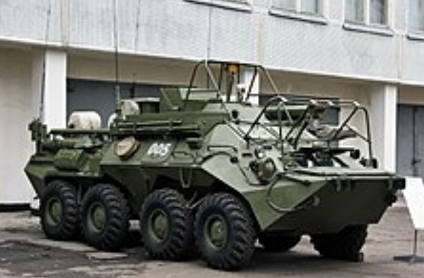

#### Kalustokuvaus
Liikkuva radiokeskus tai viestiasema, jonka tehtävä on ylläpitää joukkojen radioverkkoa kenttäolosuhteissa. Järjestelmä mahdollistaa eri johtamistasojen välisen yhteydenpidon sekä viestiverkon laajentamisen.

#### Suorituskyvyt
- Radioviestintä ja verkon ylläpito (Р-166): tukee HF/VHF/UHF-tyyppisiä yhteyksiä kalustoversiosta riippuen. Kantama riippuu antennista, radiotyypistä ja maastosta eikä sitä voi kuvata yhdellä luvulla.

#### Huomioita analyysiin
R-166-tyyppinen järjestelmä on kriittinen etenkin hajautetussa johtamisessa ja liikkuvissa operaatioissa. Se on enemmän mahdollistaja kuin näkyvä “taistelujärjestelmä”.

#### Operatiiviset rajoitteet
Viestiverkko on herkkä EW-vaikutukselle ja fyysiselle häirinnälle. Suojaus riippuu alustasta; pehmeillä alustoilla selviytymiskyky on alhainen.

#### Lähteet
- [ODIN – search: R-166](https://odin.tradoc.army.mil/Search/WEG/R-166)

### R-419L1
#### Kalustokuva
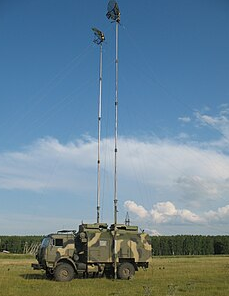

#### Kalustokuvaus
Mikroaaltolinkki- tai radioreleasema, joka tukee pitkähköjen kenttäyhteyksien muodostamista ilman kiinteää infrastruktuuria. Järjestelmä mahdollistaa komentoverkon ulottamisen syvemmälle ja hajautetummin.

#### Suorituskyvyt
- Radiorele- ja runkoverkkokyky (Р-419Л1): tarjoaa korkeamman kapasiteetin viestilinkkejä kuin perusradiot. Kantama riippuu antennikorkeudesta, maastosta ja näköyhteydestä.

#### Huomioita analyysiin
R-419L1 on tärkeä, koska se tukee komentoverkon selkärankaa eikä vain yksittäistä radiolinkkiä. Sen avulla komentopaikat, sensorit ja tuliyksiköt voidaan kytkeä samaan verkkoon.

#### Operatiiviset rajoitteet
Näköyhteysvaatimus ja antennirakenne voivat lisätä paljastumisriskiä. Järjestelmä on riippuvainen sähkönsyötöstä ja masto-/antennikalustosta.

#### Lähteet
- [ODIN – search: R-419L1](https://odin.tradoc.army.mil/Search/WEG/R-419L1)

### R-439MD2
#### Kalustokuva
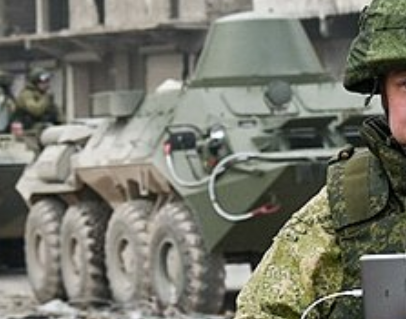

#### Kalustokuvaus
Satelliittiviestijärjestelmä, jonka tehtävä on luoda pitkän kantaman yhteyksiä silloin, kun maassa toimiva radioverkko ei riitä. Järjestelmä mahdollistaa komentamisen operatiivisella syvyydellä myös hajautetuissa kokoonpanoissa.

#### Suorituskyvyt
- SATCOM-yhteys (Р-439МД2): tarjoaa satelliittipohjaisen tiedonsiirron ja viestiliikenteen. Sen arvo on etäyhteyksissä ja verkon redundanssissa, ei orgaanisessa itsepuolustuksessa.

#### Huomioita analyysiin
Satelliittiviestijärjestelmät nostavat komentorakenteen joustavuutta ja jatkuvuutta. Niiden käyttö voi viitata tarpeeseen pitää yhteys laajalle levittäytyneisiin tai nopeasti liikkuviin joukkoihin.

#### Operatiiviset rajoitteet
Riippuvuus satelliittikanavista tekee järjestelmästä herkän häirinnälle ja kapasiteettirajoitteille. Suojaus riippuu käytetystä alustasta eikä itse viestijärjestelmästä.

#### Lähteet
- [ODIN – search: R-439MD2](https://odin.tradoc.army.mil/Search/WEG/R-439MD2)

## ilmatorjunta

### 9K22 Tunguska
#### Kalustokuva
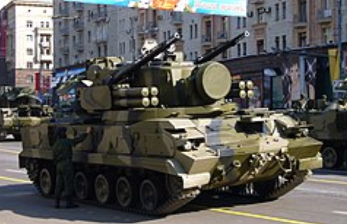

#### Kalustokuvaus
Tykkien ja ohjusten yhdistelmään perustuva lyhyen kantaman itseliikkuva ilmatorjuntajärjestelmä, joka on tarkoitettu liikkuvien joukkojen suojaamiseen. Järjestelmä mahdollistaa reaktion sekä matalalla lentäviin ilma-aluksiin että joihinkin drooni- ja helikopteriuhkiin.

#### Suorituskyvyt
- 30 mm ilmatorjuntakanuunat (2A38M / 2А38М): korkea tulinopeus antaa hyvän lähialueen torjuntakyvyn. Tykkivaikutuksen kantama on tyypillisesti noin 4 km luokkaa.
- Ilmatorjuntaohjukset (9M311 / 9М311): täydentävät tykkijärjestelmää pitemmällä kantamalla. Raportoitu torjuntaetäisyys on versiosta riippuen noin 8–10 km.

#### Huomioita analyysiin
Tunguska on arvokas etenkin panssaroitujen osastojen mukana liikkuvana suojajärjestelmänä. Se yhdistää kaksi vaikutuskerrosta samaan alustaan, mikä tekee siitä joustavan lähitorjuntaratkaisun.

#### Operatiiviset rajoitteet
Tutkaan ja näkyvään tuliasemaan perustuva järjestelmä on altis SEAD/EW-vaikutukselle ja vastatulelle. Sen kantama on rajallinen suhteessa keski- ja pitkän kantaman ilmauhkiin.

#### Lähteet
- [ODIN – 2S6M1 Tunguska-M1 Russian 30mm Self-Propelled Anti-Aircraft System](https://odin.tradoc.army.mil/WEG/Asset/2S6M1_Tunguska-M1_Russian_30mm_Self-Propelled_Anti-Aircraft_System)
- [ODIN – 2S6M Tunguska-M](https://odin.tradoc.army.mil/WEG/Asset/2S6M_Tunguska-M_Russian_30mm_Self-Propelled_Anti-Aircraft_System)

### 9K33 Osa
#### Kalustokuva
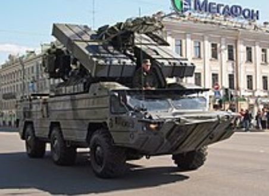

#### Kalustokuvaus
Amfibinen lyhyen kantaman ilmatorjuntaohjusjärjestelmä, joka yhdistää tutkan, komentojärjestelmän ja ohjuslaukaisimen samalle alustalle. Järjestelmä mahdollistaa itsenäisen paikallisen ilmapuolustuksen ilman erillistä tulenjohtotutkaa.

#### Suorituskyvyt
- Ohjusaseistus (9M33 / 9М33): tarkoitettu matalalla ja keskikorkeudella lentävien ilmakohteiden torjuntaan. ODIN:n mukaan järjestelmä kuuluu short-range tactical SAM -luokkaan; tyypillinen kantama on noin 10–15 km versiosta riippuen.
- Orgaaninen tutka- ja tulenjohtokyky: tekee Osa-järjestelmästä autonomisen. Tämä lisää joustavuutta, mutta myös elektromagneettista näkyvyyttä.

#### Huomioita analyysiin
Osa on edelleen relevantti, koska se on itsenäinen ja liikkuva järjestelmä. Se soveltuu erityisesti piste- ja joukkojen suojaan siellä, missä modernimpaa SHORAD-kalustoa on rajallisesti.

#### Operatiiviset rajoitteet
Vanha elektroniikka ja suhteellisen lyhyt kantama heikentävät suorituskykyä nykyaikaista ilmasodankäyntiä vastaan. Tutka-altistus lisää haavoittuvuutta elektroniselle sodankäynnille ja anti-radiation-aseille.

#### Lähteet
- [ODIN – 9K33 Osa (SA-8 Gecko) Russian Short-Range Tactical Surface-to-Air Missile System](https://odin.tradoc.army.mil/WEG/Asset/9K33_Osa_%28SA-8_Gecko%29_Russian_6x6_Amphibious_Short-Range_Tactical_Surface-to-Air_Missile_System)

### 9K35M3 Strela-10M3/MN
#### Kalustokuva
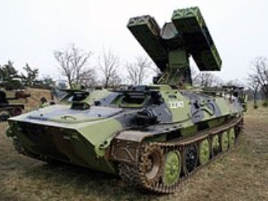

#### Kalustokuvaus
Kevyt, liikkuva ja etulinjan mukana kulkeva lyhyen kantaman ilmatorjuntaohjusjärjestelmä. Järjestelmä mahdollistaa matalalla lentävien ilma-alusten, helikoptereiden ja osin UAV-kohteiden torjunnan hajautetusti.

#### Suorituskyvyt
- IR-/opto-ohjattu ilmatorjuntaohjus (9M37/9M333 -perhe): soveltuu matalalla lentävien maaliin torjuntaan ilman jatkuvaa tutkasäteilyä. Tyypilliset kantamat ovat noin 5 km luokkaa, versiosta riippuen hieman enemmän.

#### Huomioita analyysiin
Strela-10:n etu on yksinkertainen, liikkuva ja suhteellisen passiivinen torjuntakonsepti. Se sopii hyvin etulinjan joukkojen lähisuojaksi ja voi toimia ilman suurta elektromagneettista allekirjoitusta.

#### Operatiiviset rajoitteet
Sää, näkyvyys, maalin lämpöjälki ja vastatoimet vaikuttavat voimakkaasti tehoon. Kantama ja korkeusulottuvuus ovat rajallisia verrattuna tutkaohjattuihin järjestelmiin.

#### Lähteet
- [ODIN – search: Strela-10M3](https://odin.tradoc.army.mil/Search/WEG/Strela-10M3)
- [Military Today – Strela-10](https://www.militarytoday.com/missiles/strela_10.htm)

### Buk
#### Kalustokuva
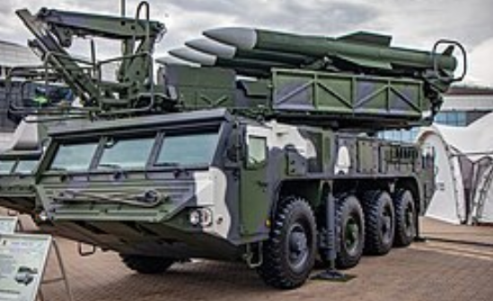

#### Kalustokuvaus
Keski- tai keskipitkän kantaman liikkuva ilmatorjuntajärjestelmäperhe, joka on tarkoitettu suojaamaan joukkoja ja kohteita lentokoneilta, risteilyohjuksilta ja joiltakin ballistisilta uhkilta. Järjestelmä mahdollistaa kerroksellisen ilmapuolustuksen liikkuvassa maasodankäynnissä.

#### Suorituskyvyt
- Ilmatorjuntaohjukset (9M38 / 9M317 / 9R31M -perhe, versiosta riippuen): Buk-M1:n kantama on tyypillisesti noin 35 km, Buk-M2:n noin 45–50 km ja Buk-M3:n jopa 70 km luokkaa. Versio vaikuttaa merkittävästi kykyyn torjua pienikokoisia tai nopeasti liikkuvia maaleja.
- Tutka- ja tulenjohtokyky: järjestelmä käyttää useita tutkia ja laukaisualustoja verkossa. Se voi sitoa useita maaleja samanaikaisesti paremmin kuin lyhyen kantaman SHORAD-järjestelmät.

#### Huomioita analyysiin
Buk on keskeinen osa venäläistä liikkuvaa kerroksellista ilmatorjuntaa. Yksittäisen TELAR-ajoneuvon ja koko patterin suorituskyky eroavat merkittävästi, joten analyysi on tehtävä kokoonpanotasolla.

#### Operatiiviset rajoitteet
Tutkapohjaisuus tekee järjestelmästä näkyvän elektronisessa spektrissä. Suoritus riippuu verkon eheydestä, hajautuksesta ja siitä, onko käytössä vanha M1 vai modernimpi M2/M3.

#### Lähteet
- [ODIN – 9K37 Buk-M1 (SA-11 Gadfly)](https://odin.tradoc.army.mil/WEG/Asset/9K37_Buk-M1_%28SA-11_Gadfly%29_Russian_Medium-Range_Surface-to-Air_Missile_System)
- [ODIN – Buk-M2 (SA-17 Grizzly)](https://odin.tradoc.army.mil/WEG/Asset/Buk-M2_%28SA-17_Grizzly%29_Russian_Medium-Range_Air_Defense_Missile_System)
- [ODIN – 9K317M Buk-M3 (SA-27)](https://odin.tradoc.army.mil/WEG/Asset/9K317M_Buk-M3_%28SA-27%29_Russian_Medium-Range_Air_Defense_Missile_System)

### S-300
#### Kalustokuva
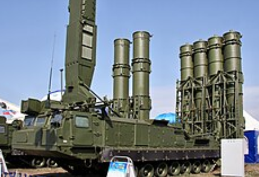

#### Kalustokuvaus
Pitkän kantaman ilmatorjuntajärjestelmäperhe, jonka maavoimaversioita käytetään joukkojen ja tärkeiden kohteiden suojaamiseen laajalla alueella. Järjestelmä mahdollistaa syvän ilmapuolustuksen lentokoneita, risteilyohjuksia ja osin ballistisia maaleja vastaan.

#### Suorituskyvyt
- Pitkän kantaman ilmatorjuntaohjukset (S-300V / 9M82/9M83 -perhe): kantamat vaihtelevat ohjuksesta riippuen noin 75 km:stä jopa noin 200 km luokkaan. Järjestelmä on suunniteltu myös joitakin taktisia ballistisia uhkia vastaan.
- Kerroksellinen tutka- ja komentojärjestelmä: mahdollistaa useiden maalien seurannan ja torjunnan samanaikaisesti. S-300V-perhe on liikkuvampi maavoimien käyttöön kuin jotkin kiinteämmät ilmapuolustusratkaisut.

#### Huomioita analyysiin
S-300V-tyyppinen järjestelmä on korkeaarvoinen operatiivisen tason ilma- ja ohjuspuolustuksen resurssi. Sen käyttöönotto, suoja ja sensoriketju ovat analyytikolle keskeisiä havaintokohteita.

#### Operatiiviset rajoitteet
Järjestelmä on suuri, logistisesti raskas ja näkyvä. Kokonaisuus on altis SEAD-kampanjoinnille, jos sensorit, komentopaikat ja TELAR-ajoneuvot tunnistetaan verkostona.

#### Lähteet
- [ODIN – S-300V (SA-12b Giant) Russian Long-Range Air Defense Missile System](https://odin.tradoc.army.mil/WEG/Asset/S-300V_%28SA-12b_Giant%29_Russian_Long-Range_Air_Defense_Missile_System)
- [ODIN – search: S-300](https://odin.tradoc.army.mil/Search/WEG/S-300)

### Tor
#### Kalustokuva
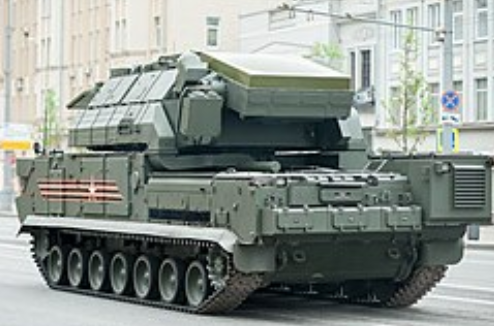

#### Kalustokuvaus
Lyhyen kantaman erittäin liikkuva ilmatorjuntajärjestelmä, joka on suunniteltu suojaamaan joukkoja tarkkuusaseilta, lentokoneilta, helikoptereilta ja UAV-kohteilta. Järjestelmä mahdollistaa nopean ja automatisoidun lähialueen torjunnan.

#### Suorituskyvyt
- Ilmatorjuntaohjukset (9M330/9M331/9M338 -perhe): perusversioiden kantama on noin 12 km ja uudemmissa versioissa noin 15–16 km luokkaa. Tor soveltuu erityisesti matalan ja keskimatalan korkeuden maaleihin.
- Orgaaninen tutka, seuranta ja automatisoitu tulenkäyttö: järjestelmä kykenee havaitsemaan, seuraamaan ja torjumaan kohteita nopeasti samalla alustalla. Tämä tekee siitä erittäin käyttökelpoisen liikkuvien joukkojen lähisuojassa.

#### Huomioita analyysiin
Tor on yksi relevantimmista venäläisistä SHORAD-järjestelmistä nykytaistelukentällä. Se on erityisen vaarallinen, kun se toimii osana laajempaa johtamis- ja tutka-arkkitehtuuria.

#### Operatiiviset rajoitteet
Kantama on silti lyhyt verrattuna medium- ja long-range SAM-järjestelmiin. Tutkapohjaisuus altistaa sen EW- ja SEAD-vaikutuksille.

#### Lähteet
- [ODIN – 9K330 Tor (SA-15 Gauntlet) Russian Short-Range Surface-to-Air Missile System](https://odin.tradoc.army.mil/WEG/Asset/9K330_Tor_%28SA-15_Gauntlet%29_Russian_Short-Range_Surface-to-Air_Missile_System)
- [ODIN – Tor M2DT Russian Short-Range Air Defense Missile System](https://odin.tradoc.army.mil/WEG/Asset/a9d8b08f1b0e0dd94eb511b283137d5b)

## heitin-kalusto

### 2S19 Msta-S
#### Kalustokuva
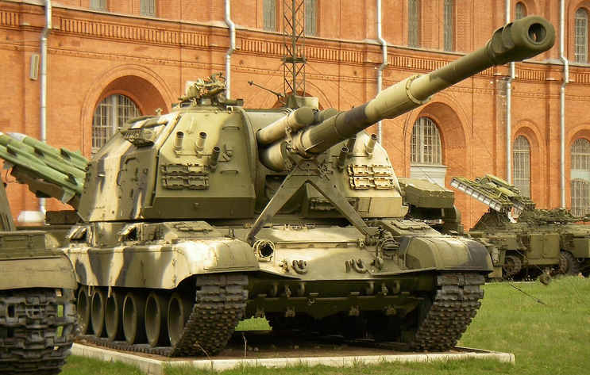
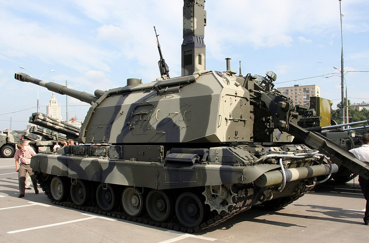

#### Kalustokuvaus
152 mm itseliikkuva haupitsi, joka muodostaa venäläisen putkitykistön keskeisen telapohjaisen tuliyksikön. Järjestelmä mahdollistaa liikkuvan epäsuoran tulen mekanisoitujen joukkojen mukana.

#### Suorituskyvyt
- 152 mm haupitsi (2A64 / 2А64): kykenee ampumaan laajaa ammusvalikoimaa, mukaan lukien tavallisia HE-ammuksia ja joitakin täsmä-/erikoisammuksia. Kantama on tyypillisesti noin 24–29 km perusammuksilla ja pidempi rocket-assisted-ammuksilla.
- Tulenjohtoon ja automaatioon liittyvät parannukset (M1/M2-versiot): parantavat tulinopeutta ja reagointiaikaa. Modernisoidut versiot kykenevät nopeampaan tulenavaukseen ja asemanvaihtoon.

#### Huomioita analyysiin
Msta-S on määrällisesti ja operatiivisesti yksi tärkeimmistä venäläisistä putkitykistöjärjestelmistä. Version tunnistaminen on tärkeää, koska Msta-SM1/SM2 nostaa suorituskykyä selvästi.

#### Operatiiviset rajoitteet
Vastatykistö, droonihavainnointi ja ammusten kulutuksen logistinen taakka rajoittavat käyttöä. Järjestelmä tarvitsee tehokkaan sensoriverkon ollakseen täydessä potentiaalissaan.

#### Lähteet
- [ODIN – 2S19 Msta-S Russian 152mm Self-Propelled Howitzer](https://odin.tradoc.army.mil/WEG/Asset/2S19_Msta-S_Russian_152mm_Self-Propelled_Howitzer_%28SPH%29)
- [ODIN – search: 2S19](https://odin.tradoc.army.mil/Search/WEG/2S19)

### 9A53-G Tornado-G
#### Kalustokuva
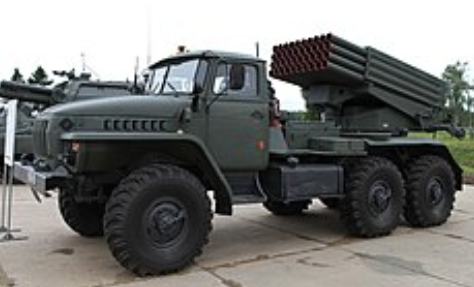

#### Kalustokuvaus
Modernisoitu 122 mm raketinheitinjärjestelmä, joka jatkaa Grad-perhettä paremmalla palonhallinnalla ja tarkkuudella. Järjestelmä mahdollistaa nopean aluevaikutuksen ja lyhyen vasteajan kevyemmällä logistisella jalanjäljellä kuin raskaammat MLRS-järjestelmät.

#### Suorituskyvyt
- 122 mm rakettiaseistus (Торнадо-Г / 9А53-Г): tarkoitettu jalkaväen, kevyen kaluston, tuliasemien ja aluekohteiden lamauttamiseen. ODIN kuvaa järjestelmän high degree of precision -suuntautuneeksi; kantama on tyypillisesti noin 20–40 km rakettityypistä riippuen.

#### Huomioita analyysiin
Tornado-G tuo Grad-konseptiin modernimpaa tulenhallintaa ja mahdollisesti parempaa tarkkuutta. Se on relevantti erityisesti silloin, kun arvioidaan venäläisen kevyemmän MLRS-kerroksen tehokkuutta.

#### Operatiiviset rajoitteet
122 mm MLRS ei korvaa raskaampien järjestelmien kantamaa tai taistelukärjen massaa. Järjestelmä on altis vastatykistölle, jos asemanvaihto ei ole nopea.

#### Lähteet
- [ODIN – 9A53-G Tornado Russian 122mm Multiple Rocket Launcher](https://odin.tradoc.army.mil/WEG/Asset/b5d8ddf3c1634eaed3eda056d67bf01f)

### 9K515 Tornado S
#### Kalustokuva
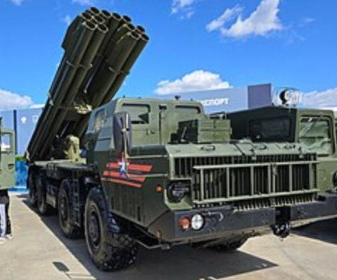

#### Kalustokuvaus
Raskas 300 mm raketinheitinjärjestelmä, joka edustaa Smerch-perheen modernisoitua ja osin täsmällisempää kehityslinjaa. Järjestelmä mahdollistaa syvän aluevaikutuksen ja joitakin tarkempia iskuprofiileja operatiivisella etäisyydellä.

#### Suorituskyvyt
- 300 mm rakettiaseistus (Торнадо-С / 9К515): kykenee käyttämään pitkän kantaman raketteja suuria aluekohteita ja tärkeitä kohdepisteitä vastaan. Yleisesti raportoidut kantamat ovat noin 70–120 km tai pidemmätkin uudemmilla raketeilla.

#### Huomioita analyysiin
Tornado-S nostaa venäläisen rakettiartillerian syvävaikuttamiskykyä erityisesti, jos käytössä on ohjattuja raketteja. Se sijoittuu taktisen ja operatiivisen tulen rajapintaan.

#### Operatiiviset rajoitteet
Järjestelmä on korkean arvon kohde ja logistisesti raskaampi kuin 122 mm järjestelmät. Ammusten saatavuus ja sensori–tulenkäyttöketju määrittävät todellisen tehokkuuden.

#### Lähteet
- [ODIN – search: Tornado-S](https://odin.tradoc.army.mil/Search/WEG/Tornado-S)
- [ODIN – search: smerch](https://odin.tradoc.army.mil/Search/WEG/smerch)

### BM-21 Grad
#### Kalustokuva
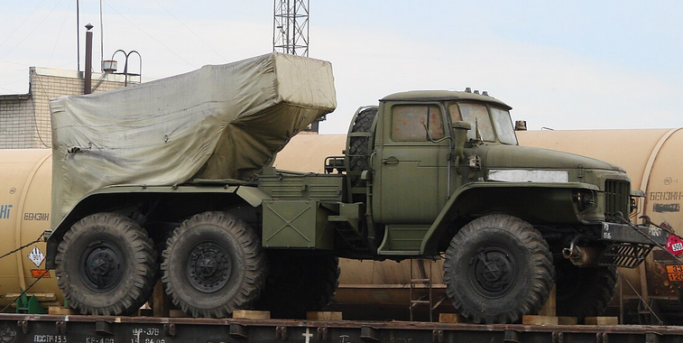
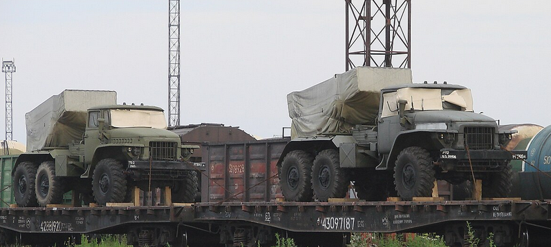
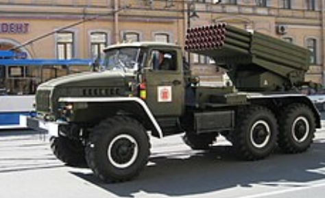

#### Kalustokuvaus
Klassinen 122 mm moniputkiraketinheitin, jonka vahvuus on yksinkertaisuus, määrä ja nopea alueellinen tulivaikutus. Järjestelmä mahdollistaa nopeasti toimitetun laajan sirpale- ja räjähdysvaikutuksen joukkoja, tuliasemia ja kevyitä kohteita vastaan.

#### Suorituskyvyt
- 122 mm raketit (БМ-21 «Град»): järjestelmä käyttää 40 putkea ja kykenee salvoon lyhyessä ajassa. Kantama on rakettityypistä riippuen tyypillisesti noin 20 km perusammuksilla ja pidempi uusilla ammuksilla.

#### Huomioita analyysiin
Grad on edelleen relevantti massan, saatavuuden ja yksinkertaisen käytön vuoksi. Se on kuitenkin tarkkuudeltaan ja selviytymiskyvyltään heikompi kuin modernisoidut Tornado-järjestelmät.

#### Operatiiviset rajoitteet
Tarkkuus on rajallinen ja ammusten kulutus suuri. Järjestelmä on altis vastatykistölle, koska laukaisu paljastaa aseman nopeasti.

#### Lähteet
- [ODIN – BM-21 Grad Russian 122mm Multiple Rocket Launcher](https://odin.tradoc.army.mil/WEG/Asset/BM-21_%22Grad%22_Russian_122mm_Multiple_Rocket_Launcher_%28MRL%29)

### BM-27 Uragan
#### Kalustokuva
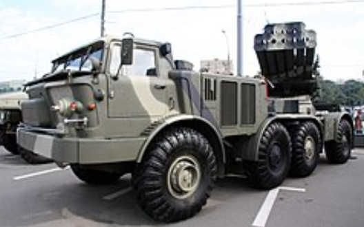

#### Kalustokuvaus
220 mm raskas raketinheitinjärjestelmä, joka sijoittuu Gradin ja Smerchin väliin vaikutusalan ja taistelukärjen koon osalta. Järjestelmä mahdollistaa laajan aluevaikutuksen syvemmälle kuin 122 mm järjestelmät.

#### Suorituskyvyt
- 220 mm raketit (БМ-27 «Ураган» / 9П140): 16 putken salvo tuottaa voimakkaan alueellisen vaikutuksen. ODIN:n ja muiden lähteiden mukaan kantama on tyypillisesti noin 35 km luokkaa, pidempi erikoisammuksilla.

#### Huomioita analyysiin
Uragan on edelleen käyttökelpoinen, mutta sitä korvaa asteittain Uragan-1M ja muut modernimmat ratkaisut. Sen arvo on tulimassan ja taistelukärjen koon yhdistelmässä.

#### Operatiiviset rajoitteet
Vanha alusta ja tulenhallinta rajoittavat selviytymistä ja tarkkuutta. Ammusten logistinen kuorma on huomattava.

#### Lähteet
- [ODIN – 9P140 (BM-27 Uragan) Russian 220mm Multiple Rocket Launch](https://odin.tradoc.army.mil/WEG/Asset/9P140_%28BM-27_Uragan%29_Russian_220mm_Multiple_Rocket_Launch_%28MRL%29)

### BM-30 Smerch
#### Kalustokuva
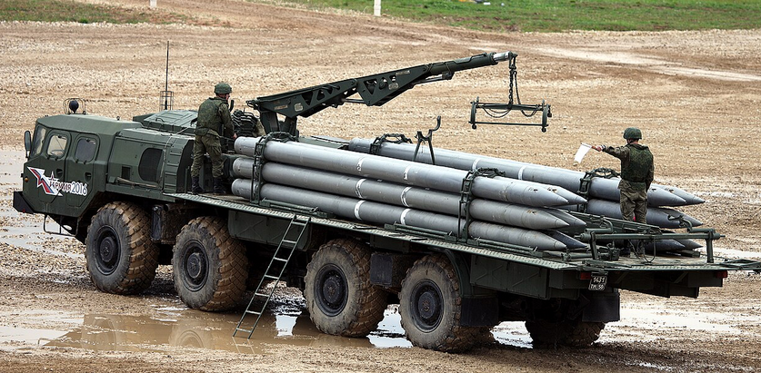
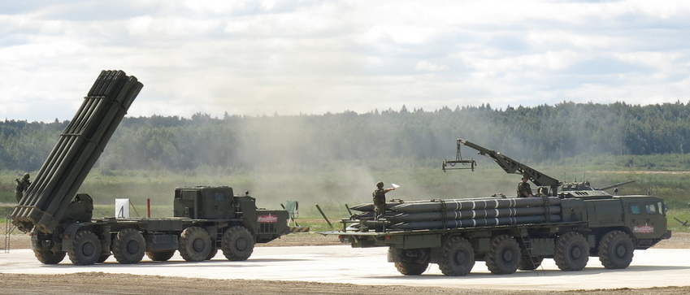
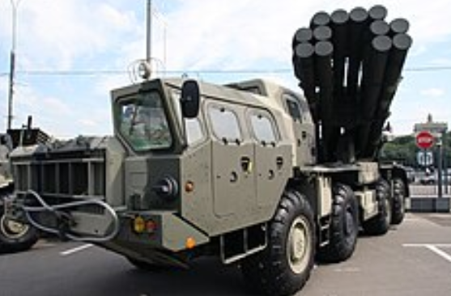

#### Kalustokuvaus
300 mm raskas raketinheitinjärjestelmä, joka on suunniteltu suurten alueiden tuhoamiseen ja syvempään tulivaikutukseen kuin kevyemmät MLRS-järjestelmät. Järjestelmä mahdollistaa operatiivisen tason tuki-iskut joukkoja, komentopaikkoja ja aluekohteita vastaan.

#### Suorituskyvyt
- 300 mm raketit (БМ-30 «Смерч» / 9А52-2): 12 putken salvo tuottaa suuren taistelukärkimassan. ODIN:n mukaan järjestelmä kuuluu medium rocket systems up to 100 km -luokkaan; käytännön kantama on tyypillisesti noin 70–90 km.

#### Huomioita analyysiin
Smerch on ollut pitkään venäläisen raskaan rakettiartillerian perusjärjestelmä. Sen todellinen vaikutus riippuu ammustyypistä ja siitä, onko käytössä uudempia ohjattuja raketteja vai perinteisiä alueammuksia.

#### Operatiiviset rajoitteet
Asema paljastuu laukaisussa ja järjestelmä on korkean arvon maali. Ammusten koko kasvattaa huoltotarvetta ja latausjärjestelyjen merkitystä.

#### Lähteet
- [ODIN – 9A52-2 (BM-30 Smerch-M) Russian 300mm Multiple Launch Rocket System](https://odin.tradoc.army.mil/WEG/Asset/9A52-2_)
- [ODIN – search: smerch](https://odin.tradoc.army.mil/Search/WEG/smerch)

### TOS-1A Solntsepyok
#### Kalustokuva
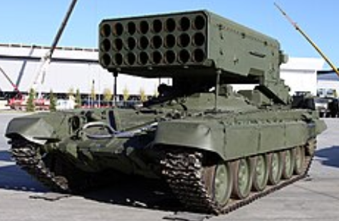

#### Kalustokuvaus
Raskas termobaarinen raketinheitinjärjestelmä, joka on tarkoitettu erityisesti linnoitettujen asemien, rakennusten ja suojautuneen jalkaväen tuhoamiseen. Järjestelmä mahdollistaa erittäin voimakkaan lähialueen vaikutuksen, mutta ei ole perinteinen pitkän kantaman tykistöjärjestelmä.

#### Suorituskyvyt
- 220 mm termobaariset raketit (ТОС-1А «Солнцепёк»): järjestelmä käyttää 24 putkea ja tuottaa erittäin voimakkaan paine- ja lämpövaikutuksen. ODIN:n mukaan kantama on parannetuilla raketeilla noin 6 km luokkaa, aiemmin lyhyempi.

#### Huomioita analyysiin
TOS-1A on psykologisesti ja taktisesti merkittävä järjestelmä suljettujen asemien murtamiseen. Sen käyttö viittaa usein tarveeseen lamauttaa suojattuja kohteita nopeasti suurella vaikutuksella.

#### Operatiiviset rajoitteet
Lyhyt kantama pakottaa järjestelmän lähelle etulinjaa, mikä altistaa sen PST-, drooni- ja tykistöuhalle. Suuri termobaarinen ammuskuorma tekee siitä myös korkean riskin maalin.

#### Lähteet
- [ODIN – TOS-1A Solntsepek Russian 220mm Heavy Flamethrower System](https://odin.tradoc.army.mil/WEG/Asset/3067b1cfe6cb93f35b4065e3a2067bc7)

### TOS-2 Tosochka
#### Kalustokuva
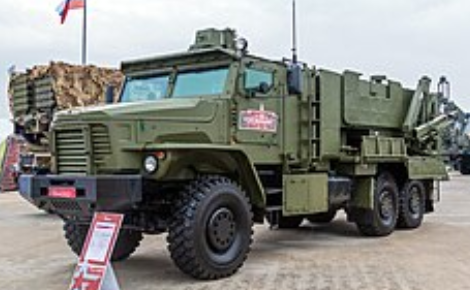

#### Kalustokuvaus
Pyöräalustainen raskas termobaarinen raketinheitinjärjestelmä, joka jatkaa TOS-konseptia liikkuvampana ja modernimpana versiona. Järjestelmä mahdollistaa termobaarisen vaikutuksen pidemmälle ja joustavammin kuin TOS-1A tietyissä olosuhteissa.

#### Suorituskyvyt
- 220 mm termobaariset raketit (ТОС-2 «Тосочка»): järjestelmä käyttää parannettuja raketteja ja automatisoitua tulenhallintaa. Julkisesti raportoidut kantamat ovat nousseet noin 10–20 km luokkaan versiosta ja raketista riippuen.
- Omalataus / integroidut tukiratkaisut: pyöräalusta ja oma nosturiratkaisu parantavat logistista joustavuutta. Tämä vähentää riippuvuutta erillisestä latausajoneuvosta verrattuna vanhempaan TOS-1A-konseptiin.

#### Huomioita analyysiin
TOS-2 pyrkii siirtämään raskaan liekinheitinjärjestelmän pois hyvin lyhyen kantaman pakosta. Se on tärkeä kehitysvaihe venäläisessä termobaarisessa tykistövaikuttamisessa.

#### Operatiiviset rajoitteet
Pyöräalusta ei tarjoa samanlaista panssarisuojaa kuin TOS-1A:n telapohjainen ratkaisu. Julkinen lähdetieto kantamista ja käytännön tehosta on yhä osin kehittyvää.

#### Lähteet
- [TASS – TOS-2 successor with increased capabilities](https://tass.com/defense/1205065)
- [Rostec – camouflage for TOS-2 / Tosochka](https://rostec.ru/en/media/news/rostec-has-developed-an-invisible-coating-for-the-tosochka-flamethrowing-systems/)

### TOS-3 Drakon
#### Kalustokuva
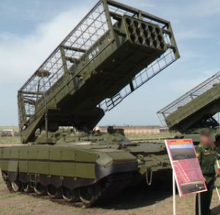

#### Kalustokuvaus
Uusin raportoitu raskaan termobaarisen raketinheitinjärjestelmän kehitysvaihe, jonka tavoitteena on kasvattaa kantamaa ja selviytymiskykyä suhteessa aiempiin TOS-järjestelmiin. Järjestelmä mahdollistaa termobaarisen vaikutuksen pidemmälle, mutta avoin lähdetieto on vielä rajallista.

#### Suorituskyvyt
- 220 mm termobaarinen rakettiaseistus (ТОС-3 «Дракон»): julkisten raporttien mukaan putkia on vähemmän kuin TOS-1A:ssa, mutta kantamaa on pyritty kasvattamaan. Tarkat kantama- ja suojausarvot eivät ole vakiintuneita avoimissa luotettavissa lähteissä.

#### Huomioita analyysiin
TOS-3 on analyytikolle ennen kaikkea merkki siitä, että Venäjä jatkaa TOS-konseptin kehittämistä Ukrainan sodan kokemusten perusteella. Järjestelmän todellinen sotilaallinen merkitys riippuu sarjatuotannosta ja käyttöönoton laajuudesta.

#### Operatiiviset rajoitteet
Avoin lähdetieto on toistaiseksi niukkaa, joten suorituskykyarviot ovat väliaikaisia. Kehitysvaiheinen tai harvalukuinen kalusto ei vielä välttämättä muuta laajaa taistelukentän tasapainoa.

#### Lähteet
- [The War Zone – Russia’s New TOS-3 Dragon Thermobaric Rocket Launcher Breaks Cover](https://www.twz.com/land/russias-new-tos-3-dragon-thermobaric-rocket-launcher-breaks-cover)
- [Army Recognition – TOS-3 Drakon reporting](https://armyrecognition.com/focus-analysis-conflicts/army/conflicts-in-the-world/russia-ukraine-war-2022/russia-deploys-new-tos-3-drakon-thermobaric-rocket-system-in-ukraine-against-fortified-positions)

### Uragan-1M
#### Kalustokuva
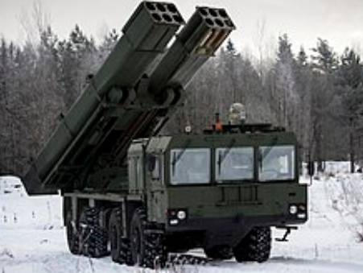

#### Kalustokuvaus
Monikaliiperinen raskas raketinheitinjärjestelmä, joka kykenee käyttämään sekä 220 mm että 300 mm ammuskuormia moduuliratkaisulla. Järjestelmä mahdollistaa joustavamman ammusvalinnan ja tuliprofiilin kuin vanhat yhden kaliiperin MLRS-järjestelmät.

#### Suorituskyvyt
- 220/300 mm modulaarinen rakettiaseistus (Ураган-1М / 9К512): järjestelmä voi käyttää eri kaliiperin laukaisupod-eja tehtävän mukaan. ODIN:n mukaan se käyttää myös BM-30 Smerch -järjestelmän 300 mm raketteja; kantamat ulottuvat kaliiperin mukaan noin 35 km:stä jopa noin 90 km luokkaan.

#### Huomioita analyysiin
Uragan-1M on tärkeä logistinen ja operatiivinen kehitysaskel, koska sama alusta voi tuottaa erilaisia tuliprofiileja. Se vähentää osin tarvetta pitää useita erillisiä raskaan MLRS:n alustoja.

#### Operatiiviset rajoitteet
Korkean arvon järjestelmä tarvitsee suojaa ja tehokkaan tulenjohdon. Modulaarisuus ei poista vastatykistö- ja havaittavuusongelmia laukaisun jälkeen.

#### Lähteet
- [ODIN – 9K512 (Uragan-1M) Russian 220mm/300mm Multiple Launch Rocket System](https://odin.tradoc.army.mil/WEG/Asset/6e2dd6441933ecc2031b3a9c012d1d0b)

## ohjuskalusto

### 9K720 Iskander
#### Kalustokuva
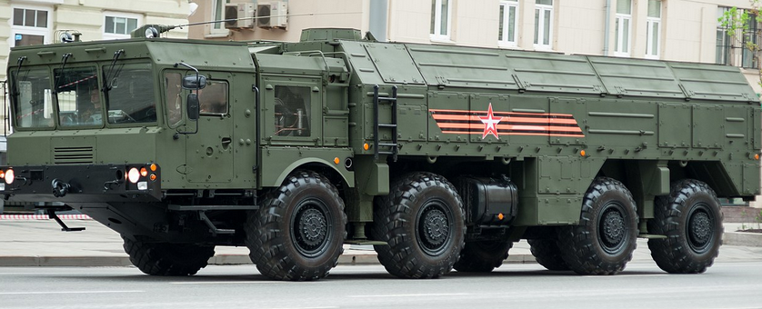
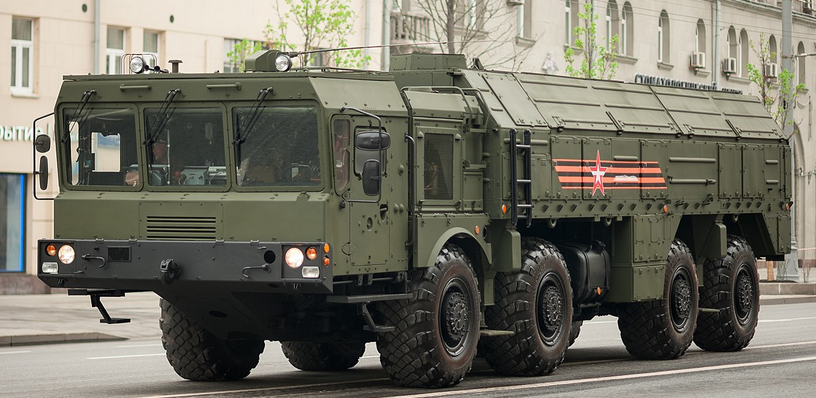

#### Kalustokuvaus
Liikkuva lyhyen kantaman ballistinen ohjusjärjestelmä, jonka tehtävä on iskeä korkean arvon maaleihin operatiivisella syvyydellä. Järjestelmä mahdollistaa komentopaikkojen, ilmatorjunnan, logistiikan ja infrastruktuurin tarkemman tai vähintään nopean syvävaikuttamisen kuin tykistö.

#### Suorituskyvyt
- Ballistinen ohjus (9M723 / 9М723): järjestelmän yleisesti ilmoitettu kantama on noin 500 km INF-sopimuksen aikaisen rajan mukaisesti, vaikka joissakin arvioissa esitetään poikkeavia lukuja. Ohjus on suunniteltu läpäisemään ilmapuolustusta liikeprofiililla ja vastatoimilla.
- Risteilyohjusvaihtoehto (9M728/9M729, järjestelmäperheeseen liitettyinä): mahdollistaa vaihtoehtoisen iskutavan maaleihin. Näihin liittyy huomattavaa poliittista ja tiedustelullista kiistaa kantamista.

#### Huomioita analyysiin
Iskander on yksi keskeisimmistä venäläisistä operatiivisen tason maamaalijärjestelmistä. Sen läsnäolo alueella vaikuttaa suoraan tärkeiden kohteiden uhka-arvioon ja vastatoimien priorisointiin.

#### Operatiiviset rajoitteet
Järjestelmä on korkean arvon kohde, jonka laukaisuajoneuvojen määrä on rajallinen. Vaikutus riippuu maalitiedosta, ammusvarannosta ja kyvystä säilyttää laukaisuvalmius vastapuolen iskujen alla.

#### Lähteet
- [ODIN – 9K720 Iskander (SS-26 Stone)](https://odin.tradoc.army.mil/WEG/Asset/9K720_Iskander_%28SS-26_Stone%29_Russian_Surface_to_Surface_Short_Range_Ballistic_Missile)
- [CSIS Missile Threat – SS-26 Iskander](https://missilethreat.csis.org/missile/ss-26/)

### 9P157-2 Khrizantema-S/SP
#### Kalustokuva
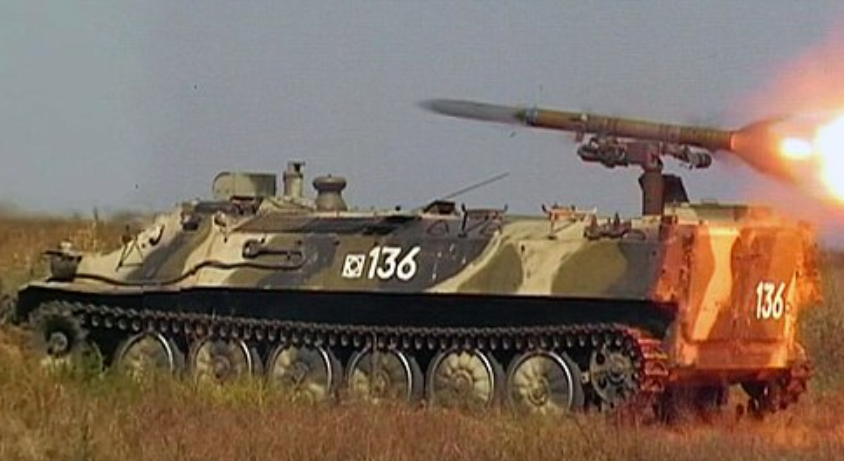

#### Kalustokuvaus
Panssarintorjuntaohjusajoneuvo, joka on suunniteltu taistelemaan panssarivaunuja ja muita panssaroituja maaleja vastaan myös vaikeissa sääoloissa. Järjestelmä mahdollistaa pitkän kantaman panssarintorjunnan omalta alustalta ilman jalkautumista.

#### Suorituskyvyt
- PST-ohjukset (9M123 Khrizantema / 9М123 «Хризантема»): järjestelmä käyttää laser- ja/tai tutkaohjattuja ohjuksia. Tyypillinen kantama on noin 5–6 km, ja järjestelmä on suunniteltu läpäisemään reaktiivipanssarointi.
- Kaksoiskanavainen maalinosoitus: mahdollistaa toiminnan myös tilanteissa, joissa yksi ohjauskanava häiriintyy. Tämä nostaa käytettävyyttä huonossa säässä ja savun läpi verrattuna yksikanavaisiin ratkaisuihin.

#### Huomioita analyysiin
Khrizantema-S on yksi Venäjän suorituskykyisimmistä omalla alustalla liikkuvista pst-järjestelmistä. Se on vaarallinen erityisesti avoimessa maastossa ja puolustuksessa, jossa tuliasemat voidaan valmistella etukäteen.

#### Operatiiviset rajoitteet
Järjestelmä on erikoistunut ja tarvitsee suojan lähietäisyyden uhkia vastaan. Vaikutus heikkenee, jos sensorit, ammusvaranto tai maalitiedon laatu eivät riitä.

#### Lähteet
- [Rosoboronexport – Khrizantema-S](https://roe.ru/eng/catalog/land-forces/anti-tank-guided-missile-systems/khrizantema-s/)
- [ODIN – search: Khrizantema-S](https://odin.tradoc.army.mil/Search/WEG/Khrizantema-S)

### 9P163-3 Kornet-D
#### Kalustokuva
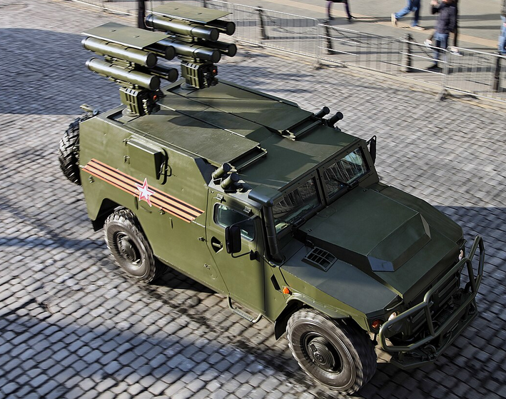

#### Kalustokuvaus
Pitkän kantaman panssarintorjuntaohjusjärjestelmä, joka on suunniteltu erityisesti pyöräalustaiselle korkean liikkuvuuden alustalle. Järjestelmä mahdollistaa panssarintorjunnan, kevyiden linnoitteiden tuhoamisen ja joissain profiileissa myös matalien ilma-maalien uhkaamisen.

#### Suorituskyvyt
- PST-ohjukset (9M133 Kornet / 9М133 «Корнет»): pitkän kantaman laserkeilaohjattu ohjus. Kornet-D:lle raportoidaan noin 8 km kantama panssarimaaleihin ja jopa noin 10 km joillakin maalityypeillä tai versioilla.
- Kaksiohjuslaukaisu / salvo-ominaisuus: parantaa todennäköisyyttä läpäistä suojauksia ja vaikeuttaa aktiivisuojajärjestelmien toimintaa. Tämä tekee järjestelmästä vaarallisen myös moderneille panssarivaunuille.

#### Huomioita analyysiin
Kornet-D on tärkeä, koska se yhdistää pitkän kantaman pst-vaikutuksen liikkuvaan alustaan. Se voi toimia tehokkaasti väijytys- ja torjuntaprofiilissa sekä hajautettuna.

#### Operatiiviset rajoitteet
Laserkeilaohjaus vaatii näköyhteyden maaliin koko lennon ajan. Järjestelmä on haavoittuva vastatulelle ja havaittavuudelle laukaisun yhteydessä.

#### Lähteet
- [Rosoboronexport – Kornet-EM / Kornet-D family](https://roe.ru/eng/catalog/land-forces/anti-tank-guided-missile-systems/kornet-em/)
- [ODIN – 9M133 Kornet](https://odin.tradoc.army.mil/WEG/Asset/9M133_Kornet_%28AT-14_Spriggan%29_Russian_Man-Portable_Anti-Tank_Guided_Missile_%28ATGM%29)

### 9P163M-1 Kornet-T
#### Kalustokuva
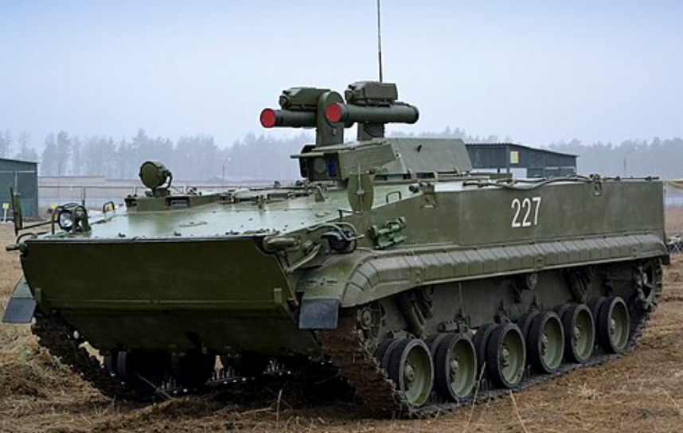

#### Kalustokuvaus
BMP-3-alustainen panssarintorjuntaohjusajoneuvo, jonka tehtävä on tuhota panssarivaunuja ja muita kovia maamaaleja etäältä. Järjestelmä mahdollistaa suojatun, liikkuvan ja suhteellisen nopeasti toistettavan pst-vaikutuksen.

#### Suorituskyvyt
- PST-ohjukset (9M133 Kornet / 9М133 «Корнет»): järjestelmän päävaikutin on pitkän kantaman laserkeilaohjattu ohjus. ODIN kuvaa sitä Shturm-S:n korvaajaksi; kantama on tyypillisesti noin 5–8 km versiosta riippuen.
- Ammusvalmius ja BMP-3-alusta: suojaa miehistöä ja mahdollistaa liikkeen mekanisoidun joukon mukana. Tämä parantaa käyttöä etulinjan tuntumassa verrattuna jalka- tai lavettiratkaisuihin.

#### Huomioita analyysiin
Kornet-T yhdistää suhteellisen modernin ohjuksen ja maastokelpoisen alustan. Se on käyttökelpoinen puolustuksessa, väijytyksissä ja panssarijoukkojen sivustasuojassa.

#### Operatiiviset rajoitteet
Järjestelmä on kapea erikoisalusta eikä korvaa monitoimista IFV:tä. Ohjuksen käyttö vaatii maalin seurantaa ja altistaa ajoneuvon havaittavuudelle laukaisun aikana.

#### Lähteet
- [ODIN – 9P162 Kornet-T Russian Anti-Tank Missile Carrier](https://odin.tradoc.army.mil/WEG/Asset/223bc869ffda3e31fc9dd6f14997d978)
- [ODIN – 9M133 Kornet](https://odin.tradoc.army.mil/WEG/Asset/9M133_Kornet_%28AT-14_Spriggan%29_Russian_Man-Portable_Anti-Tank_Guided_Missile_%28ATGM%29)
