# Kalustokuvasto

## Maihinnousualukset

### Dyugon-luokka
#### Kalustokuva
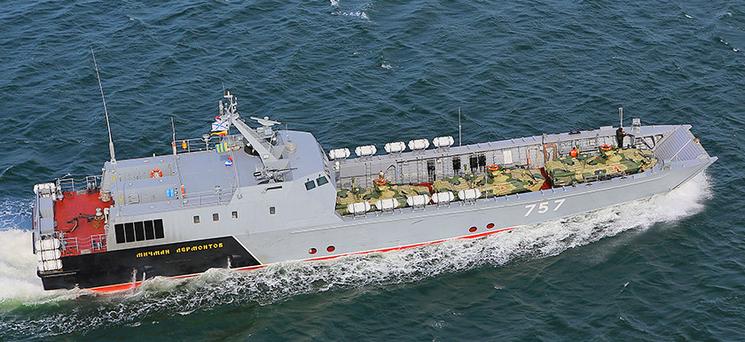
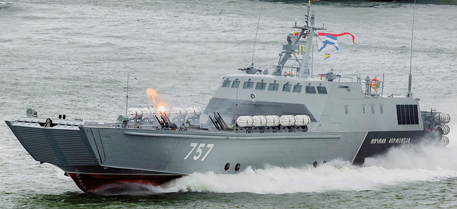
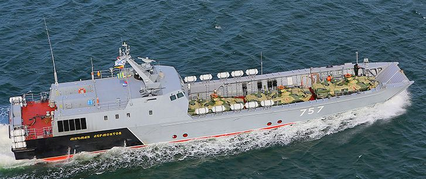

#### Alukset
| Latinisoitu nimi | Kyrillinen nimi | Käyttöönotto | Tila | Huom |
|---|---|---:|---|---|
| Ataman Platov | Атаман Платов | 2010 | Aktiivikäytössä | Kaspianmeren laivue; luokan ensimmäinen käyttöön otettu alus. |
| Denis Davydov | Денис Давыдов | 2014 | Aktiivikäytössä | Baltian laivasto. |
| Ivan Kartsov | Иван Карцов | 2015 | Aktiivikäytössä | Tyynenmeren laivasto. |
| Lieutenant Rimsky-Korsakov | Лейтенант Римский-Корсаков | 2015 | Aktiivikäytössä | Baltian laivasto. |
| Midshipman Lermontov | Мичман Лермонтов | 2015 | Aktiivikäytössä | Baltian laivasto. |

#### Kalustokuvaus
Nopea maihinnousualus joukkojen, ajoneuvojen ja huollon siirtämiseen nopeasti rantaan myös heikosti valmistelluille rantautumispaikoille. Alus mahdollistaa ripeän taktisen tason siirron rannikkoalueilla, mutta ei ole tarkoitettu pitkäkestoiseen merikuljetukseen.

#### Suorituskyky
- 14,5 mm raskaat konekiväärit (МТПУ) muodostavat luokan perusomansuojan lähietäisyydelle. Tehokas vaikutusetäisyys on tyypillisesti noin 2 km ilma- ja pintamaaleihin, ja aseistus on tarkoitettu lähinnä rantautumisen aikaiseksi lähisuojaksi eikä itsenäiseen taisteluun.
- Rantautumis- ja kuljetuskyky (десантные возможности) on luokan keskeinen suorituskyky. Alus pystyy kuljettamaan esimerkiksi kaksi taistelupanssarivaunua tai noin 140 tonnia kuormaa suurella nopeudella, mikä tukee nopeaa siirtoa lyhyillä ja keskipitkillä rannikkoetäisyyksillä.

#### Huomioita analyysiin
Nopea rannikkovyöhykkeen maihinnousualus, jonka arvo on joustava joukko-, ajoneuvo- ja huoltosiirto lyhyellä varoitusajalla. Luokka tukee erityisesti saaristo-, jokisuu- ja tukikohtalähtöisiä taktisia siirtoja.

#### Operatiiviset rajoitteet
Kevyt aseistus ja rajallinen merikelpoisuus sitovat käytön matalan ja keskitason uhan ympäristöihin. Pitkäkestoiseen avomerikuljetukseen tai itsenäiseen taistelutehtävään luokka ei sovellu.

#### Lähteet
- [Dyugon-class landing craft – Wikipedia](https://en.wikipedia.org/wiki/Dyugon-class_landing_craft)
- [ODIN – Dyugon Class](https://odin.tradoc.army.mil/WEG/Asset/Dyugon-Class_%28Project_21820_Class%29_Russian_Landing_Craft)
- [ODIN – Dyugon Class (Project 21820 Class) Russian Landing Craft](https://odin.tradoc.army.mil/WEG/Asset/Dyugon-Class_%28Project_21820_Class%29_Russian_Landing_Craft) ([ODIN-verkkosivu](https://odin.tradoc.army.mil))
- [Wikipedia – Dyugon-class landing craft](https://en.wikipedia.org/wiki/Dyugon-class_landing_craft)

### Ivan Gren -luokka
#### Kalustokuva
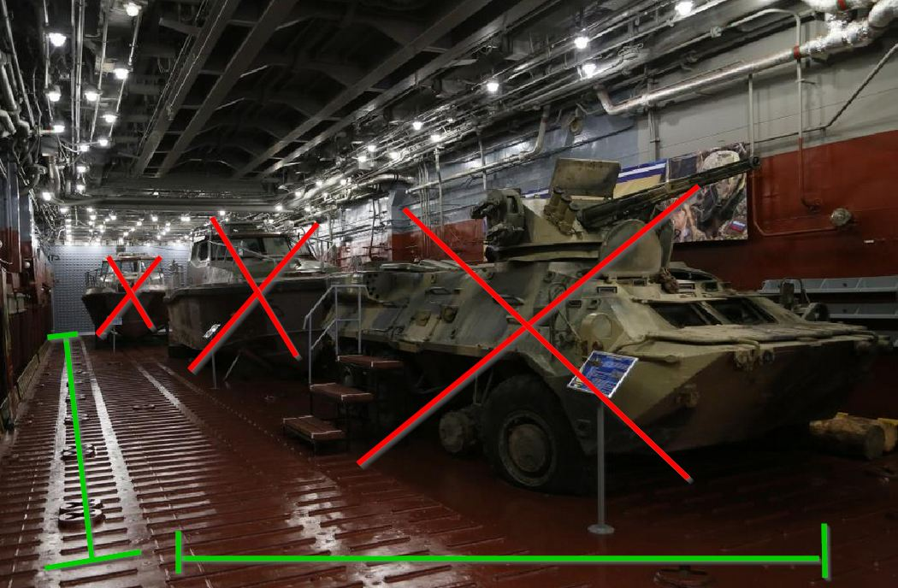
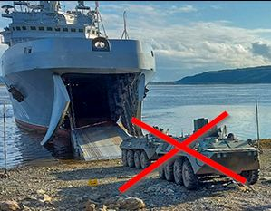
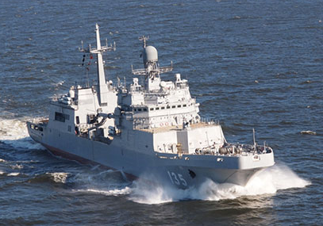

#### Alukset
| Latinisoitu nimi | Kyrillinen nimi | Käyttöönotto | Tila | Huom |
|---|---|---:|---|---|
| Ivan Gren | Иван Грен | 2018 | Aktiivikäytössä | Pohjoinen laivasto; luokan johtoalus. |
| Pyotr Morgunov | Пётр Моргунов | 2020 | Aktiivikäytössä | Pohjoinen laivasto. |
| Vladimir Andreyev | Владимир Андреев | – | Launched | Vesillelaskettu 2025; käyttöönottoa ei vielä vahvistettu. |
| Vasily Trushin | Василий Трушин | – | Rakenteilla | Rakenteilla; käyttöönottovuosi ei julkisesti vahvistettu. |
| Sergei Kabanov | Сергей Кабанов | – | Rakenteilla | Köli laskettu 2025. |

#### Kalustokuvaus
Suuri maihinnousualus joukkojen, panssaroitujen ajoneuvojen ja raskaan kaluston kuljettamiseen sekä maihinnousuoperaatioiden tukemiseen. Alus mahdollistaa pataljoonatason merikuljetuksen ja vahvistusten tuonnin alueellisiin operaatioihin.

#### Suorituskyky
- 76 mm merikanuuna (АК-176М) antaa alukselle peruskyvyn pinta- ja ilmamaalien torjuntaan. Tyypillinen kantama on noin 15 km pintamaaleihin ja noin 10–11 km ilmamaaleihin, mutta luokan päärooli on maihinnousu eikä tulituki.
- 30 mm lähitorjuntajärjestelmät (АК-630М) suojaavat alusta ohjuksia, ilma- ja pieniä pintamaaleja vastaan. Järjestelmän käytännön torjuntaetäisyys on yleensä noin 4–5 km, ja aseistus toimii lähisuojana maihinnousuvaiheessa.
- Kuljetus- ja helikopterikyky (десантные возможности; вертолётная площадка) mahdollistaa joukkojen, panssarikaluston ja huollon siirron sekä rajoitetun ilmatukevan toiminnan. Avoimissa lähteissä kuormaksi ilmoitetaan enintään noin 13 panssarivaunua tai 300 merijalkaväen sotilasta, ja aluksella on laskeutumisalue Ka-29-tyyppiselle helikopterille.

#### Huomioita analyysiin
Suuri maihinnousualus, joka yhdistää joukko- ja kalustokuljetuksen, rajallisen tulituen sekä helikopteritoiminnan tuen. Luokka on hyödyllinen, kun tavoitteena on siirtää vahvistuksia tai huoltoa yhdellä alustalla alueelliseen operaatioon.

#### Operatiiviset rajoitteet
Pieni yksikkömäärä tekee luokasta korkean näkyvyyden ja korkean arvon resurssin. Hidas profiili ja suuri koko kasvattavat haavoittuvuutta nykyaikaista ilmauhkaa ja meritorjuntaohjuksia vastaan.

#### Lähteet
- [Ivan Gren-class landing ship – Wikipedia](https://en.wikipedia.org/wiki/Ivan_Gren-class_landing_ship)
- [Naval Technology – Project 11711 Ivan Gren Class](https://www.naval-technology.com/projects/project-11711-ivan-gren-class-landing-ships/)
- [Naval Technology – Project 11711 Ivan Gren Class Landing Ships](https://www.naval-technology.com/projects/project-11711-ivan-gren-class-landing-ships/) ([Naval Technology](https://www.naval-technology.com))
- [ODIN – Ivan Green Class (Project 11711 Class) Russian Landing Ship](https://odin.tradoc.army.mil/WEG/Asset/Ivan_Green_Class_%28Project_11711_Class%29_Russian_Landing_Ship) ([ODIN-verkkosivu](https://odin.tradoc.army.mil))
- [ODIN – Ivan Gren Class](https://odin.tradoc.army.mil/WEG/Asset/Ivan_Green_Class_%28Project_11711_Class%29_Russian_Landing_Ship)
- [Naval Technology – Project 11711](https://www.naval-technology.com/projects/project-11711-ivan-gren-class-landing-ships/)

### Ondatra-luokka
#### Kalustokuva
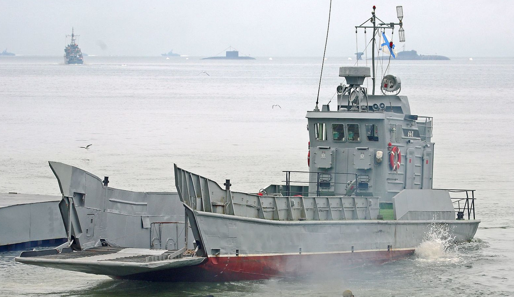

#### Alukset
| Latinisoitu nimi | Kyrillinen nimi | Käyttöönotto | Tila | Huom |
|---|---|---:|---|---|
| – | – | – | Ei vahvistettu julkisista lähteistä | Avoimista lähteistä saatava yksikkökohtainen aluslista ja palvelustila ovat ristiriitaisia tai puutteellisia. Tämä luokka kannattaa varmentaa erikseen esim. Jane’s Fighting Ships-, Combat Fleets-, ODIN- ja telakkalähteillä ennen operatiivista käyttöä. |

#### Kalustokuvaus
Pieni hyöty- ja maihinnousualus kevyiden ajoneuvojen, lastin tai joukkojen siirtämiseen alukselta rannalle lyhyillä etäisyyksillä. Alus mahdollistaa paikallisen kuljetus- ja tukikäytön rannikko- ja satama-alueilla.

#### Suorituskyky
- 14,5 mm raskaat konekiväärit (МТПУ-1) muodostavat luokan kevyen omasuojan. Vaikutusetäisyys on noin 2 km, ja aseistus on tarkoitettu suojaamaan alusta rantautumisen ja kuorman purun aikana kevyitä uhkia vastaan.
- Rantautumiskyky (десантные возможности) mahdollistaa yhden taistelupanssarivaunun, noin 50 tonnin kuorman tai noin 20–22 sotilaan siirtämisen suoraan rantaan. Luokka on taktinen lähialueen kuljetusväline, ei tulitukialus.

#### Huomioita analyysiin
Kevyt hyöty- ja maihinnousualus, jonka merkitys on paikallisessa rantakuljetuksessa, huollossa ja tukikohtien sisäisessä liikkeessä. Luokka sopii erityisesti mataliin, suojattuihin ja logistisesti ahtaisiin rannikkokohteisiin.

#### Operatiiviset rajoitteet
Rajallinen kuorma, suojaus ja merikelpoisuus rajaavat käytön lyhyille etäisyyksille. Alus on riippuvainen lähialueen ilmasuojasta ja suurempien alusten tai rantatukikohtien tuesta.

#### Lähteet
- [List of active Russian Navy ships – Wikipedia](https://en.wikipedia.org/wiki/List_of_active_Russian_Navy_ships)
- [Russian Navy – Wikipedia](https://en.wikipedia.org/wiki/Russian_Navy)
- [ODIN – Ondatra Class (Project 1176 Class) Russian Landing Craft](https://odin.tradoc.army.mil/WEG/Asset/Ondatra-Class) ([ODIN-verkkosivu](https://odin.tradoc.army.mil))
- [Wikipedia – Ondatra-class landing craft](https://en.wikipedia.org/wiki/Ondatra-class_landing_craft)
- [RussianShips.info – Project 1176](https://russianships.info/eng/warships/project_1176.htm)

### Ropucha-luokka
#### Kalustokuva
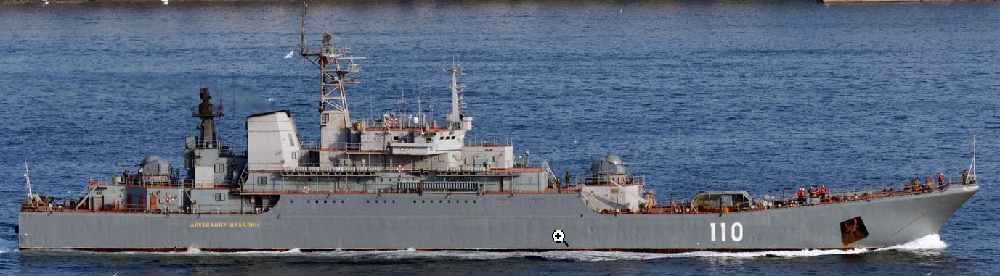
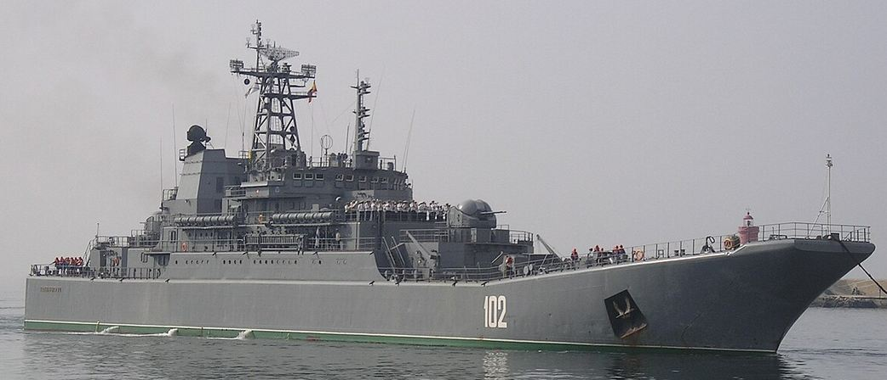
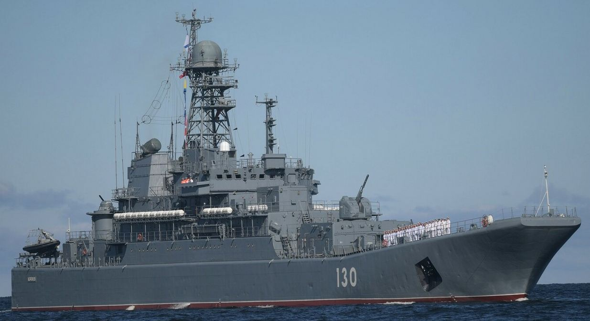

#### Alukset
| Latinisoitu nimi | Kyrillinen nimi | Käyttöönotto | Tila | Huom |
|---|---|---:|---|---|
| – | – | – | Ei vahvistettu julkisista lähteistä | Avoimista lähteistä saatava yksikkökohtainen aluslista ja palvelustila ovat ristiriitaisia tai puutteellisia. Tämä luokka kannattaa varmentaa erikseen esim. Jane’s Fighting Ships-, Combat Fleets-, ODIN- ja telakkalähteillä ennen operatiivista käyttöä. |

#### Kalustokuvaus
Keskikokoinen maihinnousualus joukkojen, ajoneuvojen ja huollon siirtämiseen suoraan rantaan keula- ja peräramppien kautta. Alus mahdollistaa alueellisen amfibisen kuljetuksen ja huollon, vaikka luokka on jo iäkäs.

#### Suorituskyky
- 122 mm laivastorakettijärjestelmä Grad-M (А-215 «Град-М») antaa alukselle rantautumista tukevaa alueellista tulivoimaa. Rakettien enimmäiskantama on tyypillisesti noin 20 km, mutta järjestelmä on tarkoitettu lyhytkestoiseen maihinnousun tulitukeen eikä tarkkuusiskuihin.
- 57 mm tai 76 mm meritykit (АК-725 / АК-176, alasarjasta riippuen) tuottavat peruskyvyn pinta- ja ilmamaalien torjuntaan. Kantama vaihtelee aseesta riippuen noin 8–15 km, ja lähteissä on alusarjojen välillä selviä eroja.
- Lähitorjunta- ja ilmatorjuntakyky (АК-630; Стрела-2 / SA-N-5) suojaa alusta ohjuksia, ilma-aluksia ja pieniä veneuhkia vastaan. Käytännön lähitorjuntaetäisyys on noin 4–5 km AK-630-järjestelmällä, kun taas Strela-2-luokan ohjuksilla kantama on noin 4 km.

#### Huomioita analyysiin
Vakiintunut maihinnousuluokka, jolla voidaan siirtää joukkoja, ajoneuvoja ja huoltoa suoraan rantaan tai satamaan. Luokan käytännön arvo on edelleen logistisessa massassa ja kyvyssä tukea alueellisia vahvistuksia.

#### Operatiiviset rajoitteet
Iäkäs runko- ja järjestelmäkanta heikentää selviytymistä korkean uhan ympäristössä. Luokka on altis etenkin ilma- ja ohjusuhalle, jos saattosuoja ja ilmapuolustus puuttuvat.

#### Lähteet
- [List of active Russian Navy ships – Wikipedia](https://en.wikipedia.org/wiki/List_of_active_Russian_Navy_ships)
- [Russian Navy – Wikipedia](https://en.wikipedia.org/wiki/Russian_Navy)
- [ODIN – Ropucha Class (Project 775 Class) Russian Landing Ship, Tank](https://odin.tradoc.army.mil/WEG/Asset/Ropucha_Class_%28Project_775_Class%29_Russian_Landing_Ship%2C_Tank_%28LST%29) ([ODIN-verkkosivu](https://odin.tradoc.army.mil))
- [Wikipedia – Ropucha-class landing ship](https://en.wikipedia.org/wiki/Ropucha-class_landing_ship)
- [ODIN – Ropucha Class](https://odin.tradoc.army.mil/WEG/Asset/Ropucha_Class_%28Project_775_Class%29_Russian_Landing_Ship)

### Serna-luokka
#### Kalustokuva
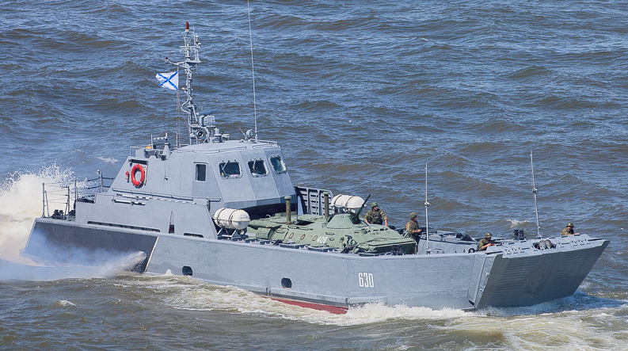
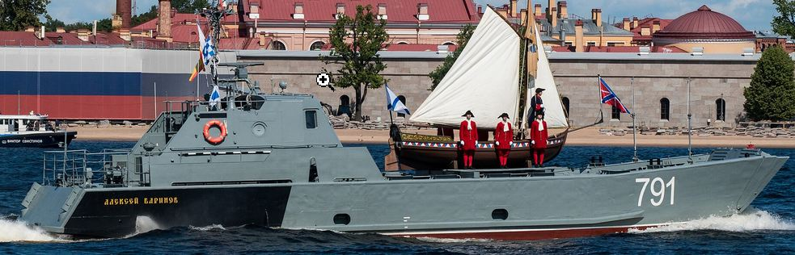
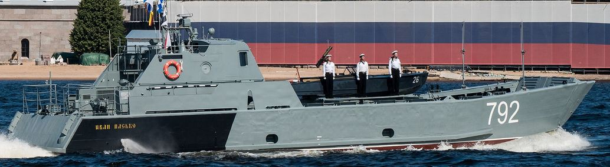

#### Alukset
| Latinisoitu nimi | Kyrillinen nimi | Käyttöönotto | Tila | Huom |
|---|---|---:|---|---|
| – | – | – | Ei vahvistettu julkisista lähteistä | Avoimista lähteistä saatava yksikkökohtainen aluslista ja palvelustila ovat ristiriitaisia tai puutteellisia. Tämä luokka kannattaa varmentaa erikseen esim. Jane’s Fighting Ships-, Combat Fleets-, ODIN- ja telakkalähteillä ennen operatiivista käyttöä. |

#### Kalustokuvaus
Nopea ilmakavitointiin perustuva maihinnousualus joukkojen, ajoneuvojen ja lastin kuljettamiseen kevyesti valmistelluille rannoille. Alus mahdollistaa nopean rantautumisen matalassa vedessä, mutta sen kuljetuskapasiteetti on rajallinen.

#### Suorituskyky
- Raskaiden konekiväärien omasuoja (МТПУ) antaa alukselle lähietäisyyden itsepuolustuskyvyn. Vaikutusetäisyys on noin 2 km, ja aseistus on tarkoitettu kevyitä rantauhkoja vastaan.
- Nopea maihinnousukyky (десантные возможности) mahdollistaa panssarivaunun, kahden kevyemmän ajoneuvon tai noin 45 tonnin kuorman siirron nopeasti rantaan. Luokan suorituskyky painottuu nopeuteen ja matalaan syväykseen, ei asevaikutukseen.

#### Huomioita analyysiin
Nopea maihinnousualus, joka painottuu taktiseen yllätykseen, lyhyisiin siirtoihin ja kevyen panssaroidun kaluston rantauttamiseen. Luokka on hyödyllinen, kun halutaan viedä rajattu isku- tai tukiosasto nopeasti rantaan.

#### Operatiiviset rajoitteet
Pieni kuljetuskapasiteetti ja kevyt omasuoja rajaavat vaikutuksen paikalliseksi. Käyttö edellyttää yleensä suojattua rannikkoympäristöä tai muun taisteluosaston tukea.

#### Lähteet
- [List of active Russian Navy ships – Wikipedia](https://en.wikipedia.org/wiki/List_of_active_Russian_Navy_ships)
- [Russian Navy – Wikipedia](https://en.wikipedia.org/wiki/Russian_Navy)
- [ODIN – Serna Class (Project 11770 Class) Russian Air-Cavity Fast Landing Craft](https://odin.tradoc.army.mil/WEG/Asset/Serna-Class_) ([ODIN-verkkosivu](https://odin.tradoc.army.mil))
- [ODIN – Serna Class](https://odin.tradoc.army.mil/WEG/Asset/Serna-Class_)
- [Wikipedia – Serna-class landing craft](https://en.wikipedia.org/wiki/Serna-class_landing_craft)

### Alligator-luokka
#### Kalustokuva
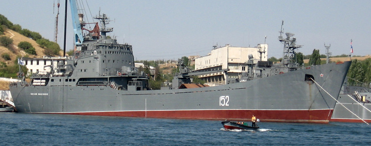

#### Alukset
| Latinisoitu nimi | Kyrillinen nimi | Käyttöönotto | Tila | Huom |
|---|---|---:|---|---|
| – | – | – | Ei vahvistettu julkisista lähteistä | Avoimista lähteistä saatava yksikkökohtainen aluslista ja palvelustila ovat ristiriitaisia tai puutteellisia. Tämä luokka kannattaa varmentaa erikseen esim. Jane’s Fighting Ships-, Combat Fleets-, ODIN- ja telakkalähteillä ennen operatiivista käyttöä. |

#### Kalustokuvaus
Vanhemman sukupolven suuri maihinnousualus joukkojen, panssarikaluston ja huollon kuljettamiseen suoraan rantaan. Alus mahdollistaa perinteisen merikuljetuksen ja vahvistusten tuonnin, mutta sen selviytymiskyky korkean uhan ympäristössä on rajallinen.

#### Suorituskyky
- 122 mm Grad-M -raketinheitin (А-215 «Град-М») antaa alukselle maihinnousua tukevaa epäsuoraa tulivoimaa. Kantama on tyypillisesti noin 20 km, mutta aseistus ei tee aluksesta täysimittaista tulitukialusta.
- 57 mm kaksoistykkitorni (АК-725) tuottaa peruskyvyn pinta- ja ilmamaalien torjuntaan. Käytännön kantama on noin 8 km pintamaaleihin ja lyhyempi ilmamaaleihin, ja alasarjasta riippuen mukana voi olla myös kevyempää ilmatorjunta-aseistusta.
- Lähialueen ilmatorjunta (Стрела-2 / SA-N-5) antaa rajallisen itsepuolustuskyvyn ilmauhkia vastaan. Ohjuksen kantama on noin 4 km, mikä riittää lähinnä lähestyviä helikoptereita tai matalalla lentäviä koneita vastaan.

#### Huomioita analyysiin
Vanhemman sukupolven suuri maihinnousualus, jonka vahvuus on joukkojen, panssarikaluston ja huollon massakuljetus. Luokka on analyytikolle ennen kaikkea logistinen ja operatiivinen kapasiteetti, ei moderni taistelualusta.

#### Operatiiviset rajoitteet
Ikä, näkyvyys ja rajallinen omasuoja tekevät aluksista haavoittuvia nykyaikaisessa merisodankäynnissä. Käyttökelpoisuus riippuu voimakkaasti siitä, kuinka paljon vastustajan meri- ja ilmatorjuntakykyä on ensin tukahdutettu.

#### Lähteet
- [List of active Russian Navy ships – Wikipedia](https://en.wikipedia.org/wiki/List_of_active_Russian_Navy_ships)
- [Russian Navy – Wikipedia](https://en.wikipedia.org/wiki/Russian_Navy)
- [ODIN – Rivne Class (former Alligator / Project 1171 lineage) Ukrainian Landing Ship](https://odin.tradoc.army.mil/WEG/Asset/Rivne-Class_Ukrainian_Landing_Ship) ([ODIN-verkkosivu](https://odin.tradoc.army.mil))
- [Naval Encyclopedia – Alligator class landing ships](https://naval-encyclopedia.com/cold-war/soviet/alligator-class-landing-ships.php) ([Naval Encyclopedia](https://naval-encyclopedia.com))
- [Wikipedia – Tapir-class landing ship](https://en.wikipedia.org/wiki/Tapir-class_landing_ship)
- [Naval Technology – Alligator / Project 1171 overview](https://www.naval-technology.com/projects/project-11711-ivan-gren-class-landing-ships/)

### Zubr-luokka
#### Kalustokuva
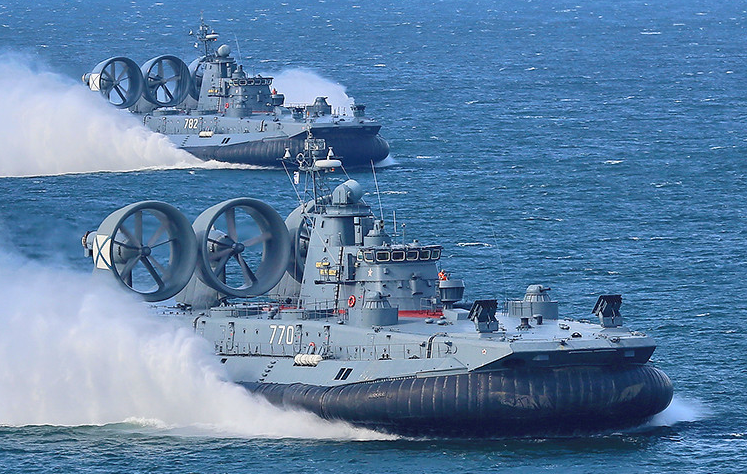
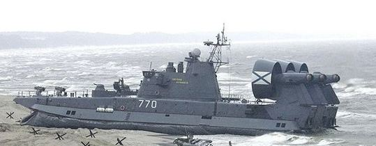
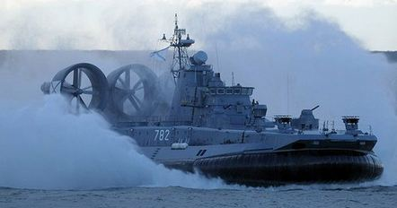

#### Alukset
| Latinisoitu nimi | Kyrillinen nimi | Käyttöönotto | Tila | Huom |
|---|---|---:|---|---|
| Evgeniy Kocheshkov | Евгений Кочешков | 1986 | Aktiivikäytössä | Baltian laivasto; entinen MDK-50. |
| Mordoviya | Мордовия | 1991 | Aktiivikäytössä | Baltian laivasto; entinen MDK-94. |

#### Kalustokuvaus
Raskas ilmatyynyalus panssarivaunujen, ajoneuvojen ja merijalkaväen erittäin nopeaan siirtoon myös pehmeille, miinoitetuille tai esteisille rannoille. Alus mahdollistaa nopean läpäisyn rannikkovyöhykkeellä poikkeuksellisen suurella kuormalla.

#### Suorituskyky
- 140 mm raketinheitinjärjestelmä Ogon (МС-227 «Огонь») antaa ilmatyynyalukselle voimakkaan mutta lyhyen tulitukikyvyn rantautumisen tueksi. Kantama on lähteestä riippuen noin 4,5–10 km, ja järjestelmä on tarkoitettu rantakaistan suppressioon juuri ennen maihinnousua.
- 30 mm tykki-ohjusjärjestelmät (АК-630) ja 9K33 Osa-M / Osa-MA (Оса-М) muodostavat luokan lähialueen omasuojan. AK-630:n tehokas torjuntaetäisyys on noin 4–5 km ja Osa-M-ohjuksen noin 10–15 km, mikä on poikkeuksellisen vahva aseistus maihinnousualukselle.
- Miinoituskyky (минные постановки) mahdollistaa merimiinojen kuljettamisen ja laskemisen. Avoimissa lähteissä luokan ilmoitetaan voivan kuljettaa useita kymmeniä miinoja, mikä tekee siitä myös merialueen sulkemiseen soveltuvan alustan.

#### Huomioita analyysiin
Raskas ilmatyynyalus tarjoaa poikkeuksellisen nopean ja esteitä kiertävän tavan siirtää raskastakin maihinnousukuormaa rantaan. Luokka soveltuu erityisesti yllätykselliseen rannikkovyöhykkeen iskuun, nopeaan vahvistukseen ja vaikeakulkuisten rantasektorien käyttöön.

#### Operatiiviset rajoitteet
Suuri koko, meluisa profiili ja korkea havaittavuus heikentävät selviytymistä, jos vastassa on valmis ilmatorjunta tai rannikkotorjunta. Huoltotarve ja rajallinen yksikkömäärä voivat myös rajoittaa käytön jatkuvuutta.

#### Lähteet
- [Zubr-class LCAC – Wikipedia](https://en.wikipedia.org/wiki/Zubr-class_LCAC)
- [ODIN – Zubr Class](https://odin.tradoc.army.mil/WEG/Asset/Zubr_Class_%28Project_1232.2_Class%29_Russian_Landing_Craft_Air-Cushion_%28LCAC%29)
- [ODIN – Zubr Class (Project 1232.2 Class) Russian Landing Craft Air-Cushion](https://odin.tradoc.army.mil/WEG/Asset/Zubr_Class_%28Project_1232.2_Class%29_Russian_Landing_Craft_Air-Cushion_%28LCAC%29) ([ODIN-verkkosivu](https://odin.tradoc.army.mil))
- [Wikipedia – Zubr-class LCAC](https://en.wikipedia.org/wiki/Zubr-class_LCAC)

## Miinantorjunta-alukset

### Alexandrit-luokka
#### Kalustokuva
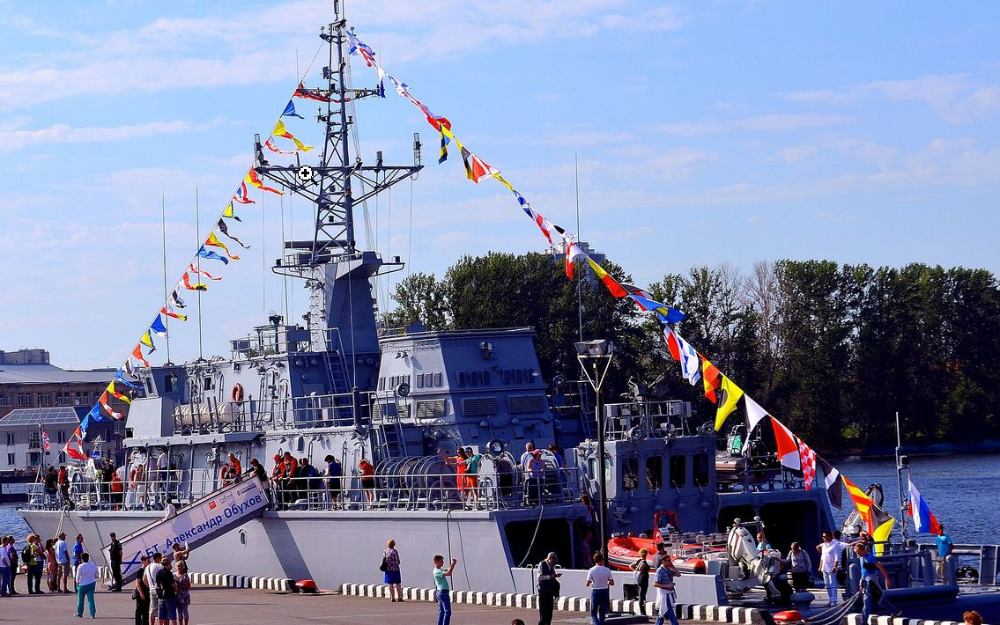
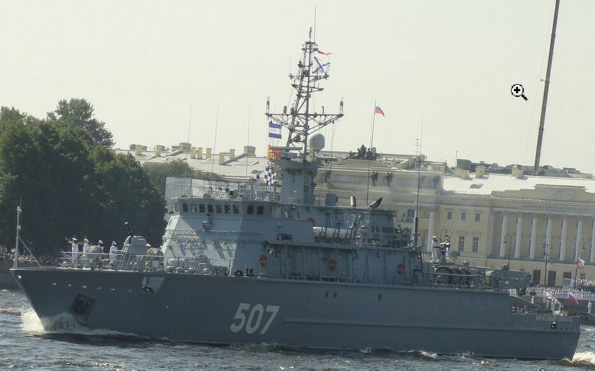

#### Alukset
| Latinisoitu nimi | Kyrillinen nimi | Käyttöönotto | Tila | Huom |
|---|---|---:|---|---|
| Aleksandr Obukhov | Александр Обухов | 2016 | Aktiivikäytössä | Baltian laivasto; luokan johtoalus. |
| Ivan Antonov | Иван Антонов | 2019 | Aktiivikäytössä | Mustanmeren laivasto. |
| Vladimir Yemelyanov | Владимир Емельянов | 2019 | Aktiivikäytössä | Mustanmeren laivasto. |
| Yakov Balyaev | Яков Баляев | 2020 | Aktiivikäytössä | Tyynenmeren laivasto. |
| Georgiy Kurbatov | Георгий Курбатов | 2021 | Aktiivikäytössä | Mustanmeren laivasto. |
| Pyotr Ilyichev | Пётр Ильичёв | 2022 | Aktiivikäytössä | Tyynenmeren laivasto. |
| Anatoly Shlemov | Анатолий Шлемов | 2022 | Aktiivikäytössä | Tyynenmeren laivasto. |
| Lev Chernavin | Лев Чернавин | 2023 | Aktiivikäytössä | Baltian laivasto. |
| Afanasy Ivannikov | Афанасий Иванников | 2025 | Aktiivikäytössä | Pohjoinen laivasto. |
| Polyarny | Полярный | – | Launched | Vesillelaskettu 2025; käyttöönottoa ei vielä vahvistettu. |
| Dmitry Lysov | Дмитрий Лысов | – | Launched | Vesillelaskettu 2025; käyttöönottoa ei vielä vahvistettu. |

#### Kalustokuvaus
Moderni miinantorjunta-alus, jossa yhdistyvät vähämagneettinen runkorakenne sekä etä- ja miehittämättömät miinantorjuntajärjestelmät. Alus mahdollistaa satamien, väylien ja lähestymisalueiden raivaamisen nykyaikaisen miinauhan alla.

#### Suorituskyky
- 30 mm automaattikanuuna (АК-306) muodostaa luokan perusomansuojan. Vaikutusetäisyys on tyypillisesti noin 4–5 km pieniä pinta- ja ilmauhkia vastaan.
- Minehunting-sonari ja etäohjatut järjestelmät (противоминные средства) ovat luokan keskeinen suorituskyky. Avoimissa lähteissä mainitaan muun muassa Livadiya-/Kabarga-tyyppisiä järjestelmiä sekä miehittämättömiä vedenalaisia välineitä, joilla miinoja voidaan havaita, luokitella ja tuhota turvallisen etäisyyden päästä.
- Miinanraivauskalusto (тралы) mahdollistaa kontakti-, akustisten ja magneettisten miinojen torjunnan. Luokan vahvuus on komposiittirungon pieni magneettinen allekirjoitus, joka parantaa selviytymistä miinauhka-alueella.

#### Huomioita analyysiin
Moderni miinantorjunta-alus, jonka vahvuus on vähämagneettinen runko ja etäkäyttöinen minehunting-kyky. Luokka tukee satamien, väylien ja lähestymisalueiden avaamista tilanteissa, joissa miinauhka halutaan pitää hallittuna ilman miehistön altistamista etulinjaan.

#### Operatiiviset rajoitteet
Luokan taisteluarvo perustuu erikoistehtävään eikä suoraan asevaikutukseen. Vaikuttavuus heikkenee nopeasti, jos etäjärjestelmät, sonarikalusto tai saattosuoja eivät ole käytettävissä.

#### Lähteet
- [Alexandrit-class minesweeper – Wikipedia](https://en.wikipedia.org/wiki/Alexandrit-class_minesweeper)
- [Naval Technology – Project 12700 Mine Countermeasures Vessels](https://www.naval-technology.com/projects/project-12700-mine-countermeasures-vessels/)
- [ODIN – Alexandrit / Obukhov Class (Project 12700 Class) Russian Minesweeper](https://odin.tradoc.army.mil/WEG/Asset/Obukhov-Class_) ([ODIN-verkkosivu](https://odin.tradoc.army.mil))
- [Wikipedia – Alexandrit-class minesweeper](https://en.wikipedia.org/wiki/Alexandrit-class_minesweeper)
- [Naval Technology – Project 12700](https://www.naval-technology.com/projects/project-12700-mine-countermeasures-vessels/)

### Gorya-luokka
#### Kalustokuva
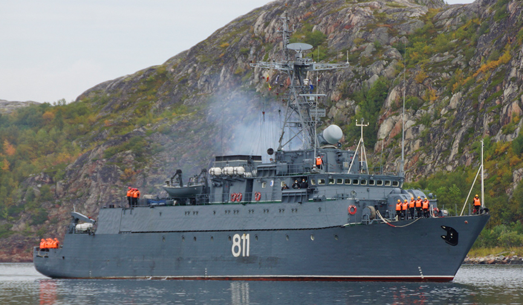

#### Alukset
| Latinisoitu nimi | Kyrillinen nimi | Käyttöönotto | Tila | Huom |
|---|---|---:|---|---|
| – | – | – | Ei vahvistettu julkisista lähteistä | Avoimista lähteistä saatava yksikkökohtainen aluslista ja palvelustila ovat ristiriitaisia tai puutteellisia. Tämä luokka kannattaa varmentaa erikseen esim. Jane’s Fighting Ships-, Combat Fleets-, ODIN- ja telakkalähteillä ennen operatiivista käyttöä. |

#### Kalustokuvaus
Avomerimiinanraivaaja miinojen etsintään ja raivaukseen laajoilla merialueilla sekä tärkeillä laivastoreiteillä. Alus mahdollistaa meriyhteyksien suojaamisen ja laivaston operointivapauden avomerellä.

#### Suorituskyky
- 76 mm merikanuuna (АК-176М) antaa luokalle poikkeuksellisen vahvan omasuojan miinantorjunta-alukseksi. Kantama on noin 15 km pintamaaleihin ja noin 10–11 km ilmamaaleihin.
- 30 mm lähitorjuntajärjestelmä (АК-630) suojaa ohjuksia ja pieniä pinta- tai ilmauhkia vastaan. Tehokas torjuntaetäisyys on yleensä noin 4–5 km.
- Minehunting- ja raivausjärjestelmät (противоминные средства) sisältävät sonarijärjestelmiä, sweeppauskalustoa ja etäkäyttöisiä välineitä. Lähteissä mainitaan myös kyky käsitellä miinoja jopa noin 1000 metrin syvyydessä, mikä tekee luokasta syvän veden erikoistuneen minehunterin.

#### Huomioita analyysiin
Syvän veden miinantorjunta-alus, jolla on merkitystä erityisesti avomerireittien ja tärkeiden lähestymisalueiden puhdistamisessa. Luokka on hyödyllinen, kun miinauhka ulottuu rannikon ulkopuolelle ja vaatii raskaampaa erikoiskykyä.

#### Operatiiviset rajoitteet
Pieni määrä, korkea erikoistuneisuus ja vanhentuva kalusto tekevät yksiköistä vaativia korvata. Alukset tarvitsevat yleensä suojatun toimintaympäristön, koska niiden päärooli ei ole taistella saattajina.

#### Lähteet
- [List of active Russian Navy ships – Wikipedia](https://en.wikipedia.org/wiki/List_of_active_Russian_Navy_ships)
- [Russian Navy – Wikipedia](https://en.wikipedia.org/wiki/Russian_Navy)
- [ODIN – Gorya Class (Project 12660 Class) Russian Deep Ocean Minesweeper](https://odin.tradoc.army.mil/WEG/Asset/Gorya-Class_) ([ODIN-verkkosivu](https://odin.tradoc.army.mil))
- [Wikipedia – Gorya-class minesweeper](https://en.wikipedia.org/wiki/Gorya-class_minesweeper)
- [RussianShips.info – Project 12660](https://russianships.info/eng/warships/project_1266.htm)

### Lida-luokka
#### Kalustokuva
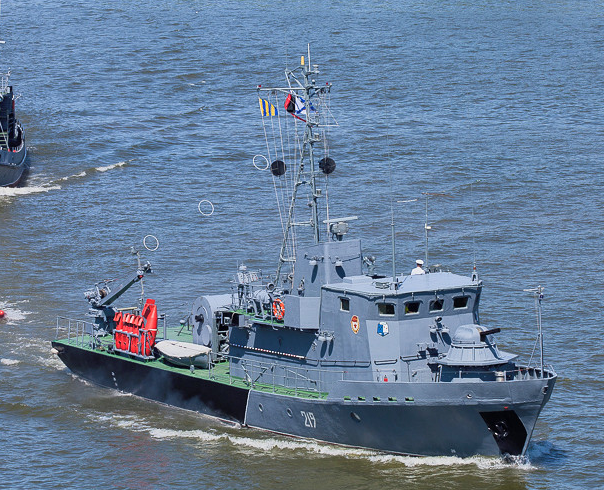

#### Alukset
| Latinisoitu nimi | Kyrillinen nimi | Käyttöönotto | Tila | Huom |
|---|---|---:|---|---|
| – | – | – | Ei vahvistettu julkisista lähteistä | Avoimista lähteistä saatava yksikkökohtainen aluslista ja palvelustila ovat ristiriitaisia tai puutteellisia. Tämä luokka kannattaa varmentaa erikseen esim. Jane’s Fighting Ships-, Combat Fleets-, ODIN- ja telakkalähteillä ennen operatiivista käyttöä. |

#### Kalustokuvaus
Pieni rannikko- ja satama-alueiden miinantorjunta-alus väylien, satamansuiden ja jokireittien raivaamiseen. Alus mahdollistaa tukikohtien lähialueiden pääsynvarmistamisen ja paikallisen miinantorjunnan.

#### Suorituskyky
- 30 mm automaattikanuuna (АК-306/АК-630 lähteestä riippuen) muodostaa luokan perusomansuojan satama- ja rannikkoympäristössä. Vaikutusetäisyys on noin 4–5 km, ja lähteissä on aseaseman nimityksestä jonkin verran vaihtelua.
- Kannettavat ilmatorjuntaohjukset (Стрела-2) antavat rajallisen lähi-ilmatorjuntakyvyn. Käytännön kantama on noin 3–4 km.
- Miinanetsintä- ja raivausjärjestelmät (противоминные средства) mahdollistavat satamien, väylien ja jokialueiden miinantorjunnan. Luokan komposiittirunko ja pieni koko tukevat toimintaa matalissa ja ahtaissa vesissä.

#### Huomioita analyysiin
Pieni rannikko- ja satamamiinanraivaaja, jonka arvo on tukikohtien, väylien ja jokisuistojen paikallisessa puhdistamisessa. Luokka sopii erityisesti matalaan ja ahtaaseen toimintaympäristöön, jossa suurempi miinantorjuntakalusto on kömpelöä.

#### Operatiiviset rajoitteet
Rajallinen koko ja omasuoja tekevät luokasta riippuvaisen alueellisesta suojauksesta. Vaikutusalue jää paikalliseksi, eikä luokka ole tarkoitettu laajoihin avomerellisiin miinantorjuntaoperaatioihin.

#### Lähteet
- [List of active Russian Navy ships – Wikipedia](https://en.wikipedia.org/wiki/List_of_active_Russian_Navy_ships)
- [Russian Navy – Wikipedia](https://en.wikipedia.org/wiki/Russian_Navy)
- [RussianShips.info – Project 10750 Inshore Minesweeper](http://russianships.info/eng/warships/project_10750.htm) ([RussianShips.info](http://russianships.info/eng/))
- [Army Recognition – Project 10750 class overview](https://www.armyrecognition.com/russia_russian_navy_light_and_small_combat_ships_uk/project_10750_lida_class_inshore_minesweeper_data_sheet_specifications_pictures_video_11607168.html) ([Army Recognition](https://www.armyrecognition.com))
- [Wikipedia – Lida-class minesweeper](https://en.wikipedia.org/wiki/Lida-class_minesweeper)
- [Sredne-Nevsky Shipyard – Project 10750](https://snsz.ru/en/production/project-10750e/)

### Natya-luokka
#### Kalustokuva

#### Alukset
| Latinisoitu nimi | Kyrillinen nimi | Käyttöönotto | Tila | Huom |
|---|---|---:|---|---|
| – | – | – | Ei vahvistettu julkisista lähteistä | Avoimista lähteistä saatava yksikkökohtainen aluslista ja palvelustila ovat ristiriitaisia tai puutteellisia. Tämä luokka kannattaa varmentaa erikseen esim. Jane’s Fighting Ships-, Combat Fleets-, ODIN- ja telakkalähteillä ennen operatiivista käyttöä. |

#### Kalustokuvaus
Merikelpoinen miinanraivaaja reittien puhdistamiseen rannikko- ja avomerialueilla laivaston liikkeiden tueksi. Alus mahdollistaa kestävän reittiturvallisuuden, mutta ei edusta modernin miehittämättömän miinantorjunnan huippua.

#### Suorituskyky
- 30 mm automaattikanuuna (АК-230 tai АК-306 alasarjasta riippuen) antaa luokalle lähisuojausta pinta- ja ilmauhkia vastaan. Tehokas etäisyys jää tyypillisesti noin 2,5–4 km tasolle järjestelmästä riippuen.
- Kannettavat ilmatorjuntaohjukset (Стрела-2) täydentävät aluksen lähialueen itsepuolustusta. Ohjuksen kantama on noin 4 km.
- Miinanraivauskalusto ja sonarijärjestelmät (тралы; противоминные средства) muodostavat luokan pääsuorituskyvyn. Luokka on suunniteltu rannikko- ja avomerivyöhykkeen miinanetsintään, haraukseen ja väylien aukaisuun.

#### Huomioita analyysiin
Merikelpoinen miinanraivaaja, joka yhdistää rannikko- ja avomerialueen väylänavauskyvyn. Luokka on hyödyllinen, kun laivaston liike halutaan turvata laajemmalla alueella kuin puhtaasti satamaympäristössä.

#### Operatiiviset rajoitteet
Vanhempi teknologia ja miehitettyyn raivaukseen painottuva toimintatapa rajoittavat tehokkuutta modernia miinauhkaa vastaan. Selviytyminen heikkenee, jos vastassa on aktiivinen ilma- tai pintauhkaympäristö.

#### Lähteet
- [List of active Russian Navy ships – Wikipedia](https://en.wikipedia.org/wiki/List_of_active_Russian_Navy_ships)
- [Russian Navy – Wikipedia](https://en.wikipedia.org/wiki/Russian_Navy)
- [ODIN – Natya Class (Project 266M Akvamarin Class) Russian Ocean Minesweeper](https://odin.tradoc.army.mil/WEG/Asset/Natya-Class_) ([ODIN-verkkosivu](https://odin.tradoc.army.mil))
- [Wikipedia – Natya-class minesweeper](https://en.wikipedia.org/wiki/Natya-class_minesweeper)
- [RussianShips.info – Minesweepers overview](https://russianships.info/eng/warships/)

### Sonya-luokka
#### Kalustokuva
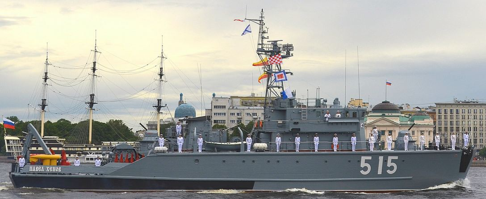

#### Alukset
| Latinisoitu nimi | Kyrillinen nimi | Käyttöönotto | Tila | Huom |
|---|---|---:|---|---|
| – | – | – | Ei vahvistettu julkisista lähteistä | Avoimista lähteistä saatava yksikkökohtainen aluslista ja palvelustila ovat ristiriitaisia tai puutteellisia. Tämä luokka kannattaa varmentaa erikseen esim. Jane’s Fighting Ships-, Combat Fleets-, ODIN- ja telakkalähteillä ennen operatiivista käyttöä. |

#### Kalustokuvaus
Puurunkoiseen ja matalan magneettisen herätteen rakenteeseen perustuva rannikkomiinanraivaaja. Alus mahdollistaa tukikohtien, kapeikkojen ja rannikon liikenneväylien miinantorjunnan.

#### Suorituskyky
- 25–30 mm kevyt tykkiaseistus (2М-3M / AK-306 alaversiosta riippuen) antaa luokalle kevyen omasuojan. Kantama on tyypillisesti noin 2–4 km, eikä aseistus ole tarkoitettu merkittävään taisteluun.
- Kannettavat ilmatorjuntaohjukset (Стрела-2) tuovat rajallisen lähi-ilmatorjunnan. Ohjuksen kantama on noin 4 km.
- Miinantorjuntajärjestelmät (тралы; противоминные средства) mahdollistavat rannikkovesien miinojen etsinnän ja raivauksen. Luokan rooli on taktinen väylänavaus ja satamien lähialueiden puhdistus.

#### Huomioita analyysiin
Rannikkomiinanraivaaja, joka on suunniteltu tukikohtien, kapeikkojen ja rannikon liikenneväylien puhdistamiseen. Luokan käytännön merkitys on paikallisessa pääsynvarmistuksessa ja väyläturvallisuuden ylläpidossa.

#### Operatiiviset rajoitteet
Ikääntyminen ja kevyt omasuoja rajaavat käytön matalan uhan ympäristöihin. Luokka ei tarjoa samaa etä- ja sensoripohjaista turvallisuutta kuin uudemmat miinantorjunta-alukset.

#### Lähteet
- [List of active Russian Navy ships – Wikipedia](https://en.wikipedia.org/wiki/List_of_active_Russian_Navy_ships)
- [Russian Navy – Wikipedia](https://en.wikipedia.org/wiki/Russian_Navy)
- [ODIN – Sonya Class (Project 1265 Yakhont Class) Russian Coastal Minesweeper](https://odin.tradoc.army.mil/WEG/Asset/Sonya-Class_) ([ODIN-verkkosivu](https://odin.tradoc.army.mil))
- [Wikipedia – Sonya-class minesweeper](https://en.wikipedia.org/wiki/Sonya-class_minesweeper)
- [RussianShips.info – Project 1265](https://russianships.info/eng/warships/project_1265.htm)

### Yevgenya-luokka
#### Kalustokuva
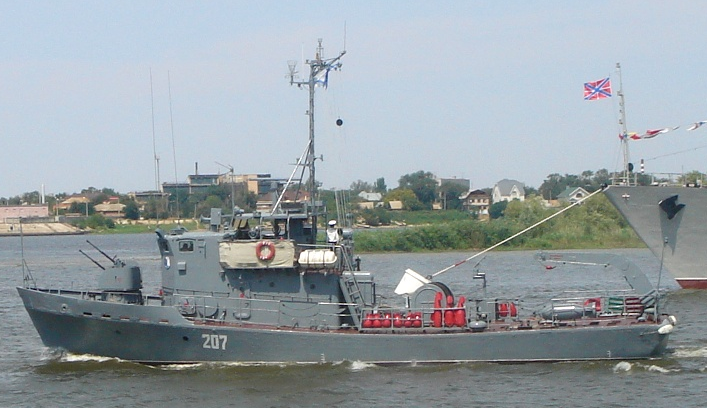

#### Alukset
| Latinisoitu nimi | Kyrillinen nimi | Käyttöönotto | Tila | Huom |
|---|---|---:|---|---|
| – | – | – | Ei vahvistettu julkisista lähteistä | Avoimista lähteistä saatava yksikkökohtainen aluslista ja palvelustila ovat ristiriitaisia tai puutteellisia. Tämä luokka kannattaa varmentaa erikseen esim. Jane’s Fighting Ships-, Combat Fleets-, ODIN- ja telakkalähteillä ennen operatiivista käyttöä. |

#### Kalustokuvaus
Hyvin pieni sisävesi- ja rannikkoalueiden miinanraivaaja satamien, jokisuistojen ja suojattujen vesialueiden miinantorjuntaan. Alus mahdollistaa paikallisen merellisen infrastruktuurin ja tukikohtien suojaamisen.

#### Suorituskyky
- 25 mm kevyt tykkiaseistus (2М-3M) muodostaa luokan omasuojan aivan lähietäisyydelle. Käytännön vaikutusetäisyys on noin 2–3 km.
- Miinanraivauskalusto (тралы) on luokan ydinsuorituskyky. Alukset on suunniteltu satamien, jokisuistojen ja rannikkovyöhykkeen miinantorjuntaan eikä niillä ole merkittävää hyökkäysaseistusta.

#### Huomioita analyysiin
Hyvin pieni miinantorjunta-alus, jonka painopiste on satamien, jokialueiden ja muiden suojattujen vesialueiden puhdistamisessa. Luokka on analyytikolle ennen kaikkea paikallisen infrastruktuurin suojauskyky, ei meritaistelun resurssi.

#### Operatiiviset rajoitteet
Erittäin rajallinen merikelpoisuus ja aseistus sitovat käytön lähelle tukikohtia. Alus ei sovellu avomerelliseen operointiin eikä itsenäiseen korkeauhkatehtävään.

#### Lähteet
- [List of active Russian Navy ships – Wikipedia](https://en.wikipedia.org/wiki/List_of_active_Russian_Navy_ships)
- [Russian Navy – Wikipedia](https://en.wikipedia.org/wiki/Russian_Navy)
- [ODIN – Yevgenya Class (Project 1258 Class) Russian Inshore Minesweeper](https://odin.tradoc.army.mil/WEG/Asset/Yevgenya-Class_) ([ODIN-verkkosivu](https://odin.tradoc.army.mil))
- [Wikipedia – Yevgenya-class minesweeper](https://en.wikipedia.org/wiki/Yevgenya-class_minesweeper)
- [RussianShips.info – Minesweepers overview](https://russianships.info/eng/warships/)

## Sukellusveneet

### Akula-luokka
#### Kalustokuva
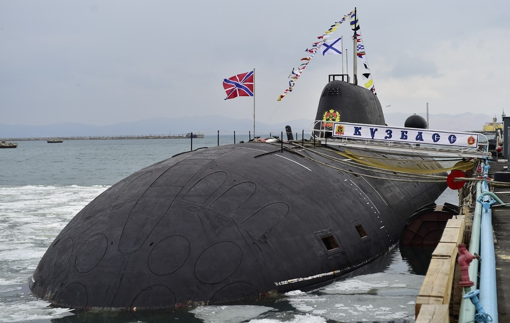

#### Alukset
| Latinisoitu nimi | Kyrillinen nimi | Käyttöönotto | Tila | Huom |
|---|---|---:|---|---|
| – | – | – | Ei vahvistettu julkisista lähteistä | Avoimista lähteistä saatava yksikkökohtainen aluslista ja palvelustila ovat ristiriitaisia tai puutteellisia. Tämä luokka kannattaa varmentaa erikseen esim. Jane’s Fighting Ships-, Combat Fleets-, ODIN- ja telakkalähteillä ennen operatiivista käyttöä. |

#### Kalustokuvaus
Ydinkäyttöinen hyökkäyssukellusvene sukellusveneiden ja pinta-alusten torjuntaan sekä pitkän keston partiointiin. Alus mahdollistaa peitteisen metsästäjä-tappaja-toiminnan ja pitkän toiminta-ajan merellä.

#### Suorituskyky
- 533 mm ja 650 mm torpedoputket (торпедные аппараты 533 мм / 650 мм) muodostavat luokan pääaseistuksen. Putkista voidaan käyttää torpedoja, merimiinoja ja useissa lähteissä myös risteilyohjuksia; käytännön kantama riippuu käytettävästä aseesta kymmenistä aina satoihin kilometreihin.
- Risteilyohjuskyky (Калибр / Гранат, alaversiosta riippuen) antaa luokalle kyvyn iskeä pinta- ja mahdollisesti maamaaleihin stand-off-etäisyydeltä. Tarkka aseistus vaihtelee modernisointitason mukaan, mikä on analyytikon syytä varmentaa yksikkökohtaisesti.
- Sukellusveneentorjunta- ja meritilannekuvakyky (гидроакустический комплекс) perustuu laajaan sonaripakettiin ja hiljaiseen ydinkäyttöiseen runkoon. Luokka on ensisijaisesti monitoiminen hyökkäyssukellusvene, jonka vahvuus on vihollisen pinta- ja sukellusvenekaluston metsästäminen.

#### Huomioita analyysiin
Ydinkäyttöinen hyökkäyssukellusvene, jonka vahvuus on peitteinen torjunta- ja seurantatoiminta pinta- ja sukellusvenemaaleja vastaan. Luokka on edelleen relevantti pitkän toiminta-ajan, hyvän asekuorman ja monikäyttöisyyden vuoksi.

#### Operatiiviset rajoitteet
Alaversioiden, modernisointien ja yksikkökohtaisen kunnon erot voivat olla merkittäviä. Todellinen suorituskyky riippuu siksi paljon yksittäisestä veneestä, miehistöstä ja huollon tasosta.

#### Lähteet
- [List of active Russian Navy ships – Wikipedia](https://en.wikipedia.org/wiki/List_of_active_Russian_Navy_ships)
- [Russian Navy – Wikipedia](https://en.wikipedia.org/wiki/Russian_Navy)
- [ODIN – Akula Class / Akula II (Project 971 Shchuka-B) Russian Nuclear-Powered Attack Submarine](https://odin.tradoc.army.mil/WEG/Asset/Akula_II-Class_%28Project_971U_Class%29_Russian_Nuclear-Powered_Attack_Submarine) ([ODIN-verkkosivu](https://odin.tradoc.army.mil))
- [Wikipedia – Akula-class submarine](https://en.wikipedia.org/wiki/Akula-class_submarine)
- [ODIN – Akula Class](https://odin.tradoc.army.mil/WEG/Asset/Akula_Class_%28Project_971_Class%29_Russian_Nuclear_Powered_Attack_Submarine_%28SSN%29)

### Belgorod-muunnos (ex Oscar II)
#### Kalustokuva

#### Alukset
| Latinisoitu nimi | Kyrillinen nimi | Käyttöönotto | Tila | Huom |
|---|---|---:|---|---|
| Belgorod | Белгород | 2022 | Aktiivikäytössä | Projekti 09852; erikoistehtävävene Poseidon-järjestelmälle ja syvänmeren operaatioille, ei perinteinen Oscar II -taisteluvene. |

#### Kalustokuvaus
Oscar II -runkoon perustuva erikoistehtävien ydinsukellusvene syvänmeren operaatioihin, erikoiskuormiin ja strategisten merenalaisten järjestelmien tukemiseen. Alus mahdollistaa merenpohjaoperaatiot, GUGI-tehtävät ja Poseidon-järjestelmän kuljetuksen.

#### Suorituskyky
- Poseidon-järjestelmä (Посейдон) on luokan strategisesti merkittävin suorituskyky. Avoimissa lähteissä aluksen arvioidaan voivan kuljettaa useita ydinkäyttöisiä, erittäin pitkän kantaman autonomisia torpedoja, mutta tarkat kantama- ja kuormamäärät eivät ole julkisesti varmistettuja.
- Erikoisoperaatio- ja syvänmerenkyky (специальные подводные аппараты) mahdollistaa miehitettyjen ja miehittämättömien syvänmeren järjestelmien kuljettamisen, emälaivatoiminnan sekä merenalaisen infrastruktuurin tutkimisen tai käsittelyn. Tämä tekee Belgorodista enemmän strategisen erikoistehtävän aluksen kuin tavanomaisen taistelusukellusveneen.
- Torpedo- ja ohjusaseistus (торпедное / ракетное вооружение) perustuu Oscar II -rungon perintöön, mutta julkisissa lähteissä painopiste on erikoisjärjestelmissä. Analyytikon on syytä käsitellä tavanomaisen aseistuksen tilaa epävarmana, ellei yksikkökohtaista lähdevahvistusta ole saatavilla.

#### Huomioita analyysiin
Strateginen erikoistehtäväalus, jonka painopiste on Poseidon-järjestelmässä, syvänmeren erikoisoperaatioissa ja merenalaisen infrastruktuurin käsittelyssä. Luokan arvo on enemmän strateginen ja psykologinen kuin tavanomaisen meritaistelun taktinen.

#### Operatiiviset rajoitteet
Poikkeuksellinen rooli tekee aluksesta vaikeasti luokiteltavan ja sen tarkan varustetilan osin epävarmaksi. Pieni lukumäärä tarkoittaa, että jokainen havainto tai siirtymä voi olla tiedustelullisesti merkittävä.

#### Lähteet
- [K-329 Belgorod – French Wikipedia](https://fr.wikipedia.org/wiki/K-329_Belgorod)
- [Future of the Russian Navy – Wikipedia](https://en.wikipedia.org/wiki/Future_of_the_Russian_Navy)
- [ODIN – K-329 Belgorod (Project 09852) Russian Nuclear Submarine](https://odin.tradoc.army.mil/WEG/Asset/Belgorod-Class_) ([ODIN-verkkosivu](https://odin.tradoc.army.mil))
- [Wikipedia – Russian submarine Belgorod](https://en.wikipedia.org/wiki/Russian_submarine_Belgorod_(K-329))
- [Naval News – Belgorod / Poseidon reporting](https://www.navalnews.com/naval-news/2022/07/russian-navys-belgorod-special-submarine-delivered/)

### Borei-luokka
#### Kalustokuva
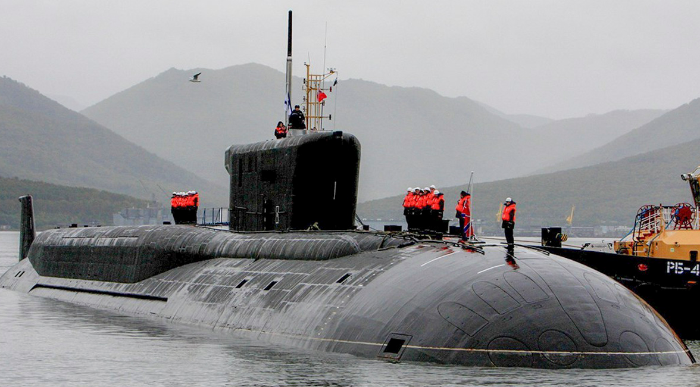

#### Alukset
| Latinisoitu nimi | Kyrillinen nimi | Käyttöönotto | Tila | Huom |
|---|---|---:|---|---|
| Yury Dolgorukiy | Юрий Долгорукий | 2012 | Aktiivikäytössä | Projekti 955; Pohjoinen laivasto. |
| Alexander Nevsky | Александр Невский | 2013 | Aktiivikäytössä | Projekti 955; Tyynenmeren laivasto. |
| Vladimir Monomakh | Владимир Мономах | 2014 | Aktiivikäytössä | Projekti 955; Tyynenmeren laivasto. |
| Knyaz Vladimir | Князь Владимир | 2020 | Aktiivikäytössä | Projekti 955A; Pohjoinen laivasto. |
| Knyaz Oleg | Князь Олег | 2021 | Aktiivikäytössä | Projekti 955A; Tyynenmeren laivasto. |
| Generalissimus Suvorov | Генералиссимус Суворов | 2022 | Aktiivikäytössä | Projekti 955A; Tyynenmeren laivasto. |
| Imperator Aleksandr III | Император Александр III | 2023 | Aktiivikäytössä | Projekti 955A; Tyynenmeren laivasto. |
| Knyaz Pozharskiy | Князь Пожарский | 2025 | Aktiivikäytössä | Projekti 955A; uusin palvelukseen otettu julkisesti vahvistettu yksikkö. |
| Dmitry Donskoy | Дмитрий Донской | – | Rakenteilla | Projekti 955A; rakenteilla. |
| Knyaz Potemkin | Князь Потёмкин | – | Rakenteilla | Projekti 955A; rakenteilla. |

#### Kalustokuvaus
Strateginen ballististen ohjusten ydinsukellusvene, joka muodostaa Venäjän merellisen ydinpelotteen ytimen. Alus mahdollistaa toisen iskun kyvyn ja jatkuvan strategisen partioinnin.

#### Suorituskyky
- R-30 Bulava -ballistiset meriohjukset (Р-30 «Булава») muodostavat luokan pääaseistuksen ja ydinpelotteen ytimen. Ohjuksen kantama ilmoitetaan yleisesti noin 8 000–9 000 km, ja kussakin veneessä on tyypillisesti 16 ohjusta.
- 533 mm torpedoputket (торпедные аппараты 533 мм) antavat veneelle itsepuolustus- ja rajallisen hyökkäyskyvyn pinta- ja sukellusvenemaaleja vastaan. Torpedoiden kantama riippuu mallista, mutta on tyypillisesti kymmeniä kilometrejä.
- Hiljainen strateginen partiointikyky (стратегическое сдерживание) on luokan ratkaiseva operatiivinen vahvuus. Borei ei ole tarkoitettu etulinjan hyökkäysveneeksi vaan toisen iskun ydinasepelotteen merelliseksi alustaksi.

#### Huomioita analyysiin
Strateginen ydinohjussukellusvene muodostaa merellisen toisen iskun kyvyn rungon. Luokan merkitys on ennen kaikkea jatkuvassa pelotteessa, ei alueellisen pintasodankäynnin tukemisessa.

#### Operatiiviset rajoitteet
Toiminta on sidottu suojattuihin partioalueisiin, saattavaan sukellusveneentorjuntaan ja tiukkaan komentoketjuun. Operatiivinen vaikutus näkyy usein enemmän vastustajan voimien sitomisena kuin näkyvinä taistelutoimina.

#### Lähteet
- [Borei-class submarine – Wikipedia](https://en.wikipedia.org/wiki/Borei-class_submarine)
- [Reuters – Bulava deployed on Borei-class submarines](https://www.reuters.com/world/europe/russia-puts-submarine-launched-bulava-intercontinental-missile-into-service-2024-05-14/)
- [ODIN – Borei Class (Project 955) Russian Nuclear-Powered Ballistic Missile Submarine](https://odin.tradoc.army.mil/WEG/Asset/Borei-Class_) ([ODIN-verkkosivu](https://odin.tradoc.army.mil))
- [Wikipedia – Borei-class submarine](https://en.wikipedia.org/wiki/Borei-class_submarine)
- [Missile Threat – Bulava](https://missilethreat.csis.org/missile/ss-n-32-bulava/)

### Delta IV -luokka
#### Kalustokuva
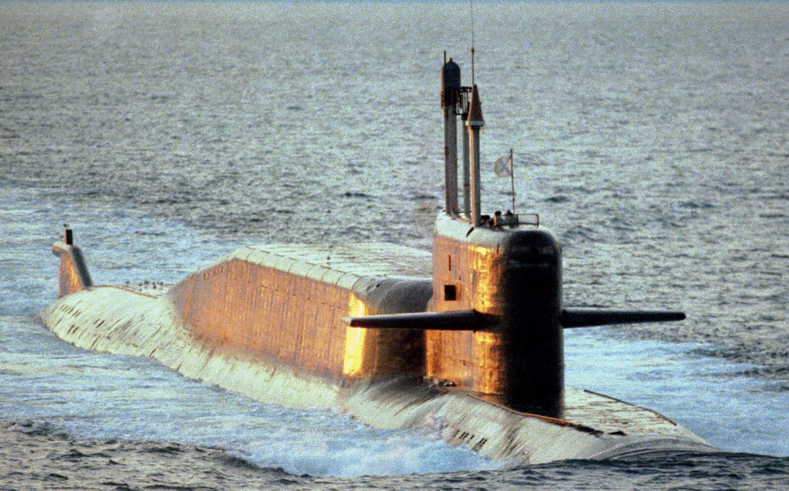

#### Alukset
| Latinisoitu nimi | Kyrillinen nimi | Käyttöönotto | Tila | Huom |
|---|---|---:|---|---|
| – | – | – | Ei vahvistettu julkisista lähteistä | Avoimista lähteistä saatava yksikkökohtainen aluslista ja palvelustila ovat ristiriitaisia tai puutteellisia. Tämä luokka kannattaa varmentaa erikseen esim. Jane’s Fighting Ships-, Combat Fleets-, ODIN- ja telakkalähteillä ennen operatiivista käyttöä. |

#### Kalustokuvaus
Strateginen ydinsukellusvene ballististen ohjusten partiointiin ja laukaisuun suojatuista bastionialueista. Alus mahdollistaa edelleen merkittävän osan Venäjän merellisestä ydinpelotteesta, vaikka luokka on vanhempi.

#### Suorituskyky
- R-29RMU Sineva / Layner -ballistiset ohjukset (Р-29РМУ «Синева» / «Лайнер») muodostavat luokan strategisen iskuvoiman. Kantama on lähteestä ja kuormasta riippuen noin 8 000–11 500 km.
- 533 mm torpedoputket (торпедные аппараты 533 мм) tuottavat itsepuolustuskyvyn pinta- ja sukellusvenemaaleja vastaan. Torpedoiden ja vastatoimijärjestelmien avulla vene kykenee suojaamaan itseään partiointialueella.
- Strateginen ydinpelotekyky (стратегическое сдерживание) tekee luokasta edelleen relevantin, vaikka se on vanhempi kuin Borei. Analyytikon on huomioitava, että merkitys liittyy ennen kaikkea ydinasekantokykyyn eikä taktiseen meritaisteluun.

#### Huomioita analyysiin
Vanhempi strateginen ydinohjussukellusvene, joka ylläpitää edelleen osaa merellisestä ydinpelotteesta. Luokka on analyysissa tärkeä, koska se kertoo vanhemman mutta yhä käyttökelpoisen deterrenssikerroksen säilyttämisestä.

#### Operatiiviset rajoitteet
Ikä lisää huolto- ja meluprofiiliriskejä verrattuna uudempiin strategisiin veneisiin. Luokan käyttö painottuu todennäköisesti suojattuihin partioalueisiin eikä korkean riskin eteen työnnettyyn toimintaan.

#### Lähteet
- [List of active Russian Navy ships – Wikipedia](https://en.wikipedia.org/wiki/List_of_active_Russian_Navy_ships)
- [Russian Navy – Wikipedia](https://en.wikipedia.org/wiki/Russian_Navy)
- [ODIN – Delta IV Class (Project 667BDRM Delfin Class) Russian Nuclear-Powered Ballistic Missile Submarine](https://odin.tradoc.army.mil/WEG/Asset/Delta_IV-Class_) ([ODIN-verkkosivu](https://odin.tradoc.army.mil))
- [Wikipedia – Delta-class submarine](https://en.wikipedia.org/wiki/Delta-class_submarine)
- [Missile Threat – Sineva](https://missilethreat.csis.org/missile/ss-n-23-skiff-r-29rmu-sineva/)

### Kashalot-luokka
#### Kalustokuva

#### Alukset
| Latinisoitu nimi | Kyrillinen nimi | Käyttöönotto | Tila | Huom |
|---|---|---:|---|---|
| – | – | – | Ei vahvistettu julkisista lähteistä | Avoimista lähteistä saatava yksikkökohtainen aluslista ja palvelustila ovat ristiriitaisia tai puutteellisia. Tämä luokka kannattaa varmentaa erikseen esim. Jane’s Fighting Ships-, Combat Fleets-, ODIN- ja telakkalähteillä ennen operatiivista käyttöä. |

#### Kalustokuvaus
Ydinkäyttöinen syvänmeren erikoissukellusvene merenpohjatyöhön, syvänmeren teknisiin tehtäviin ja peitteisiin vedenalaisiin operaatioihin. Alus mahdollistaa kapean mutta strategisesti merkittävän pääsyn vedenalaiseen infrastruktuuriin ja erikoiskohteisiin.

#### Suorituskyky
- 533 mm torpedoputket (торпедные аппараты 533 мм) muodostavat luokan pääaseistuksen. Kyse on syvänmeren erikoissukellusveneestä, jonka aseistus on rajallinen verrattuna suurempiin taistelusukellusveneisiin.
- Syvänmeren erikoistoimintakyky (глубоководные работы) on luokan keskeinen suorituskyky. Julkisissa lähteissä painottuvat merenalaiset tutkimus-, pelastus- ja erikoistehtävät, eivät varsinaiset iskuoperaatiot.
- Aseistuksen ja tehtäväjärjestelmien julkinen tieto on niukkaa. Analyytikon kannattaa käsitellä luokkaa ennen kaikkea GUGI-tyyppisenä erikoisalustana, jonka todelliset valmiudet voivat ylittää avoimissa lähteissä kuvatun tason.

#### Huomioita analyysiin
Syvämeren erikoissukellusvene, joka liittyy merenalaiseen tutkimus-, pelastus- tai erikoisoperaatiokykyyn ennemmin kuin tavanomaiseen torjuntataisteluun. Luokka on analyytikolle tärkeä siksi, että se voi tukea herkkiä vedenalaisia tehtäviä ja erikoisjärjestelmiä.

#### Operatiiviset rajoitteet
Avoin tieto yksikkömäärästä, varustuksesta ja tämänhetkisestä käyttötilasta on rajallista. Tämä epävarmuus on itsessään huomioitava arvioitaessa luokan todellista operatiivista painoarvoa.

#### Lähteet
- [List of active Russian Navy ships – Wikipedia](https://en.wikipedia.org/wiki/List_of_active_Russian_Navy_ships)
- [Russian Navy – Wikipedia](https://en.wikipedia.org/wiki/Russian_Navy)
- [H I Sutton – Project 1910 Uniform / Kashalot Class](https://www.hisutton.com/1910%20Kashalot.html) ([H I Sutton / Covert Shores](https://www.hisutton.com))
- [Wikipedia – Kashalot-class submarine](https://en.wikipedia.org/wiki/Kashalot-class_submarine)
- [Wikipedia – Russian submarine Kashalot](https://en.wikipedia.org/wiki/Russian_submarine_Kashalot)

### Kilo-luokka
#### Kalustokuva
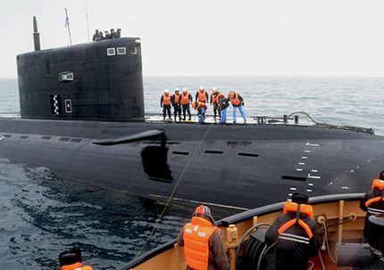
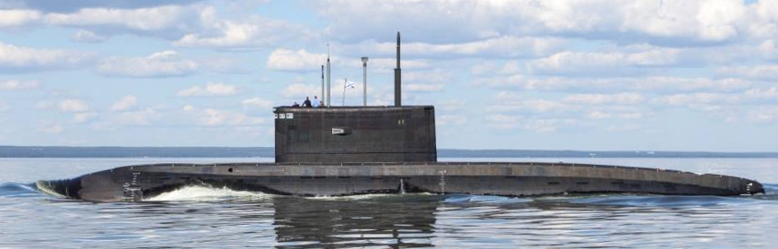
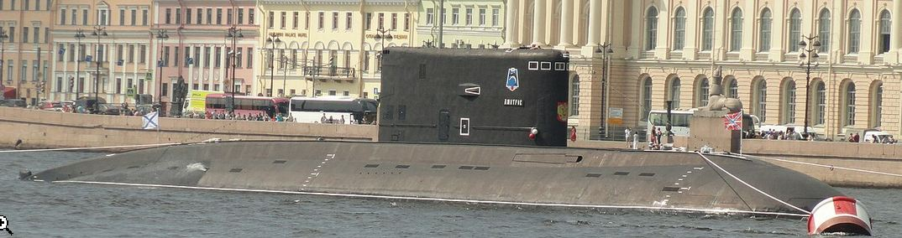
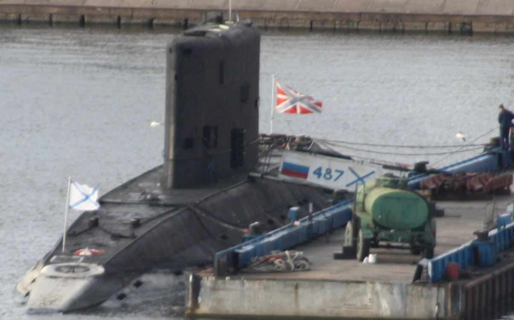

#### Alukset
| Latinisoitu nimi | Kyrillinen nimi | Käyttöönotto | Tila | Huom |
|---|---|---:|---|---|
| – | – | – | Ei vahvistettu julkisista lähteistä | Avoimista lähteistä saatava yksikkökohtainen aluslista ja palvelustila ovat ristiriitaisia tai puutteellisia. Tämä luokka kannattaa varmentaa erikseen esim. Jane’s Fighting Ships-, Combat Fleets-, ODIN- ja telakkalähteillä ennen operatiivista käyttöä. |

#### Kalustokuvaus
Dieselsähköinen hyökkäyssukellusvene pinta-alusten ja sukellusveneiden torjuntaan erityisesti suhteellisen matalissa vesissä. Alus mahdollistaa hiljaisen väijytyskyvyn ja alueellisen meritorjunnan rannikko- ja lähimerialueilla.

#### Suorituskyky
- 533 mm torpedoputket (торпедные аппараты 533 мм) muodostavat luokan perusaseistuksen. Putkista voidaan käyttää torpedoja ja merimiinoja, ja torpedoiden kantama on mallista riippuen tyypillisesti kymmeniä kilometrejä.
- Kalibr-risteilyohjukset (Калибр-ПЛ) kuuluvat modernisoitujen Project 636.3 -veneiden keskeiseen iskujärjestelmään. Maamaaliversioiden kantamasta on useita arvioita, mutta vienti- ja kotimaan versioiden erot sekä julkisen tiedon ristiriidat on huomioitava.
- Hiljainen rannikko- ja suljetun merialueen torjuntakyky (малошумность) tekee luokasta vaarallisen erityisesti Itämeren, Mustanmeren ja Välimeren kaltaisissa ympäristöissä. Luokan vahvuus on väijytys, ei suuri nopeus tai syvä strateginen partiointi.

#### Huomioita analyysiin
Diesel-sähköinen hyökkäyssukellusvene soveltuu hyvin rannikko- ja suljetun meren partiointiin, meritorjuntaan ja risteilyohjusiskuihin modernisoiduissa versioissa. Luokan vahvuus on hiljainen toiminta lyhyellä ja keskietäisyydellä sekä soveltuvuus alueelliseen merensulkuun.

#### Operatiiviset rajoitteet
Rajoitettu kestävyys veden alla ja tarve käyttää snorkkelia heikentävät selviytymistä pitkissä operaatioissa. Suorituskyky vaihtelee huomattavasti vanhempien perusversioiden ja uudemman Improved Kilo -kaluston välillä.

#### Lähteet
- [List of active Russian Navy ships – Wikipedia](https://en.wikipedia.org/wiki/List_of_active_Russian_Navy_ships)
- [Russian Navy – Wikipedia](https://en.wikipedia.org/wiki/Russian_Navy)
- [ODIN – Kilo Class (Project 877 Paltus) Russian Diesel-Electric Attack Submarine](https://odin.tradoc.army.mil/WEG/Asset/Kilo-Class_) ([ODIN-verkkosivu](https://odin.tradoc.army.mil))
- [Wikipedia – Kilo-class submarine](https://en.wikipedia.org/wiki/Kilo-class_submarine)
- [Naval Technology – Project 636.3 Varshavyanka](https://www.naval-technology.com/projects/project-6363-improved-kilo-class-submarine/)

### Lada-luokka
#### Kalustokuva
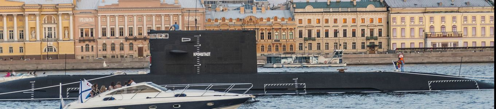
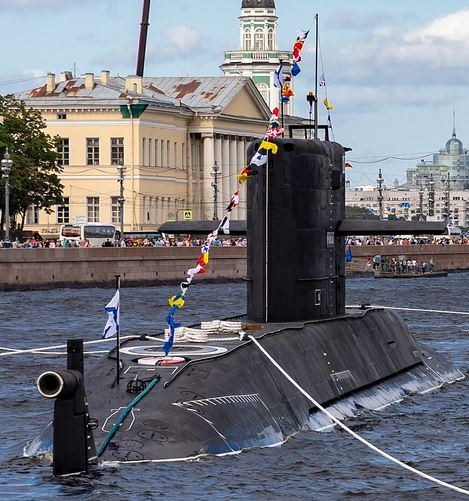
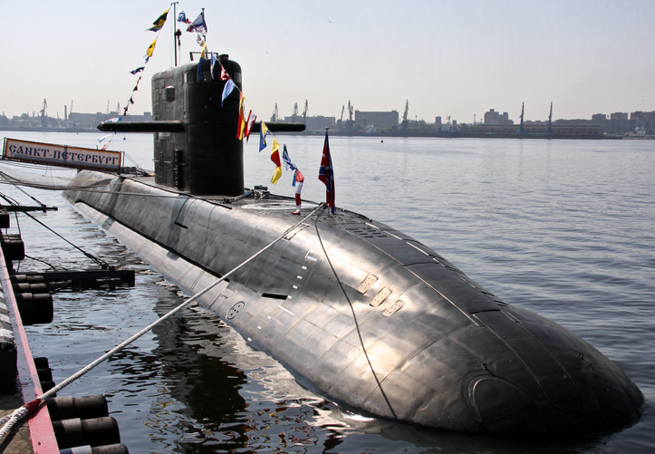

#### Alukset
| Latinisoitu nimi | Kyrillinen nimi | Käyttöönotto | Tila | Huom |
|---|---|---:|---|---|
| Sankt Peterburg | Санкт-Петербург | 2010 | Ei aktiivikäytössä | Prototyyppi B-585; poistettu käytöstä 2024. |
| Kronshtadt | Кронштадт | 2024 | Aktiivikäytössä | B-586; ensimmäinen operatiivisesti käyttökelpoinen luokan vene. |
| Velikiye Luki | Великие Луки | 2025 | Aktiivikäytössä | B-587; Baltian laivasto. |
| Vologda | Вологда | – | Rakenteilla | Rakenteilla. |
| Yaroslavl | Ярославль | – | Rakenteilla | Rakenteilla. |

#### Kalustokuvaus
Kehittyneempi dieselsähköinen sukellusveneluokka vanhempien Kilo-alusten korvaamiseen paremmalla akustisella suorituskyvyllä ja sensoreilla. Alus mahdollistaa peitteisen alueellisen meritorjunnan, tiedustelutuen ja iskuoperaatiot kiistanalaisissa rannikkovesissä.

#### Suorituskyky
- 533 mm torpedoputket (торпедные аппараты 533 мм) ovat luokan pääaseistus. Putkista voidaan käyttää torpedoja, merimiinoja ja lähteestä riippuen myös ohjuksia.
- Kalibr-yhteensopivuus (Калибр-ПЛ) antaa luokalle mahdollisuuden pitkän kantaman iskuun, mikäli vene on varustettu kyseisellä aseella. Julkisissa lähteissä on epäselvyyttä siitä, miten laajasti kyky on jo integroitu kaikkiin yksiköihin.
- Parannettu sensori- ja häivetaso (гидроакустика; малошумность) on luokan olennainen suorituskyky suhteessa vanhempaan Kilo-luokkaan. Käytännön arvo riippuu kuitenkin tuotannon hitaudesta ja siitä, kuinka pitkälle suunnitellut järjestelmät on todella operationalisoitu.

#### Huomioita analyysiin
Uudempi diesel-sähköinen sukellusvene, jonka tavoitteena on parempi hiljaisuus, sensorisuorituskyky ja rannikkoalueen torjuntakyky. Luokka on analyysissa kiinnostava kehityssuuntana, vaikka tuotanto ja kypsyys ovat olleet hitaita.

#### Operatiiviset rajoitteet
Pieni määrä ja ohjelmaan liittyneet tekniset viiveet rajoittavat välitöntä operatiivista merkitystä. Yksikkökohtaiset erot ja keskeneräiset modernisointitavoitteet on syytä huomioida arvioissa.

#### Lähteet
- [Lada-class submarine – Wikipedia](https://en.wikipedia.org/wiki/Lada-class_submarine)
- [ODIN – Lada Class](https://odin.tradoc.army.mil/WEG/Asset/Lada_Class_Russian_Submarine)
- [ODIN – Lada Class (Project 677 Class) Russian Diesel-Electric Attack Submarine](https://odin.tradoc.army.mil/WEG/Asset/Lada-Class_) ([ODIN-verkkosivu](https://odin.tradoc.army.mil))
- [Wikipedia – Lada-class submarine](https://en.wikipedia.org/wiki/Lada-class_submarine)
- [Naval Technology – Lada Class](https://www.naval-technology.com/projects/lada-class-diesel-electric-submarine-russia/)

### Oscar II -luokka
#### Kalustokuva
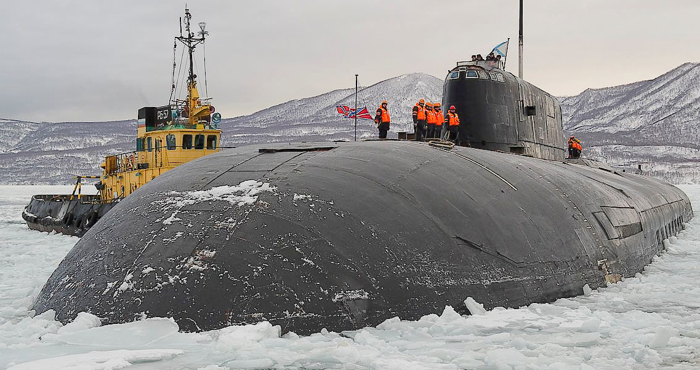

#### Alukset
| Latinisoitu nimi | Kyrillinen nimi | Käyttöönotto | Tila | Huom |
|---|---|---:|---|---|
| Smolensk | Смоленск | 1990 | Aktiivikäytössä | Pohjoinen laivasto; peruskorjattu. |
| Orel | Орёл | 1992 | Aktiivikäytössä | Pohjoinen laivasto. |
| Tomsk | Томск | 1996 | Aktiivikäytössä | Tyynenmeren laivasto. |
| Omsk | Омск | 1993 | Aktiivikäytössä | Tyynenmeren laivasto. |
| Chelyabinsk | Челябинск | 1995 | Modernisoinnissa | Projekti 949AM -päivitys julkisissa lähteissä. |
| Irkutsk | Иркутск | 1988 | Ei aktiivikäytössä | Julkisissa lähteissä poistettu käytöstä / modernisointiohjelma epäselvä 2025 lopulla. |
| Voronezh | Воронеж | 1989 | Reservissä / ei aktiivikäytössä | Asema julkisissa lähteissä epäselvä. |

#### Kalustokuvaus
Suuri ydinkäyttöinen risteilyohjussukellusvene lentotukialusosastojen ja muiden korkean arvon pinta-alusten tuhoamiseen pitkän kantaman merimaaliohjuksilla. Alus mahdollistaa raskaan merellisen iskukyvyn, ja modernisointi on lisännyt myös maamaalivaikutusta.

#### Suorituskyky
- P-700 Granit -risteilyohjukset (П-700 «Гранит») muodostavat luokan alkuperäisen pääiskukyvyn pinta-aluksia vastaan. Ohjuksen kantama ilmoitetaan tyypillisesti noin 550–625 km, ja suuri taistelukärki on tarkoitettu erityisesti suuria pintaosastoja vastaan.
- 533 mm ja 650 mm torpedoputket (торпедные аппараты 533 мм / 650 мм) tuottavat toissijaisen torpedo- ja miinoituskyvyn. Aseistus mahdollistaa myös sukellusveneentorjunnan lähietäisyydellä.
- Modernisoiduissa yksiköissä Kalibr-, Oniks- ja mahdollisesti Tsirkon-yhteensopivuus (Калибр; Оникс; Циркон) muuttaa luokan roolia merkittävästi. Analyytikon on varmistettava yksikkökohtaisesti, onko kyseessä alkuperäinen Granit-konfiguraatio vai modernisoitu asepaketti.

#### Huomioita analyysiin
Raskas ydinkäyttöinen risteilyohjussukellusvene on suunniteltu erityisesti suurten pinta-alusosastojen torjuntaan pitkältä etäisyydeltä. Luokka tarjoaa suuren iskuvolyymin ja voi toimia merkittävänä merellisen denial-kyvyn välineenä.

#### Operatiiviset rajoitteet
Suuri koko lisää havaittavuutta verrattuna ketterämpiin hyökkäyssukellusveneisiin. Todellinen uhkataso riippuu paljon siitä, onko yksikkö modernisoitu uudemmille ohjuksille ja sensoreille.

#### Lähteet
- [Oscar-class submarine – Wikipedia](https://en.wikipedia.org/wiki/Oscar-class_submarine)
- [Wikipedia – Russian submarine Orel](https://en.wikipedia.org/wiki/Russian_submarine_Orel)
- [ODIN – Oscar II Class (Project 949A Antey Class) Russian Nuclear-Powered Cruise Missile Submarine](https://odin.tradoc.army.mil/WEG/Asset/Oscar_II-Class_) ([ODIN-verkkosivu](https://odin.tradoc.army.mil))
- [Wikipedia – Oscar-class submarine](https://en.wikipedia.org/wiki/Oscar-class_submarine)
- [Missile Threat – P-700 Granit](https://missilethreat.csis.org/missile/ss-n-19-shipwreck-p-700-granit/)

### Sierra II -luokka
#### Kalustokuva
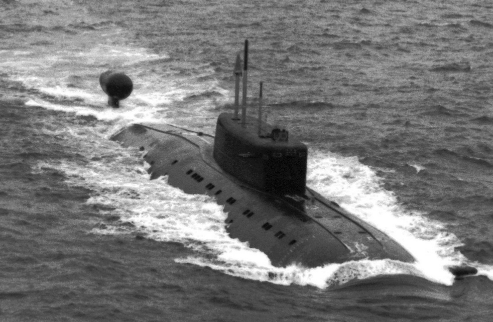

#### Alukset
| Latinisoitu nimi | Kyrillinen nimi | Käyttöönotto | Tila | Huom |
|---|---|---:|---|---|
| – | – | – | Ei vahvistettu julkisista lähteistä | Avoimista lähteistä saatava yksikkökohtainen aluslista ja palvelustila ovat ristiriitaisia tai puutteellisia. Tämä luokka kannattaa varmentaa erikseen esim. Jane’s Fighting Ships-, Combat Fleets-, ODIN- ja telakkalähteillä ennen operatiivista käyttöä. |

#### Kalustokuvaus
Titaanirunkoinen ydinhyökkäyssukellusvene syväsukellukseen, suureen nopeuteen sekä sukellusvene- ja pinta-alustorjuntaan. Alus mahdollistaa vaativan vedenalaisen toiminnan ja korkean suorituskyvyn, mutta pieni määrä rajoittaa kokonaisvaikutusta.

#### Suorituskyky
- 533 mm ja 650 mm torpedoputket (торпедные аппараты 533 мм / 650 мм) muodostavat luokan pääaseistuksen. Putkista voidaan käyttää torpedoja, merimiinoja ja joissakin lähteissä myös ohjuksia, joiden tarkka malli riippuu modernisoinnista.
- Titaniumrunko ja suuri sukellussyvyys (титановый корпус; глубина погружения) ovat luokan keskeisiä operatiivisia vahvuuksia. Tämä parantaa selviytymistä ja antaa taktista liikkumavaraa syvän veden sukellusveneentorjuntaympäristössä.
- Sensori- ja metsästyskyky (гидроакустический комплекс) tekee luokasta ensisijaisesti vihollisen sukellusveneiden torjuntaan optimoidun hyökkäysveneen. Julkinen tieto yksittäisten veneiden modernisointitasosta on rajallista.

#### Huomioita analyysiin
Titaanirunkoinen ydinsukellusvene yhdistää hyvän sukellussyvyyden, kestävyyden ja hyökkäyssukellusveneen perinteisen torjuntaroolin. Luokan kiinnostavuus on teknisessä laadussa ja suhteellisen pienessä mutta erikoisessa kalustopoolissa.

#### Operatiiviset rajoitteet
Veneitä on vähän, ja niiden ylläpito on vaativaa. Pieni määrä tekee yksikkökohtaisesta käyttötilasta keskeisen tiedustelukysymyksen.

#### Lähteet
- [List of active Russian Navy ships – Wikipedia](https://en.wikipedia.org/wiki/List_of_active_Russian_Navy_ships)
- [Russian Navy – Wikipedia](https://en.wikipedia.org/wiki/Russian_Navy)
- [Nuclear Threat Initiative – Russia Submarine Capabilities](https://www.nti.org/analysis/articles/russia-submarine-capabilities/) ([NTI](https://www.nti.org))
- [Wikipedia – Sierra-class submarine](https://en.wikipedia.org/wiki/Sierra-class_submarine)
- [ODIN – Sierra Class](https://odin.tradoc.army.mil/WEG/Asset/Sierra_Class_%28Project_945A_Class%29_Russian_Nuclear_Powered_Attack_Submarine_%28SSN%29)

### Victor III -luokka
#### Kalustokuva
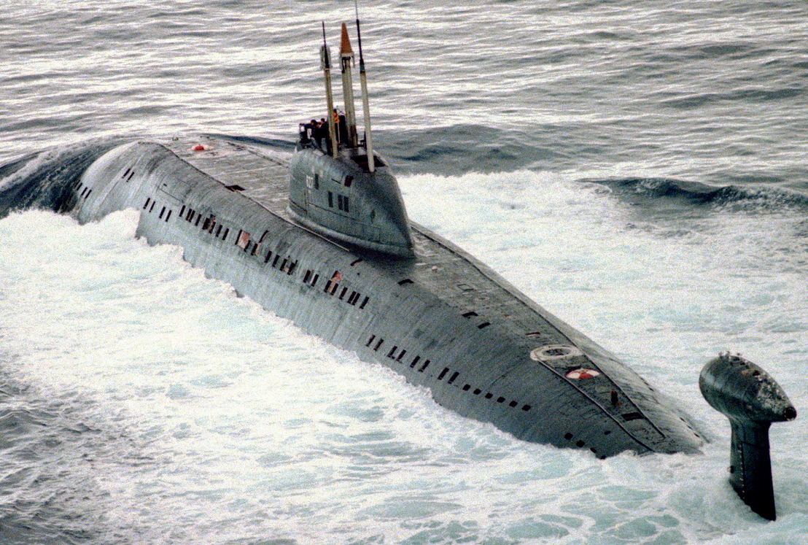

#### Alukset
| Latinisoitu nimi | Kyrillinen nimi | Käyttöönotto | Tila | Huom |
|---|---|---:|---|---|
| – | – | – | Ei vahvistettu julkisista lähteistä | Avoimista lähteistä saatava yksikkökohtainen aluslista ja palvelustila ovat ristiriitaisia tai puutteellisia. Tämä luokka kannattaa varmentaa erikseen esim. Jane’s Fighting Ships-, Combat Fleets-, ODIN- ja telakkalähteillä ennen operatiivista käyttöä. |

#### Kalustokuvaus
Myöhäisen neuvostokauden ydinhyökkäyssukellusvene sukellusveneentorjuntaan sekä torpedo- ja ohjusiskuihin. Alus mahdollistaa siirtymävaiheen suorituskyvyn kohti hiljaisempia moderneja hyökkäyssukellusveneitä.

#### Suorituskyky
- 533 mm torpedoputket (торпедные аппараты 533 мм) ovat luokan pääaseistus. Putkista voidaan käyttää torpedoja, miinoja ja joissakin lähteissä SS-N-15/16-tyyppisiä sukellusveneestä laukaistavia aseita, joiden kantama on aseesta riippuen kymmenistä kilometreistä ylöspäin.
- Sukellusveneentorjuntakyky (противолодочная борьба) on luokan ensisijainen tehtävä. Victor III oli aikanaan merkittävä kehitysaskel hiljaisuudessa ja sonarisuorituskyvyssä, vaikka se on nykyisin vanheneva alusta.
- Mahdollinen rakettitorpedokyky (Водопад / Ветер -perhe) laajentaa vaikutusetäisyyttä verrattuna puhtaaseen torpedotaisteluun. Tarkka yhteensopivuus vaihtelee veneittäin ja vaatii yksikkökohtaisen varmistuksen.

#### Huomioita analyysiin
Vanhemman sukupolven ydinhyökkäyssukellusvene, jolla on edelleen jonkinlainen torjunta- ja partioarvo toissijaisissa tehtävissä. Luokka kuvastaa enemmän periytyvää runkomassaa kuin modernin sukellusvenetaistelun kärkeä.

#### Operatiiviset rajoitteet
Ikä, meluprofiili ja vanhentuvat järjestelmät heikentävät kilpailukykyä nykyaikaisessa vedenalaisessa ympäristössä. Käyttömahdollisuudet voivat painottua koulutus-, reservi- tai rajattuihin partioihin.

#### Lähteet
- [List of active Russian Navy ships – Wikipedia](https://en.wikipedia.org/wiki/List_of_active_Russian_Navy_ships)
- [Russian Navy – Wikipedia](https://en.wikipedia.org/wiki/Russian_Navy)
- [ODIN – Victor III Class (Project 671RTM/RTMK Shchuka Class) Russian Nuclear-Powered Attack Submarine](https://odin.tradoc.army.mil/WEG/Asset/Victor_III-Class_) ([ODIN-verkkosivu](https://odin.tradoc.army.mil))
- [Wikipedia – Victor-class submarine](https://en.wikipedia.org/wiki/Victor-class_submarine)
- [ODIN – Victor III Class](https://odin.tradoc.army.mil/WEG/Asset/Victor_III_Class_%28Project_671RTMK_Class%29_Russian_Nuclear_Powered_Attack_Submarine_%28SSN%29)

### Yasen-luokka
#### Kalustokuva
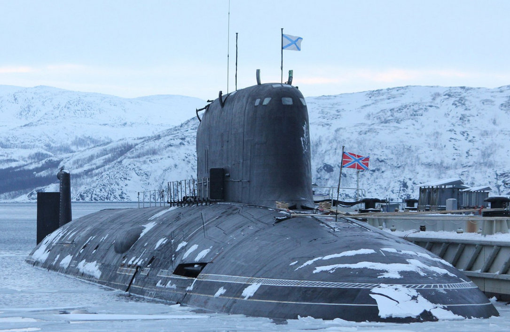

#### Alukset
| Latinisoitu nimi | Kyrillinen nimi | Käyttöönotto | Tila | Huom |
|---|---|---:|---|---|
| Severodvinsk | Северодвинск | 2014 | Aktiivikäytössä | Projekti 885; Pohjoinen laivasto. |
| Kazan | Казань | 2021 | Aktiivikäytössä | Projekti 885M; Pohjoinen laivasto. |
| Novosibirsk | Новосибирск | 2021 | Aktiivikäytössä | Projekti 885M; Tyynenmeren laivasto. |
| Krasnoyarsk | Красноярск | 2023 | Aktiivikäytössä | Projekti 885M; Tyynenmeren laivasto. |
| Arkhangelsk | Архангельск | 2024 | Aktiivikäytössä | Projekti 885M; Pohjoinen laivasto. |
| Perm | Пермь | – | Merikokeet / käyttöönotto odottaa | Vesillelaskettu 2025; käyttöönottoa ei vielä julkisesti vahvistettu. |
| Ulyanovsk | Ульяновск | – | Rakenteilla | Rakenteilla. |
| Voronezh | Воронеж | – | Rakenteilla | Rakenteilla. |
| Vladivostok | Владивосток | – | Rakenteilla | Rakenteilla. |
| Bratsk | Братск | – | Tilattu | Tilattu jatkosarjaan; toteutusaikataulu epävarma julkisissa lähteissä. |

#### Kalustokuvaus
Edistynyt ydinkäyttöinen risteilyohjussukellusvene, joka kykenee merimaalitorjuntaan, maamaali-iskuihin ja sukellusveneentorjuntaan samassa alustassa. Alus mahdollistaa Venäjän korkeimman suorituskyvyn monirooli-iskukyvyn merellä.

#### Suorituskyky
- Kalibr-risteilyohjukset (Калибр) antavat luokalle pitkän kantaman kyvyn iskeä maamaaleihin ja pinta-aluksiin. Julkisissa lähteissä kantamaksi esitetään usein satoja tai yli tuhat kilometriä versiosta riippuen, mutta venäläisten kotimaan versioiden tarkat suoritusarvot eivät ole täysin avoimia.
- P-800 Oniks ja 3M22 Tsirkon (Оникс; Циркон) muodostavat luokan raskaan merimaaliohjus- ja hypersonisen iskukyvyn. Oniksin kantamaksi ilmoitetaan tyypillisesti noin 300–600 km ja Tsirkonin useissa lähteissä noin 1 000 km luokkaa.
- 533 mm torpedoputket (торпедные аппараты 533 мм) täydentävät luokan monitoimista isku- ja torjuntakykyä. Yasen on Venäjän merivoimien moderni pääasiallinen SSGN/SSN-alusta, jonka vahvuus on yhdistelmä häive-, sensori- ja monipuolista aseistusta.

#### Huomioita analyysiin
Monitoiminen ydinhyökkäyssukellusvene yhdistää pitkän kantaman ohjusiskut, torpedokyvyn ja kehittyneen sensori- ja hiljaisuusprofiilin. Luokka on yksi merivoimien keskeisistä korkeatasoisista iskualustoista.

#### Operatiiviset rajoitteet
Pieni tuotantomäärä ja korkea arvo tekevät yksiköistä operatiivisesti herkkiä ja tarkasti priorisoituja. Jokainen havaittu siirto tai käyttöönotto voi viitata painopisteen muutokseen laivaston toiminnassa.

#### Lähteet
- [Yasen-class submarine – Wikipedia](https://en.wikipedia.org/wiki/Yasen-class_submarine)
- [ODIN – Yasen Class (Project 885) Russian Nuclear-Powered Cruise Missile Submarine](https://odin.tradoc.army.mil/WEG/Asset/89e97b3c6adb251073848e132d018a80) ([ODIN-verkkosivu](https://odin.tradoc.army.mil))
- [Wikipedia – Yasen-class submarine](https://en.wikipedia.org/wiki/Yasen-class_submarine)
- [Missile Threat – Tsirkon](https://missilethreat.csis.org/missile/3m22-tsirkon/)

## Taistelualukset

### Admiral Gorshkov -luokka
#### Kalustokuva
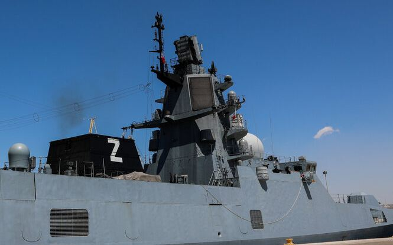
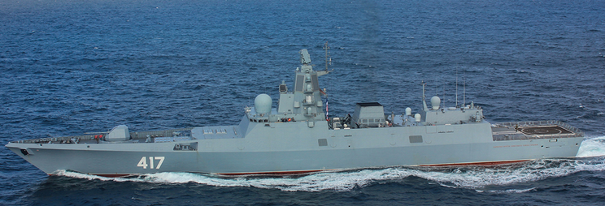

#### Alukset
| Latinisoitu nimi | Kyrillinen nimi | Käyttöönotto | Tila | Huom |
|---|---|---:|---|---|
| Admiral Gorshkov | Адмирал Горшков | 2018 | Aktiivikäytössä | Pohjoinen laivasto; luokan johtoalus. |
| Admiral Kasatonov | Адмирал Касатонов | 2020 | Aktiivikäytössä | Pohjoinen laivasto. |
| Admiral Golovko | Адмирал Головко | 2023 | Aktiivikäytössä | Pohjoinen laivasto. |
| Admiral Isakov | Адмирал Исаков | – | Varustelussa | Vesillelaskettu 2024; käyttöönottoa odotetaan. |
| Admiral Amelko | Адмирал Амелько | – | Varustelussa | Vesillelaskettu 2025. |
| Admiral Chichagov | Адмирал Чичагов | – | Rakenteilla | Rakenteilla. |
| Admiral Yumashev | Адмирал Юмашев | – | Rakenteilla | Rakenteilla. |
| Admiral Spiridonov | Адмирал Спиридонов | – | Rakenteilla | Rakenteilla. |

#### Kalustokuvaus
Moderni monitoimifregatti ilmatorjuntaan, sukellusveneentorjuntaan, saattotehtäviin ja pitkän kantaman iskuihin. Alus mahdollistaa valtamerikelpoisen moniroolisen pintataistelukyvyn nykyaikaisessa kokoluokassa.

#### Suorituskyky
- UKSK-pystyheitinjärjestelmä (УКСК) mahdollistaa Kalibr-, Oniks- ja Tsirkon-ohjusten käytön. Kantama riippuu aseesta: Oniks noin 300–600 km, Tsirkon noin 1 000 km luokkaa ja Kalibr-versiot jopa huomattavasti pidemmälle maamaaleihin.
- Poliment-Redut-ilmatorjuntajärjestelmä (Полимент-Редут) muodostaa luokan alue- ja pisteilmatorjunnan ytimen. Julkisissa lähteissä käytetään 9M96-ohjuksia, joiden kantama vaihtelee versiosta riippuen noin 40–150 km.
- 130 mm merikanuuna (А-192 «Армат») ja Paket-NK-torpedontorjuntajärjestelmä (Пакет-НК) täydentävät lähitaistelua ja sukellusveneentorjuntaa. Luokka on Venäjän nykyaikaisin monitoimifregatti, ja sen suorituskyky on selvästi laajempi kuin vanhemmilla venäläisillä fregateilla.

#### Huomioita analyysiin
Uuden sukupolven fregatti, joka yhdistää pitkän kantaman ilma-, pinta- ja maamaalivaikutuksen yhdelle alustalle. Luokka on merkittävä, koska se tuo suuremman laivaston yksiköihin aidosti monitoimisen pitkän kantaman iskukyvyn.

#### Operatiiviset rajoitteet
Pieni määrä ja korkea kysyntä eri laivastoalueilla rajoittavat yhtäaikaista läsnäoloa. Todellinen vaikutus riippuu myös siitä, kuinka paljon moderneja ohjuksia ja koulutettuja miehistöjä on käytettävissä.

#### Lähteet
- [Project 22350 frigate – Wikipedia](https://en.wikipedia.org/wiki/Project_22350_frigate)
- [Wikipedia – Admiral Gorshkov](https://en.wikipedia.org/wiki/Russian_frigate_Admiral_Gorshkov)
- [List of active Russian Navy ships – Wikipedia](https://en.wikipedia.org/wiki/List_of_active_Russian_Navy_ships)
- [ODIN – Admiral Gorshkov Class (Project 22350 Class) Russian Frigate](https://odin.tradoc.army.mil/WEG/Asset/Admiral-Gorshkov_Class_) ([ODIN-verkkosivu](https://odin.tradoc.army.mil))
- [Wikipedia – Admiral Gorshkov-class frigate](https://en.wikipedia.org/wiki/Admiral_Gorshkov-class_frigate)
- [Naval Technology – Project 22350](https://www.naval-technology.com/projects/project-22350-admiral-gorshkov-class-frigates/)

### Admiral Grigorovich -luokka
#### Kalustokuva
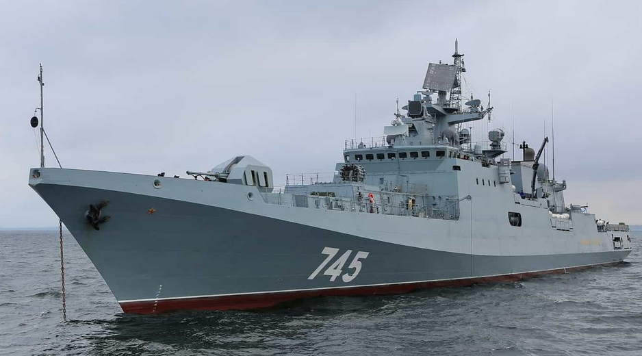

#### Alukset
| Latinisoitu nimi | Kyrillinen nimi | Käyttöönotto | Tila | Huom |
|---|---|---:|---|---|
| Admiral Grigorovich | Адмирал Григорович | 2016 | Aktiivikäytössä | Mustanmeren laivasto. |
| Admiral Essen | Адмирал Эссен | 2016 | Aktiivikäytössä | Mustanmeren laivasto; ukrainalaislähteissä väitetty vaurioita 2026, mutta alusluokka listataan edelleen aktiiviseksi. |
| Admiral Makarov | Адмирал Макаров | 2017 | Aktiivikäytössä | Mustanmeren laivasto. |

#### Kalustokuvaus
Monitoimifregatti alueellisiin saattotehtäviin, sukellusveneentorjuntaan ja pitkän kantaman iskuihin. Alus mahdollistaa kustannustehokkaan yleiskäytön erityisesti lähimerialueiden operaatioissa.

#### Suorituskyky
- Kalibr-NK-ohjukset (Калибр-НК) ovat luokan keskeinen pitkän kantaman iskukyky. Kantama riippuu versiosta ja maalista, mutta luokka kykenee sekä meri- että maamaali-iskuihin stand-off-etäisyydeltä.
- Shtil-1-ilmatorjuntajärjestelmä (Штиль-1) antaa keskikantaman ilmatorjunnan. Järjestelmän kantama on tyypillisesti noin 40–50 km käytetystä ohjuksesta riippuen.
- 100 mm merikanuuna (А-190), Kashtan/Palash-lähitorjunta sekä torpedot ja RBU-6000 (РБУ-6000) täydentävät monitoimisuorituskykyä. Luokka soveltuu erityisesti alueellisen läsnäolon, saattamisen ja rajatun iskuvaikutuksen tehtäviin.

#### Huomioita analyysiin
Monitoimifregatti, joka tarjoaa tasapainoisen kyvyn ilma-, pinta- ja maamaalien torjuntaan erityisesti alueellisissa operaatioissa. Luokka on käytännöllinen työjuhta, jos painopiste on Mustanmeren, Välimeren tai muiden lähialueiden tehtävissä.

#### Operatiiviset rajoitteet
Yksikkömäärä on rajallinen eikä ilmapuolustus yllä suurten alueilmatorjunta-alusten tasolle. Vaikuttavuus kasvaa selvästi osana laivuekokonaisuutta eikä yksin operoivana yksikkönä.

#### Lähteet
- [Project 11356R frigate – Wikipedia](https://en.wikipedia.org/wiki/Project_11356R_frigate)
- [List of active Russian Navy ships – Wikipedia](https://en.wikipedia.org/wiki/List_of_active_Russian_Navy_ships)
- [ODIN – Admiral Grigorovich Class (Project 11356 Class) Russian Frigate](https://odin.tradoc.army.mil/WEG/Asset/Admiral_Grigorovich-Class_) ([ODIN-verkkosivu](https://odin.tradoc.army.mil))
- [Wikipedia – Admiral Grigorovich-class frigate](https://en.wikipedia.org/wiki/Admiral_Grigorovich-class_frigate)
- [Naval Technology – Admiral Grigorovich Class](https://www.naval-technology.com/projects/admiral-grigorovich-class-frigates-russia/)

### Bora-luokka
#### Kalustokuva
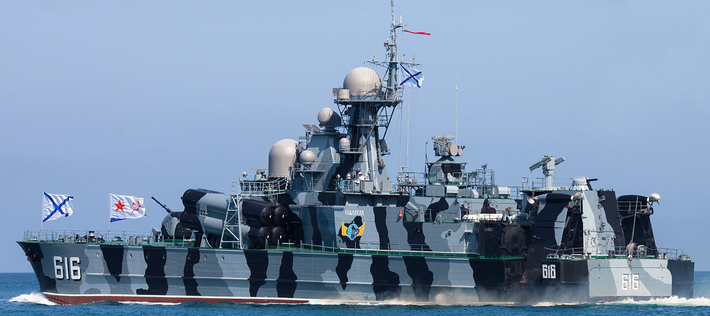

#### Alukset
| Latinisoitu nimi | Kyrillinen nimi | Käyttöönotto | Tila | Huom |
|---|---|---:|---|---|
| – | – | – | Ei vahvistettu julkisista lähteistä | Avoimista lähteistä saatava yksikkökohtainen aluslista ja palvelustila ovat ristiriitaisia tai puutteellisia. Tämä luokka kannattaa varmentaa erikseen esim. Jane’s Fighting Ships-, Combat Fleets-, ODIN- ja telakkalähteillä ennen operatiivista käyttöä. |

#### Kalustokuvaus
Nopea ohjusaseistettu ilmatyyny-/katamaraanikorvetti rannikkovesien iskuoperaatioihin pinta-aluksia vastaan. Alus mahdollistaa nopean iske-ja-irtoa -toiminnan rannikkovyöhykkeellä.

#### Suorituskyky
- Moskit-merimaaliohjukset (П-270 «Москит») muodostavat luokan pääiskukyvyn. Ohjuksen kantamaksi ilmoitetaan tyypillisesti noin 120 km perusversioissa ja pidemmälle kehittyneemmissä versioissa.
- Osa-M-ilmatorjunta (Оса-М), 76 mm tykit ja AK-630-lähitorjunta antavat alukselle vahvan omasuojan kokoluokkaansa nähden. Osa-M-ohjuksen kantama on noin 10–15 km ja AK-630:n noin 4–5 km.
- Ilmatyynyrungon suuri nopeus (скорость) tekee luokasta nopeatempoisen rannikkoalueen iskuvälineen. Sen vahvuus on nopea hyökkäys ja irtautuminen, mutta merikelpoisuus ja lukumäärä rajoittavat strategista vaikutusta.

#### Huomioita analyysiin
Nopea ilmatyynykatamaraani yhdistää suuren nopeuden ja raskaan meritorjuntaohjusaseistuksen rannikkoalueen iskuun. Luokan arvo perustuu kykyyn ilmestyä nopeasti uhkasektorille ja vapauttaa ohjusisku lyhyellä reagointiajalla.

#### Operatiiviset rajoitteet
Harvinainen rakenne, pieni yksikkömäärä ja huoltoherkkyys rajoittavat operatiivista kestävyyttä. Alus on tehokas niissä oloissa, joihin se on suunniteltu, mutta ei yleiskäyttöinen avomeritaistelija.

#### Lähteet
- [List of active Russian Navy ships – Wikipedia](https://en.wikipedia.org/wiki/List_of_active_Russian_Navy_ships)
- [Russian Navy – Wikipedia](https://en.wikipedia.org/wiki/Russian_Navy)
- [ODIN – Bora Class (Project 1239 Class) Russian Hoverborne Guided Missile Corvette](https://odin.tradoc.army.mil/WEG/Asset/Bora-Class_) ([ODIN-verkkosivu](https://odin.tradoc.army.mil))
- [SeaForces – Bora class listing](http://www.seaforces.org/marint/Russian-Navy/Corvette/Bora-class.htm) ([SeaForces](http://www.seaforces.org))
- [Wikipedia – Bora-class guided missile hovercraft](https://en.wikipedia.org/wiki/Bora-class_guided_missile_hovercraft)
- [ODIN – Bora Class](https://odin.tradoc.army.mil/WEG/Asset/Bora_Class_%28Project_1239_Class%29_Russian_Guided_Missile_Hovercraft)

### Buyan-M-luokka
#### Kalustokuva
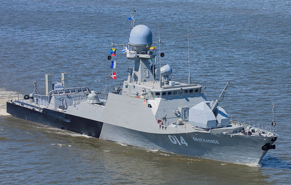
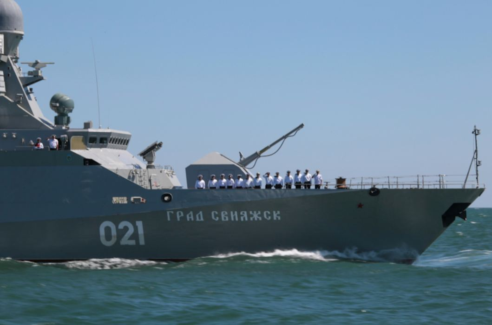
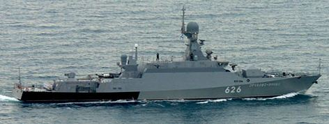
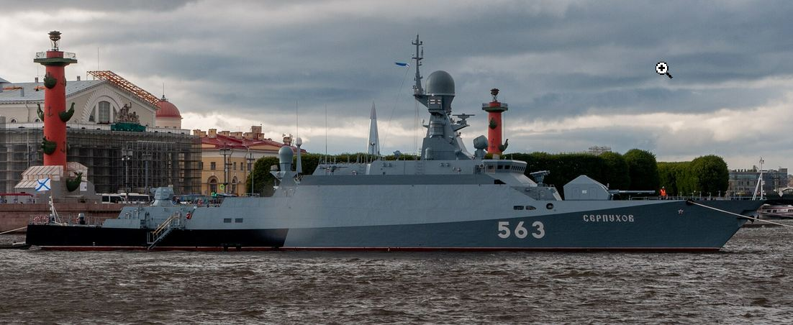
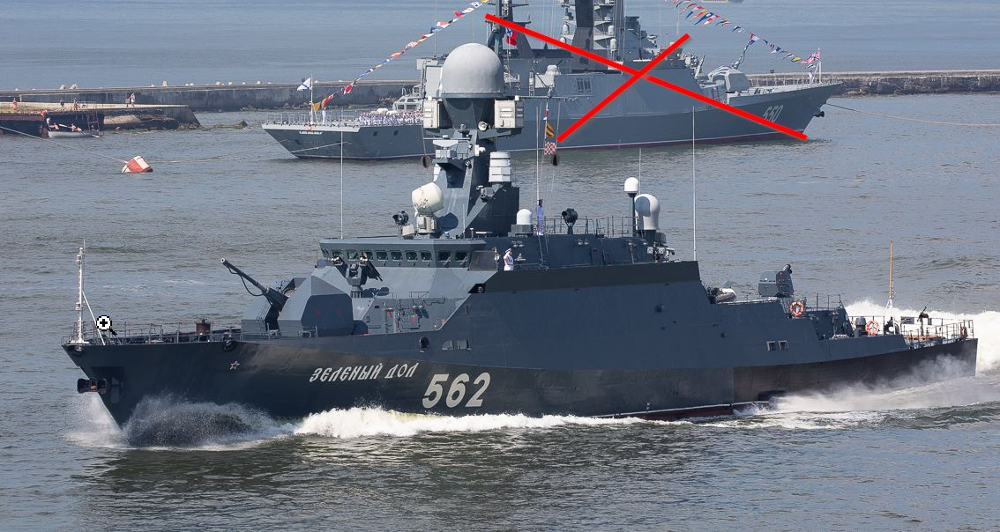

#### Alukset
| Latinisoitu nimi | Kyrillinen nimi | Käyttöönotto | Tila | Huom |
|---|---|---:|---|---|
| Grad Sviyazhsk | Град Свияжск | 2014 | Aktiivikäytössä | Kaspianmeren laivue. |
| Uglich | Углич | 2014 | Aktiivikäytössä | Kaspianmeren laivue. |
| Velikiy Ustyug | Великий Устюг | 2014 | Aktiivikäytössä | Kaspianmeren laivue. |
| Zelenyy Dol | Зелёный Дол | 2015 | Aktiivikäytössä | Baltian laivasto. |
| Serpukhov | Серпухов | 2015 | Aktiivikäytössä | Baltian laivasto; julkisia raportteja vaurioista 2024. |
| Vyshniy Volochyok | Вышний Волочёк | 2018 | Aktiivikäytössä | Mustanmeren laivasto; julkisia raportteja törmäysvauriosta 2025. |
| Orekhovo-Zuyevo | Орехово-Зуево | 2018 | Aktiivikäytössä | Mustanmeren laivasto. |
| Ingushetiya | Ингушетия | 2019 | Aktiivikäytössä | Mustanmeren laivasto. |
| Grayvoron | Грайворон | 2021 | Aktiivikäytössä | Mustanmeren laivasto. |
| Grad | Град | 2022 | Aktiivikäytössä | Baltian laivasto; julkisia raportteja mahdollisista vaurioista 2025. |

#### Kalustokuvaus
Pieni ohjuskorvetti rannikko- ja sisämerialueiden operaatioihin, mutta se kantaa pitkän kantaman Kalibr-aseistusta. Alus mahdollistaa kokoaan suuremman maamaali- ja meritorjuntavaikutuksen hajautettuna iskualustana.

#### Suorituskyky
- Kalibr-NK-ohjukset (Калибр-НК) muodostavat luokan strategisesti merkittävän iskukyvyn suhteessa pieneen kokoon. Luokka on tunnettu kyvystään laukoa pitkän kantaman maamaaliohjuksia sisä- ja rannikkovesiltä.
- 100 mm merikanuuna (А-190) antaa pintamaalivaikutuksen ja rajallisen ilmatorjuntakyvyn. Käytännön kantama on noin 15–20 km pintamaaleihin.
- Gibka-/Duet-lähitorjunta (Гибка; АК-630М-2 «Дуэт» aluksesta riippuen) suojaa pientä alusta lähiuhkia vastaan. Luokan analyytikkorelevanssi perustuu ennen kaikkea sen UKSK-iskukykyyn eikä ilmatorjuntaan tai merikelpoisuuteen.

#### Huomioita analyysiin
Pieni ohjusalus, jonka merkitys perustuu pitkän kantaman maamaalivaikutukseen rannikko- ja sisävesiympäristöistä. Luokka on erityisen tärkeä, koska se mahdollistaa strategisenkin iskun pieneltä ja hajautettavalta alustalta.

#### Operatiiviset rajoitteet
Rajallinen ilmapuolustus ja merikelpoisuus tekevät aluksesta haavoittuvan avomerellä. Luokan vahvuus on suojatun rannikkovyöhykkeen tai suljetun meren iskuoperaatioissa, ei sinivesitoiminnassa.

#### Lähteet
- [Buyan-class corvette – Wikipedia](https://en.wikipedia.org/wiki/Buyan-class_corvette)
- [ODIN – Buyan-M Class (Project 21631 Class) Russian Corvette](https://odin.tradoc.army.mil/WEG/Asset/Buyan-M-Class_) ([ODIN-verkkosivu](https://odin.tradoc.army.mil))
- [Wikipedia – Buyan-class corvette](https://en.wikipedia.org/wiki/Buyan-class_corvette)
- [Naval Technology – Buyan-M Class](https://www.naval-technology.com/projects/project-21631-buyan-m-class-corvette-russia/)

### Gepard-luokka
#### Kalustokuva
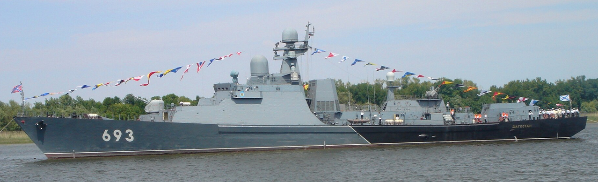

#### Alukset
| Latinisoitu nimi | Kyrillinen nimi | Käyttöönotto | Tila | Huom |
|---|---|---:|---|---|
| – | – | – | Ei vahvistettu julkisista lähteistä | Avoimista lähteistä saatava yksikkökohtainen aluslista ja palvelustila ovat ristiriitaisia tai puutteellisia. Tämä luokka kannattaa varmentaa erikseen esim. Jane’s Fighting Ships-, Combat Fleets-, ODIN- ja telakkalähteillä ennen operatiivista käyttöä. |

#### Kalustokuvaus
Monitoiminen fregatti/korvetti partiointiin, saattamiseen sekä pinta- ja sukellusvenetorjuntaan. Alus mahdollistaa joustavan alueellisen taistelukäytön suljetuissa merialueissa ja meriturvallisuustehtävissä.

#### Suorituskyky
- Uran- tai Kalibr-ohjukset (Уран / Калибр) muodostavat luokan pääiskukyvyn alaversiosta riippuen. Uran-ohjuksen kantama on yleisesti noin 130–260 km versiosta riippuen, kun taas Kalibr antaa huomattavasti pidemmän isku-ulottuvuuden.
- Shtil-1- tai Osa-/Palma-tyyppinen ilmatorjunta (Штиль-1 / Оса / Палаш alaversiosta riippuen) määrittää aluksen ilmapuolustustason. Luokan eri käyttäjillä ja rakennetuilla versioilla on merkittäviä eroja, mikä vaatii yksilötason tarkennusta.
- 100 mm merikanuuna, torpedot ja RBU-6000 (РБУ-6000) tekevät luokasta aidosti monitoimisen fregatti-/korvettialustan. Venäjän omassa käytössä luokan merkitys on rajallinen verrattuna vientimenestykseen.

#### Huomioita analyysiin
Kevyt fregatti tai suuri korvetti, joka soveltuu monirooliseen rannikko- ja lähialueen merisodankäyntiin. Luokan hyöty on tasapainossa: se kykenee partiointiin, saattoon ja rajattuun isku- tai torjuntatoimintaan.

#### Operatiiviset rajoitteet
Versioerot ovat merkittäviä, koska osa aluksista on rakennettu vientiin ja osa eri varustetasolla. Yksikkökohtainen kokoonpano on siksi tarkistettava ennen suorituskykyarviota.

#### Lähteet
- [List of active Russian Navy ships – Wikipedia](https://en.wikipedia.org/wiki/List_of_active_Russian_Navy_ships)
- [Russian Navy – Wikipedia](https://en.wikipedia.org/wiki/Russian_Navy)
- [ODIN – Gepard Class (Project 11661 Class) Russian Frigate](https://odin.tradoc.army.mil/WEG/Asset/Gepard-Class_) ([ODIN-verkkosivu](https://odin.tradoc.army.mil))
- [Wikipedia – Gepard-class frigate](https://en.wikipedia.org/wiki/Gepard-class_frigate)
- [Naval Technology – Gepard Class](https://www.naval-technology.com/projects/gepard-class-frigates-russia/)

### Gremyashchiy-luokka
#### Kalustokuva
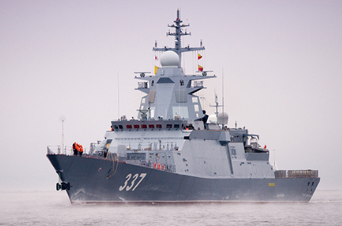

#### Alukset
| Latinisoitu nimi | Kyrillinen nimi | Käyttöönotto | Tila | Huom |
|---|---|---:|---|---|
| Gremyashchiy | Гремящий | 2020 | Aktiivikäytössä | Projekti 20385; Tyynenmeren laivasto. |
| Provornyy | Проворный | – | Rakenteilla / vaurioitunut | Rakenteilla; kärsi vakavasta telakkapalosta 2021, ohjelma jatkuu. |
| Rezkiy | Резкий | 2023 | Aktiivikäytössä | Projekti 20380/20385-johdannainen; Tyynenmeren laivasto. |

#### Kalustokuvaus
Steregushchiy-luokan jatkokehitys, jossa painottuvat aiempaa vahvempi iskuaseistus ja laajempi monitoimisuus. Alus mahdollistaa rannikkotaistelun, sukellusveneentorjunnan ja täsmäiskut suhteellisen kompaktissa rungossa.

#### Suorituskyky
- UKSK-ohjusjärjestelmä (УКСК) mahdollistaa Kalibr-, Oniks- ja joissakin arvioissa Tsirkon-aseiden käytön. Tämä antaa pienelle korvetille poikkeuksellisen pitkän kantaman iskuvaikutuksen.
- Redut-ilmatorjunta (Редут) muodostaa luokan keski- ja lähialueen ilmapuolustuksen. Kantama riippuu ohjuksesta, mutta 9M96-sarjalla se voi nousta kymmenistä kilometreistä noin 100+ km tasolle.
- 100 mm merikanuuna, Paket-NK ja sukellusveneentorjuntajärjestelmät tekevät luokasta monitoimisen rannikko- ja lähimerialustan. Käytännön suorituskyky riippuu kuitenkin edelleen tuotantovolyymista ja sensorijärjestelmien kypsyydestä.

#### Huomioita analyysiin
Uudempi korvettiluokka, joka tuo rannikko- ja lähialueen operointiin modernit sensorit, meritorjunnan ja pitkän kantaman ohjusvaihtoehdot. Luokka kasvattaa erityisesti hajautetun mutta hyvin aseistetun korvettivoiman laatua.

#### Operatiiviset rajoitteet
Pieni määrä ja tuotannon vaiheittaisuus rajoittavat kokonaismassaa. Aluksen koko asettaa silti rajoja pysyvyydelle ja ilmapuolustuksen syvyydelle verrattuna fregattiin.

#### Lähteet
- [Gremyashchiy-class corvette – Wikipedia](https://en.wikipedia.org/wiki/Gremyashchiy-class_corvette)
- [ODIN – Steregushchiy / Gremyashchiy development context](https://odin.tradoc.army.mil/WEG/Asset/Steregushchiy-Class_) ([ODIN-verkkosivu](https://odin.tradoc.army.mil))
- [Chatham House – Russia’s New State Armament Programme](https://www.chathamhouse.org/2018/05/russias-new-state-armament-programme-implications-russian-armed-forces-and-military) ([Chatham House](https://www.chathamhouse.org))
- [Wikipedia – Gremyashchiy-class corvette](https://en.wikipedia.org/wiki/Gremyashchiy-class_corvette)
- [Naval Technology – Project 20385](https://www.naval-technology.com/projects/gremyashchiy-class-corvettes-russia/)

### Karakurt-luokka
#### Kalustokuva
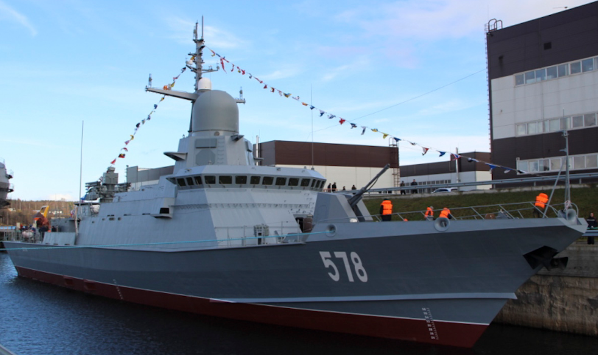
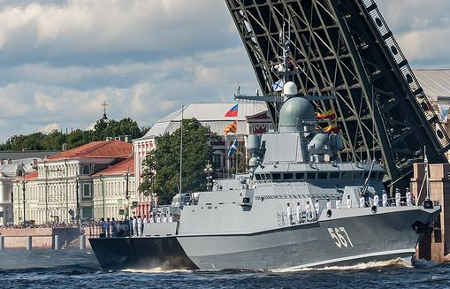
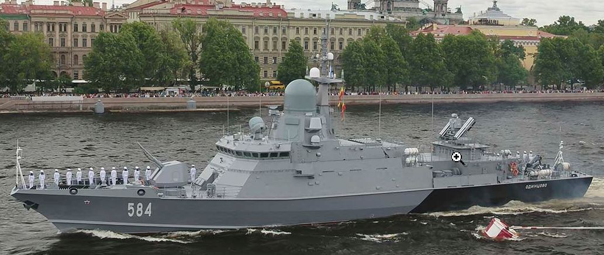
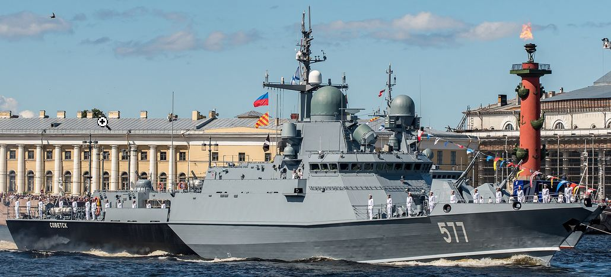

#### Alukset
| Latinisoitu nimi | Kyrillinen nimi | Käyttöönotto | Tila | Huom |
|---|---|---:|---|---|
| Mytishchi | Мытищи | 2018 | Aktiivikäytössä | Luokan ensimmäinen käyttöön otettu alus; entinen Uragan. |
| Sovetsk | Советск | 2019 | Aktiivikäytössä | Entinen Taifun. |
| Odintsovo | Одинцово | 2020 | Aktiivikäytössä | Baltian laivasto. |
| Tsiklon | Циклон | 2023 | Aktiivikäytössä | Mustanmeren laivasto. |
| Askold | Аскольд | – | Ei aktiivikäytössä / vaurioitunut | Kärsi vakavia vaurioita ennen käyttöönottoa 2023. |
| Amur | Амур | – | Rakenteilla | Rakenteilla. |
| Burya | Буря | 2025 | Aktiivikäytössä | Käyttöönotettu 2025. |
| Rzhev | Ржев | – | Rakenteilla | Rakenteilla. |
| Udomlya | Удомля | – | Rakenteilla | Rakenteilla. |

#### Kalustokuvaus
Pieni ohjuskorvetti rannikkosodankäyntiin, mutta sillä on huomattava meri- ja maamaalivaikutus kokoluokkaansa nähden. Alus mahdollistaa hajautetun alueellisen meritorjunnan ja vaikeuttaa vastustajan maalinosoitusta.

#### Suorituskyky
- UKSK-ohjusjärjestelmä (УКСК) Kalibr- ja Oniks-ohjuksille tekee luokasta pienen mutta vaarallisen ohjusalustan. Pääarvo on kyky tuottaa pitkän kantaman iskuvaikutus rannikkovesiltä tai suojatuista merialueista.
- Pantsir-M-lähitorjuntajärjestelmä (Панцирь-М) parantaa luokan omasuojaa merkittävästi verrattuna Buyan-M-luokkaan. Järjestelmän ohjusulottuvuus on avoimissa lähteissä noin 20 km luokkaa, ja tykit täydentävät torjuntaa aivan lähietäisyydellä.
- 76 mm merikanuuna (АК-176МА) antaa lisävaikutuksen pinta- ja ilmamaaleihin. Luokan vahvuus on halpa hajautettu ohjusmassa, mutta heikkoutena ovat rajoitettu merikelpoisuus ja pienempi sensori- sekä ilmapuolustuskupla.

#### Huomioita analyysiin
Kompakti ohjusalus, jonka vahvuus on korkea iskukyky suhteessa kokoon ja kyky toimia hajautetusti rannikkovyöhykkeellä. Luokka on suunniteltu lisäämään ohjuslaukaisualustojen määrää nopeasti ja suhteellisen kustannustehokkaasti.

#### Operatiiviset rajoitteet
Pieni runko rajoittaa kestävyyttä, miehistötilaa ja avomerikelpoisuutta. Osa todellisesta taisteluarvosta riippuu siitä, kuinka nopeasti yksiköt ovat saaneet täyden ilmapuolustus- ja sensorivarustuksen.

#### Lähteet
- [Karakurt-class corvette – Wikipedia](https://en.wikipedia.org/wiki/Karakurt-class_corvette)
- [List of active Russian Navy ships – Wikipedia](https://en.wikipedia.org/wiki/List_of_active_Russian_Navy_ships)
- [ODIN – Karakurt Class (Project 22800 Class) Russian Corvette](https://odin.tradoc.army.mil/WEG/Asset/Karakurt-Class_) ([ODIN-verkkosivu](https://odin.tradoc.army.mil))
- [Wikipedia – Karakurt-class corvette](https://en.wikipedia.org/wiki/Karakurt-class_corvette)
- [Naval Technology – Karakurt Class](https://www.naval-technology.com/projects/project-22800-karakurt-class-corvette-russia/)

### Kirov-luokka
#### Kalustokuva
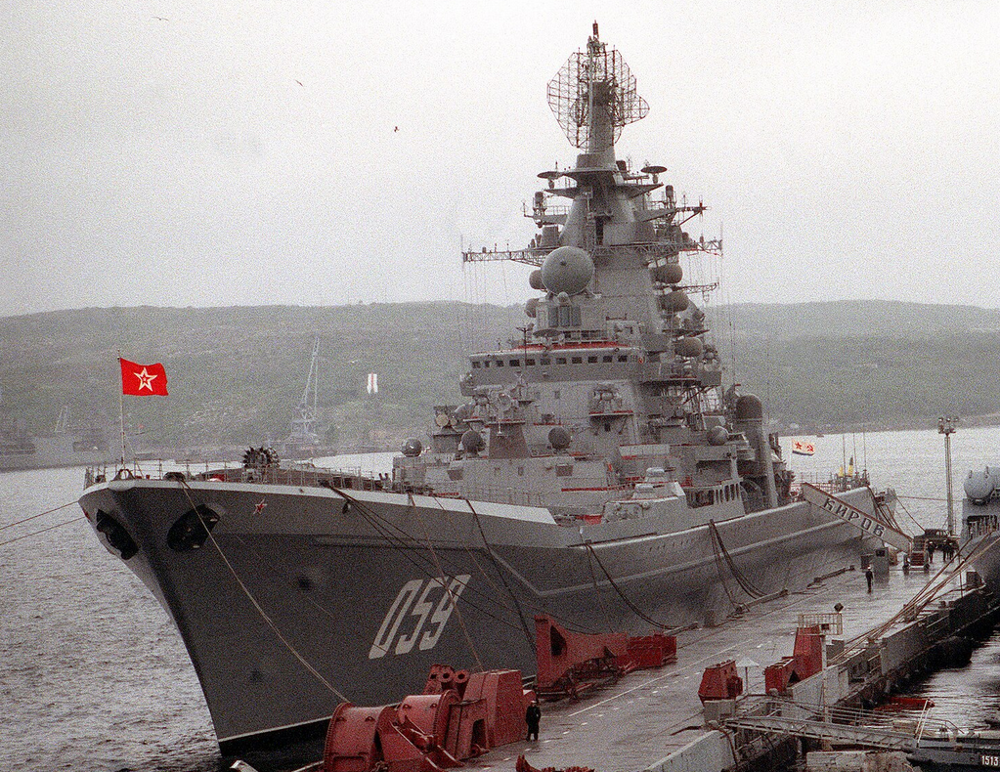

#### Alukset
| Latinisoitu nimi | Kyrillinen nimi | Käyttöönotto | Tila | Huom |
|---|---|---:|---|---|
| Pyotr Velikiy | Пётр Великий | 1998 | Ei aktiivikäytössä / epäselvä | Julkisissa lähteissä inaktiivinen vuodesta 2023; jatko epäselvä. |
| Admiral Nakhimov | Адмирал Нахимов | – | Merikokeet / modernisointi | Pitkä modernisointi; merikokeet käynnissä 2025. |

#### Kalustokuvaus
Ydinkäyttöinen raskas ohjusristeilijä lippulaiva-, alueilmatorjunta- ja pitkän kantaman meritaistelutehtäviin. Alus mahdollistaa korkean profiilin voimanosoituksen ja raskaan taisteluosaston johtamisen, mutta ylläpitokustannukset ja vähäinen lukumäärä rajoittavat käytännön vaikutusta.

#### Suorituskyky
- Pitkän kantaman ilmatorjunta S-300F / Fort (С-300Ф «Форт») tekee luokasta alueilmatorjunnan raskaan alustan. Kantama on tyypillisesti noin 75–90 km vanhemmilla ohjuksilla ja pidemmälle modernisoinneista riippuen.
- Raskaat merimaaliohjukset P-700 Granit (П-700 «Гранит») muodostavat luokan pääiskukyvyn pintaosastoja vastaan. Ohjuksen kantama on noin 550–625 km ja se on suunniteltu erityisesti lentotukialusosastojen torjuntaan.
- Laaja lähiaseistus ja sukellusveneentorjunta (АК-130, Кинжал / Оса, АК-630, РБУ, torpedot) tekevät luokasta kerroksellisen taistelualustan. Käytännössä luokan operatiivinen arvo riippuu ratkaisevasti yksittäisen risteilijän modernisointi- ja käyttöasteesta.

#### Huomioita analyysiin
Raskas ydinkäyttöinen taisteluristeilijä on korkean profiilin lippulaivatason alus, jolla on laaja ilma- ja iskukyky. Luokan merkitys on enemmän strateginen näkyvyys, komentorooli ja pitkän kantaman tulivoima kuin lukumääräinen massa.

#### Operatiiviset rajoitteet
Erittäin pieni määrä, korkeat ylläpitokustannukset ja modernisointitarpeet rajoittavat jatkuvaa käyttöä. Jokainen käytössä oleva yksikkö on korkean arvon kohde ja samalla korkean näkyvyyden symboli.

#### Lähteet
- [Russian Navy – Wikipedia](https://en.wikipedia.org/wiki/Russian_Navy)
- [Northern Fleet – Wikipedia](https://en.wikipedia.org/wiki/Northern_Fleet)
- [Naval Encyclopedia – Kirov class battlecruisers](https://naval-encyclopedia.com/cold-war/soviet/kirov-class-battlecruisers.php) ([Naval Encyclopedia](https://naval-encyclopedia.com))
- [Wikipedia – Kirov-class battlecruiser](https://en.wikipedia.org/wiki/Kirov-class_battlecruiser)
- [Missile Threat – P-700 Granit](https://missilethreat.csis.org/missile/ss-n-19-shipwreck-p-700-granit/)

### Krivak-luokka
#### Kalustokuva
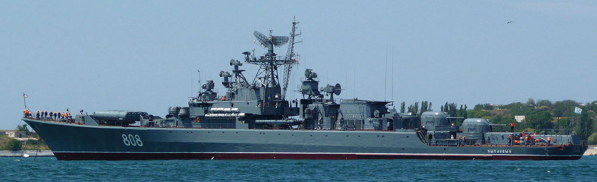

#### Alukset
| Latinisoitu nimi | Kyrillinen nimi | Käyttöönotto | Tila | Huom |
|---|---|---:|---|---|
| Ladnyy | Ладный | 1980 | Aktiivikäytössä | Projekti 1135; Mustanmeren laivasto, aktiivinen julkisten lähteiden mukaan 2023. |
| Pytlivyy | Пытливый | 1981 | Aktiivikäytössä | Projekti 1135M; Mustanmeren laivasto, aktiivinen julkisten lähteiden mukaan 2024. |

#### Kalustokuvaus
Fregattiperhe, joka liittyy erityisesti saattamiseen ja sukellusveneentorjuntaan, mutta myöhemmissä versioissa myös partiointi- ja yleistehtäviin. Alus mahdollistaa kestävän neuvostoperäisen yleiskäytön rannikkopuolustuksen ja sinivesisaattamisen välimaastossa.

#### Suorituskyky
- Metel/Rastrub-sukellusveneentorjuntaohjukset (Метель / Раструб) olivat luokan keskeinen alkuperäinen iskujärjestelmä. Kantama oli tyypillisesti kymmeniä kilometrejä ja painopiste selvästi sukellusveneentorjunnassa.
- Osa-M- tai Kinzhal-ilmatorjunta (Оса-М / Кинжал) vaihtelee alasarjan mukaan. Kantama ulottuu noin 10–15 km Osa-M:llä ja pidemmälle uudemmilla järjestelmillä.
- 76 mm/100 mm tykit, torpedot ja RBU-sarjan heittimet tekevät luokasta monipuolisen mutta vanhenevan saattajaluokan. Analyysissä on tärkeää erottaa Krivak I/II/III -sarjat toisistaan, sillä niiden aseistus poikkeaa merkittävästi.

#### Huomioita analyysiin
Vanhemman sukupolven fregatti, joka on perinteisesti painottunut sukellusveneentorjuntaan ja saattotehtäviin. Luokka on edelleen analyytikolle relevantti etenkin silloin, kun iäkkäämpää runkokalustoa käytetään täydentämään uudempia yksiköitä.

#### Operatiiviset rajoitteet
Ikä ja alaversioiden erot rajaavat suorituskyvyn arviointia. Luokka ei yleensä tarjoa samanlaista monitoimisuutta tai selviytymiskykyä kuin uudemmat fregatit ja korvetit.

#### Lähteet
- [List of active Russian Navy ships – Wikipedia](https://en.wikipedia.org/wiki/List_of_active_Russian_Navy_ships)
- [ODIN – Krivak III Class (Project 11351 Nerey Class) Russian Frigate](https://odin.tradoc.army.mil/WEG/Asset/Krivak_III-Class_) ([ODIN-verkkosivu](https://odin.tradoc.army.mil))
- [Wikipedia – Krivak-class frigate](https://en.wikipedia.org/wiki/Krivak-class_frigate)
- [ODIN – Krivak Class](https://odin.tradoc.army.mil/WEG/Asset/Krivak_Class_%28Project_1135_Class%29_Russian_Frigate)

### Nanuchka-luokka
#### Kalustokuva
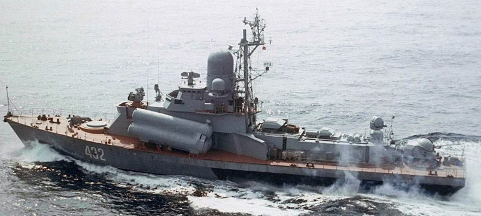
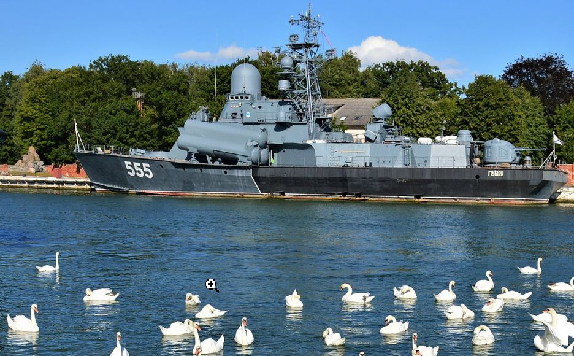
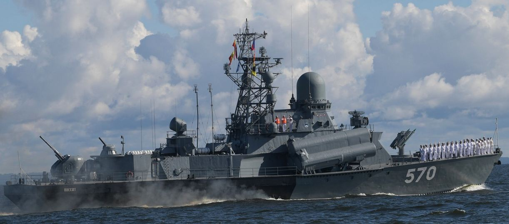
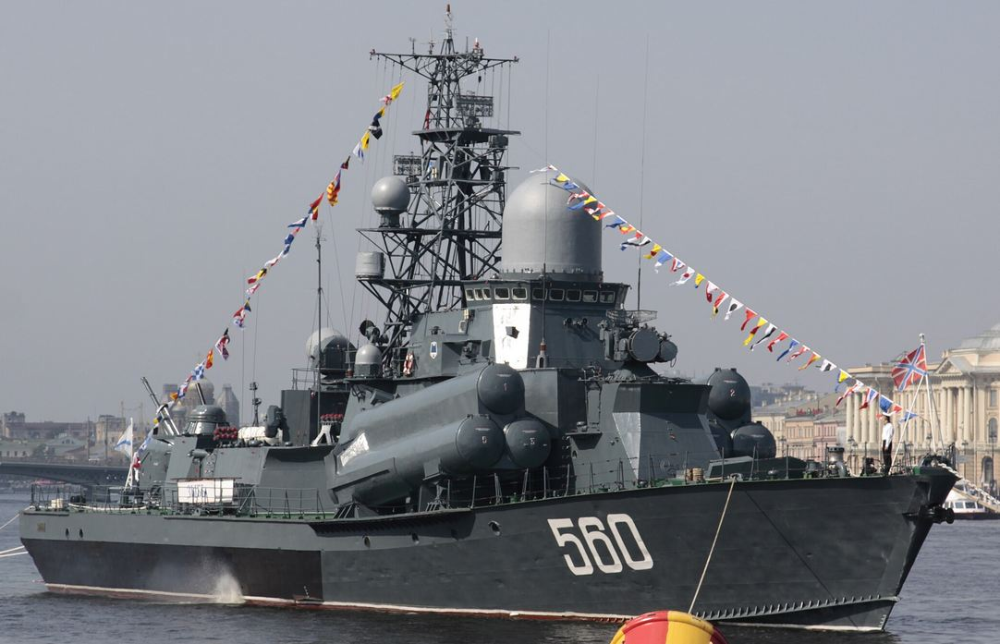

#### Alukset
| Latinisoitu nimi | Kyrillinen nimi | Käyttöönotto | Tila | Huom |
|---|---|---:|---|---|
| – | – | – | Ei vahvistettu julkisista lähteistä | Avoimista lähteistä saatava yksikkökohtainen aluslista ja palvelustila ovat ristiriitaisia tai puutteellisia. Tämä luokka kannattaa varmentaa erikseen esim. Jane’s Fighting Ships-, Combat Fleets-, ODIN- ja telakkalähteillä ennen operatiivista käyttöä. |

#### Kalustokuvaus
Pieni ohjuskorvetti rannikkovesien pinta-alustorjuntaan raskaalla ohjusaseistuksella. Alus mahdollistaa suuren iskuvaikutuksen pienestä rungosta rannikon meritorjuntatehtävissä.

#### Suorituskyky
- P-120 Malakhit- tai P-800 Oniks -merimaaliohjukset (П-120 «Малахит» / «Оникс», alasarjasta riippuen) muodostavat luokan pääaseistuksen. Malakhitin kantama on noin 110–150 km, kun taas modernisoinneissa suorituskyky voi olla selvästi suurempi.
- Osa-M-ilmatorjunta (Оса-М) antaa alukselle keskitetyn lähialueen ilmapuolustuksen. Kantama on noin 10–15 km.
- 76 mm merikanuuna ja AK-630-lähitorjunta täydentävät rannikon läheisen ohjusveneen taistelukykyä. Luokka on edelleen vaarallinen saturaatiohyökkäyksissä, mutta sensori- ja selviytymiskyky ovat vanhentuneita.

#### Huomioita analyysiin
Pieni ohjuskorvetti, jonka pääarvo on meritorjuntaohjusisku rannikko- ja lähialueen taistelussa. Luokka voi edelleen muodostaa paikallisen uhan, jos sitä käytetään suojatusta asemasta ja oikea-aikaisesti.

#### Operatiiviset rajoitteet
Vanha suunnittelu, rajallinen ilmapuolustus ja pieni runko heikentävät selviytymistä. Todellinen uhka perustuu enemmän ohjussalvoon kuin sensorien tai omasuojan laatuun.

#### Lähteet
- [List of active Russian Navy ships – Wikipedia](https://en.wikipedia.org/wiki/List_of_active_Russian_Navy_ships)
- [Russian Navy – Wikipedia](https://en.wikipedia.org/wiki/Russian_Navy)
- [Naval Encyclopedia – Nanuchka class corvettes](https://naval-encyclopedia.com/cold-war/soviet/nanuchka-class-corvettes.php) ([Naval Encyclopedia](https://naval-encyclopedia.com))
- [Wikipedia – Nanuchka-class corvette](https://en.wikipedia.org/wiki/Nanuchka-class_corvette)
- [ODIN – Nanuchka Class](https://odin.tradoc.army.mil/WEG/Asset/Nanuchka_Class_%28Project_1234_Class%29_Russian_Corvette)

### Neustrashimy-luokka
#### Kalustokuva
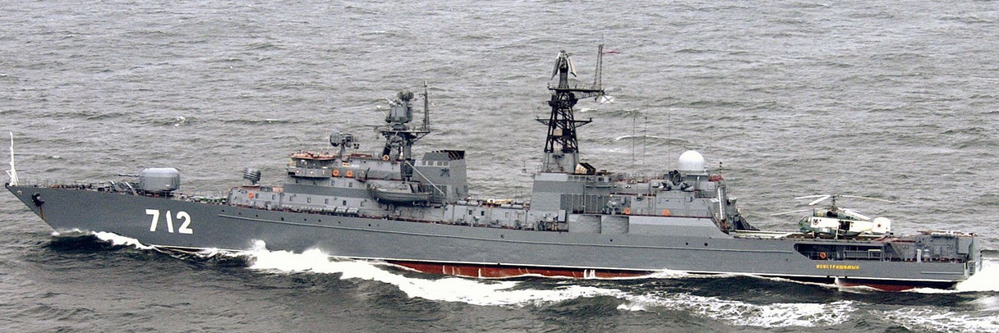
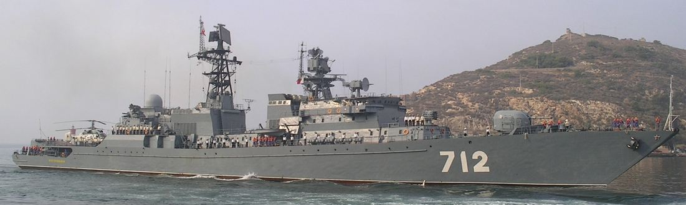
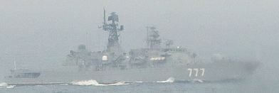

#### Alukset
| Latinisoitu nimi | Kyrillinen nimi | Käyttöönotto | Tila | Huom |
|---|---|---:|---|---|
| Neustrashimy | Неустрашимый | 1993 | Aktiivikäytössä | Palasi palvelukseen laajan peruskorjauksen jälkeen 2023. |
| Yaroslav Mudry | Ярослав Мудрый | 2009 | Aktiivikäytössä | Baltian laivasto. |
| Tuman | Туман | – | Peruttu | Rakentaminen peruttiin Neuvostoliiton hajoamisen jälkeen. |

#### Kalustokuvaus
Monitoimifregatti, joka kehitettiin korvaamaan vanhempia sukellusveneentorjunta-aluksia paremmalla toimintasäteellä ja monipuolisemmalla suorituskyvyllä. Alus mahdollistaa saattamisen, partioinnin ja sukellusveneentorjunnan, mutta ei edusta uusinta venäläistä pintataistelukykyä.

#### Suorituskyky
- Kh-35 Uran -merimaaliohjukset (Х-35 «Уран») muodostavat luokan pääiskukyvyn pintamaaleja vastaan. Kantama on versiosta riippuen noin 130–260 km.
- Kinzhal-ilmatorjuntajärjestelmä (Кинжал) antaa alukselle vahvan piste- ja alueellisen lähisuojan. Järjestelmän kantama on yleisesti noin 12 km luokkaa.
- 100 mm merikanuuna, Kashtan-lähitorjunta, torpedot ja RBU-6000 tekevät luokasta tasapainoisen monitoimifregatin. Vaikka luokka on määrältään pieni, se on edelleen käyttökelpoinen saattaja- ja partiointiroolissa.

#### Huomioita analyysiin
Monitoimifregatti, jonka vahvuus on tasapainoinen saattue-, partio- ja sukellusveneentorjuntakyky. Luokka tarjoaa käyttökelpoisen mutta määrällisesti rajallisen rungon etenkin siellä, missä tarvitaan pidempää läsnäoloa kuin korvetilta.

#### Operatiiviset rajoitteet
Pieni yksikkömäärä ja pitkät huoltojaksot rajoittavat saatavuutta. Taisteluarvo on huomattava, mutta ei ratkaiseva ilman muuta laivue- ja ilmapuolustustukea.

#### Lähteet
- [Neustrashimy-class frigate – Wikipedia](https://en.wikipedia.org/wiki/Neustrashimy-class_frigate)
- [Wikipedia – Russian frigate Neustrashimy](https://en.wikipedia.org/wiki/Russian_frigate_Neustrashimy)
- [ODIN – Neustrashimy Class (Project 11540 Class) Russian Frigate](https://odin.tradoc.army.mil/WEG/Asset/Neustrashimy-Class_) ([ODIN-verkkosivu](https://odin.tradoc.army.mil))
- [Wikipedia – Neustrashimy-class frigate](https://en.wikipedia.org/wiki/Neustrashimy-class_frigate)
- [ODIN – Neustrashimy Class](https://odin.tradoc.army.mil/WEG/Asset/Neustrashimy_Class_%28Project_11540_Class%29_Russian_Frigate)

### Parchim-luokka
#### Kalustokuva
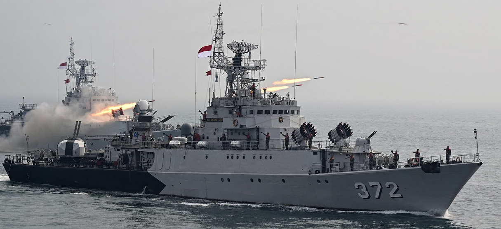
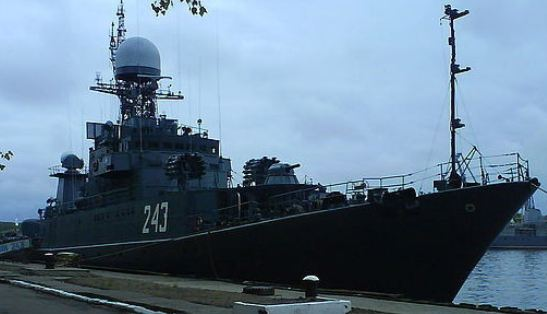
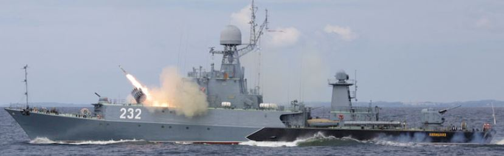
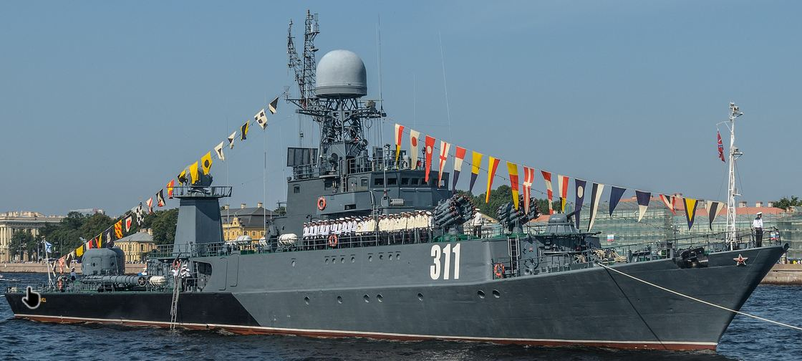
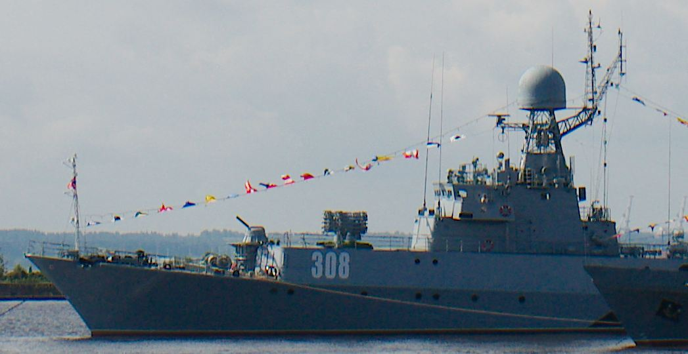
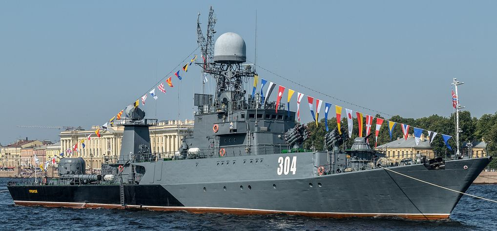

#### Alukset
| Latinisoitu nimi | Kyrillinen nimi | Käyttöönotto | Tila | Huom |
|---|---|---:|---|---|
| – | – | – | Ei vahvistettu julkisista lähteistä | Avoimista lähteistä saatava yksikkökohtainen aluslista ja palvelustila ovat ristiriitaisia tai puutteellisia. Tämä luokka kannattaa varmentaa erikseen esim. Jane’s Fighting Ships-, Combat Fleets-, ODIN- ja telakkalähteillä ennen operatiivista käyttöä. |

#### Kalustokuvaus
Sukellusveneentorjuntakorvetti rannikkovesien suojaamiseen sukellusveneitä ja kevyitä pinta-aluksia vastaan. Alus mahdollistaa paikallisen ASW- ja partiointikyvyn, ei pitkän kantaman iskuoperaatioita.

#### Suorituskyky
- Sukellusveneentorjuntaraketit ja -kranaatinheittimet (РБУ-6000 / RPK-järjestelmät alasarjasta riippuen) muodostavat luokan päätehtäväaseistuksen. Niiden kantama on tyypillisesti muutamista kilometreistä kymmeniin kilometreihin järjestelmästä riippuen.
- Osa-M-ilmatorjunta (Оса-М) antaa rajallisen lähialueen ilmapuolustuksen. Kantama on noin 10–15 km.
- 76 mm tai 57 mm tykit, torpedot ja syvyyspommit tekevät luokasta rannikkovyöhykkeen ASW-korvetin. Luokan analyysissa on huomioitava, että se on suunniteltu ennen kaikkea sukellusveneentorjuntaan lähellä rannikkoa eikä avomeritaisteluun.

#### Huomioita analyysiin
Kevyt korvetti on suunniteltu erityisesti rannikkoalueen sukellusveneentorjuntaan ja partiointiin. Luokan merkitys on paikallisen merialueen vartioinnissa ja tukitehtävissä, ei kauaskantoisessa iskukäytössä.

#### Operatiiviset rajoitteet
Ikääntyminen ja rajallinen aseistus tekevät aluksista todennäköisesti toissijaisia korkean intensiteetin taistelussa. Niiden hyöty on suurin matalan ja keskitason uhan alueellisissa tehtävissä.

#### Lähteet
- [List of active Russian Navy ships – Wikipedia](https://en.wikipedia.org/wiki/List_of_active_Russian_Navy_ships)
- [Russian Navy – Wikipedia](https://en.wikipedia.org/wiki/Russian_Navy)
- [SeaForces – Russian Navy Parchim class (Project 1331M) Corvette](http://www.seaforces.org/marint/Russian-Navy/Corvette/Parchim-class.htm) ([SeaForces](http://www.seaforces.org))
- [Naval Encyclopedia – Soviet corvettes overview](https://naval-encyclopedia.com/cold-war/soviet/soviet-corvettes.php) ([Naval Encyclopedia](https://naval-encyclopedia.com))
- [Wikipedia – Parchim-class corvette](https://en.wikipedia.org/wiki/Parchim-class_corvette)
- [ODIN – Parchim Class](https://odin.tradoc.army.mil/WEG/Asset/Parchim_Class_%28Project_133.1_Class%29_Russian_Corvette)

### Slava-luokka
#### Kalustokuva
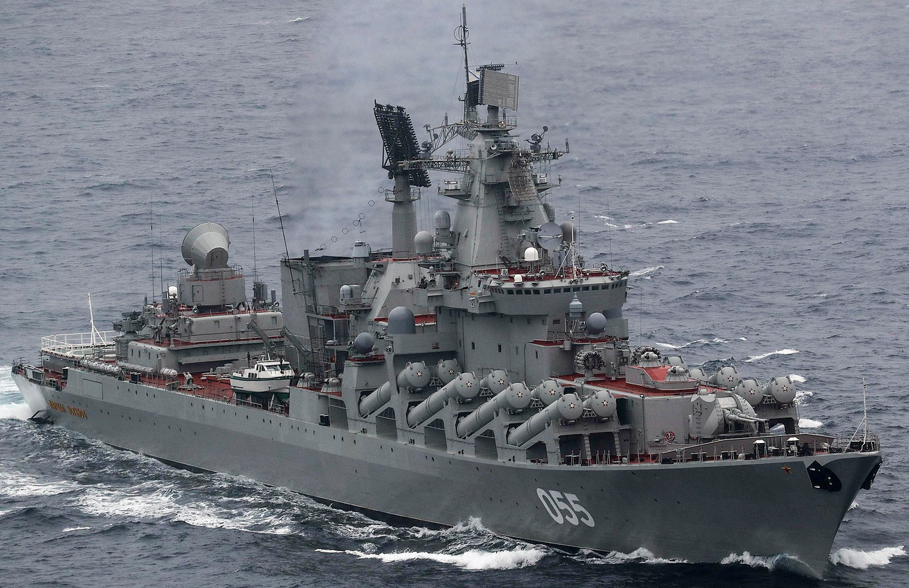

#### Alukset
| Latinisoitu nimi | Kyrillinen nimi | Käyttöönotto | Tila | Huom |
|---|---|---:|---|---|
| Marshal Ustinov | Маршал Устинов | 1986 | Aktiivikäytössä | Pohjoinen laivasto; julkisesti aktiivinen 2026. |
| Varyag | Варяг | 1989 | Aktiivikäytössä | Tyynenmeren laivasto. |
| Moskva | Москва | 1983 | Ei aktiivikäytössä | Upposi 2022; mainittu analyytikon vertailun vuoksi. |

#### Kalustokuvaus
Ohjusristeilijä, jonka painopiste on pitkän kantaman merimaalitorjunnassa ja laivasto-osaston ilmatorjunnassa. Alus mahdollistaa lippulaivatoiminnan ja korkean arvon iskuvaikutuksen, mutta tappiot ja ikä ovat heikentäneet luokan kokonaismerkitystä.

#### Suorituskyky
- P-500 Bazalt- tai P-1000 Vulkan -merimaaliohjukset (П-500 «Базальт» / П-1000 «Вулкан») muodostavat luokan raskaan iskuvoiman. Kantama on versiosta riippuen tyypillisesti noin 550–700 km.
- S-300F Fort -ilmatorjunta (С-300Ф «Форт») antaa luokalle alueilmatorjunnan. Kantama on ohjusversiosta riippuen noin 75–90 km luokkaa.
- 130 mm merikanuuna, Osa-MA, AK-630, torpedot ja RBU-6000 rakentavat kerroksellisen puolustuksen. Luokan vahvuus on edelleen raskas pitkän kantaman pinta- ja ilmasodankäynti, mutta yksiköiden kunto ja huoltovarmuus ovat kriittisiä muuttujia.

#### Huomioita analyysiin
Ohjusristeilijä, jonka päätehtävä on alueilmatorjunta ja raskas meritorjunta suurissa laivasto-osastoissa. Luokka on edelleen merkittävä, koska se yhdistää komentoroolin ja suuren ohjuskuorman yhdelle alustalle.

#### Operatiiviset rajoitteet
Suuri koko, korkea havaittavuus ja rajallinen yksikkömäärä tekevät aluksista myös näkyviä ja haavoittuvia. Kunto, modernisoinnit ja saatavuus ovat ratkaisevia arvioitaessa todellista vaikutusta.

#### Lähteet
- [Northern Fleet – Wikipedia](https://en.wikipedia.org/wiki/Northern_Fleet)
- [Russian Navy – Wikipedia](https://en.wikipedia.org/wiki/Russian_Navy)
- [ODIN – Slava Class (Project 1164 Atlant Class) Russian Guided Missile Cruiser](https://odin.tradoc.army.mil/WEG/Asset/Slava-Class_) ([ODIN-verkkosivu](https://odin.tradoc.army.mil))
- [Wikipedia – Slava-class cruiser](https://en.wikipedia.org/wiki/Slava-class_cruiser)
- [Missile Threat – P-1000 Vulkan](https://missilethreat.csis.org/missile/ss-n-12-sandbox-p-500-bazalt-p-1000-vulkan/)

### Sovremenny-luokka
#### Kalustokuva
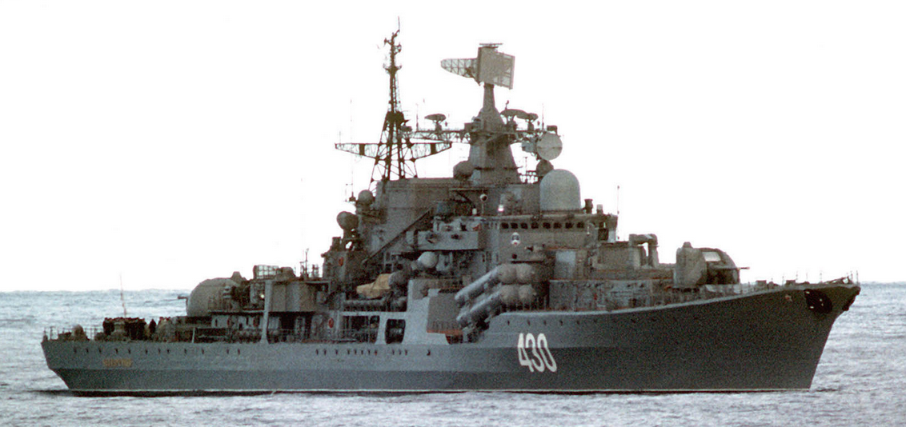
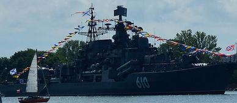
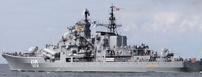

#### Alukset
| Latinisoitu nimi | Kyrillinen nimi | Käyttöönotto | Tila | Huom |
|---|---|---:|---|---|
| Bystryy | Быстрый | 1989 | Aktiivikäytössä | Tyynenmeren laivasto; luokan käyttöaste matala ja tekninen kunto usein rajoittava tekijä. |
| Admiral Ushakov | Адмирал Ушаков | 1993 | Aktiivikäytössä / epäselvä | Pohjoinen laivasto; aktiivisuustaso vaihtelee julkisissa lähteissä. |
| Nastoychivyy | Настойчивый | 1993 | Aktiivikäytössä / epäselvä | Baltian laivasto; usein lippulaivatehtävissä mutta operatiivinen käyttöaste rajallinen. |

#### Kalustokuvaus
Ohjushävittäjä, joka suunniteltiin alun perin merimaalitorjuntaan, ilmatorjuntaan ja meritykistötukeen. Alus mahdollistaa edelleen merkittävän tulivoiman pintaoperaatioissa, vaikka ylläpitokuorma rasittaa käytettävyyttä.

#### Suorituskyky
- Moskit-merimaaliohjukset (П-270 «Москит») muodostavat luokan pääiskukyvyn pinta-aluksia vastaan. Kantama on perusversioissa noin 120 km ja joissakin versioissa pidempi.
- Uragan/Shtil-ilmatorjunta (Ураган / Штиль) antaa keskikantaman ilmapuolustuksen. Kantama on yleisesti noin 25–50 km käytetystä ohjuksesta riippuen.
- 130 mm kaksoistykki (АК-130), torpedot ja RBU-1000/12000 tekevät luokasta raskaan monitoimisen hävittäjän. Luokan suurin vahvuus on voimakas pinta- ja tulitukiaseistus, mutta käyttöä rajoittavat vanheneminen ja koneistojärjestelmien ylläpitohaasteet.

#### Huomioita analyysiin
Hävittäjäluokka, jonka vahvuus on raskas pintatorjuntakyky ja merellisen tulituen tarjoaminen. Luokka voi edelleen olla vaarallinen pinta-aluksia vastaan, jos aseistus ja miehistö ovat hyvässä kunnossa.

#### Operatiiviset rajoitteet
Ikä, koneistoon liittyneet tunnetut haasteet ja huollon vaativuus heikentävät käyttövarmuutta. Aluksen selviytymiskyky ei vastaa nykyaikaisten monitoimihävittäjien tasoa.

#### Lähteet
- [Russian Navy – Wikipedia](https://en.wikipedia.org/wiki/Russian_Navy)
- [ODIN – Sovremenny Class (Project 956 Sarych) Russian Guided Missile Destroyer](https://odin.tradoc.army.mil/WEG/Asset/Sovremenny-Class_) ([ODIN-verkkosivu](https://odin.tradoc.army.mil))
- [Wikipedia – Sovremenny-class destroyer](https://en.wikipedia.org/wiki/Sovremenny-class_destroyer)
- [ODIN – Sovremenny Class](https://odin.tradoc.army.mil/WEG/Asset/Sovremenny_Class_%28Project_956_Class%29_Russian_Destroyer)

### Steregushchiy-luokka
#### Kalustokuva
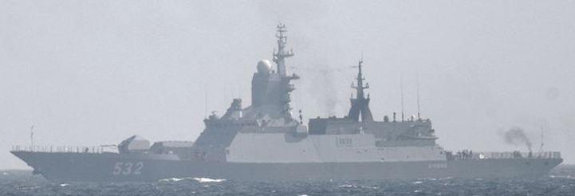
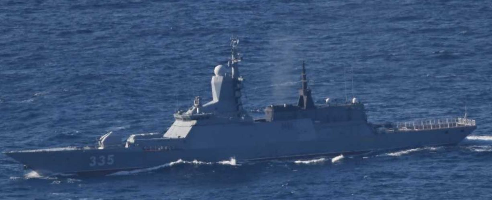
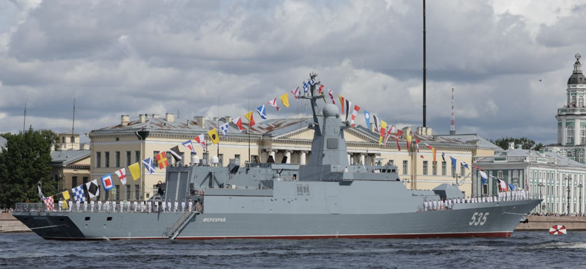
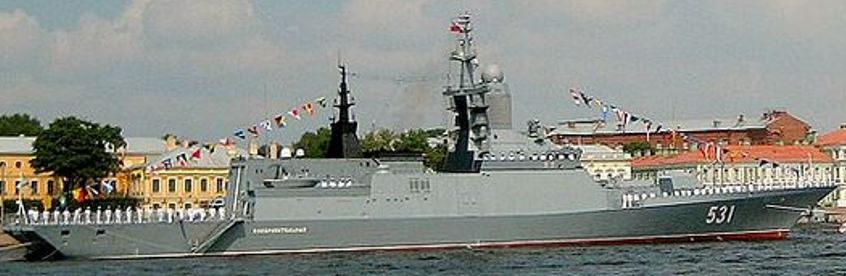
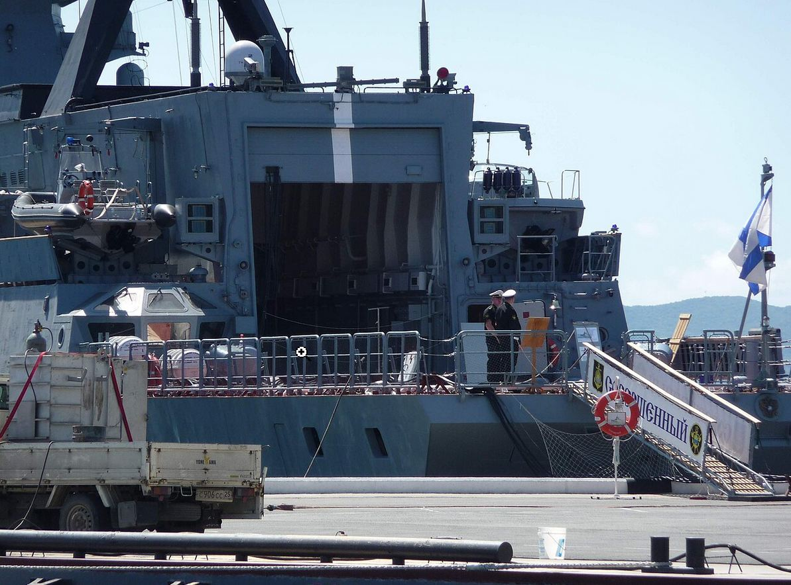
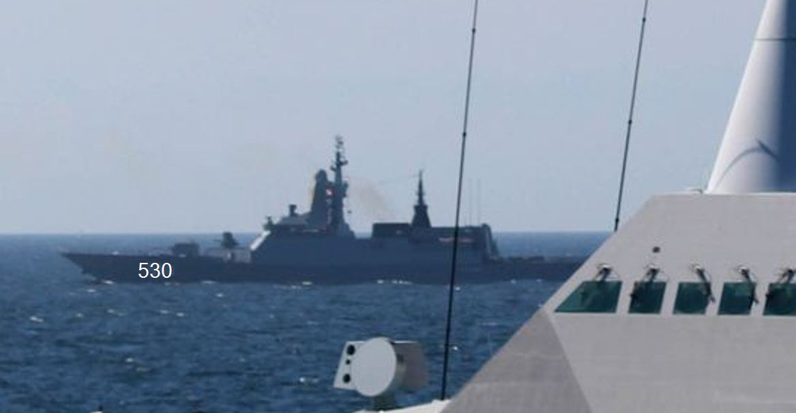
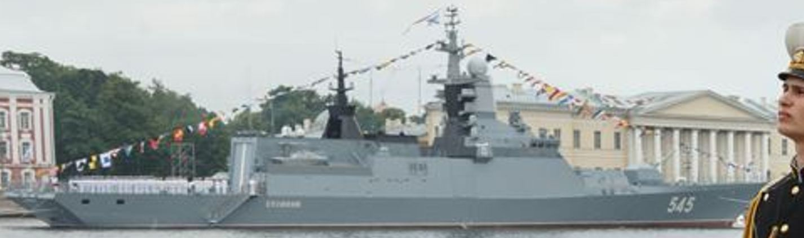

#### Alukset
| Latinisoitu nimi | Kyrillinen nimi | Käyttöönotto | Tila | Huom |
|---|---|---:|---|---|
| Steregushchiy | Стерегущий | 2008 | Aktiivikäytössä | Baltian laivasto; luokan johtoalus. |
| Soobrazitelny | Сообразительный | 2011 | Aktiivikäytössä | Baltian laivasto. |
| Boikiy | Бойкий | 2013 | Aktiivikäytössä | Baltian laivasto. |
| Stoikiy | Стойкий | 2014 | Aktiivikäytössä | Baltian laivasto. |
| Sovershennyy | Совершенный | 2017 | Aktiivikäytössä | Tyynenmeren laivasto. |
| Gromkiy | Громкий | 2018 | Aktiivikäytössä | Tyynenmeren laivasto. |
| Aldar Tsydenzhapov | Алдар Цыденжапов | 2020 | Aktiivikäytössä | Tyynenmeren laivasto. |
| Rezkiy | Резкий | 2023 | Aktiivikäytössä | Tyynenmeren laivasto; joskus luokiteltu 20380-sarjaan. |
| Retiviy | Ретивый | 2023 | Aktiivikäytössä | Mustanmeren laivasto / siirtotila julkisissa lähteissä. |

#### Kalustokuvaus
Moderni korvetti lähimeri- ja rannikkosodankäyntiin, ja se kykenee sukellusveneentorjuntaan, pinta-alustaisteluun sekä paikalliseen ilmatorjuntaan. Alus mahdollistaa Venäjän rannikkopainotteisen pintalaivaston keskeisen monitoimikyvyn.

#### Suorituskyky
- Kh-35 Uran -ohjukset (Х-35 «Уран») ovat luokan pääaseistus useimmissa alkuperäisissä yksiköissä. Kantama on versiosta riippuen noin 130–260 km.
- Redut-ilmatorjunta (Редут) tai Kashtan/Palash-lähitorjunta vaihtelee alasarjan ja modernisointitason mukaan. Tämä on analyytikon kannalta tärkeä ero, koska ilmapuolustuskyky ei ole täysin yhtenäinen koko luokassa.
- 100 mm merikanuuna, Paket-NK ja sukellusveneentorjuntajärjestelmät tekevät luokasta monipuolisen lähimerien taistelualuksen. Luokka soveltuu saattamiseen, pintataisteluun ja rajalliseen ASW-toimintaan.

#### Huomioita analyysiin
Korvettiluokka tarjoaa tasapainoisen yhdistelmän partiointia, meritorjuntaa, sukellusveneentorjuntaa ja rajattua ilmapuolustusta. Luokka on tärkeä erityisesti rannikkoalueen pysyvän läsnäolon ja nopeasti käyttöön saatavan taisteluvoiman näkökulmasta.

#### Operatiiviset rajoitteet
Koon tuomat rajoitteet näkyvät kestävyydessä, ilmapuolustuksen syvyydessä ja merikelpoisuudessa verrattuna fregattiin. Alasarjojen erot on huomioitava, koska aseistus ja sensorit ovat kehittyneet tuotannon aikana.

#### Lähteet
- [Steregushchiy-class corvette – Wikipedia](https://en.wikipedia.org/wiki/Steregushchiy-class_corvette)
- [ODIN – Steregushchiy Class (Project 20380 Class) Russian Corvette](https://odin.tradoc.army.mil/WEG/Asset/Steregushchiy-Class_) ([ODIN-verkkosivu](https://odin.tradoc.army.mil))
- [Wikipedia – Steregushchiy-class corvette](https://en.wikipedia.org/wiki/Steregushchiy-class_corvette)
- [Naval Technology – Steregushchiy Class](https://www.naval-technology.com/projects/steregushchiy-class-corvette-russia/)

### Tarantul-luokka
#### Kalustokuva
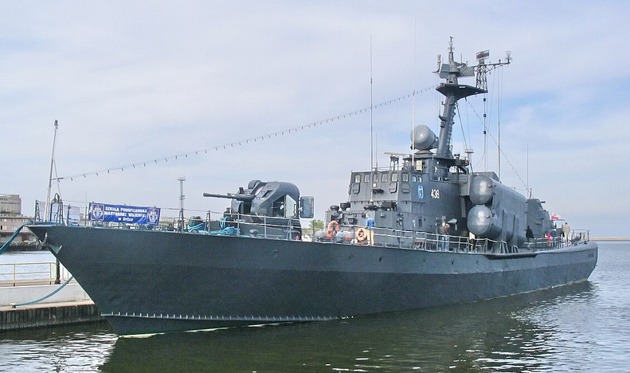
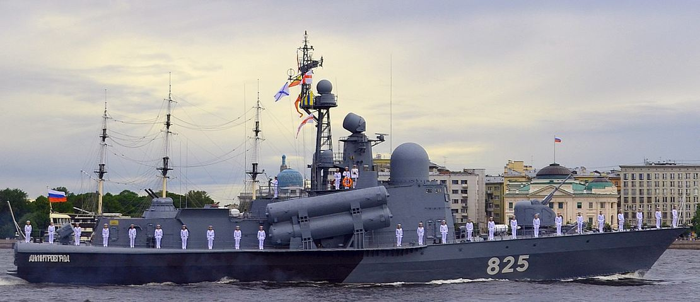
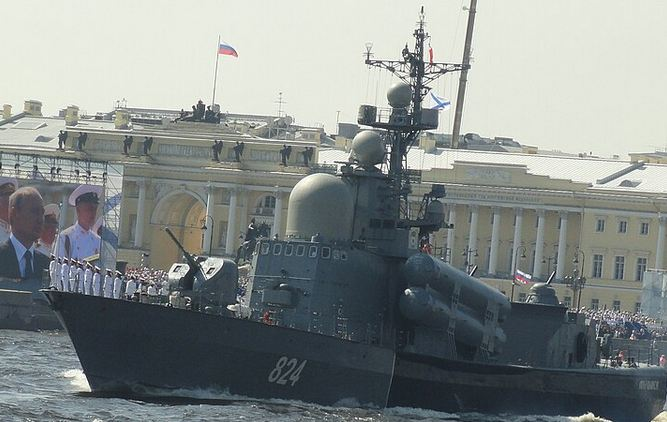
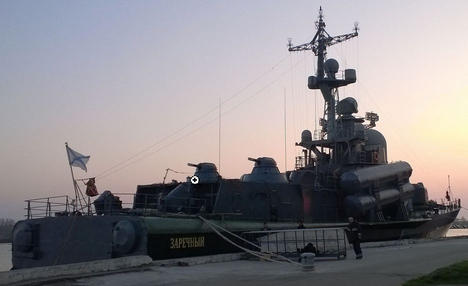

#### Alukset
| Latinisoitu nimi | Kyrillinen nimi | Käyttöönotto | Tila | Huom |
|---|---|---:|---|---|
| – | – | – | Ei vahvistettu julkisista lähteistä | Avoimista lähteistä saatava yksikkökohtainen aluslista ja palvelustila ovat ristiriitaisia tai puutteellisia. Tämä luokka kannattaa varmentaa erikseen esim. Jane’s Fighting Ships-, Combat Fleets-, ODIN- ja telakkalähteillä ennen operatiivista käyttöä. |

#### Kalustokuvaus
Nopea ohjuskorvetti rannikkovesien merimaalitorjuntaan ja nopeaan reagointiin suljetuilla merialueilla. Alus mahdollistaa nopeat ohjusiskut, mutta suoja ja kestävyys ovat toissijaisia tulivoimaan nähden.

#### Suorituskyky
- Moskit- tai P-15/P-270-tyyppiset merimaaliohjukset (П-270 «Москит» jne.) muodostavat luokan pääiskukyvyn alaversiosta riippuen. Kantama vaihtelee merkittävästi versiosta toiseen, mikä edellyttää tarkkaa alasarjakohtaista tunnistusta.
- Osa-M-ilmatorjunta (Оса-М) antaa ohjusveneelle rajallisen ilmasuojan. Kantama on noin 10–15 km.
- 76 mm tai 57 mm tykki ja AK-630-lähitorjunta täydentävät rannikkoalueen nopean iskun konseptia. Luokan merkitys liittyy hajautettuun rannikko-ohjussodankäyntiin, mutta sensorit ja selviytymiskyky ovat nykymittapuulla rajalliset.

#### Huomioita analyysiin
Nopea ohjusvene, jonka merkitys on nopeassa meritorjuntaiskussa rannikkoalueen suojasta. Luokka voi edelleen muodostaa paikallisen uhan, jos se pääsee hyödyntämään maantieteellistä peitteisyyttä ja lyhyttä reagointiaikaa.

#### Operatiiviset rajoitteet
Pieni koko, vanhenevat sensorit ja rajallinen omasuoja heikentävät selviytymistä avoimessa taistelussa. Vaikutus perustuu enemmän ensisalvoon kuin kestävään taistelunkäyntiin.

#### Lähteet
- [List of active Russian Navy ships – Wikipedia](https://en.wikipedia.org/wiki/List_of_active_Russian_Navy_ships)
- [Russian Navy – Wikipedia](https://en.wikipedia.org/wiki/Russian_Navy)
- [Naval Encyclopedia – Soviet missile corvettes overview](https://naval-encyclopedia.com/cold-war/soviet/soviet-missile-corvettes.php) ([Naval Encyclopedia](https://naval-encyclopedia.com))
- [Wikipedia – Tarantul-class corvette](https://en.wikipedia.org/wiki/Tarantul-class_corvette)
- [ODIN – Tarantul Class](https://odin.tradoc.army.mil/WEG/Asset/Tarantul_Class_%28Project_1241_Class%29_Russian_Corvette)

### Udaloy-luokka
#### Kalustokuva
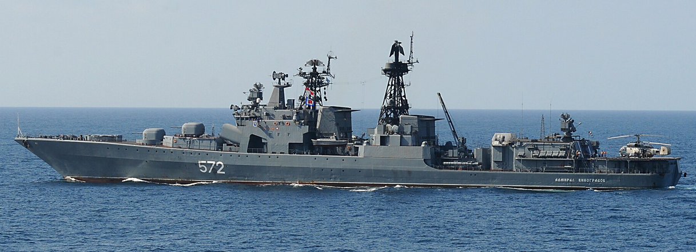

#### Alukset
| Latinisoitu nimi | Kyrillinen nimi | Käyttöönotto | Tila | Huom |
|---|---|---:|---|---|
| Vice Admiral Kulakov | Вице-адмирал Кулаков | 1982 | Aktiivikäytössä | Pohjoinen laivasto. |
| Severomorsk | Североморск | 1987 | Aktiivikäytössä | Pohjoinen laivasto. |
| Admiral Levchenko | Адмирал Левченко | 1988 | Aktiivikäytössä | Pohjoinen laivasto. |
| Admiral Chabanenko | Адмирал Чабаненко | 1999 | Ei aktiivikäytössä / epäselvä | Projekti 1155.1; pitkä korjausjakso, mahdollinen paluu epäselvä. |
| Admiral Tributs | Адмирал Трибуц | 1985 | Aktiivikäytössä | Tyynenmeren laivasto. |
| Marshal Shaposhnikov | Маршал Шапошников | 1986 | Aktiivikäytössä | Tyynenmeren laivasto; laaja modernisointi iskuaseisiin. |
| Admiral Panteleyev | Адмирал Пантелеев | 1992 | Aktiivikäytössä | Tyynenmeren laivasto. |

#### Kalustokuvaus
Suuri hävittäjä, joka optimoitiin sukellusveneentorjuntaan ja korkean arvon yksiköiden suojaamiseen. Alus mahdollistaa taisteluosaston suojauksen sukellusveneuhkaa vastaan, ja modernisoinnit ovat lisänneet myös iskukykyä.

#### Suorituskyky
- Rastrub-/Metel- tai modernisoiduissa yksiköissä Kalibr/Oniks-aseistus (Раструб / Калибр / Оникс) muodostaa luokan pääiskukyvyn. Vanhemmissa aluksissa painopiste on ASW-ohjuksissa, kun taas modernisointi laajentaa selvästi pinta- ja maamaalivaikutusta.
- Kinzhal- tai Shtil-tyyppinen ilmatorjunta sekä AK-100/130 ja AK-630 luovat kerroksellisen puolustuksen. Kantama riippuu järjestelmästä, mutta luokka kykenee suojaamaan itseään paremmin kuin pienemmät korvetit.
- Torpedot, RBU-6000 ja helikopteri (Ка-27) tekevät luokasta vahvan sukellusveneentorjunta-alustan. Luokan ydinrooli on edelleen pintaosaston ASW-suoja, vaikka modernisoidut yksiköt pystyvät laajempaan monitoimisuorituskykyyn.

#### Huomioita analyysiin
Suuri sukellusveneentorjuntahävittäjä on rakennettu suojaamaan laivasto-osastoja ja metsästämään vedenalaisia maaleja. Luokka on relevantti etenkin tilanteissa, joissa halutaan luoda suojaa strategisille sukellusveneille tai pintaosastoille.

#### Operatiiviset rajoitteet
Ilmapuolustus ja monitoimisuus ovat perusmuodossa rajallisempia kuin modernissa yleishävittäjässä. Todellinen arvo riippuu paljon mahdollisista modernisoinneista ja yksittäisen aluksen teknisestä kunnosta.

#### Lähteet
- [Northern Fleet – Wikipedia](https://en.wikipedia.org/wiki/Northern_Fleet)
- [Russian Navy – Wikipedia](https://en.wikipedia.org/wiki/Russian_Navy)
- [ODIN – Udaloy Class (Project 1155 Fregat Class) Russian Anti-Submarine Guided-Missile Destroyer](https://odin.tradoc.army.mil/WEG/Asset/Udaloy-Class_) ([ODIN-verkkosivu](https://odin.tradoc.army.mil))
- [Wikipedia – Udaloy-class destroyer](https://en.wikipedia.org/wiki/Udaloy-class_destroyer)
- [ODIN – Udaloy Class](https://odin.tradoc.army.mil/WEG/Asset/Udaloy_Class_%28Project_1155_Class%29_Russian_Destroyer)

## Tiedustelualukset

### Alpinist-luokka
#### Kalustokuva
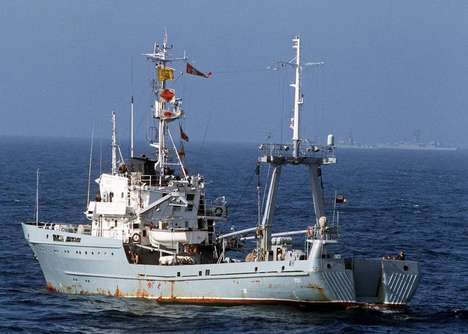

#### Alukset
| Latinisoitu nimi | Kyrillinen nimi | Käyttöönotto | Tila | Huom |
|---|---|---:|---|---|
| – | – | – | Ei vahvistettu julkisista lähteistä | Avoimista lähteistä saatava yksikkökohtainen aluslista ja palvelustila ovat ristiriitaisia tai puutteellisia. Tämä luokka kannattaa varmentaa erikseen esim. Jane’s Fighting Ships-, Combat Fleets-, ODIN- ja telakkalähteillä ennen operatiivista käyttöä. |

#### Kalustokuvaus
Keskiraskas tiedustelualus signaali- ja elektroniikkatiedusteluun, merellisen tilannekuvan muodostamiseen ja laivaston tukemiseen. Alus mahdollistaa alueellisen ISR-toiminnan, mutta ei ole strategisen tason valtameriseurannan pääkalustoa.

#### Suorituskyky
- SIGINT/ELINT-keruukyky (радиоэлектронная разведка) on luokan varsinainen suorituskyky. Julkisissa lähteissä painottuvat viesti- ja sähköisen tiedustelun tehtävät eikä merkittävä raskas aseistus.
- Kevyt omasuoja-aseistus (стрелковое вооружение / малокалиберные установки) on avoimissa lähteissä huonosti dokumentoitu. Analyytikon kannattaa olettaa, että luokka toimii ensisijaisesti tiedustelualustana suojatun toimintaympäristön turvin eikä asevaikutteisen aluksen tavoin.

#### Huomioita analyysiin
Erikois- tai tiedustelualus, jonka todennäköinen arvo liittyy mittaus-, seuranta- tai tukitehtäviin eikä perinteiseen taisteluun. Luokka voi tarjota hyödyllistä merellistä läsnäoloa alhaisella profiililla, jos tehtävä on tekninen tai tiedustelullinen.

#### Operatiiviset rajoitteet
Avoimista lähteistä saatava tieto on rajallista, mikä kasvattaa epävarmuutta luokan täsmällisestä roolista. Tämä on huomioitava, ettei alukselle yli- tai aliarvioida operatiivista merkitystä.

#### Lähteet
- [List of active Russian Navy ships – Wikipedia](https://en.wikipedia.org/wiki/List_of_active_Russian_Navy_ships)
- [Russian Navy – Wikipedia](https://en.wikipedia.org/wiki/Russian_Navy)
- [RussianShips.info – All Russian Intelligence Ships](http://russianships.info/eng/warships/support.htm) ([RussianShips.info](http://russianships.info/eng/))
- [Military Periscope – AL'PINIST class overview](https://www.militaryperiscope.com/weapons/ships/intelligence-collection/alpinist-agi-class/overview/)
- [CMANO DB – SSV Alpinist](https://cmano-db.com/ship/451/)

### Baklan-luokka
#### Kalustokuva
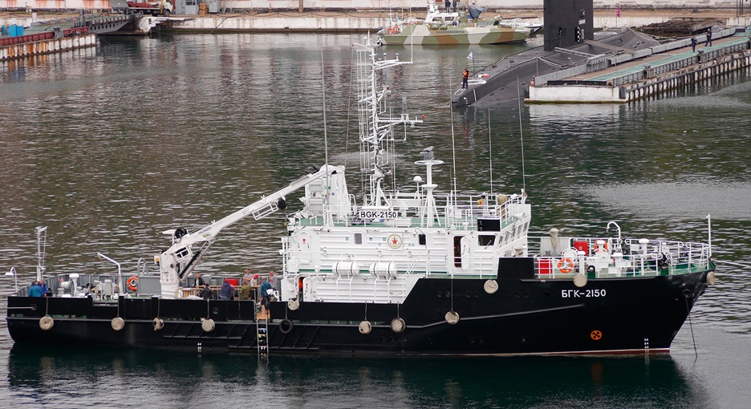

#### Alukset
| Latinisoitu nimi | Kyrillinen nimi | Käyttöönotto | Tila | Huom |
|---|---|---:|---|---|
| KSV-2168 | КСВ-2168 | 2018 | Aktiivikäytössä | Projekti 1388NZ; pieni tiedustelu-/mittausalusta Baltian laivastossa. Julkinen yksikkölista on erittäin suppea. |

#### Kalustokuvaus
Pieni tiedustelualus paikalliseen valvontaan, tiedonkeruuseen ja erikoistuneisiin laivastotukitehtäviin rannikkovesillä. Alus mahdollistaa lyhyen kantaman ISR- ja tukitoiminnan lähialueilla.

#### Suorituskyky
- Hydrografinen ja mittauskyky (гидрографические работы) on luokan pääsuorituskyky. Julkisissa lähteissä Baklan-projekti kuvataan ennen kaikkea väylä-, poiju- ja rannikkovesien mittaustehtäviin, ei varsinaiseksi taistelualukseksi.
- Merkittävästä vakioaseistuksesta ei ole julkisissa lähteissä vahvistettua näyttöä. Analyytikon on syytä käsitellä luokkaa apu- tai tukialuksena, jonka sotilaallinen arvo liittyy merenkulun tukemiseen eikä asevaikutukseen.

#### Huomioita analyysiin
Tiedustelu- tai mittausaluksena luokan vahvuus on teknisen tiedon keruu, seuranta ja mahdollinen testitoiminnan tuki. Sen merkitys korostuu ympäristöissä, joissa merellinen signaalitiedustelu tai mittaus on pysyvää ja vähän näkyvää.

#### Operatiiviset rajoitteet
Julkinen tieto yksittäisistä järjestelmistä ja tehtäväprofiileista on niukkaa. Arvioissa on siksi syytä nojata varmistettuihin havaintoihin eikä päätellä liikaa rungon perusteella.

#### Lähteet
- [List of active Russian Navy ships – Wikipedia](https://en.wikipedia.org/wiki/List_of_active_Russian_Navy_ships)
- [Wikipedia – Baklan-class intelligence ship](https://en.wikipedia.org/wiki/Baklan-class_intelligence_ship) ([Wikipedia](https://en.wikipedia.org))
- [MarineVesselTraffic – Russian support vessel tracker](https://www.marinevesseltraffic.com/vessels) ([MarineVesselTraffic](https://www.marinevesseltraffic.com))
- [RussianShips.info – Project 19920 Baklan](https://russianships.info/eng/support/project_19920.htm)
- [Naval News – New Hydrographic Vessels](https://www.navalnews.com/naval-news/2020/04/an-overview-of-the-new-hydrographic-vessels-of-the-russian-navy/)

### Balzam-luokka
#### Kalustokuva
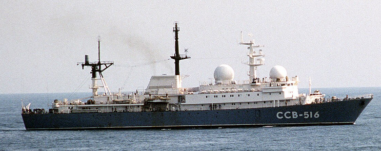

#### Alukset
| Latinisoitu nimi | Kyrillinen nimi | Käyttöönotto | Tila | Huom |
|---|---|---:|---|---|
| Pribaltika | Прибалтика | 1983 | Aktiivikäytössä | Projekti 1826; Tyynenmeren laivasto. Ainoa julkisesti vahvistettu aktiivinen luokan alus. |

#### Kalustokuvaus
Suuri tiedustelualus pitkän kantaman elektroniikka- ja viestitiedusteluun sekä merellisen toiminnan seurantaan. Alus mahdollistaa valtamerikelpoisen SIGINT-toiminnan sotilaallisen aktiviteetin monitorointiin.

#### Suorituskyky
- 30 mm AK-630-lähitorjuntajärjestelmä (АК-630) antaa luokalle poikkeuksellisen omasuojan tiedustelualukseksi. Tehokas torjuntaetäisyys on noin 4–5 km.
- Strela-2-ilmatorjunta (Стрела-2) täydentää aluksen lähi-ilmapuolustusta. Kantama on noin 3–4 km ja suorituskyky on nykymittapuulla vaatimaton.
- SIGINT/COMINT- ja EW-järjestelmät (радиоразведка; радиоэлектронная борьба) ovat luokan todellinen päätuote. Luokka oli merkittävä askel, koska se yhdisti tiedustelusensorit ja itsepuolustusaseistuksen samaan alustaan.

#### Huomioita analyysiin
Suuri tiedustelualus, joka on suunniteltu signaalitiedusteluun, merellisen liikenteen seurantaan ja operatiivisen tilannekuvan keräämiseen. Luokka soveltuu hyvin pitkäkestoiseen tiedusteluläsnäoloon alueilla, joilla halutaan seurata sotilaallista toimintaa ilman välitöntä taistelukontaktia.

#### Operatiiviset rajoitteet
Suojaus perustuu enemmän etäisyyteen ja saattotukeen kuin omaan taistelukykyyn. Alusten sijainti, antennikokoonpanot ja toimintarytmi voivat paljastaa paljon niiden ajankohtaisesta tehtävästä.

#### Lähteet
- [List of active Russian Navy ships – Wikipedia](https://en.wikipedia.org/wiki/List_of_active_Russian_Navy_ships)
- [ODIN – Balzam Class (Project 1826 Class) Russian Intelligence Collection Ship](https://odin.tradoc.army.mil/WEG/Asset/Balzam-Class_) ([ODIN-verkkosivu](https://odin.tradoc.army.mil))
- [Wikipedia – Balzam-class intelligence ship](https://en.wikipedia.org/wiki/Balzam-class_intelligence_ship)
- [RussianShips.info – Project 1826](https://russianships.info/eng/intelligence/project_1826.htm)

### Marshal Nedelin -luokka
#### Kalustokuva
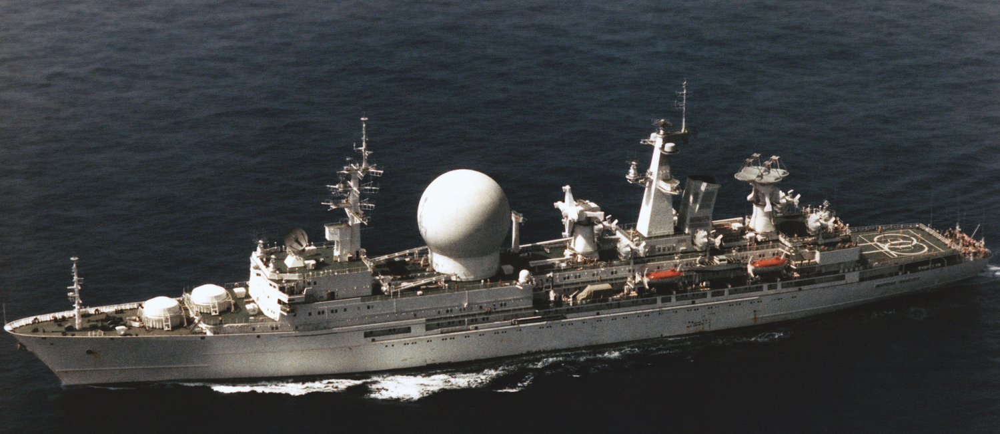

#### Alukset
| Latinisoitu nimi | Kyrillinen nimi | Käyttöönotto | Tila | Huom |
|---|---|---:|---|---|
| Marshal Krylov | Маршал Крылов | 1990 | Aktiivikäytössä | Projekti 1914; suuri mittaus- ja tiedustelualus Tyynenmeren laivastossa. |

#### Kalustokuvaus
Suuri mittaus- ja seurantalaiva ohjuskokeiden, telemetrian sekä avaruus- ja strategisten järjestelmien seurannan tukemiseen pitkiltä etäisyyksiltä. Alus mahdollistaa liikkuvan sensori- ja mittausalustan käytön strategisessa tuessa.

#### Suorituskyky
- Ohjus- ja avaruusjärjestelmien mittaus- ja seurantakyky (измерительный комплекс) on luokan pääsuorituskyky. Alukset tukevat koe-, telemetria- ja avaruustoimintaa eivätkä ole tavanomaisia taistelualuksia.
- Merkittävästä raskasaseistuksesta ei ole julkisissa lähteissä keskeistä näyttöä. Analyytikon on syytä arvioida luokka strategiseksi tukialustaksi, jonka arvo liittyy ase- ja avaruusohjelmien tukemiseen.

#### Huomioita analyysiin
Mittaus- ja koealuksena luokka tukee strategisten asejärjestelmien ja ohjuskokeiden seurantaa, telemetriaa ja mittausta. Sen arvo on erityisesti strategisten testien mahdollistamisessa ja tulosten keruussa.

#### Operatiiviset rajoitteet
Alus ei ole perinteinen taisteluyksikkö, joten sen liikkeet voivat viitata testitoimintaan pikemminkin kuin operatiiviseen voimankäyttöön. Juuri siksi sen lähtöihin ja sijainteihin liittyy usein korkea tiedusteluarvo.

#### Lähteet
- [List of active Russian Navy ships – Wikipedia](https://en.wikipedia.org/wiki/List_of_active_Russian_Navy_ships)
- [RussianShips.info – Project 1914 Missile Range Instrumentation Ships](http://russianships.info/eng/support/project_1914.htm) ([RussianShips.info](http://russianships.info/eng/))
- [Wikipedia – Marshal Nedelin-class missile range instrumentation ship](https://en.wikipedia.org/wiki/Marshal_Nedelin-class_missile_range_instrumentation_ship)
- [RussianShips.info – Intelligence / special ships overview](https://russianships.info/eng/intelligence/)

### Moma-luokka
#### Kalustokuva
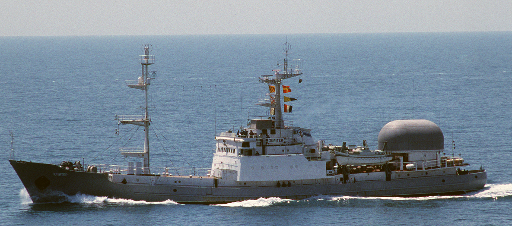

#### Alukset
| Latinisoitu nimi | Kyrillinen nimi | Käyttöönotto | Tila | Huom |
|---|---|---:|---|---|
| Priazovye | Приазовье | 1987 | Aktiivikäytössä | Projekti 864 / Vishnya-johdannainen ei ole Moma; Moma-luokan nykytila julkisissa lähteissä epäselvä. |

#### Kalustokuvaus
Muunnettu tiedustelualus alueellisiin elektroniikka- ja viestitiedustelutehtäviin sekä jatkuvaan merellisen toiminnan seurantaan. Alus mahdollistaa vaatimattoman mutta hyödyllisen lähialueiden pysyvän valvonnan.

#### Suorituskyky
- SIGINT/ELINT-tiedustelu (радиоэлектронная разведка) on luokan keskeinen tehtävä. Luokka on suunniteltu viesti- ja sähköisen tiedustelun keruuseen merialueilta eikä merkittävään asevaikutukseen.
- Kevyt omasuoja-aseistus (малокалиберное вооружение) on lähteissä vähäinen tai epäyhtenäisesti kuvattu. Analyytikon kannattaa arvioida alukset tiedustelukerääjiksi, joiden vaikutus syntyy sensorien eikä aseiden kautta.

#### Huomioita analyysiin
Pitkään käytössä ollut tiedustelualusluokka, joka on liittynyt erityisesti signaalitiedusteluun ja merellisen liikenteen seurantaan. Luokan merkitys voi edelleen olla käyttökelpoisessa rungossa ja riittävässä sensorikapasiteetissa matalamman intensiteetin tehtävissä.

#### Operatiiviset rajoitteet
Ikä ja vanhenevat järjestelmät voivat rajoittaa kykyä modernia, tiheää sähkömagneettista ympäristöä vastaan. Yksikkökohtaiset modernisoinnit ratkaisevat paljon enemmän kuin pelkkä luokkanimi.

#### Lähteet
- [List of active Russian Navy ships – Wikipedia](https://en.wikipedia.org/wiki/List_of_active_Russian_Navy_ships)
- [Covert Shores / KCHF – Intelligence Ship Kildin, Project 861M / Moma Class](http://www.kchf.ru/ship/vspomogat/moma.htm) ([KCHF](http://www.kchf.ru))
- [Wikipedia – Moma-class vessel](https://en.wikipedia.org/wiki/Moma-class_vessel)
- [RussianShips.info – Intelligence ships overview](https://russianships.info/eng/intelligence/)

### Chusuvoy -alus
#### Kalustokuva
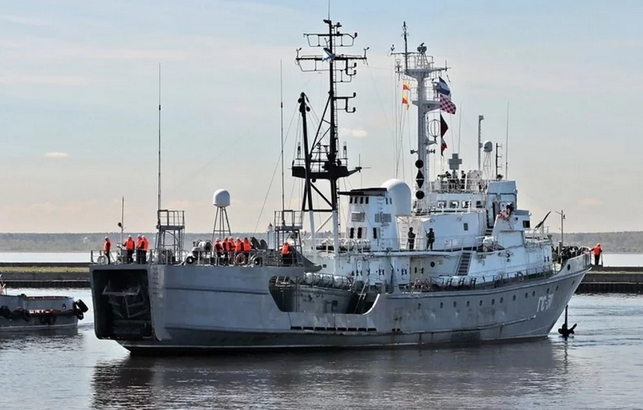

#### Alukset
| Latinisoitu nimi | Kyrillinen nimi | Käyttöönotto | Tila | Huom |
|---|---|---:|---|---|
| – | – | – | Ei vahvistettu julkisista lähteistä | Avoimista lähteistä saatava yksikkökohtainen aluslista ja palvelustila ovat ristiriitaisia tai puutteellisia. Tämä luokka kannattaa varmentaa erikseen esim. Jane’s Fighting Ships-, Combat Fleets-, ODIN- ja telakkalähteillä ennen operatiivista käyttöä. |

#### Kalustokuvaus
Erikoistehtäviin liitetty tiedustelu- ja tukialus, joka yhdistetään valvontaan sekä pohjoisten merialueiden erityisoperaatioiden tukemiseen. Alus mahdollistaa niche-tyyppisen ISR- ja tukikäytön, ei varsinaista pintataistelua.

#### Suorituskyky
- Merivalvonta- ja tiedustelukyky (разведывательные / специальные задачи) on aluksen relevantti suorituskyky julkisissa lähteissä. Chusovoyta käsitellään yleensä erikois- tai tiedustelutehtäviin liittyvänä alustana eikä etulinjan taistelualuksena.
- Merkittävästä vakioaseistuksesta ei ole avoimissa lähteissä vahvaa näyttöä. Käytännössä analyytikon kannattaa painottaa aluksen roolia tukevana tai erikoistuneena alustana ja suhtautua aseistustietoihin varauksella.

#### Huomioita analyysiin
Yksittäisaluksena Chusuvoyn arvo liittyy erikoistuneeseen tiedustelu-, mittaus- tai tukirooliin enemmän kuin luokkaperusteiseen massavaikutukseen. Analyysissa yksikkökohtaiset havainnot, reitit ja satamakäynnit ovat tärkeämpiä kuin rungon yleisluokitus.

#### Operatiiviset rajoitteet
Avoimista lähteistä saatava tieto on rajallista ja osin epätasaista. Tämän vuoksi arvioissa on syytä erottaa varmennetut faktat oletuksista hyvin selvästi.

#### Lähteet
- [List of active Russian Navy ships – Wikipedia](https://en.wikipedia.org/wiki/List_of_active_Russian_Navy_ships)
- [Russian Navy – Wikipedia](https://en.wikipedia.org/wiki/Russian_Navy)
- [Wikipedia – List of ships of the Russian Navy / Chusovoy entry](https://en.wikipedia.org/wiki/List_of_ships_of_the_Russian_Navy) ([Wikipedia](https://en.wikipedia.org))
- [RussianShips.info – Intelligence ships overview](https://russianships.info/eng/intelligence/)
- [Wikipedia – List of active Russian Navy ships](https://en.wikipedia.org/wiki/List_of_active_Russian_Navy_ships)

### Vishnya-luokka
#### Kalustokuva
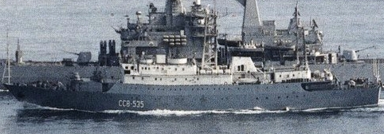

#### Alukset
| Latinisoitu nimi | Kyrillinen nimi | Käyttöönotto | Tila | Huom |
|---|---|---:|---|---|
| Kareliya | Карелия | 1986 | Aktiivikäytössä | Projekti 864; Pohjoinen laivasto. |
| Vasily Tatishchev | Василий Татищев | 1988 | Aktiivikäytössä | Baltian laivasto. |
| Viktor Leonov | Виктор Леонов | 1988 | Aktiivikäytössä | Pohjoinen laivasto. |
| Priazovye | Приазовье | 1987 | Aktiivikäytössä | Mustanmeren laivasto. |

#### Kalustokuvaus
Valtamerikelpoinen SIGINT-alus viesti- ja elektroniikkatiedusteluun sekä sotilaallisen toiminnan pitkäkestoiseen seurantaan merialueilla. Alus mahdollistaa Venäjän keskeisen merellisen tiedonkeruun kaukana kotivesiltä.

#### Suorituskyky
- 30 mm AK-630-lähitorjuntatykit (АК-630) muodostavat luokan pääasiallisen näkyvän itsepuolustusaseistuksen. Tehokas torjuntaetäisyys on noin 4–5 km.
- SA-N-8 / lähi-ilmatorjuntakyky (osa lähteistä mainitsee) antaa rajallisen suojan ilmauhkia vastaan. Julkisissa lähteissä yksityiskohdat vaihtelevat, joten tarkka konfiguraatio kannattaa varmistaa aluskohtaisesti.
- SIGINT/ELINT- ja viestitiedustelukyky (радиоразведка) on luokan varsinainen strateginen arvo. Vishnya-luokka on edelleen yksi Venäjän tärkeimmistä avomerellä toimivista tiedustelualusluokista.

#### Huomioita analyysiin
Nykyaikaisempi tiedustelualusluokka, jonka vahvuus on laaja signaalitiedustelu ja merellisen toimintaympäristön tekninen seuranta. Luokka soveltuu näkyvään mutta ei-kinettiseen läsnäoloon kriisialueiden läheisyydessä.

#### Operatiiviset rajoitteet
Alukset ovat korkean tiedusteluarvon yksiköitä, mutta niiden suora taistelukyky on rajallinen. Toiminta on siksi herkkä saattosuojalle, diplomaattiselle ympäristölle ja vastustajan häirintätoimille.

#### Lähteet
- [List of active Russian Navy ships – Wikipedia](https://en.wikipedia.org/wiki/List_of_active_Russian_Navy_ships)
- [ODIN – Vishnya Class (Project 864 Class) Russian Intelligence Collection Ship](https://odin.tradoc.army.mil/WEG/Asset/Vishnya-Class_) ([ODIN-verkkosivu](https://odin.tradoc.army.mil))
- [Wikipedia – Vishnya-class intelligence ship](https://en.wikipedia.org/wiki/Vishnya-class_intelligence_ship)
- [RussianShips.info – Intelligence ships overview](https://russianships.info/eng/intelligence/)

### Yantar -alus
#### Kalustokuva
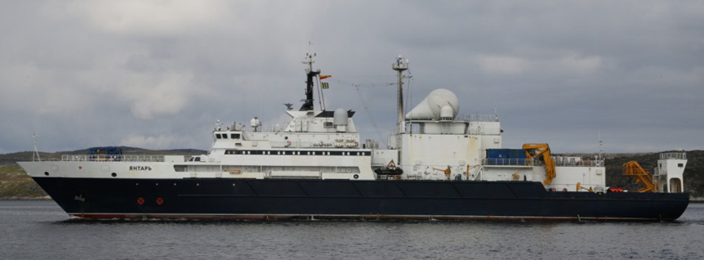

#### Alukset
| Latinisoitu nimi | Kyrillinen nimi | Käyttöönotto | Tila | Huom |
|---|---|---:|---|---|
| – | – | – | Ei vahvistettu julkisista lähteistä | Avoimista lähteistä saatava yksikkökohtainen aluslista ja palvelustila ovat ristiriitaisia tai puutteellisia. Tämä luokka kannattaa varmentaa erikseen esim. Jane’s Fighting Ships-, Combat Fleets-, ODIN- ja telakkalähteillä ennen operatiivista käyttöä. |

#### Kalustokuvaus
Virallisesti merentutkimusalus, mutta sitä pidetään laajasti myös syvänmeren tiedustelu- ja erikoisoperaatioalustana, joka kykenee merenpohjan kartoitukseen ja sukelluslaitteiden tukemiseen. Alus mahdollistaa kaksikäyttöisen pääsyn vedenalaiseen infrastruktuuriin ja merenpohjaoperaatioihin.

#### Suorituskyky
- Syvänmeren tiedustelu- ja interventiokyky (глубоководные аппараты) on aluksen ratkaiseva suorituskyky. Alus voi käyttää Rus- ja Konsul-tyyppisiä syvänmeren laitteita, mikä mahdollistaa merenalaisen infrastruktuurin tutkimisen, käsittelyn ja mahdollisesti häirinnän.
- Merkittävästä raskasaseistuksesta ei ole julkisesti vahvistettua näyttöä. Yantarin arvo syntyy erikoislaitteista, pitkästä toiminta-ajasta ja kyvystä operoida merenpohjan kohteiden lähellä, ei taistelualuksen tulivoimasta.
- Helikopterikansi ja erikoisjärjestelmät (вертолётная площадка; специальные средства) tukevat laajaa merellisen tiedustelun ja tutkimuksen tehtäväprofiilia. Operatiivisesti alus on yhdistelmä tiedustelu-, tutkimus- ja syvänmeren erikoisalusta.

#### Huomioita analyysiin
Syvänmeren tutkimus- ja erikoisalus, jonka tiedustelullinen merkitys liittyy merenalaiseen infrastruktuuriin, vedenalaisiin järjestelmiin ja erikoisoperaatioihin. Aluksen liikkeet voivat olla strategisesti kiinnostavia etenkin kaapeleiden, sensoreiden tai syvänmeren kohteiden läheisyydessä.

#### Operatiiviset rajoitteet
Julkisissa lähteissä rooliin liittyy paljon spekulaatiota, joten johtopäätöksissä on pysyttävä varmistetussa tiedossa. Vaikka alus ei ole perinteinen taistelualus, sen läsnäolo voi aiheuttaa huomattavaa operatiivista ja poliittista herkkyyttä.

#### Lähteet
- [List of active Russian Navy ships – Wikipedia](https://en.wikipedia.org/wiki/List_of_active_Russian_Navy_ships)
- [Russian Navy – Wikipedia](https://en.wikipedia.org/wiki/Russian_Navy)
- [Wikipedia – Russian ship Yantar](https://en.wikipedia.org/wiki/Russian_ship_Yantar) ([Wikipedia](https://en.wikipedia.org))
- [RussianShips.info – Project 22010 oceanographic research ship](http://russianships.info/eng/support/project_22010.htm) ([RussianShips.info](http://russianships.info/eng/))
- [Wikipedia – Russian research vessel Yantar](https://en.wikipedia.org/wiki/Russian_research_vessel_Yantar)
- [Naval Technology – Yantar / intelligence collection context](https://www.naval-technology.com/projects/yuri-ivanov-project-18280-class-intelligence-gathering-vessels/)

### Yury Ivanov -luokka
#### Kalustokuva
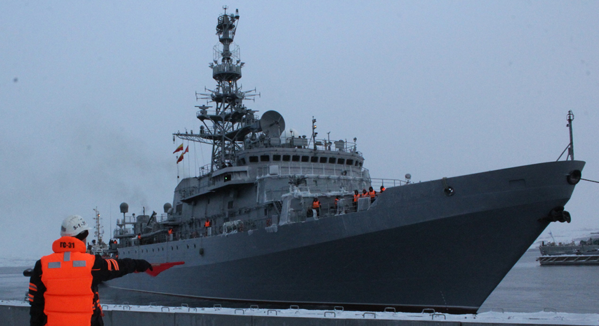

#### Alukset
| Latinisoitu nimi | Kyrillinen nimi | Käyttöönotto | Tila | Huom |
|---|---|---:|---|---|
| Yuriy Ivanov | Юрий Иванов | 2015 | Aktiivikäytössä | Projekti 18280; Pohjoinen laivasto. |
| Ivan Khurs | Иван Хурс | 2018 | Aktiivikäytössä | Projekti 18280; Mustanmeren laivasto; raportoitu joutuneen USV-hyökkäyksen kohteeksi 2023. |

#### Kalustokuvaus
Moderni SIGINT-alus elektroniikka- ja viestitiedusteluun sekä merellisen tilannekuvan tukemiseen. Alus mahdollistaa tarkoitushakuisen merellisen ISR-kyvyn ja toimii seuraajana vanhemmille neuvostoperäisille tiedustelualuksille.

#### Suorituskyky
- 14,5 mm MTPU-konekiväärit (МТПУ) muodostavat luokan perusomansuojan. Vaikutusetäisyys on noin 2 km, ja aseistus on suunnattu kevyitä pinta- ja ilmauhkia vastaan.
- Igla-ilmatorjuntaohjukset (Игла / 9К38) täydentävät lähialueen itsepuolustusta. Käytännön kantama on noin 5 km luokkaa, mikä riittää lähinnä lähi-ilmauhkiin.
- SIGINT/ELINT- ja viestitiedustelukyky (радиоразведка) on luokan todellinen operatiivinen ydin. Alukset on tarkoitettu sähköisen toimintaympäristön seurantaan, signaalitiedusteluun ja merellisen tilannekuvan muodostamiseen etäälläkin kotisatamista.

#### Huomioita analyysiin
Uudempi SIGINT/ELINT-alusluokka tarjoaa pitkäkestoisen merellisen tiedustelukyvyn nykyaikaisilla viesti- ja signaalinseurantajärjestelmillä. Luokka on tärkeä, koska se mahdollistaa sekä sotilaallisen tilannekuvan että järjestelmällisen sähköisen tiedonkeruun kriisialueiden läheisyydessä.

#### Operatiiviset rajoitteet
Rajallinen yksikkömäärä tekee jokaisesta aluksesta korkean prioriteetin tiedusteluresurssin. Operatiivinen arvo riippuu paljon siitä, kuinka vapaasti alus voi toimia kansainvälisillä merialueilla ilman häirintää.

#### Lähteet
- [Yury Ivanov-class intelligence ship – Wikipedia](https://en.wikipedia.org/wiki/Yury_Ivanov-class_intelligence_ship)
- [List of active Russian Navy ships – Wikipedia](https://en.wikipedia.org/wiki/List_of_active_Russian_Navy_ships)
- [ODIN – Yuri Ivanov Class (Project 18280) Russian SIGINT Ship](https://odin.tradoc.army.mil/WEG/Asset/Yuri_Ivanov-Class_) ([ODIN-verkkosivu](https://odin.tradoc.army.mil))
- [Wikipedia – Yury Ivanov-class intelligence ship](https://en.wikipedia.org/wiki/Yury_Ivanov-class_intelligence_ship)
- [ODIN – Yuri Ivanov Class](https://odin.tradoc.army.mil/WEG/Asset/Yuri_Ivanov-Class_)
