# Kalustokuvasto

## Altair (Altius)
### Kuvamateriaali
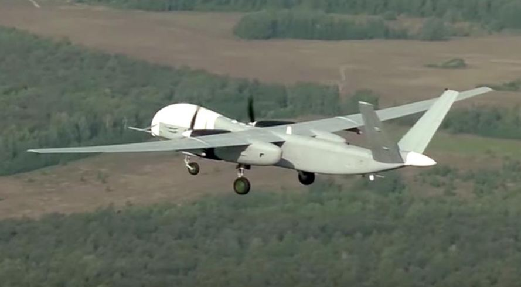

### Kalustotiedot

## Eleron-3
### Kuvamateriaali
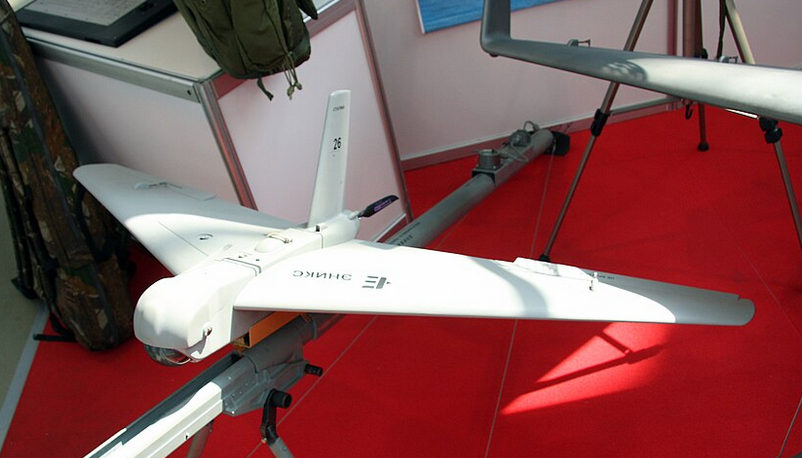

### Kalustotiedot

## Forpost
### Kuvamateriaali

### Kalustotiedot

## Geran-2 (Shahed 136)
### Kuvamateriaali

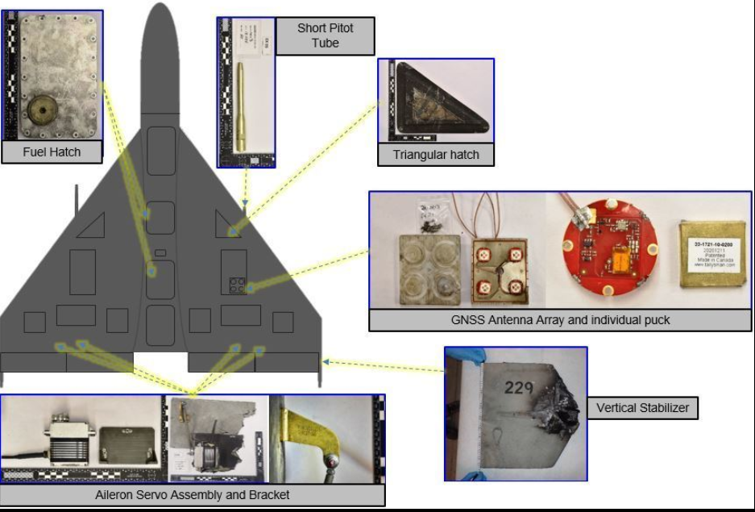

### Kalustotiedot

## Granat-1
### Kuvamateriaali
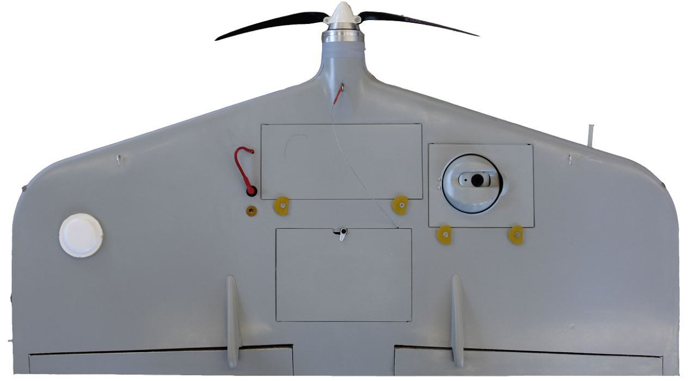

### Kalustotiedot

## Granat-2
### Kuvamateriaali

### Kalustotiedot

## Granat-4
### Kuvamateriaali

### Kalustotiedot

## KUB-BLA (KUB-E as representative)
### Kuvamateriaali
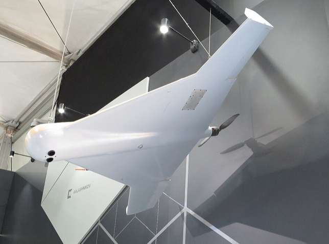

### Kalustotiedot

## Lancet
### Kuvamateriaali

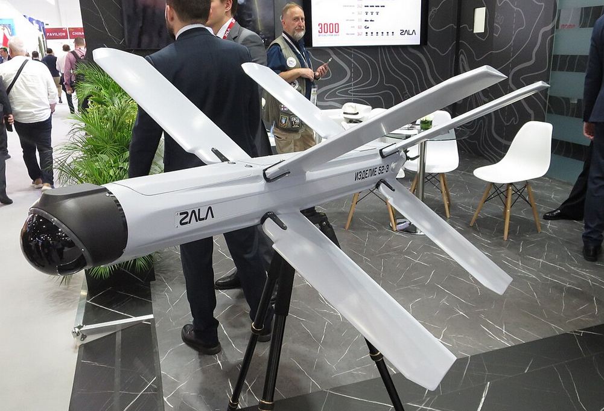

### Kalustotiedot

## Leer-3 (RB-341V)
### Kuvamateriaali

### Kalustotiedot

## Marker (UGV)
### Kuvamateriaali
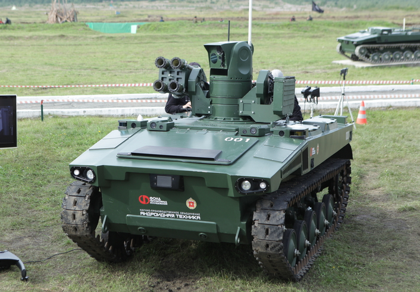
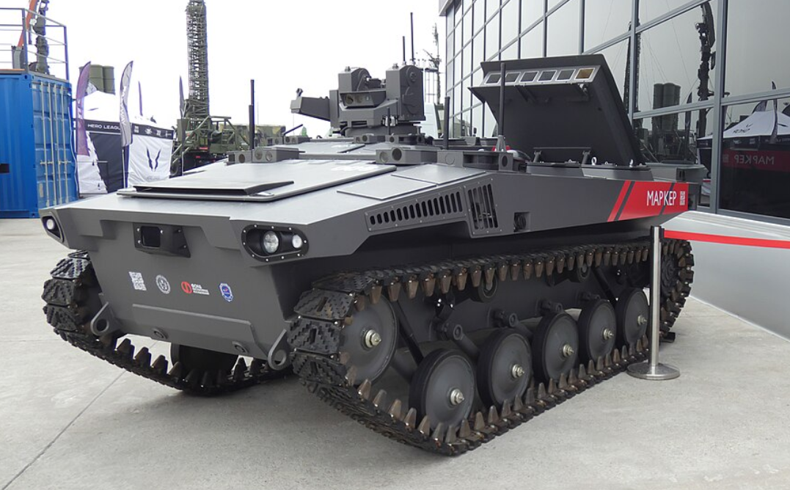

### Kalustotiedot

## Nerekhta (UGV)
### Kuvamateriaali

### Kalustotiedot

## Okhotnik (S-70)
### Kuvamateriaali
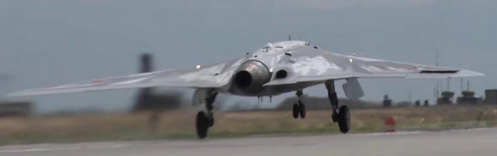
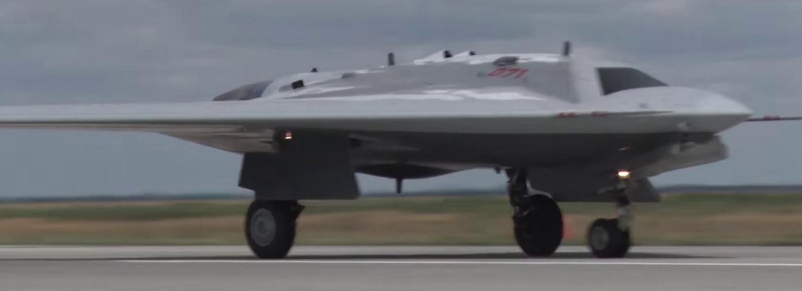

### Kalustotiedot

## Orion-E (Inokhodets) 
### Kuvamateriaali

### Kalustotiedot

## Orlan-10
### Kuvamateriaali

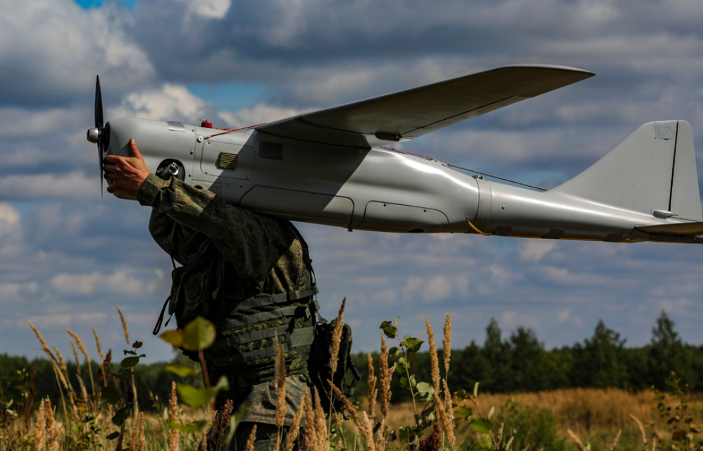

### Kalustotiedot

## Orlan-30
### Kuvamateriaali

### Kalustotiedot

## Supercam S150
### Kuvamateriaali
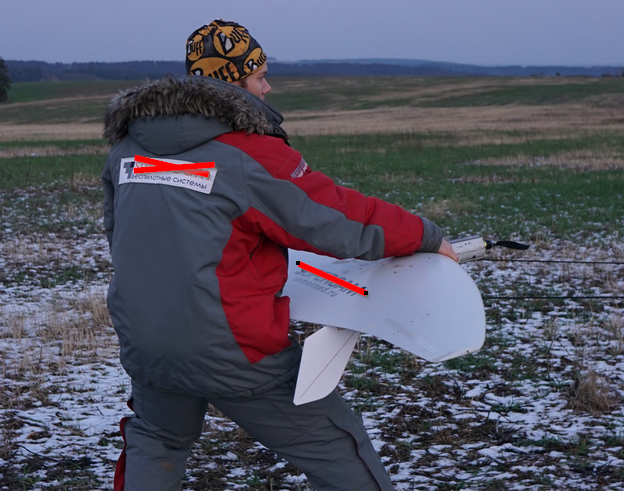
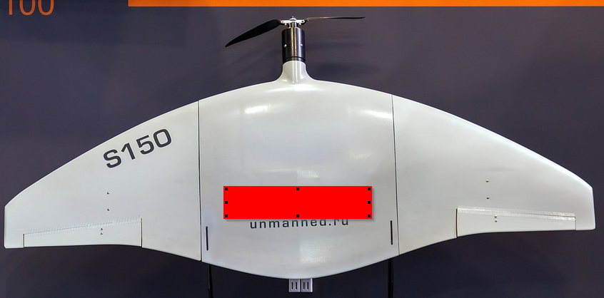

### Kalustotiedot

## Supercam S350
### Kuvamateriaali
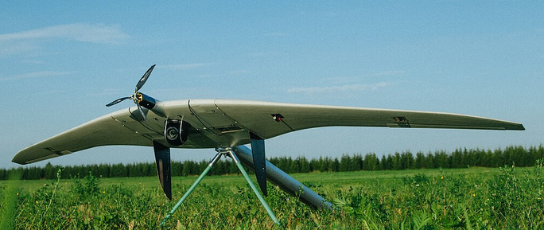

### Kalustotiedot

## Takhion
### Kuvamateriaali
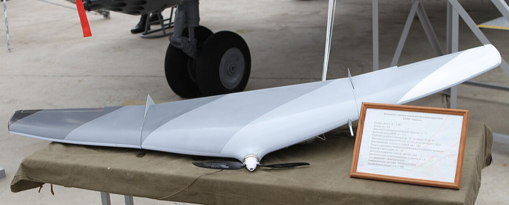
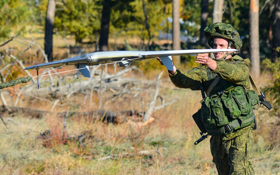

### Kalustotiedot

## Uran-9 (UGV)
### Kuvamateriaali

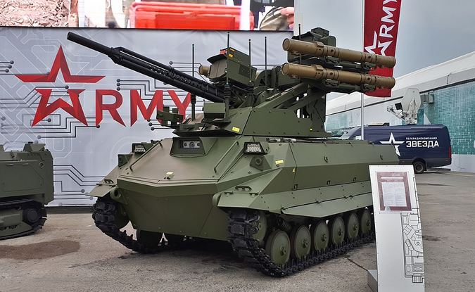

### Kalustotiedot

## ZALA 421-16
### Kuvamateriaali
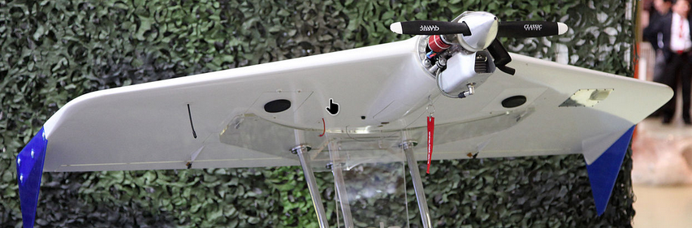
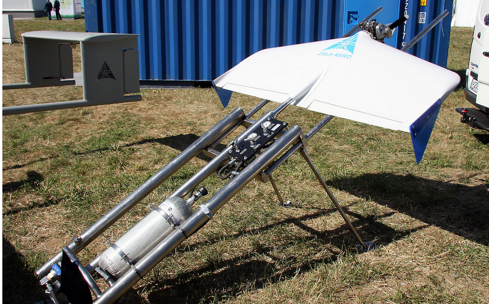

### Kalustotiedot

## ZALA 421-08
### Kuvamateriaali
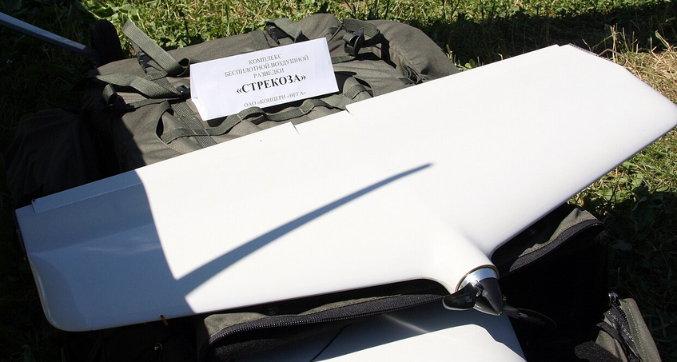
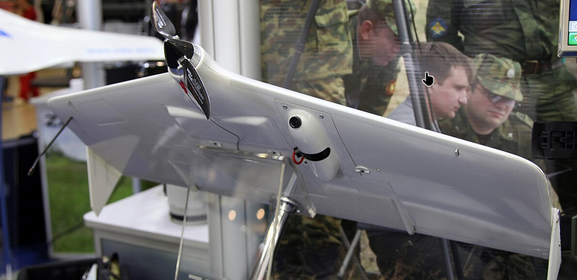

### Kalustotiedot

## ZALA 421-22
### Kuvamateriaali

### Kalustotiedot

