# Kalustokuvasto

## Miehittamattomat ilma-alukset

### Altius
#### Kalustokuva

#### Kalustokuvaus

Pitkän toiminta-ajan MALE-luokan tiedustelu- ja isku-UAV, jota on kehitetty laajoihin ISR-, maalinosoitus- ja mahdollisiin isku- sekä ELINT/EA-tehtäviin. Järjestelmä sijoittuu Venäjän UAV-portaassa taktisten Orlan/Forpost-järjestelmien yläpuolelle ja on tarkoitettu operatiivisen tason käyttöön.

#### Suorituskyvyt

- Pitkä toiminta-aika ja satelliittiyhteyksiä hyödyntävä ohjaus tukevat laajan alueen valvontaa sekä syvyyssuuntaista tiedustelua.
- Avoimissa lähteissä mainitaan myös isku- ja elektronisen sodankäynnin roolit, mutta sensorikuormista ja aseistuksesta on rajallisesti varmennettua tietoa.

#### Huomioitava analyysiin

Altius on relevantti erityisesti silloin, kun Venäjä pyrkii rakentamaan pitkäkestoista sensoripeittoa tai isku-UAV-kykyä ilman miehitettyä ilmailua. Avoin lähdeaineisto viittaa kehitysohjelman pitkään ja osin epätasaiseen etenemiseen, joten todellinen käytettävyys kannattaa erottaa ohjelmajulkisuudesta.

#### Operatiiviset rajoitteet

Sarjatuotannosta, määristä ja täysimittaisesta operatiivisesta käytöstä on avoimissa lähteissä edelleen puutteita. Järjestelmä on kokoluokaltaan arvokas ja logistisesti raskaampi kuin pienet taktiset UAV:t, mikä voi rajoittaa käyttötiheyttä etulinjassa.

#### Lähteet

- [ODIN – Sokol Altius-RU](https://odin.tradoc.army.mil/WEG/Asset/2281362bc70d8809bcf0f8c9fae9b8da)
- [Rostec – Altius/Orion export context](https://rostec.ru/en/media/news/rosoboronexport-to-showcase-advanced-russian-solutions-at-xii-international-meeting-of-high-represen/)

### DJI-Phantom-3
#### Kalustokuva
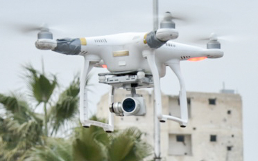

#### Kalustokuvaus

Kaupallinen neliroottorinen pien-UAV, jota on voitu käyttää sotilaskentällä tilannekuvaan, lähitiedusteluun ja tulen korjaukseen improvisoidusti. Kyse ei ole varsinaisesta sotilasjärjestelmästä vaan siviilialustasta, jota voidaan soveltaa taistelukentällä.

#### Suorituskyvyt

- Kevyt EO-kamera, nopea käyttöönotto ja lyhyt koulutuskynnys tekevät siitä käyttökelpoisen lähialueen havainnointiin.
- Kantama ja häirinnänkesto ovat siviilijärjestelmän tasoa; suorituskyky perustuu kaupalliseen radiolinkkiin ja GNSS-tukeen.

#### Huomioitava analyysiin

Analyysissa kannattaa käsitellä Phantom 3:a enemmän kulutustavarana kuin doktriinisenä asejärjestelmänä. Sen merkitys liittyy massaan, saatavuuteen ja matalaan kustannukseen, ei kehittyneeseen selviytymiskykyyn.

#### Operatiiviset rajoitteet

Alusta on altis elektroniselle häirinnälle, paikannuksen estolle ja fyysiselle torjunnalle. Kylmä sää, tuuli, rajallinen hyötykuorma ja lyhyt toiminta-aika heikentävät käyttöä sotilasympäristössä.

#### Lähteet

- [DJI – Phantom 3 specs](https://www.dji.com/phantom-3-pro/info#specs)
- [DJI – Phantom 3 user resources](https://www.dji.com/phantom-3-pro/downloads)

### Dragonfly
#### Kalustokuva
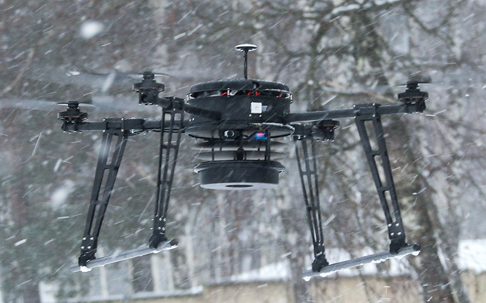

#### Kalustokuvaus

Annetulla nimellä tunnistettava venäläinen järjestelmä jää avoimissa lähteissä epäselväksi; luotettavissa lähteissä nimi viittaa lähinnä kehitteillä olleeseen mini-/mikro-UAV-konseptiin. Siksi tätä nimikettä on turvallisinta käsitellä konsepti- tai ohjelmatason eikä vakiintuneen laajasti kentitetyn järjestelmän kuvauksena.

#### Suorituskyvyt

- TASSin mukaan konseptin tavoitteena oli erittäin pieni tiedustelu-UAV, joka tukisi lähietäisyydeltä naamioitujen kohteiden ja henkilöstön havaitsemista.
- Teknisistä arvoista, sarjatuotannosta ja operatiivisesta käytöstä ei löytynyt riittävää avointa varmennusta.

#### Huomioitava analyysiin

Nimiketarkkuus kannattaa tarkistaa alkuperäisestä lähdeaineistosta tai kuvametadatasta ennen kuin järjestelmä sidotaan tiettyyn suorituskykyprofiiliin. Tässä muodossa kyseessä on selkeä tietoaukko.

#### Operatiiviset rajoitteet

Avoin lähdeaineisto ei riitä vahvistamaan tarkkaa valmistajaa, käyttöönottoa tai kenttäroolia. Liiallinen täsmentäminen ilman lisänäyttöä kasvattaisi virheriskiä.

#### Lähteet

- [TASS – Russia crafting line of 'dragonfly' drones](https://tass.com/defense/902921)
- [TAdviser – Military drones in Russia (mentions Dragonfly-type projects)](https://tadviser.com/index.php/Article:Military_drones_in_Russia)

### Eleron-10
#### Kalustokuva

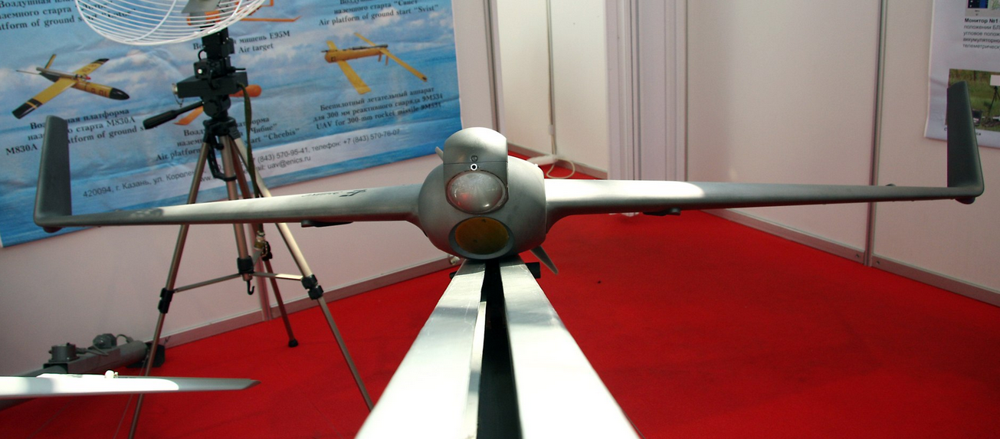

#### Kalustokuvaus

Keskikokoinen taktinen tiedustelu-UAV ympärivuorokautiseen valvontaan, maalinhakuun ja tulenkorjaukseen. Järjestelmä kuuluu venäläisten joukkojen vakiintuneeseen lyhyen/keskipitkän kantaman ISR-kerrokseen.

#### Suorituskyvyt

- Valmistajan ja avoimien lähteiden mukaan järjestelmä tukee päivä-, IR- ja muita EO-kuormia sekä reaaliaikaista tiedonsiirtoa.
- Avoimissa lähteissä ilmoitetaan noin 2 tunnin lentoaika, jopa noin 50 km videolinkki ja enintään noin 4 km toimintakorkeus mallista riippuen.

#### Huomioitava analyysiin

Eleron-10 on analyytikolle tärkeä, koska se liittyy tulen korjaukseen ja paikallisen tason tilannekuvan rakentamiseen. Se ei ole näyttävin venäläinen UAV, mutta käytännön kenttäarvo on juuri jatkuvassa ISR-käytössä.

#### Operatiiviset rajoitteet

Pieni koko, rajallinen hyötykuorma ja suhteellisen lyhyt kesto rajaavat vaikutuksen operatiiviseen syvyyteen. Järjestelmä on myös haavoittuva häirinnälle ja ilmatorjunnan lähitorjunnalle.

#### Lähteet

- [GUR War&Sanctions – Eleron-10](https://war-sanctions.gur.gov.ua/en/uav/451)
- [ENICS / open-source profile via ODIN-family references](https://odin.tradoc.army.mil/WEG/Asset/91494a1e46f43f3e0f5dbf3e9e39cbe9)

### Eleron-3
#### Kalustokuva
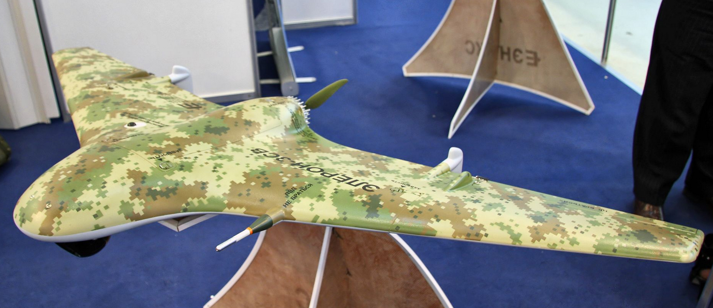

#### Kalustokuvaus

Kevyt, lyhyen kantaman taktinen tiedustelu-UAV lähialueen valvontaan, maalinetsintään ja tulenkorjaukseen. Se on suunniteltu nopeasti käyttöön otettavaksi pataljoona-/prikaatitasolla.

#### Suorituskyvyt

- ODINin mukaan järjestelmä kykenee optiseen ja lämpökameratiedusteluun sekä autonomisiin, automaattisiin ja puoliautomaattisiin lentoprofiileihin.
- Avoimissa lähteissä ilmoitetaan noin 100 minuutin lentoaika, noin 25 km datalinkki ja noin 4 000 m maksimikorkeus Eleron-3SV-mallille.

#### Huomioitava analyysiin

Eleron-3:n arvo on määrässä, hajautettavuudessa ja nopeassa ISR-tukiroolissa. Se toimii usein osana venäläistä tiedustelu–tuliketjua, ei itsenäisenä korkean profiilin alustana.

#### Operatiiviset rajoitteet

Pieni koko ja sähköinen voimalinja rajoittavat hyötykuormaa sekä huonon sään suorituskykyä. Elektroninen häirintä ja kineettinen lähitorjunta voivat kuluttaa järjestelmää nopeasti.

#### Lähteet

- [ODIN – Eleron-3](https://odin.tradoc.army.mil/WEG/Asset/91494a1e46f43f3e0f5dbf3e9e39cbe9)
- [Bard College Drone Databook (referenced by ODIN summary)](https://dronecenter.bard.edu/files/2019/10/CSD-Drone-Databook-Web.pdf)

### Eleron-7
#### Kalustokuva
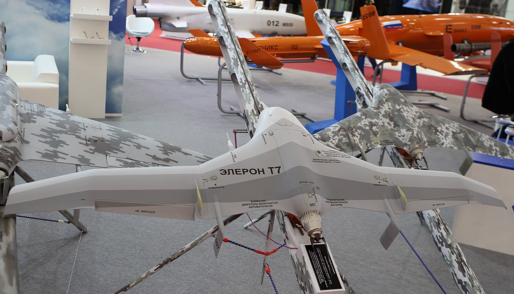

#### Kalustokuvaus

Eleron-perheen keskiluokan taktinen tiedustelu-UAV, josta avoin lähdeaineisto on selvästi niukempaa kuin Eleron-3/10-järjestelmistä. Käyttörooli näyttäytyy lähinnä päivä-/yövalvontana ja taktisen tason maalinetsintänä.

#### Suorituskyvyt

- Perheeseen kuuluvien järjestelmien perusteella suorituskyky painottuu EO/IR-tiedusteluun, reittiohjaukseen ja reaaliaikaiseen tiedonsiirtoon.
- Täsmällisiä, luotettavasti varmennettuja kantama- ja kuormaarvoja juuri Eleron-7:lle löytyi heikosti.

#### Huomioitava analyysiin

Eleron-7 kannattaa käsitellä analyysissa varovaisesti väliluokan ISR-järjestelmänä, ei täysin varmennetuin yksityiskohdin. Luotettava avoin dokumentaatio on rajallinen verrattuna tunnetumpiin Eleron-versioihin.

#### Operatiiviset rajoitteet

Tietopohja ei riitä varmaan arvioon käyttömääriä, alaversioita tai nykyistä asemaa koskevissa kysymyksissä. Tämän nimikkeen kohdalla tietoaukko on syytä merkitä näkyvästi.

#### Lähteet

- [Rosoboronexport / industry overview mentioning Eleron family](https://roe.ru/en/media/posts/kategoriya-2/rosoboronexport-to-strengthen-russia-s-position-in-the-global-market-for-unmanned-aircraft-systems-/)
- [FPRI – Russian Military Drones](https://www.fpri.org/wp-content/uploads/2023/11/russian-military-drones-.pdf)

### Forpost
#### Kalustokuva
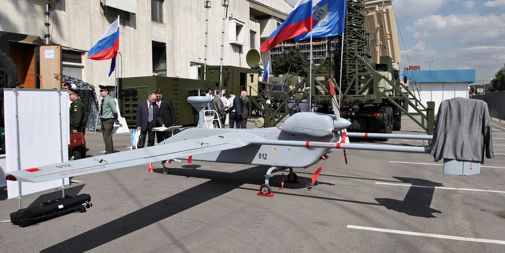
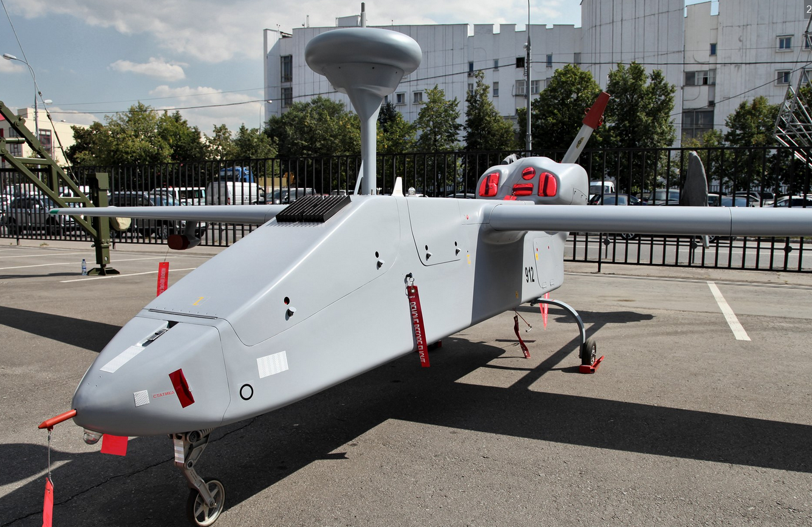

#### Kalustokuvaus

Keskikokoinen tiedustelu-UAV, joka perustuu Israelin Searcher-perheen ratkaisuun ja jota Venäjä on käyttänyt pitkään operatiivisessa ISR-roolissa. Modernisoidut variantit ovat laajentaneet järjestelmän merkitystä myös isku- ja maalinosoitustehtäviin.

#### Suorituskyvyt

- ODINin mukaan Forpost tarjoaa pitkäkestoista tiedustelua, reaaliaikaista kuvanvälitystä ja selvästi taktisia pien-UAV:ita suuremman toimintasektorin.
- Avoimissa lähteissä mainitaan noin 16–18 tunnin kesto ja noin 250 km luokan toimintasäde versiosta riippuen; tarkka suorituskyky vaihtelee Searcher-/Forpost-/Forpost-R-tasojen välillä.

#### Huomioitava analyysiin

Forpost on tärkeä linkki venäläisessä tiedustelu–isku-ketjussa, koska se kykenee syvempään ja pidempään valvontaan kuin Orlan/Eleron-luokka. Sen merkitys kasvaa, jos analyysi koskee tulivaikutuksen valmistelua operatiivisella syvyydellä.

#### Operatiiviset rajoitteet

Järjestelmä on suurempi ja näkyvämpi kuin pienet kenttä-UAV:t, mikä kasvattaa torjuntariskiä vertaisympäristössä. Varianttien erottelu on olennaista, sillä avoimessa keskustelussa Forpost ja Forpost-R sekoittuvat usein.

#### Lähteet

- [ODIN – Forposts Russian Reconnaissance UAV](https://odin.tradoc.army.mil/WEG/Asset/9597f509c7697fc75e141b3fe642f2d6)
- [IAI Searcher background](https://www.iai.co.il/p/searcher-mk-iii)

### Geran-2
#### Kalustokuva
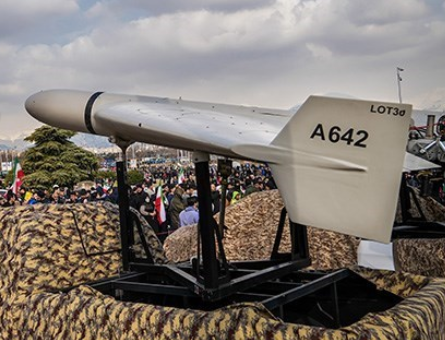

#### Kalustokuvaus

Pitkän kantaman yksisuuntainen isku-UAV/loitering munition, jonka venäläinen nimike viittaa Shahed-136-pohjaiseen järjestelmään. Sitä käytetään etenkin massahyökkäyksissä kiinteitä kohteita, infrastruktuuria ja ilmatorjunnan kuormittamista vastaan.

#### Suorituskyvyt

- ODINin ja muiden analyysien mukaan järjestelmä hyödyntää INS/GNSS-ohjausta, parvilaukaisua ja suhteellisen suurta taistelukärkeä kulutettavaan runkoon yhdistettynä.
- Kantama on perusversiossa satoja kilometrejä ja joissain arvioissa yli 1 000 km; myöhemmät venäläisversiot ovat sisältäneet muutoksia warheadiin, elektroniikkaan ja häirinnänsietoon.

#### Huomioitava analyysiin

Geran-2:n sotilaallinen vaikutus perustuu enemmän volyymiin, kustannus–vaikutus-suhteeseen ja torjunnan kyllästämiseen kuin yksittäisen aluksen hienostuneisuuteen. Järjestelmä kannattaa analysoida osana laajempaa iskuarkkitehtuuria, ei vain yksittäisenä lennokkina.

#### Operatiiviset rajoitteet

Alusta on hidas ja melko ennalta-arvattava verrattuna risteilyohjuksiin, minkä vuoksi se on altis aktiiviselle torjunnalle ilman kyllästystä. Tarkat venäläisvarianttien tekniset erot muuttuvat nopeasti, joten yksityiskohtainen versiointi vanhenee helposti.

#### Lähteet

- [ODIN – Shahed-136 / Geran context](https://odin.tradoc.army.mil/WEG/Asset/Shahed-136_Iranian_Loitering_Munition_Unmanned_Aerial_Vehicle_%28UAV%29)
- [ISIS – Analytical review of Russian Shahed-type UAVs](https://isis-online.org/isis-reports/a-comprehensive-analytical-review-of-russian-shahed-type-uavs-deployment-against-ukraine-in-2025)

### Gerbera
#### Kalustokuva
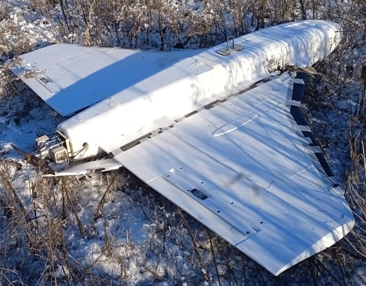

#### Kalustokuvaus

Halvemmaksi Shahed/Geran-tyyppiseksi suunniteltu moniroolinen UAV, jota on käytetty ainakin valemaalina ja joissain lähteissä myös tiedustelu- tai kevyeen iskurooliin. Järjestelmän keskeinen idea on kuluttaa torjuntaa ja lisätä massaa ilmahyökkäyksiin.

#### Suorituskyvyt

- Ukrainan GUR:n ja muiden analyysien mukaan Gerbera voi toimia valemaalina, tiedustelualustana tai räjähteellä varustettuna kertakäyttöjärjestelmänä.
- Avoimissa lähteissä kantama- ja hyötykuormatiedot vaihtelevat huomattavasti; tämän vuoksi tarkkoihin numeroihin tulee suhtautua varauksella.

#### Huomioitava analyysiin

Gerberan arvo on operatiivisessa harhautuksessa ja kustannustehokkaassa kyllästyksessä. Analyysissa se kannattaa nähdä osana venäläisten pitkän kantaman UAV-hyökkäysten kerrostettua rakennetta.

#### Operatiiviset rajoitteet

Avoin tekninen dokumentaatio on niukkaa, ja järjestelmä näyttää kehittyvän nopeasti. Halpa rakenne ja mahdollinen vaatimaton hyötykuorma rajoittavat yksittäisen lennokin vaikutusta ilman massakäyttöä.

#### Lähteet

- [GUR War&Sanctions – Gerbera](https://war-sanctions.gur.gov.ua/en/uav/329)
- [ISIS – Russian Shahed-type UAV review](https://isis-online.org/isis-reports/a-comprehensive-analytical-review-of-russian-shahed-type-uavs-deployment-against-ukraine-in-2025)

### Granat-1
#### Kalustokuva

#### Kalustokuvaus

Kannettava lyhyen kantaman tiedustelu-UAV, joka on tarkoitettu lähialueen tarkkailuun, kohteiden havaitsemiseen ja tiedon välittämiseen komentopaikalle. Se kuuluu venäläisen Navodchik-2-tyyppisen UAV-kerroksen kevyimpään päähän.

#### Suorituskyvyt

- Rosoboronexportin mukaan järjestelmä tukee ympärivuorokautista maaston etähavainnointia ja voi toimia myös viestivälittäjänä.
- Avoimissa lähteissä ilmoitetaan noin 1 tunnin lentoaika ja noin 15 km luokan toimintasäde, mikä sopii hyvin komppania-/pataljoonatason ISR-tukeen.

#### Huomioitava analyysiin

Granat-1:n merkitys on pienyksikkötason tilannekuvassa ja nopeassa käyttöönotossa. Se ei ratkaise syvyyssuuntaista tiedustelua, mutta tukee tulenkäyttöä ja paikallista havainnointia kustannustehokkaasti.

#### Operatiiviset rajoitteet

Hyötykuorma, sääsietokyky ja viestikantama ovat kevyen UAV:n tasolla. Elektroninen häirintä ja kuluttava käyttö etulinjassa heikentävät järjestelmän selviytymistä.

#### Lähteet

- [Rosoboronexport – Granat-1](https://roe.ru/en/production/aerospace-forces/complexes-with-uavs/granat-1/?theme=)
- [GUR War&Sanctions – Granat-1](https://war-sanctions.gur.gov.ua/en/uav/416)

### Granat-2
#### Kalustokuva
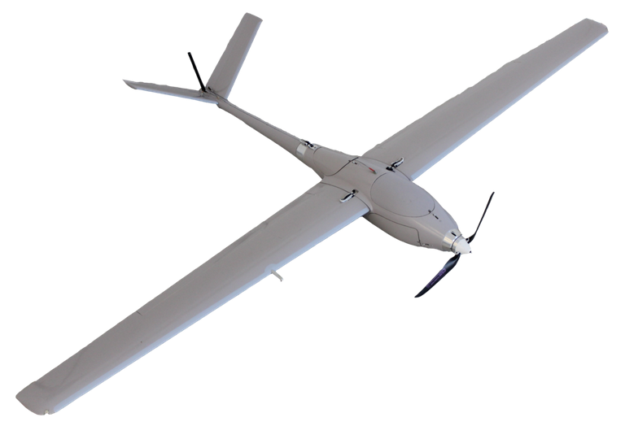

#### Kalustokuvaus

Lyhyen kantaman taktinen tiedustelu-UAV, joka täydentää Granat-1-järjestelmää suuremmalla rungolla ja hieman pidemmällä toiminta-ajalla. Järjestelmää käytetään lähialueen ISR- ja tulenkorjaustehtäviin.

#### Suorituskyvyt

- GUR:n avoimessa tietokannassa järjestelmälle ilmoitetaan noin 1,5 tunnin lentoaika, noin 15 km luokan kantama ja EO-painotteinen tiedustelurooli.
- Granat-2 kuuluu järjestelmätasolla Navodchik-2-kokonaisuuteen, jossa useat UAV-tyypit tukevat eri etäisyyksiä.

#### Huomioitava analyysiin

Granat-2 on analyysissa hyödyllinen etenkin silloin, kun arvioidaan venäläisten lyhyen kantaman tiedustelun redundanssia. Se ei ole korkean näkyvyyden järjestelmä, mutta tukee systemaattisesti tykistön ja manööverijoukkojen toimintaa.

#### Operatiiviset rajoitteet

Pieni toimintasäde ja kevyt rakenne rajaavat vaikutuksen lähelle omaa etulinjaa. Avoimissa lähteissä järjestelmän tekniset tiedot ovat suppeita, joten yksityiskohtainen suorituskykyarvio jää varovaiseksi.

#### Lähteet

- [GUR War&Sanctions – Granat-2](https://war-sanctions.gur.gov.ua/en/uav/417)
- [Jamestown – UAV unit structure references](https://jamestown.org/moscows-military-modernization-sets-agenda-for-uav-development/)

### Granat-4
#### Kalustokuva
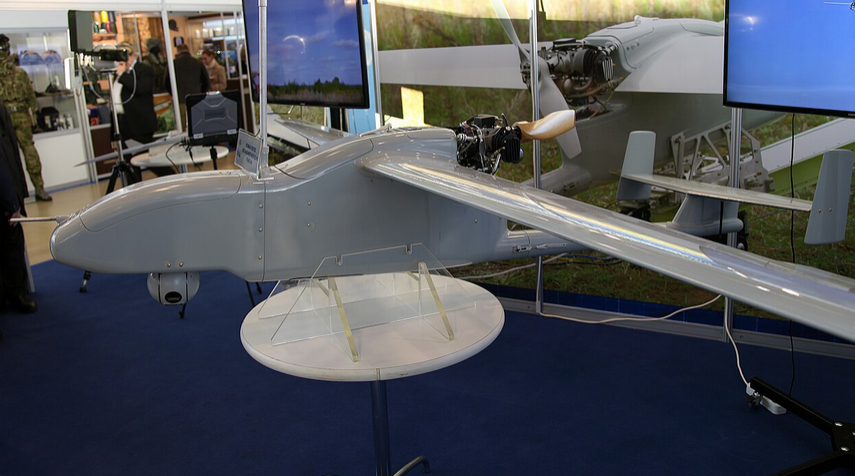

#### Kalustokuvaus

Granat-perheen raskaampi taktinen tiedustelu-UAV, joka on tarkoitettu pidempään havaintoon ja syvemmälle ulottuvaan ISR-tukeen kuin Granat-1/2. Se liittyy venäläisten taktisten UAV-järjestelmien yleiseen porrastukseen.

#### Suorituskyvyt

- Rosoboronexport on markkinoinut Granat-4E:tä aktiivisesti, ja lähteet kuvaavat sitä taktisen tiedustelun sekä valvonnan järjestelmäksi.
- Avoimissa lähteissä juuri sotilaskäytön tarkat arvot vaihtelevat, joten kantamasta ja kuormista on syytä puhua varovaisesti ilman alaversion täsmennystä.

#### Huomioitava analyysiin

Granat-4 on analyysissa merkityksellinen, koska se täydentää Orlan/Eleron-luokan ja aivan kevyiden UAV:iden välistä kapasiteettia. Luotettava tekninen julkinen data on kuitenkin niukempaa kuin tunnetummista järjestelmistä.

#### Operatiiviset rajoitteet

Avoin lähdeaineisto ei riitä tarkkaan ja ajantasaiseen versiovertailuun. Tämä kasvattaa riskiä sekoittaa vientimalli, perusmalli ja sodanaikaiset kenttämuutokset toisiinsa.

#### Lähteet

- [Rosoboronexport – Granat-4E reference](https://roe.ru/en/media/posts/kategoriya-2/rosoboronexport-to-strengthen-russia-s-position-in-the-global-market-for-unmanned-aircraft-systems-/)
- [FPRI – Russian military drones overview](https://www.fpri.org/wp-content/uploads/2023/11/russian-military-drones-.pdf)

### Grusha
#### Kalustokuva
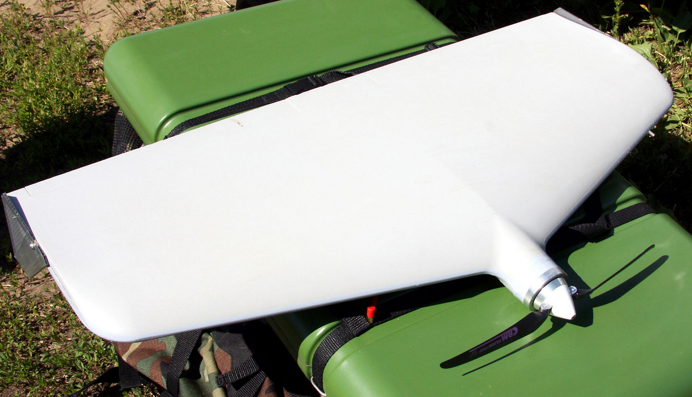

#### Kalustokuvaus

Vanhemman sukupolven kevyt mini-UAV lähitiedusteluun ja tulenkorjaukseen. Järjestelmä on ollut osa venäläisten maavoimien varhaista taktista UAV-rakennetta, mutta avoin lähdeaineisto on selvästi niukkaa.

#### Suorituskyvyt

- Asiantuntijalähteet kuvaavat Grushaa käsin laukaistavana lyhyen kantaman tiedustelualustana.
- Tarkat kantama-, hyötykuorma- ja sensoritiedot ovat avoimissa lähteissä puutteellisia tai ristiriitaisia.

#### Huomioitava analyysiin

Grushan analyysiarvo on enemmän historiallisessa ja rakenteellisessa kontekstissa kuin modernin kärki-ISR:n suorituskykynä. Se osoittaa, miten venäläinen taktinen UAV-kyky kehittyi ennen Orlanin ja uudemman ZALA/Supercam-sukupolven laajaa käyttöä.

#### Operatiiviset rajoitteet

Tietopuutteet ovat merkittäviä, eikä järjestelmän nykyisestä operatiivisesta asemasta ole avointa vahvaa varmennusta. Siksi järjestelmä kannattaa merkitä matalan luottamuksen nimikkeeksi.

#### Lähteet

- [Armada International – Russia's rapid UAV expansion](https://www.armadainternational.com/2019/03/russias-rapid-uav-expansion/)
- [Jamestown – Mission Impossible: Russia's Low-Tech-High-Tech Army](https://jamestown.org/mission-impossible-russias-low-tech-high-tech-army/)

### KUB-E
#### Kalustokuva

#### Kalustokuvaus

Loitering munition -järjestelmä täsmäiskuihin yksittäisiä maaleja vastaan. Se sijoittuu venäläisessä järjestelmässä Lancetin rinnalle kertakäyttöisenä isku-UAV:na, jonka painopiste on nopeassa maalin sitomisessa ja kustannustehokkaassa tulivaikutuksessa.

#### Suorituskyvyt

- Kalashnikovin mukaan KUB-E on tarkoitettu maalien tuhoamiseen ennalta annetuissa koordinaateissa ja osana loitering munition -kokonaisuutta.
- Tarkat kantama- ja taistelukärkitiedot vaihtelevat versioittain; uudemmissa KUB-vientiversioissa korostetaan panssaroitujen ajoneuvojen, komentopaikkojen ja ilmatorjuntajärjestelmien torjuntaa.

#### Huomioitava analyysiin

KUB-E kannattaa analysoida kertakäyttöisenä iskujärjestelmänä, jonka vahvuus on yksikköhinta–vaikutus-suhde eikä miehitetyn ilma-aluksen korvaaminen. Sen merkitys kasvaa, jos vastapuolen ilmatorjuntaa tai tykistöä pyritään painostamaan hajautetusti.

#### Operatiiviset rajoitteet

Suorituskyky riippuu voimakkaasti sensoriohjauksesta, linkistä ja maalinetsintäketjusta. Avoin data eri KUB-versioista on epätasaista, joten tarkat numerot on sidottava aina nimenomaan kyseiseen versioon.

#### Lähteet

- [Kalashnikov Group – KUB-E](https://en.kalashnikovgroup.ru/catalog/bespilotny-letatelnye-apparaty/kompleks-s-upravlyaemymi-boepripasami/kub-e)
- [Rostec – Lancet/KUB family export references](https://rostec.ru/en/media/news/rosoboronexport-unveils-lancet-e-system-at-army-2024/)

### Leer-3
#### Kalustokuva
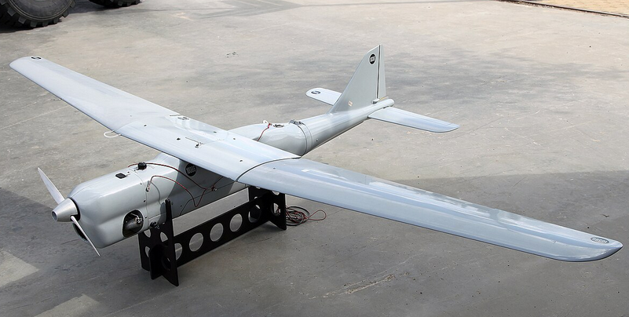

#### Kalustokuvaus

UAV-pohjainen elektronisen sodankäynnin ja tiedustelun järjestelmä, jossa Orlan-10-alustat tukevat viestiliikenteen häirintää, paikannusta ja informaatiovaikuttamista. Kyse on järjestelmäkokonaisuudesta, ei vain yksittäisestä lennokista.

#### Suorituskyvyt

- ODINin mukaan Leer-3 yhdistää ajoneuvoalustan häirintäkomponentit ja Orlan-10-UAV:t erityisesti matkapuhelinverkkojen häirintään, valvontaan ja viestivaikutukseen.
- Suorituskyky perustuu enemmän järjestelmäintegraatioon kuin lennokin kineettisiin ominaisuuksiin.

#### Huomioitava analyysiin

Leer-3 on analyysissa merkittävä, koska se yhdistää ilmassa olevan sensorin ja EW-vaikutuksen samaan ketjuun. Se voi tukea sekä joukkojen suojaa että vastapuolen viestiliikenteen häirintää ja paikannusta.

#### Operatiiviset rajoitteet

Teho riippuu sähkömagneettisesta ympäristöstä, verkkojen rakenteesta ja UAV:n selviytymisestä. Järjestelmä ei ole universaali ratkaisu kaikkiin viestiverkkoihin ja altistuu vastatoimille, jos toimintamalli tunnistetaan.

#### Lähteet

- [ODIN – Leer-3 EW system](https://odin.tradoc.army.mil/WEG/Asset/Leer-3_Russian_6x6_Mobile_Drone-Based_Electronic_Warfare_%28EW%29_System)
- [Rosoboronexport / Rostec context for Orlan systems](https://rostec.ru/en/media/news/rosoboronexport-offers-to-organize-production-and-service-of-russian-uavs-abroad-during-umex-2024/)

### Luch-Korsar
#### Kalustokuva
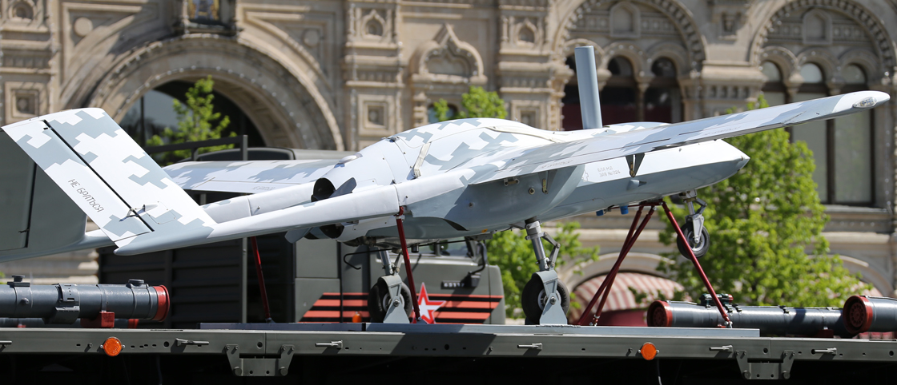

#### Kalustokuvaus

Keskiluokan taktinen UAV tiedusteluun, partiointiin ja valvontaan, jonka roolia on laajennettu myös mahdollisiin isku- ja EW-tehtäviin. Järjestelmä sijoittuu pienten taktisten UAV:iden ja raskaiden MALE-järjestelmien väliin.

#### Suorituskyvyt

- Rostecin mukaan Korsar kykenee sääriippumattomaan ilmatiedusteluun, partiointiin ja ilmakuvaukseen; lisäksi lähteissä mainitaan jopa noin 8 tunnin kesto ja yli 5 000 m toimintakorkeus.
- Kehityssuunnassa on korostettu toimintasäteen kasvattamista ja EW-ominaisuuksien lisäämistä.

#### Huomioitava analyysiin

Korsar on analyytikolle kiinnostava siksi, että se kuvastaa Venäjän yritystä rakentaa orgaanista keskiluokan UAV-kykyä. Käyttömäärät ja todellinen operatiivinen levinneisyys ovat kuitenkin avoimissa lähteissä epäselvempiä kuin Orlan- tai Forpost-järjestelmillä.

#### Operatiiviset rajoitteet

Ohjelman näkyvyys on ollut suurempi kuin avoimesti vahvistettu kenttävaikutus. Varianttien, testausvaiheiden ja todellisen palveluskäytön erottaminen on välttämätöntä.

#### Lähteet

- [Rostec – Korsar at ARMY-2019](https://rostec.ru/en/media/pressrelease/rostec-demonstrates-korsar-drone-at-army-2019/)
- [Rostec – Korsar unveiled / upgrade context](https://rostec.ru/en/media/news/rostec-will-unveil-korsar-drone-at-victory-parade/)

### Mohajer-6
#### Kalustokuva
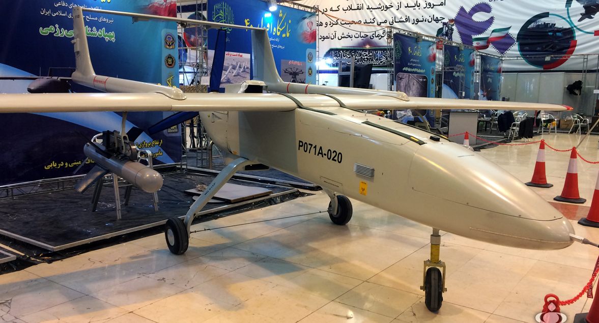

#### Kalustokuvaus

Iranilainen MALE-/taktinen isku- ja tiedustelu-UAV, jota on liitetty myös Venäjän käyttöön Ukrainassa. Järjestelmä yhdistää EO/IR-tiedustelun ja täsmäaseiden kantokyvyn samaan alustaan.

#### Suorituskyvyt

- ODIN kuvaa Mohajer-6:n monirooliseksi ISTAR/strike-järjestelmäksi; avoimissa lähteissä mainitaan jopa noin 12 tunnin kesto ja useiden ohjattujen aseiden kantokyky.
- Järjestelmä tarjoaa pidempää valvontaa ja orgaanisen iskuvaihtoehdon verrattuna pieniin tiedustelulennokkeihin.

#### Huomioitava analyysiin

Mohajer-6 on analyysissa hyödyllinen vertailukohta Venäjän oman Orion-/Forpost-luokan kyvykkyyksiin. Käyttö Venäjän joukoissa kannattaa kuitenkin erottaa iranilaisesta perusjärjestelmästä ja mahdollisista kenttämuutoksista.

#### Operatiiviset rajoitteet

Avoimissa lähteissä tekniset tiedot vaihtelevat alaversioittain ja lähteittäin. Järjestelmä on suurempi, kalliimpi ja haavoittuvampi kuin kulutettavat pien-UAV:t, mikä nostaa tappioherkkyyttä vertaisympäristössä.

#### Lähteet

- [ODIN – Mohajer-6](https://odin.tradoc.army.mil/WEG/Asset/Mohajer-6_Iranian_Unmanned_Aerial_Vehicle_%28UAV%29)

### Okhotnik-S-70
#### Kalustokuva

#### Kalustokuvaus

Raskas häivepiirteinen isku-UAV/UCAV, joka on suunniteltu korkeamman tason iskuihin ja mahdollisesti miehitetyn hävittäjätoiminnan rinnalle. Se edustaa Venäjän pyrkimystä rakentaa pitkälle kehittynyt miehittämätön taisteluilma-alus.

#### Suorituskyvyt

- ODINin mukaan järjestelmä voi saavuttaa noin 1 000 km/h nopeuden luokan ja hyödyntää häive- sekä flying wing -ratkaisua iskuroolissa.
- Avoimissa lähteissä korostetaan myös mahdollista yhteistoimintaa Su-57:n kanssa, mutta täysi operatiivinen konsepti ei ole julkisesti selvä.

#### Huomioitava analyysiin

Okhotnik on analyysissa ennen kaikkea teknologinen ja ohjelmallinen indikaattori, ei laajasti näkyvä kenttäjärjestelmä. Se kertoo Venäjän pyrkimyksestä siirtyä pelkistä taktisen tason lennokeista kohti strategisempaa miehittämätöntä ilma-asevaikutusta.

#### Operatiiviset rajoitteet

Tuotantomääristä, kypsyystasosta ja todellisesta palvelusvalmiudesta on edelleen epävarmuutta. Korkea yksikköarvo, ohjelmariski ja rajallinen määrä rajoittavat käytännön massavaikutusta.

#### Lähteet

- [ODIN – S-70 Okhotnik-B](https://odin.tradoc.army.mil/WEG/Asset/e294539d6f7c877842a5a8595fc535f5)
- [Rostec – serial production statement](https://rostec.ru/en/media/pressrelease/rostec-to-start-serial-production-of-okhotnik-heavy-attack-drones-in-2023/)

### Orion-E-Inokhodets
#### Kalustokuva
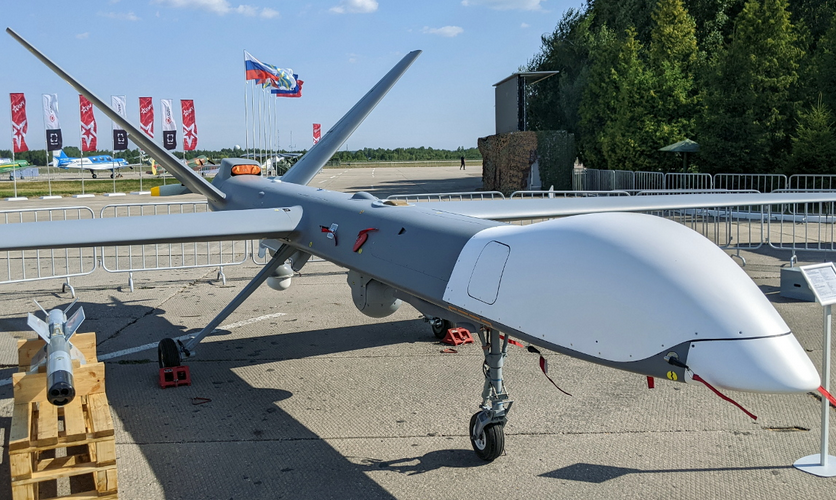
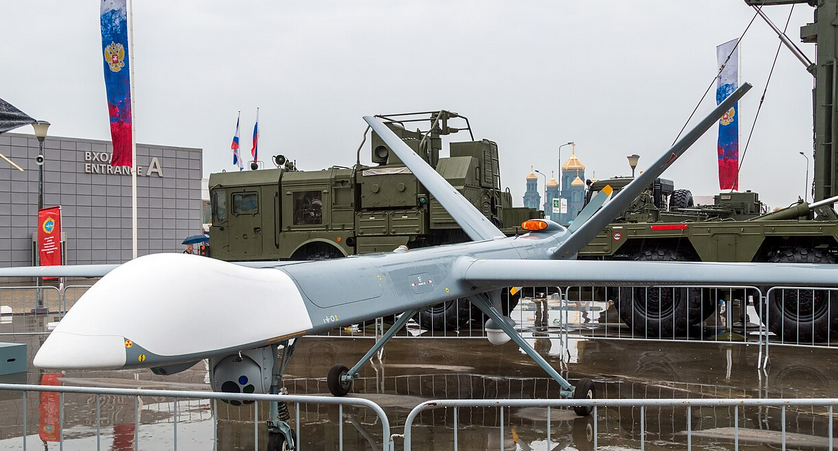
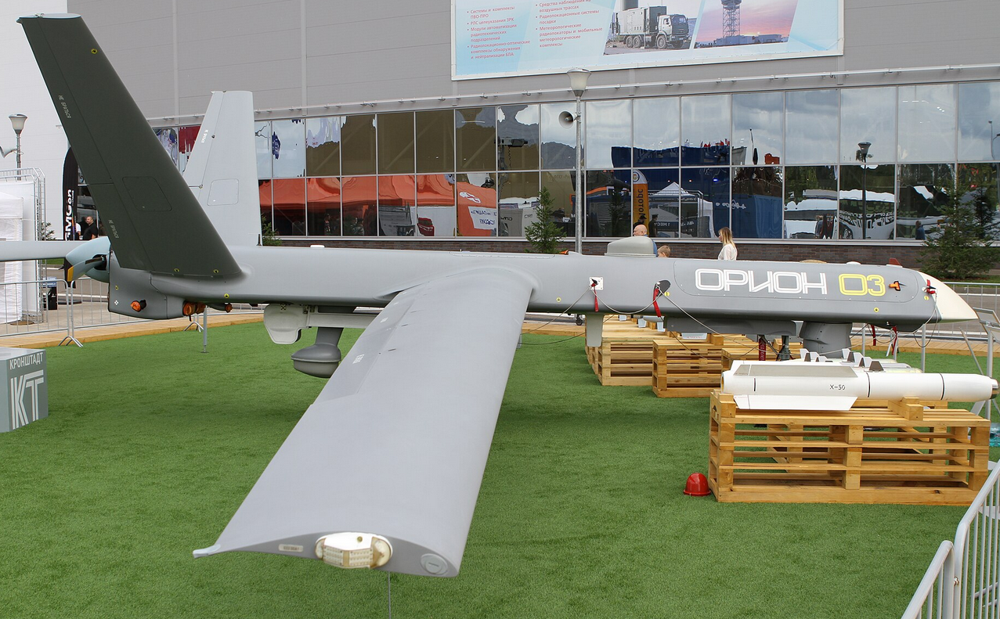

#### Kalustokuvaus

Venäläinen MALE-luokan tiedustelu- ja isku-UAV pitkäkestoiseen valvontaan, maalinosoitukseen ja tarkkuusiskuihin. Se on Venäjän näkyvin yritys rakentaa omaa Reaper-luokan kyvykkyyttä operatiiviselle tasolle.

#### Suorituskyvyt

- Rostec/Rosoboronexport kuvaa Orion-E:tä tiedustelu- ja iskujärjestelmäksi, joka on tarkoitettu pitkäkestoiseen aluevalvontaan ja maaliin vaikuttamiseen.
- Suorituskykyä on kuvattu pitkän keston, EO/IR-sensorien, datalinkin ja asekuorman yhdistelmänä; tarkat arvot vaihtelevat vienti- ja kotimarkkinaversioiden välillä.

#### Huomioitava analyysiin

Orion on analyytikolle tärkeä siksi, että se yhdistää pitkäkestoisen ISR:n ja orgaanisen tulivaikutuksen samaan alustaan. Se kertoo myös siitä, missä määrin Venäjä pystyy korvaamaan ulkoisia toimittajia omalla MALE-UAV-tuotannolla.

#### Operatiiviset rajoitteet

Järjestelmä on suurempi ja kalliimpi kuin etulinjan kulutettavat UAV:t, mikä lisää tappioherkkyyden kustannusvaikutusta. Avoimessa lähdeaineistossa kotimainen Inokhodets ja vientinimike Orion-E sekoittuvat usein.

#### Lähteet

- [Rostec – Orion-E references](https://rostec.ru/en/media/news/rosoboronexport-to-showcase-advanced-russian-solutions-at-xii-international-meeting-of-high-represen/)
- [Rosoboronexport – Orion-E export/market references](https://rostec.ru/en/media/news/rosoboronexport-offers-to-organize-production-and-service-of-russian-uavs-abroad-during-umex-2024/)

### Orlan-10
#### Kalustokuva
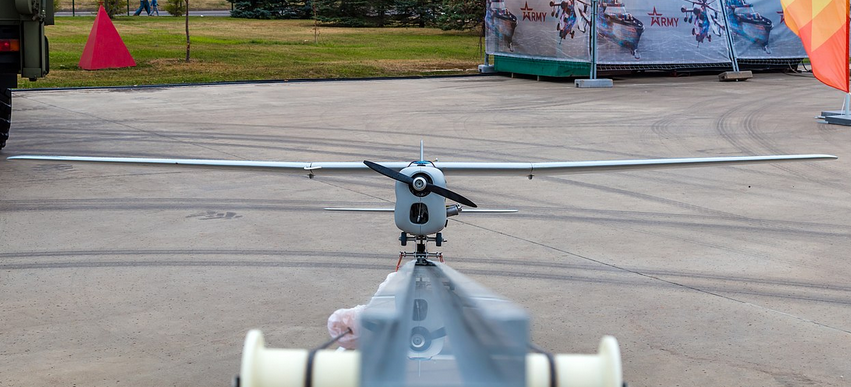

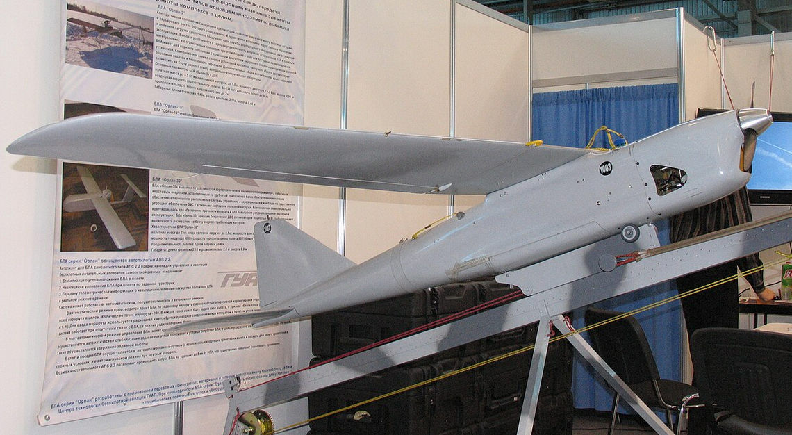

#### Kalustokuvaus

Venäjän yleisimpiin kuuluva taktinen monitoimi-UAV tiedusteluun, tulenkorjaukseen, maalinosoitukseen ja joissain kokoonpanoissa myös EW-/viestivaikutukseen. Se on käytännössä venäläisen maavoimatason ISR-järjestelmän perusalusta.

#### Suorituskyvyt

- ODINin mukaan Orlan-10 tukee monipuolisia sensorikuormia ja toimii mm. tiedustelussa, tykistön tulenkorjauksessa ja yhteistoiminnassa EW-järjestelmien kanssa.
- Järjestelmä tarjoaa selvästi etulinjan pikkulennokkeja pidemmän toiminta-ajan ja kantaman; tarkat numerot vaihtelevat lähteittäin ja versioittain.

#### Huomioitava analyysiin

Orlan-10 on analyysissa keskeinen referenssijärjestelmä, koska sen ympärille rakentuu paljon venäläistä tulenkäyttöä. Sen vaikutus syntyy mittakaavasta, jatkuvasta käytöstä ja järjestelmäintegraatiosta.

#### Operatiiviset rajoitteet

Alusta ei ole erityisen selviytymiskykyinen modernia elektronista sodankäyntiä tai ilmapuolustusta vastaan. Sen suuri käyttömäärä tekee siitä kuitenkin kulutettavan ja korvattavan, mikä osin kompensoi tappioita.

#### Lähteet

- [ODIN – Orlan-10](https://odin.tradoc.army.mil/WEG/Asset/Orlan-10_Russian_Unmanned_Aerial_Vehicle_%28UAV%29)
- [Rostec – Orlan export references](https://rostec.ru/en/media/news/rosoboronexport-to-unveil-latest-russian-weapons-and-civilian-equipment-at-sitdef-peru-2025/)

### Orlan-30
#### Kalustokuva
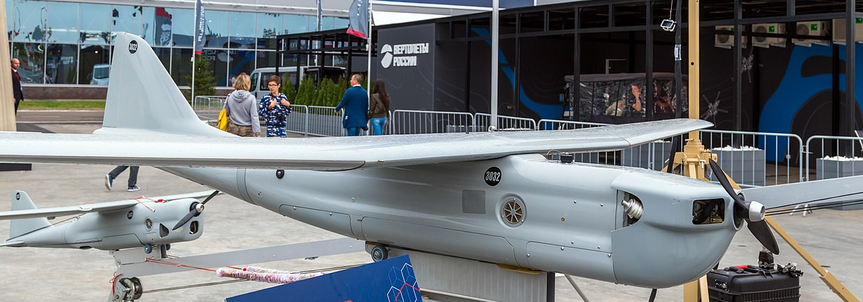
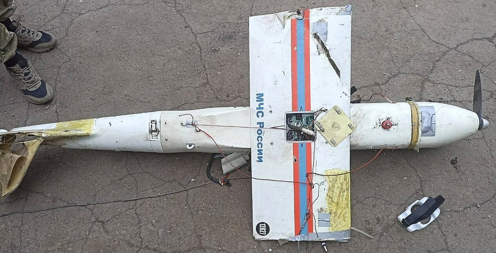
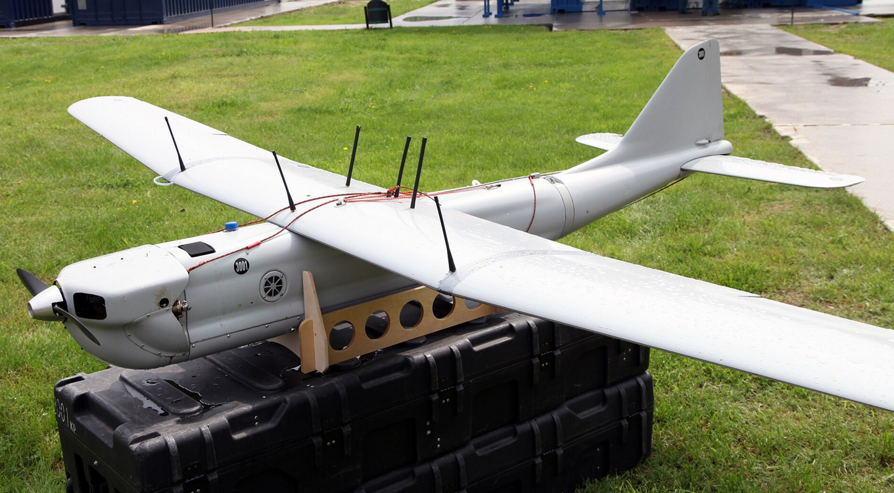

#### Kalustokuvaus

Orlan-10:n suurempi ja kehittyneempi johdannainen, joka on suunniteltu pidempään ISR-toimintaan ja erityisesti tarkemman maalinosoituksen tukemiseen. Järjestelmä on noussut esiin erityisesti tykistön ja täsmävaikutuksen sensorina.

#### Suorituskyvyt

- ODIN kuvaa Orlan-30:n Orlan-10:stä skaalatuksi versioksi, jossa on suurempi runko ja parempi suorituskyky.
- Avoimissa lähteissä korostetaan EO/IR-kykyä ja lasermaalinosoitusta; järjestelmä on erityisen relevantti Krasnopol-tyyppisten vaikutusketjujen kannalta.

#### Huomioitava analyysiin

Orlan-30 on analyytikolle tärkeä, koska se parantaa venäläisen tiedustelu–isku-ketjun tarkkuutta. Se on yksi niistä järjestelmistä, joissa sensorin laatu on taktisesti tärkeämpi kuin pelkkä lennokin määrä.

#### Operatiiviset rajoitteet

Järjestelmä on suurempi ja siten näkyvämpi sekä mahdollisesti kalliimpi kuin Orlan-10. Avoin lähdedata tarkasta määrävahvuudesta ja kaikista alaversioista on yhä rajallista.

#### Lähteet

- [ODIN – Orlan-30](https://odin.tradoc.army.mil/WEG/Asset/Orlan-30_Russian_Unmanned_Aerial_Vehicle_%28UAV%29)
- [Rostec – Orlan-30 references](https://rostec.ru/en/media/news/rosoboronexport-to-unveil-latest-russian-weapons-and-civilian-equipment-at-sitdef-peru-2025/)

### Supercam-S150
#### Kalustokuva

#### Kalustokuvaus

Kevyt taktinen tiedustelu-UAV lähi- ja keskimatkan valvontaan, tulenkorjaukseen ja maalinetsintään. Järjestelmä on osa venäläisten 2020-luvun uudemman sukupolven kenttä-UAV-arsenaalia.

#### Suorituskyvyt

- Valmistajan mukaan lentoaika on noin 2 tuntia, radioyhteys jopa noin 50 km ja videoyhteys noin 25 km, mikä tukee pataljoona-/prikaatitason ISR-käyttöä.
- Kuormavaihtoehtoihin kuuluvat ainakin näkyvän valon ja lämpökameraratkaisut.

#### Huomioitava analyysiin

Supercam S150 on analyysissa merkittävä, koska se tarjoaa halvan mutta käyttökelpoisen sensorin tykistön ja taktiikan tueksi. Se kuvastaa Venäjän siirtymää kohti laajempaa kaupallis-teollista UAV-ekosysteemiä.

#### Operatiiviset rajoitteet

Kevyt runko, sähköinen voimalinja ja line-of-sight-riippuvuus rajaavat syvyyssuuntaista käyttöä. Selviytymiskyky elektronista häirintää ja torjuntaa vastaan on rajallinen.

#### Lähteet

- [Supercam – S150](https://en.supercam.aero/catalog/supercams150)
- [GUR War&Sanctions – Supercam S150](https://war-sanctions.gur.gov.ua/en/uav/335)

### Supercam-S350
#### Kalustokuva

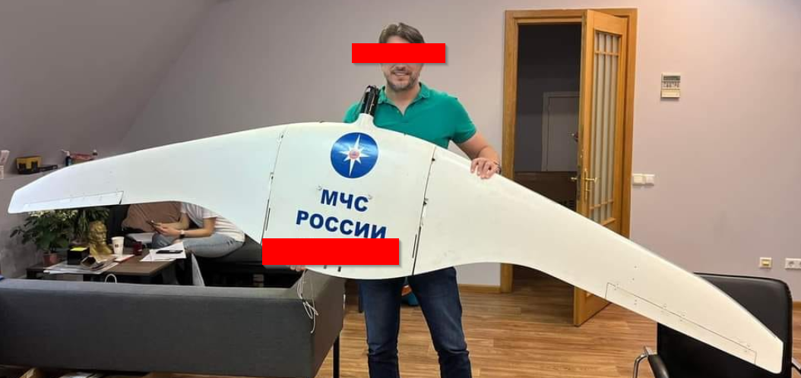
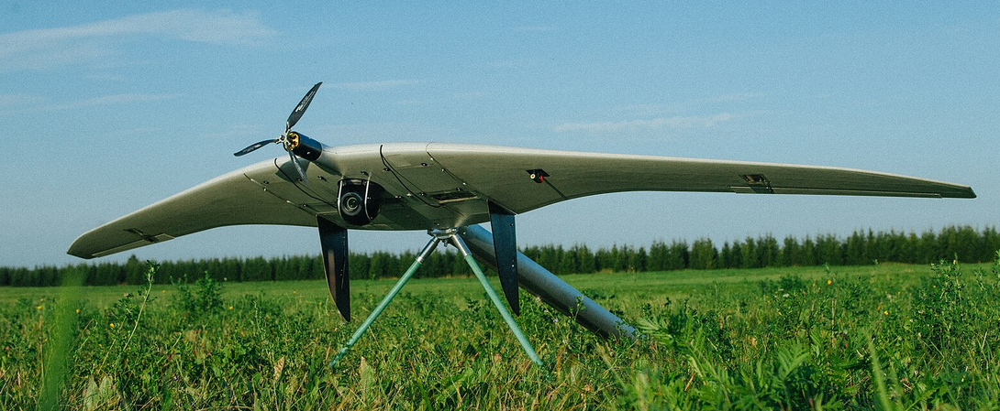

#### Kalustokuvaus

Keskiluokan taktinen tiedustelu-UAV pidempikestoiseen valvontaan, tulenkorjaukseen ja maalien paikantamiseen. Se on noussut näkyväksi sensoriksi erityisesti tykistöketjujen tukena.

#### Suorituskyvyt

- Valmistajan mukaan järjestelmä kykenee jopa noin 4,5 tunnin lentoon ja on suunniteltu ilmakuvaukseen, videovalvontaan sekä tulenkorjaukseen.
- Rostec on korostanut myös monialueista seurantaa, kartoitusta ja käytännön kenttäkokemusta.

#### Huomioitava analyysiin

Supercam S350 kannattaa huomioida yhtenä Venäjän tärkeimmistä nykyisistä taktisen tason ISR-alustoista. Sen vahvuus on käytännön käyttökelpoisuudessa, ei näyttävässä huipputeknologiassa.

#### Operatiiviset rajoitteet

Järjestelmä nojaa yhä datalinkkiin, GNSS:ään ja suhteellisen haavoittuvaan ilma-alustaan. Avoimissa lähteissä eri markkinointi- ja sotilasversioiden suorituskykytiedot eivät aina ole täysin yhteneviä.

#### Lähteet

- [Supercam – S350](https://en.supercam.aero/catalog/supercam-s350)
- [ODIN – Supercam S350](https://odin.tradoc.army.mil/WEG/Asset/955834539eadc753a28aa1f7843efa3e)
- [Rostec – Supercam S350](https://rostec.ru/en/media/news/rostec-showcased-at-idex-an-efficient-guidance-system-of-the-russian-army-the-supercam-drone/)

### Takhion
#### Kalustokuva

#### Kalustokuvaus

Lyhyen/keskipitkän kantaman taktinen tiedustelu-UAV päivää ja yötä tapahtuvaan havaintoon, maalinetsintään ja tulenkorjaukseen. Se on yksi venäläisen maavoimatason vakiintuneista pien-UAV-järjestelmistä.

#### Suorituskyvyt

- ODINin ja TASSin mukaan järjestelmä tukee EO/IR-kuormia, toimii viestivälittäjänä ja kykenee noin 6 tunnin kestoon sekä noin 40 km luokan toimintaan.
- Käyttöprofiili korostaa partiotiedustelua, kohteiden seurantaa ja tiedon välitystä omille joukoille.

#### Huomioitava analyysiin

Takhion on analyysissa hyödyllinen esimerkki venäläisestä keskikokoisesta taktisen tason ISR-alustasta, joka sijoittuu kevyiden Granat-järjestelmien ja laajemman Orlan-kerroksen väliin. Se tukee tulenkäyttöä mutta ei yksin muuta operatiivista tasapainoa.

#### Operatiiviset rajoitteet

Järjestelmä nojaa edelleen line-of-sight-ohjaukseen ja suhteellisen haavoittuvaan sensoriketjuun. Pieni koko ja matala nopeus altistavat sen elektroniselle häirinnälle ja lähitorjunnalle.

#### Lähteet

- [ODIN – Takhion](https://odin.tradoc.army.mil/WEG/Asset/bf3a83b98ecc201632a9895d1f6ee339)
- [TASS – Takhion in Russian service](https://tass.com/defense/848708)

### Yakovlev-Pchela
#### Kalustokuva
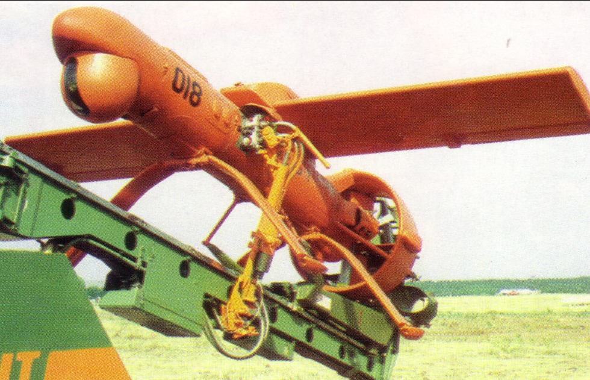

#### Kalustokuvaus

Varhaisen sukupolven venäläinen taktinen tiedustelu-UAV, jonka päärooli oli taistelukentän havainto ja tykistön tulenkorjaus. Järjestelmä on enemmän historiallisesti merkittävä kuin nykypäivän kärki-UAV.

#### Suorituskyvyt

- Pchela edusti Venäjän aikaisempaa yritystä rakentaa orgaanista taktista UAV-kykyä ennen laajaa modernia pienlennokkikalustoa.
- Avoimissa lähteissä järjestelmän nykyisestä palvelusasemasta on niukasti ajantasaista varmennusta.

#### Huomioitava analyysiin

Analyysissa Pchela toimii viitepisteenä venäläisen UAV-kehityksen evoluutiolle. Sen kautta voi selittää siirtymän vanhoista, raskaammista tiedustelulennokeista kohti hajautettuja taktisia UAV-järjestelmiä.

#### Operatiiviset rajoitteet

Järjestelmä on vanhentunut suhteessa nykyisiin EO/IR-, linkki- ja selviytymiskykyvaatimuksiin. Siksi sen suora sotilaallinen merkitys nykykentällä on todennäköisesti vähäinen.

#### Lähteet

- [FPRI – Russian Military Drones](https://www.fpri.org/wp-content/uploads/2023/11/russian-military-drones-.pdf)
- [CNAS/Facon – Perspective on Russia](https://www.frstrategie.org/sites/default/files/documents/publications/autres/2016/2016-facon-cnas-proliferated-drones.pdf)

### ZALA-421-08
#### Kalustokuva

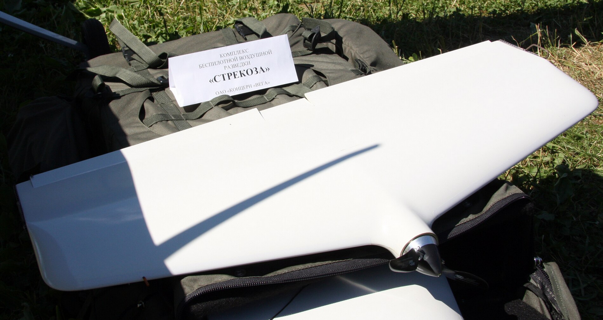

#### Kalustokuvaus

Kevyt kiinteäsiipinen tiedustelu-UAV lyhyen kantaman valvontaan, tulenkorjaukseen ja kohteiden havaintoon. Järjestelmä on yksi ZALA-perheen vakiintuneista pienistä ISR-alustoista.

#### Suorituskyvyt

- Valmistajan mukaan järjestelmä on suunniteltu valvontaan, maalinosoitukseen, tulen korjaukseen ja vaurioarviointiin.
- Painopiste on hiljaisessa toiminnassa, kevyessä rakenteessa ja nopeassa käyttöönotossa, ei raskaassa hyötykuormassa.

#### Huomioitava analyysiin

ZALA-421-08:n merkitys on joustavassa, lähelle etulinjaa vietävässä ISR-tuessa. Se tukee hajautettua toimintaa ja tarjoaa vaihtoehdon muiden kevyiden venäläisten tiedustelulennokkien rinnalle.

#### Operatiiviset rajoitteet

Kevyt alusta rajoittaa kantamaa, hyötykuormaa ja huonon sään kestävyyttä. Selviytymiskyky häirintää vastaan on rajallinen ilman lisäjärjestelmiä.

#### Lähteet

- [ZALA Aero – 421-08M](https://zala-aero.com/en/product/zala-421-08m-legkij-i-besshumnyj-bla/)
- [ZALA Aero – product family](https://zala-aero.com/en/products/bvs/)

### ZALA-421-16
#### Kalustokuva

#### Kalustokuvaus

ZALA-perheen suosittu taktinen kiinteäsiipinen tiedustelu-UAV ympärivuorokautiseen valvontaan ja tiedon välittämiseen. Järjestelmästä on useita alaversioita, mukaan lukien pitkän kantaman ja hybridivoimalinjan mallit.

#### Suorituskyvyt

- Valmistajan mukaan perusalustat tarjoavat tyypillisesti usean tunnin lentoajan, reaaliaikaisen videonsiirron ja EO/IR-havaintokyvyn.
- Joissain alaversioissa korostetaan jopa kymmenien tai satojen kilometrien etäkäyttöä, radiohiljaisuutta ja EW-kestävyyttä.

#### Huomioitava analyysiin

ZALA-421-16 on analyysissa tärkeä, koska se on laajalti käytetty ja muodostaa monille venäläisille joukoille käyttökelpoisen taktisen ISR-ratkaisun. Alaversion tunnistaminen on kuitenkin välttämätöntä ennen tarkkoja johtopäätöksiä.

#### Operatiiviset rajoitteet

Perhe on teknisesti hajanainen, joten yhden version suorituskykyä ei pidä yleistää kaikkiin 421-16-järjestelmiin. Linkkiriippuvuus ja kenttäkulutus rajoittavat vaikutusta vertaisympäristössä.

#### Lähteet

- [ZALA Aero – 421-16 product family](https://zala-aero.com/en/products/bvs/)
- [ZALA Aero – 421-16E5G](https://zala-aero.com/en/news/the-pervyj-otechestvennyj-bespilotnyj-kompleks-with-gibridnoj-silovoj-instanovkoj-zala-421-16e5g/)

### ZALA-421-22
#### Kalustokuva
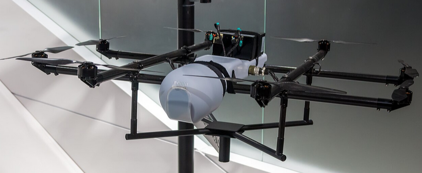
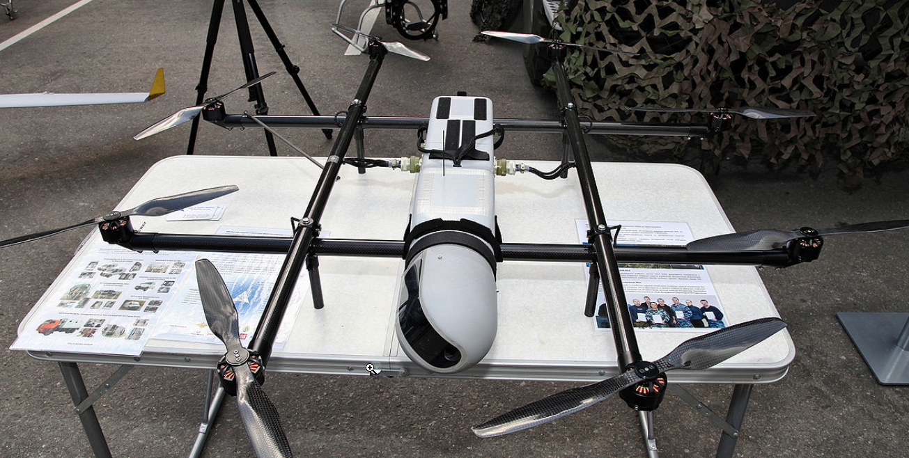

#### Kalustokuvaus

Pieni helikopterityyppinen UAV tarkkaan lähialueen valvontaan, kohteiden etsintään ja tehtäviin, joissa pystysuora nousu ja laskeutuminen on ratkaiseva. Se soveltuu erityisesti kohteisiin, joissa ei ole kiitotie- tai katapultti-infrastruktuuria.

#### Suorituskyvyt

- Valmistajan mukaan järjestelmä tukee valvontaa, laserskannausta ja jopa kevyttä kuljetusta sekä voi kantaa useita kuormia samanaikaisesti.
- VTOL-rakenne parantaa joustavuutta ahtaassa maastossa, mutta yleensä keston ja kantaman kustannuksella kiinteäsiipisiin ratkaisuihin verrattuna.

#### Huomioitava analyysiin

ZALA-421-22 on analyysissa hyödyllinen täsmätehtävien sensorina, ei laajan alueen pysyvänä peittojärjestelmänä. Sen vahvuus on käyttöympäristön joustavuudessa.

#### Operatiiviset rajoitteet

Roottorialusta on tyypillisesti hitaampi, äänekkäämpi ja lyhytkestoisempi kuin vastaavan kokoluokan kiinteäsiipinen UAV. Tämä rajoittaa syvyyssuuntaista tiedustelua ja lisää altistumista torjunnalle.

#### Lähteet

- [ZALA Aero – 421-22](https://zala-aero.com/en/product/zala-421-22-malogabaritnyj-bpla-vertoletnogo-tipa/)
- [ZALA Aero – 421-22 usage examples](https://zala-aero.com/en/news/bvs-zala-proshli-ispytanija-v-kazahstane/)

### ZALA-Lancet
#### Kalustokuva
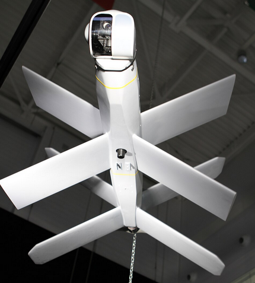

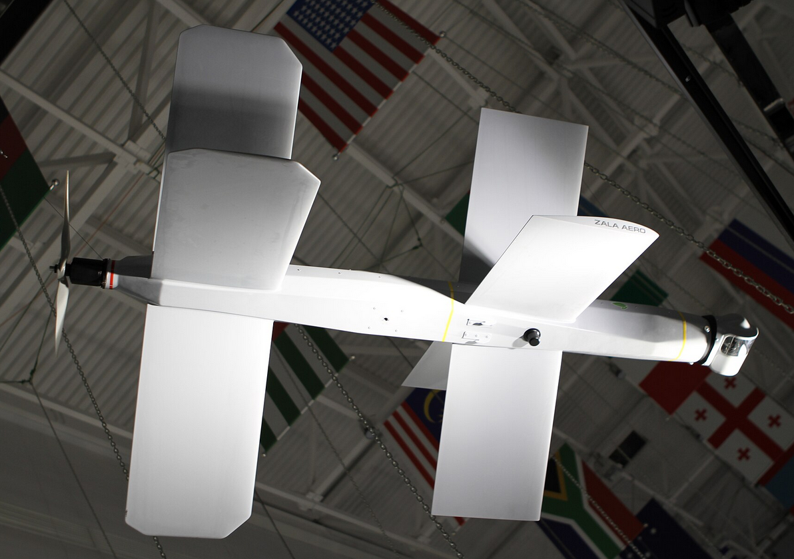

#### Kalustokuvaus

Kertakäyttöinen loitering munition -järjestelmä täsmäiskuihin korkean arvon maaleja vastaan. Lancet on noussut yhdeksi näkyvimmistä venäläisistä taistelukentän isku-UAV-järjestelmistä.

#### Suorituskyvyt

- Rostecin mukaan Lancet-E on osoittanut tehokkuutta erityisesti vastatykistötehtävissä ja nopeita maa- tai merimaaleja vastaan.
- Suorituskyky painottuu kohteen etsintään, terminal guidance -vaiheeseen ja tarkkaan kertaiskuun, ei pitkäkestoiseen ISR-partiointiin.

#### Huomioitava analyysiin

Lancet on analyysissa olennainen, koska se tarjoaa Venäjälle suhteellisen halvan keinon sitoa tykistöä, ilmatorjuntaa ja muuta korkean arvon kalustoa. Sen vaikutus näkyy erityisesti kuluttavassa vastatykistö- ja häirintäympäristössä.

#### Operatiiviset rajoitteet

Kertakäyttöisyys ja suhteellisen kevyt taistelukärki rajoittavat vaikutusta raskaasti suojattuihin maaleihin ilman osumaa kriittiseen kohtaan. Teho riippuu myös tiedusteluketjusta ja maalin havaitsemisesta ajoissa.

#### Lähteet

- [Rostec – Lancet-E at ADEX 2024](https://rostec.ru/en/media/news/rosoboronexport-to-exhibit-lancet-e-loitering-munition-system-overseas-for-first-time-at-adex-2024/)
- [Kalashnikov Group – Lancet/KUB news](https://en.kalashnikovgroup.ru/news/kalashnikov-kub-line-named-golden-idea)

### Zastava
#### Kalustokuva
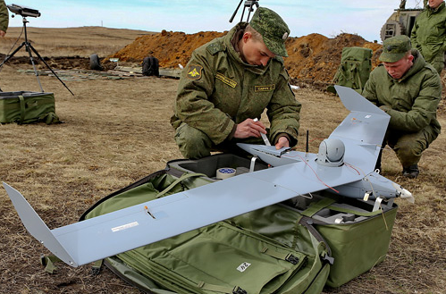

#### Kalustokuvaus

Kevyt lisenssivalmisteinen mini-UAV tiedusteluun ja tulenkorjaukseen. Avoimissa lähteissä se kuvataan venäläiseksi BirdEye 400 -johdannaiseksi, jota on käytetty lähialueen ISR-tehtävissä.

#### Suorituskyvyt

- CAR:n ja Jamestownin mukaan Zastavaa on käytetty Donbasissa, ja järjestelmä soveltuu valvontaan sekä tulen korjaukseen.
- Suorituskyvyn ydin on kevyt EO-tiedustelu eikä pitkäkestoinen syvyyssuuntainen käyttö.

#### Huomioitava analyysiin

Zastava on analyysissa kiinnostava erityisesti siksi, että se osoittaa Venäjän tukeutuneen pitkään myös lisenssi- ja ulkopohjaisiin UAV-ratkaisuihin. Sen sotilaallinen arvo on paikallistasolla, ei operatiivisessa syvyydessä.

#### Operatiiviset rajoitteet

Kevyen mini-UAV:n tavoin järjestelmä kärsii rajallisesta kantamasta ja hyötykuormasta. Avoimet tekniset tiedot ovat hajanaisia, joten yksityiskohtaiset arviot kannattaa pitää varovaisina.

#### Lähteet

- [Conflict Armament Research – Drones in Ukraine / Zastava evidence](https://storymaps.arcgis.com/stories/b9b6bca72ee54b0a9c5f683708248b32)
- [Jamestown – Russia's UAVs and UCAVs](https://jamestown.org/russias-uavs-and-ucavs-isr-and-future-strike-capabilities/)

## Miehittamattomat-maa-ajoneuvot

### Cobra-1600
#### Kalustokuva
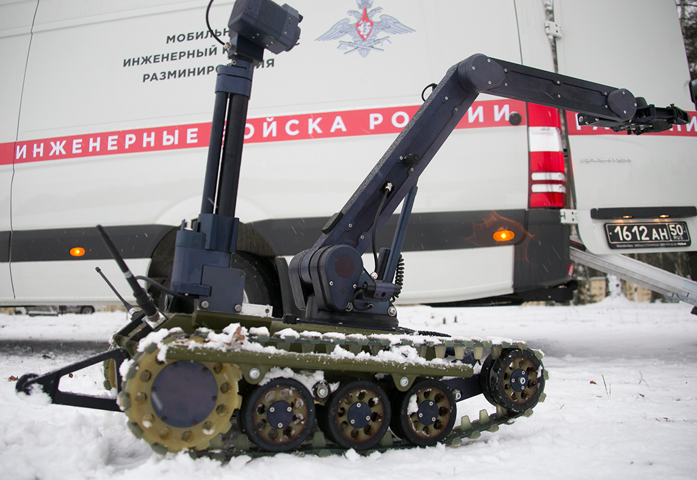

#### Kalustokuvaus
Kevyt sappari- ja EOD-robotti, jota käytetään epäilyttävien kohteiden etätarkastukseen, räjähteiden ensidiagnostiikkaan ja vaarallisten esineiden siirtämiseen. Avoimissa lähteissä se esiintyy ennen kaikkea pioneerijoukkojen tiedustelu- ja raivausrobotin roolissa.

#### Suorituskyvyt
- **Kamera- ja sensoripohjainen etätiedustelu (Кобра-1600 / Кобра-1600)**. Järjestelmä tukee visuaalista tiedustelua ja kohteiden ensitarkastusta ilman, että sapparin tarvitsee mennä välittömään vaaravyöhykkeeseen.
- **Manipulointi ja vaarallisten esineiden käsittely**. Lähteiden mukaan robotti voi käyttää erikoislisälaitteita ja siirtää neutraloituja räjähteitä erillisiin säiliöihin; tarkat kantama- ja kuorma-arvot jäävät avoimissa lähteissä niukoiksi.

#### Huomioitava analyysiin
Järjestelmä on enemmän pioneerijoukkojen riskin vähentämiseen tarkoitettu EOD-työkalu kuin taistelurobotti. Avoin lähdeaineisto on rajallista, joten suoritusarviot kannattaa pitää varovaisina.

#### Operatiiviset rajoitteet
Kevyen luokan EOD-robotin vaikutus riippuu voimakkaasti yhteydestä operaattoriin ja maasto-olosuhteista. Avoimista lähteistä ei löydy kattavaa kuvaa suojatasosta, autonomiasta tai taistelunkestävyydestä.

#### Lähteet
- CNA, *Artificial Intelligence and Autonomy in Russia* (Kobra-1600-luokitus ja rooli): https://www.cna.org/reports/2021/05/Artificial-Intelligence-and-Autonomy-in-Russia.pdf
- Army Guide, *Cobra-1600 EOD UGV for the first time entered service* : https://www.army-guide.com/eng/article/article_3240.html
- ICRC, *Autonomous Weapon Systems* (maininta Cobra-1600-järjestelmästä): https://icrcndresourcecentre.org/wp-content/uploads/2017/11/4283_002_Autonomus-Weapon-Systems_WEB.pdf

### Kapitan
#### Kalustokuva
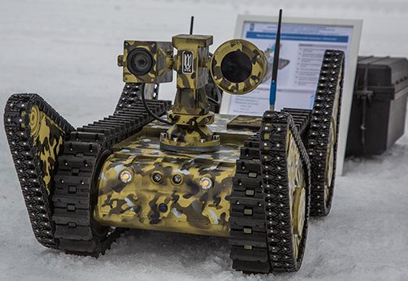

#### Kalustokuvaus
Modulaarinen telaketjuinen robottijärjestelmä, joka on suunnattu tiedustelu-, EOD- ja pioneeritehtäviin. Järjestelmä on esitetty ensisijaisesti monikäyttöisenä insinööri- ja valvontarobottina, ei raskaana taistelualustana.

#### Suorituskyvyt
- **Tiedustelu- ja pioneerikäyttö (Капитан / Kapitan)**. Lähteet kuvaavat järjestelmää ISR- ja miinanraivaustehtäviin soveltuvana alustana, jossa on manipulaattori ja mahdollisuus vaihtaa tehtävämoduuleja.
- **Etäohjattu työskentely vaaravyöhykkeellä**. ICDS:n mukaan järjestelmän ohjausetäisyys on noin 500 m kaupunkiympäristössä ja noin 1 km avoimessa maastossa; tarkempi sensorikokoonpano vaihtelee lähteittäin.

#### Huomioitava analyysiin
Kapitanin arvo on joustavuudessa: sama runko voidaan sovittaa tiedusteluun, raivaukseen ja mahdollisesti myös tuleviin EW- tai asemoduuleihin. Avoin tieto viittaa kuitenkin siihen, että järjestelmä on ollut rajallisen mittakaavan käyttöönotto- tai prototyyppivaiheessa.

#### Operatiiviset rajoitteet
Lyhyehkö ohjausetäisyys ja line-of-sight-tyyppinen käyttö rajoittavat sen hyötyä tulen alla tai rakennetussa maastossa. Avoimista lähteistä ei löydy varmistettua tietoa laajasta sarjatuotannosta tai vakiintuneesta taistelukäytöstä.

#### Lähteet
- CNA, *Artificial Intelligence and Autonomy in Russia* (Kapitan-taulukko ja rooli): https://www.cna.org/reports/2021/05/Artificial-Intelligence-and-Autonomy-in-Russia.pdf
- ICDS, *The Rise of Russia's Military Robots* : https://icds.ee/wp-content/uploads/2021/02/ICDS-Analysis_The-Rise-of-Russias-Military-Robots_Sten-Allik-et-al_February-2021.pdf
- Army Recognition, *Russian engineer troops to receive Kapitan unmanned tracked robot UGV* : https://armyrecognition.com/focus-analysis-conflicts/army/defence-security-industry-technology/russian-engineer-troops-to-receive-kapitan-unmanned-tracked-robot-ugv

### Marker
#### Kalustokuva

#### Kalustokuvaus
Kokeellinen ja modulaarinen miehittämätön maa-ajoneuvo, jota on kehitetty autonomian, sensorifuusion ja asemoduulien testialustaksi. Se on enemmän teknologinen kehitysalusta kuin laajasti vakiintunut sarjatuotettu kenttäjärjestelmä.

#### Suorituskyvyt
- **Autonominen liikkuminen ja ryhmätoiminta (Маркер / Marker)**. Lähteet korostavat autonomista navigointia, konehavainnointia ja kykyä toimia osana useamman robotin tai droonin verkkoa.
- **Modulaarinen ase- ja tehtäväkuorma**. Julkisesti esitellyissä kokoonpanoissa järjestelmään on liitetty tiedustelu-, tulituki- ja panssarintorjuntamoduuleja; ilmoitetut nopeus- ja toimintasädearvot vaihtelevat lähteittäin ja perustuvat usein demonstraatiokokoonpanoihin.

#### Huomioitava analyysiin
Markeria kannattaa tarkastella ennen kaikkea teknologiaohjelmana, jonka tarkoitus on kypsyttää venäläisiä UGV-ratkaisuja. Julkinen keskustelu sen ympärillä on osin demonstratiivista, joten ilmoitettujen kykyjen ja todellisen operatiivisen käyttöönoton väliin jää epävarmuutta.

#### Operatiiviset rajoitteet
Autonomiaan ja verkottumiseen perustuvat suorituskyvyt ovat herkkiä häirinnälle, navigointiongelmille ja ohjelmiston kypsyydelle. Avoimista lähteistä ei saa täysin varmistettua kuvaa laajasta palveluskäytöstä tai tuotantomääristä.

#### Lähteet
- Army Technology, *Marker Anti-Tank Robotic Unmanned Ground Vehicle* : https://www.army-technology.com/projects/marker-anti-tank-ugv-russia/
- Fletcher School / European Security & Defence, *Russian UGV developments influenced by Ukraine War* : https://sites.tufts.edu/fletcherrussia/russian-ugv-developments-influenced-by-ukraine-war/
- Automated Research / IISS Military Balance+ reference page, *Androidnaya Tekhnika Marker UGV* : https://automatedresearch.org/weapon/androidnaya-tekhnika-marker-ugv/

### MRK-3
#### Kalustokuva
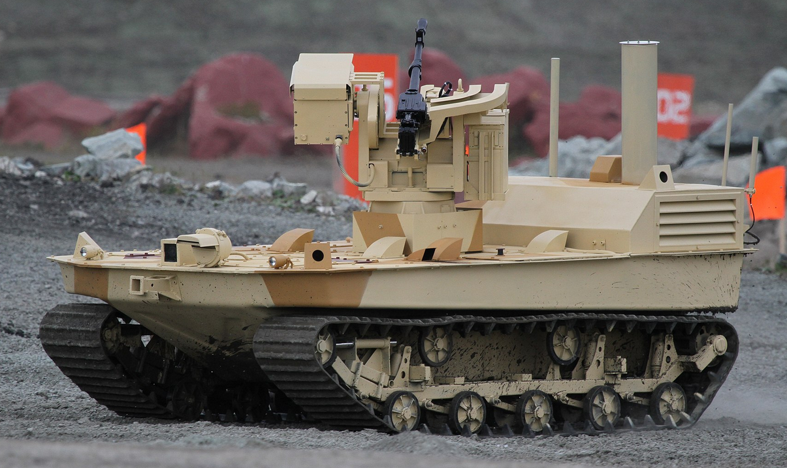

#### Kalustokuvaus
Avoimissa lähteissä MRK-3 esiintyy miehittämättömänä maa-ajoneuvona, jonka rooliksi kuvataan taistelutuki tai partiointi. Järjestelmästä on kuitenkin julkisesti saatavilla hyvin vähän varmennettua teknistä tietoa.

#### Suorituskyvyt
- **Taistelutuki ja partiointi (МРК-3 / MRK-3)**. Julkiset lähteet luokittelevat järjestelmän combat support/patrol -rooliin, mutta tarkka aseistus, sensorit ja suoritusarvot eivät avaudu luotettavasti avoimissa lähteissä.
- **Tietoaukko**. Kantama-, nopeus-, suojataso- ja ohjausjärjestelmätiedot puuttuvat tai ovat liian hajanaisia varmaan kuvaukseen.

#### Huomioitava analyysiin
MRK-3:n kohdalla analyytikon on syytä erottaa toisistaan pelkkä järjestelmän olemassaolo ja sen todellinen operatiivinen merkitys. Avoin lähdeaineisto ei tällä hetkellä riitä vahvaan suorituskykyarvioon.

#### Operatiiviset rajoitteet
Koska luotettavaa teknistä tietoa on vähän, myös käyttöympäristöä ja taistelukestävyyttä koskevat arviot jäävät epävarmoiksi. Järjestelmä kannattaa merkitä tietokantaan matalan luottamustason kohteena.

#### Lähteet
- CNA, *Artificial Intelligence and Autonomy in Russia* (yleinen venäläisten UGV-järjestelmien kooste): https://www.cna.org/reports/2021/05/Artificial-Intelligence-and-Autonomy-in-Russia.pdf
- Wikipedia-listhaku osoittaa MRK-3:n esiintyvän julkisissa kalustoluetteloissa, mutta ei täytä yksin luotettavan lähteen vaatimusta; siksi varsinaista teknistä kuvausta ei ole laajennettu.

### MRK-35MA
#### Kalustokuva
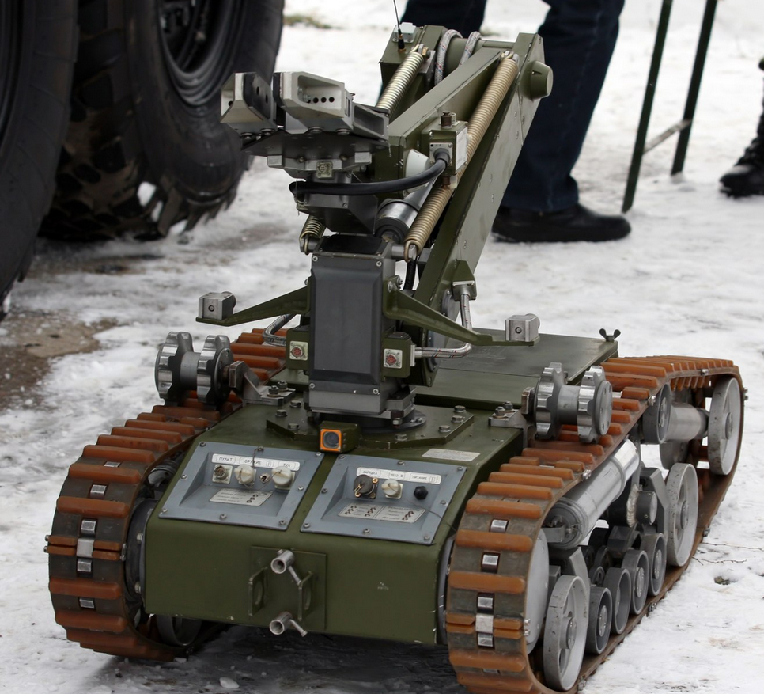

#### Kalustokuvaus
MRK-35MA kuuluu avoimissa lähteissä pieniin robottijärjestelmiin, joita liitetään tiedustelu-, raivaus- tai CBRN-tyyppisiin tehtäviin. Julkinen tekninen aineisto on kuitenkin niukkaa ja osin epäyhtenäistä.

#### Suorituskyvyt
- **Tiedustelu- ja erikoistehtävät (МРК-35МА / MRK-35MA)**. Julkisissa kalustoluetteloissa se esiintyy yhdessä MRK-RKh-järjestelmän kanssa, mikä viittaa tiedustelu-/erikoistehtäväkäyttöön, mutta tarkka rooli vaihtelee lähteittäin.
- **Tietoaukko**. Luotettavat avoimet lähteet eivät tarjoa varmistettuja arvoja esimerkiksi ohjausetäisyydestä, sensoreista tai kuormankannosta.

#### Huomioitava analyysiin
MRK-35MA:n osalta turvallisin tapa on kuvata se pienen luokan erikoisrobotiksi ja merkitä suoritusarviot matalan luottamuksen tiedoksi. Vahvoja johtopäätöksiä ei kannata tehdä ilman lisälähteitä.

#### Operatiiviset rajoitteet
Niukka lähdeaineisto tekee vaikeaksi arvioida, onko järjestelmä prototyyppi, rajattu erikoisväline vai laajemmin käytössä oleva alusta. Käyttöä rajoittaa analyysissä ennen kaikkea tiedon puute.

#### Lähteet
- CNA, *Artificial Intelligence and Autonomy in Russia* (UGV-yleiskooste): https://www.cna.org/reports/2021/05/Artificial-Intelligence-and-Autonomy-in-Russia.pdf
- Julkisissa kalustoluetteloissa esiintyvä luokittelu viittaa järjestelmän olemassaoloon, mutta tarkat suorituskykytiedot puuttuvat; tästä syystä kuvaus on pidetty tarkoituksella varovaisena.

### MRK-46
#### Kalustokuva
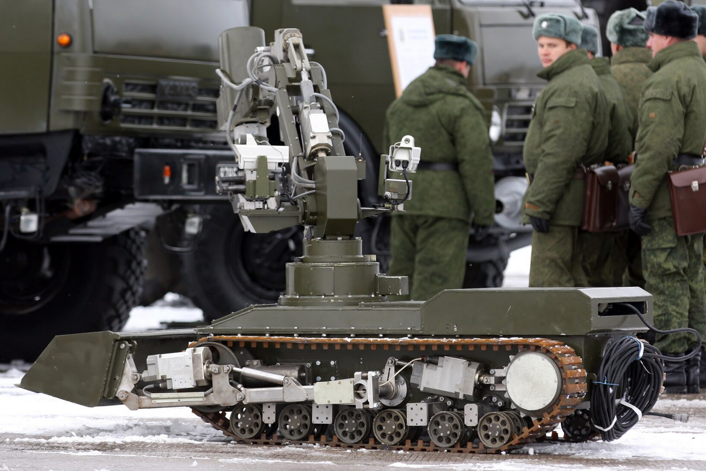

#### Kalustokuvaus
MRK-46 on pieni telaketjuinen robottijärjestelmä, joka on suunnattu tiedustelu- ja miinanraivaus-/EOD-tehtäviin. Se edustaa vanhemman sukupolven insinöörirobotteja, joissa painottuu manipulaatio ja etätyöskentely.

#### Suorituskyvyt
- **Tiedustelu ja raivaus (МРК-46 / MRK-46)**. Lähteet kuvaavat järjestelmää tiedustelu- ja mine clearing -rooliin soveltuvana alustana.
- **Manipulaattori ja kaapeliohjaus**. Army Guiden mukaan alustassa on manipulaattori, etukuormaajamainen työlaite, kamerat ja kaapelinlaskuyksikkö; ohjaus tapahtuu kaapelilla, mikä rajoittaa etäisyyttä mutta tukee häiriönsietoa.

#### Huomioitava analyysiin
MRK-46:n profiili viittaa perinteiseen EOD-/insinöörirobotin logiikkaan, jossa tärkeintä on turvallinen etäkäyttö eikä korkea liikenopeus tai tulivoima. Kaapeliohjaus on analyytikolle merkittävä tunnuspiirre.

#### Operatiiviset rajoitteet
Kaapeliohjaus rajoittaa liikkuvuutta, toimintasädettä ja käyttöä monimutkaisessa maastossa. Järjestelmä ei vaikuta olevan suunniteltu korkean intensiteetin taistelukentän etulinjakäyttöön.

#### Lähteet
- Army Guide, *MRK-46M (Robot, Unmanned Vehicle)* : https://www.army-guide.com/eng/product4735.html
- CNA, *Artificial Intelligence and Autonomy in Russia* (venäläisten UGV-järjestelmien kooste): https://www.cna.org/reports/2021/05/Artificial-Intelligence-and-Autonomy-in-Russia.pdf

### Nerekhta
#### Kalustokuva
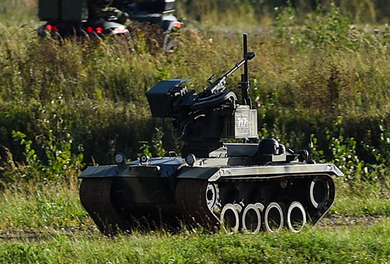

#### Kalustokuvaus
Monikäyttöinen telaketjuinen robottialusta, jota on kehitetty vartiointi-, tiedustelu-, tulituki- ja logistiikkatehtäviin. Järjestelmä on tunnettu ennen kaikkea kokeellisena tai rajatusti käyttöönotettuna aseistetun UGV:n kehityslinjana.

#### Suorituskyvyt
- **Moniroolinen tehtävämodulaarisuus (Нерехта / Nerekhta)**. Lähteiden mukaan alusta voidaan sovittaa vartiointiin, tiedusteluun, haavoittuneiden evakuointiin ja tulitukitehtäviin.
- **Aseistettavat ja sensoroidut variantit**. Avoimissa lähteissä järjestelmästä on esitetty tiedustelu- ja asemoduuliversioita, mutta yksityiskohtainen suoritusarvio jää osin prototyyppitason tiedoksi.

#### Huomioitava analyysiin
Nerekhta on kiinnostava siksi, että se näyttää toimineen välivaiheen alustana venäläisessä aseistettujen UGV-järjestelmien kehityksessä. Sen kohdalla on syytä erottaa teknologinen näyttöarvo ja todellinen laaja kenttäkäyttö.

#### Operatiiviset rajoitteet
Järjestelmän aseistaminen ei automaattisesti tee siitä taistelukentällä kestävää, jos yhteydet, havainnointi tai liikkuminen häiriintyvät. Avoimet lähteet viittaavat rajalliseen tuotantoon ja kokeelliseen käyttöön, eivät laajaan vakiintuneeseen palvelukseen.

#### Lähteet
- CNA, *Artificial Intelligence and Autonomy in Russia* (Nerekhta-rivi): https://www.cna.org/reports/2021/05/Artificial-Intelligence-and-Autonomy-in-Russia.pdf
- Army Guide, *Nerekhta Armed Unmanned Ground Vehicle* : https://www.army-guide.com/eng/product5206.html
- MAD Scientist, *Autonomous Robotic Systems in the Russian Ground Forces* : https://madsciblog.tradoc.army.mil/120-autonomous-robotic-systems-in-the-russian-ground-forces/

### Prokhod-1
#### Kalustokuva
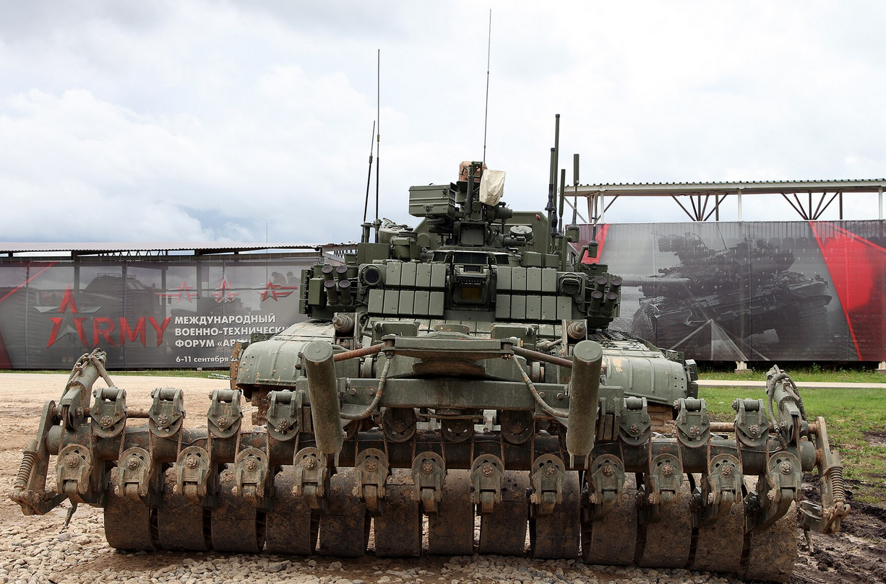

#### Kalustokuvaus
Raskas miehittämätön miinanraivausjärjestelmä, joka perustuu BMR-3MA/T-90-perheen alustaan ja on suunniteltu avaamaan kulkukelpoisia reittejä miinoitetulla alueella. Se kuuluu selvästi insinöörijoukkojen läpimurto- ja reitinavauskalustoon, ei yleiskäyttöiseen robottiajoneuvoluokkaan.

#### Suorituskyvyt
- **Raskas mekaaninen miinanraivaus (Проход-1 / Prokhod-1)**. Lähteiden mukaan järjestelmä käyttää raskasta raivauslaitteistoa ja on tarkoitettu anti-tank- ja anti-personnel -miinoitettujen alueiden läpäisyyn.
- **Raskas panssaroitu alusta ja lisäsuojat**. Julkisissa lähteissä mainitaan TMT-S-tyyppinen aura-/rullaraivauskalusto, mahdollinen elektromagneettinen lisälaite sekä radio-ohjattujen räjähteiden häirintä; yksityiskohtaiset suoritusarvot vaihtelevat lähteittäin.

#### Huomioitava analyysiin
Prokhod-1:n merkitys on operatiivinen: se mahdollistaa reitinavauksen mekanisoiduille joukoille uhkaympäristössä, jossa kevyt raivausrobotti ei riitä. Kyse on enemmän miehittämättömästä pioneeriläpimurtojärjestelmästä kuin yleisrobotista.

#### Operatiiviset rajoitteet
Suuri koko, hidas eteneminen ja ennakoitava käyttötapa tekevät järjestelmästä näkyvän ja potentiaalisesti haavoittuvan tulenkäytölle. Sen hyöty riippuu myös siitä, kuinka hyvin kauko-ohjaus ja suojaus toimivat häirityssä ympäristössä.

#### Lähteet
- CNA, *Artificial Intelligence and Autonomy in Russia* (Prokhod-1-rivi): https://www.cna.org/reports/2021/05/Artificial-Intelligence-and-Autonomy-in-Russia.pdf
- U.S. Army ODIN WEG, *Prokhod-1* (yleisviite CNA:n kautta; ODIN ei noussut suoraan haussa samalla tavoin kuin Uran-järjestelmät)
- U.S. Government, *Russian Robotics* : https://www.govinfo.gov/content/pkg/GOVPUB-D110-PURL-gpo154007/pdf/GOVPUB-D110-PURL-gpo154007.pdf
- Topwar summary of modernization aspects (käytetty vain täydentävänä, ei yksin): https://en.topwar.ru/251379-modernizacija-veprja-razvitie-tjazhelyh-rtk-razminirovanija.html

### Uran-14
#### Kalustokuva
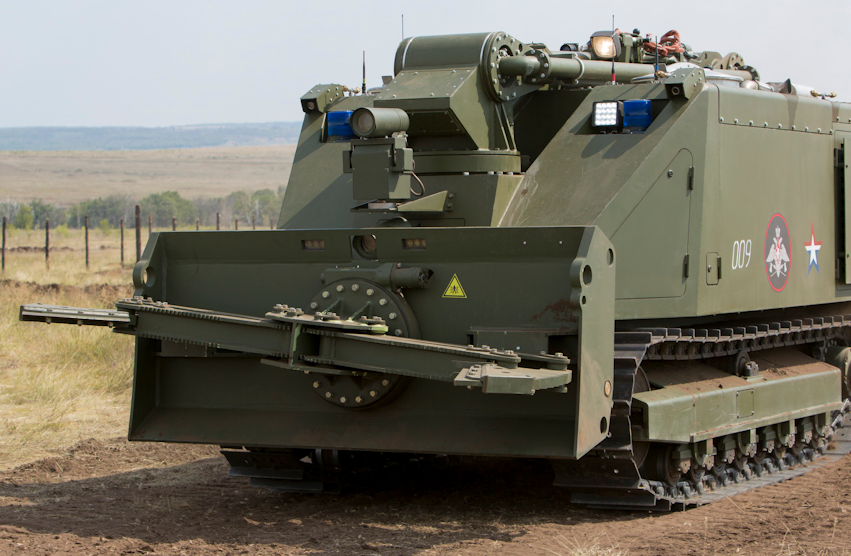

#### Kalustokuvaus
Raskas telaketjuinen miehittämätön erikoisajoneuvo, jonka päärooli on palontorjunta vaarallisissa tai vaikeapääsyisissä kohteissa. Se sijoittuu insinööri- ja pelastusrobotin kategoriaan, vaikka joissain lähteissä mainitaan myös toissijaisia raivaus- ja tukitehtäviä.

#### Suorituskyvyt
- **Palontorjunta vaaravyöhykkeellä (Уран-14 / Uran-14)**. ODIN ja Army Technology kuvaavat järjestelmää ensisijaisesti tulipalojen sammuttamiseen kohteissa, joissa miehistön lähettäminen olisi riskialtista.
- **Etäohjaus ja raskas työkalukuorma**. Julkiset lähteet mainitsevat vesisuihku-/sammutustehtävät, puskurimaisen työskentelyn ja noin 12 km/h maksiminopeuden; tarkat tehtävämoduulit vaihtelevat kokoonpanon mukaan.

#### Huomioitava analyysiin
Uran-14 ei ole taistelu-UGV vaan erikoistunut pelastus- ja insinöörijärjestelmä. Sen käyttö voi kuitenkin vapauttaa henkilöstöä pois korkean riskin kohteista ja tukea toiminnan jatkuvuutta vaurioituneilla alueilla.

#### Operatiiviset rajoitteet
Hidas nopeus ja erikoistunut tehtäväprofiili rajaavat käyttöä dynaamisessa taistelutilanteessa. Järjestelmä on hyödyllisin, kun kohde voidaan eristää ja toimintaympäristö on ainakin osittain hallittu.

#### Lähteet
- U.S. Army ODIN WEG, *Uran-14 Russian Unmanned Ground Vehicle* : https://odin.tradoc.army.mil/WEG/Asset/768e37ddba5c1e8b11fe71e62f29d75c
- Army Technology, *Uran-14 Multi-Mission Unmanned Ground Vehicle* : https://www.army-technology.com/projects/uran-14-multi-mission-unmanned-ground-vehicle/
- U.S. Government, *Russian Robotics* : https://www.govinfo.gov/content/pkg/GOVPUB-D110-PURL-gpo154007/pdf/GOVPUB-D110-PURL-gpo154007.pdf

### Uran-6
#### Kalustokuva
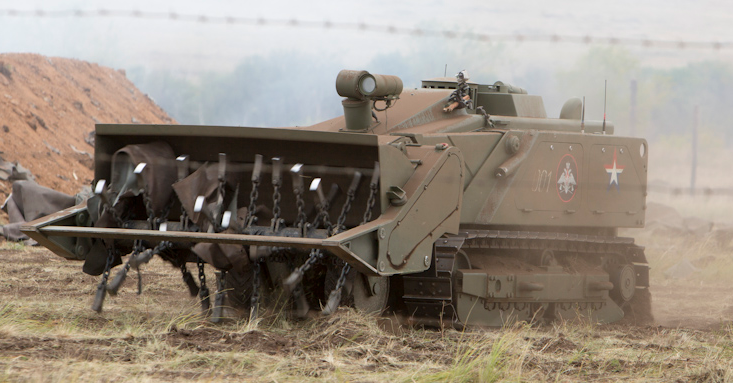

#### Kalustokuvaus
Miehittämätön miinanraivausjärjestelmä, joka on suunniteltu pioneerijoukkojen käyttöön miinojen, räjähteiden ja räjähtämättömien ammusten poistamiseen. Se on yksi tunnetuimmista venäläisistä insinöörirobotteista ja avoimissa lähteissä selvästi operatiiviseen käyttöön liitetty järjestelmä.

#### Suorituskyvyt
- **Miinanraivaus ja alueen puhdistus (Уран-6 / Uran-6)**. Rosoboronexportin ja ODINin mukaan järjestelmä on modulaarinen ja tarkoitettu jalkaväki- ja panssarimiinojen sekä IED-uhkien käsittelyyn.
- **Etäohjattu käyttö vaaravyöhykkeellä**. Julkisissa lähteissä ohjausetäisyydeksi ilmoitetaan enintään noin 1 km, ja järjestelmä käyttää vaihdettavia työvälineitä erilaisiin raivaustehtäviin.

#### Huomioitava analyysiin
Uran-6:n vahvuus on henkilöstöriskin pienentäminen pioneeritehtävissä. Se on yksi niistä venäläisistä UGV-järjestelmistä, joista on tarjolla suhteellisen yhtenäinen ja virallisilla lähteillä tuettu kuva.

#### Operatiiviset rajoitteet
Järjestelmä ei korvaa raskasta panssaroitua läpimurtoajoneuvoa eikä sovi itsenäiseen taistelutehtävään. Sen tehokkuus riippuu maastosta, uhkaympäristöstä ja siitä, säilyykö häiriötön ohjausyhteys.

#### Lähteet
- U.S. Army ODIN WEG, *Uran-6 Russian Demining Unmanned Ground Vehicle* : https://odin.tradoc.army.mil/WEG/Asset/b28843e4844525b701899963cbded72f
- Rosoboronexport, *Uran-6* : https://roe.ru/en/production/land-forces/engineer-equipment/uran-6/?theme=theme-green
- Army Recognition, *Uran-6 UGV MRTK-R* : https://armyrecognition.com/military-products/army/unmanned-systems/unmanned-ground-vehicles/uran-6-ugv-mrtk-r

### Uran-9
#### Kalustokuva
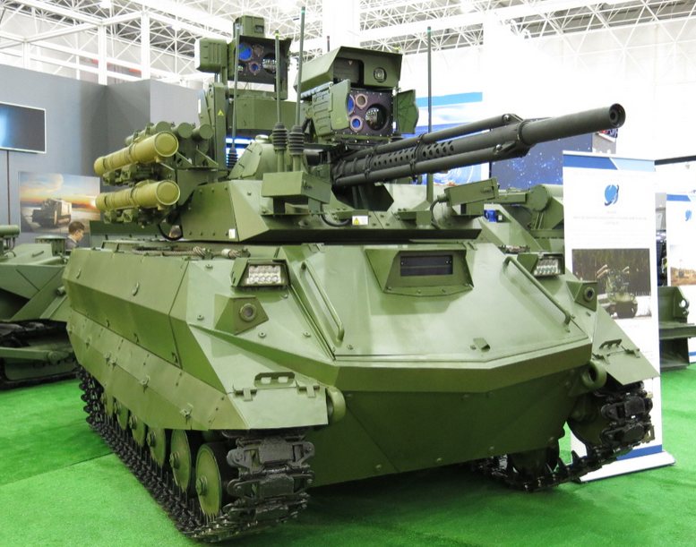

#### Kalustokuvaus
Aseistettu telaketjuinen taistelurobotti, joka on kehitetty tiedustelu-, tulituki- ja terrorisminvastaisiin tehtäviin. Se on venäläisen UGV-kehityksen tunnetuin taistelualusta, mutta samalla yksi niistä, joiden todellisesta kenttäkypsyydestä on eniten kriittisiä huomioita.

#### Suorituskyvyt
- **Suora tulituki ja asemoduulit (Уран-9 / Uran-9)**. ODINin mukaan järjestelmä voi käyttää 30 mm 2A72 -automaattitykkiä, 7,62 mm PKTM-konekivääriä, Ataka-panssarintorjuntaohjuksia ja joissain kokoonpanoissa myös muita aseita.
- **Sensoroitu tiedustelu ja etäkäyttö**. Julkisissa lähteissä korostuvat elektro-optiset sensorit, laser-etäisyysmittaus ja noin 3 km ohjausetäisyys, mutta käytännön suorituskyky on saanut kritiikkiä todellisissa käyttöoloissa.

#### Huomioitava analyysiin
Uran-9 on tärkeä enemmän konseptin ja kehityssuunnan kuin kiistattoman operatiivisen menestyksen vuoksi. Julkiset arviot, mukaan lukien venäläisiin raportteihin viittaavat länsilähteet, ovat nostaneet esiin yhteys-, havainnointi- ja luotettavuusongelmia.

#### Operatiiviset rajoitteet
Etäyhteyteen nojaava asejärjestelmä on altis häirinnälle, katveille ja monimutkaisen maaston aiheuttamille rajoitteille. Vaikka aseistus on raskas, järjestelmä ei avoimien arvioiden perusteella ole osoittanut samaa toimintavarmuutta kuin miehitetyt taisteluajoneuvot.

#### Lähteet
- U.S. Army ODIN WEG, *Uran-9 Russian Tracked Unmanned Ground Vehicle* : https://odin.tradoc.army.mil/WEG/Asset/Uran-9_Russian_Unmanned_Armored_Fighting_Vehicle_%28AFV%29
- Army Recognition, *Uran-9 UGV* : https://armyrecognition.com/military-products/army/unmanned-systems/unmanned-ground-vehicles/uran-9-ugcv-ugv-unmanned-ground-combat-vehicle-technical-data-sheet-specifications-pictures-video-10910163
- EDR Magazine, *Russia to export armed ground robots* : https://www.edrmagazine.eu/russia-to-export-armed-ground-robots
- Army Technology, *Uran-9 Unmanned Ground Combat Vehicle* : https://www.army-technology.com/projects/uran-9-unmanned-ground-combat-vehicle/
