# Kalustokuvasto

## Avangard (hypersonic glide vehicle; deployed on UR-100NUTTKh)
### Kuvamateriaali
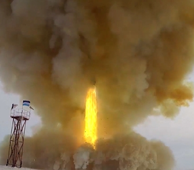

### Kalustotiedot

## R-36M2 Voyevoda (SS-18 Mod 5)
### Kuvamateriaali
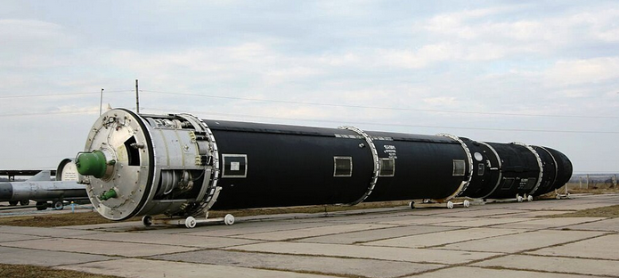

### Kalustotiedot

## RS-24 Yars
### Kuvamateriaali
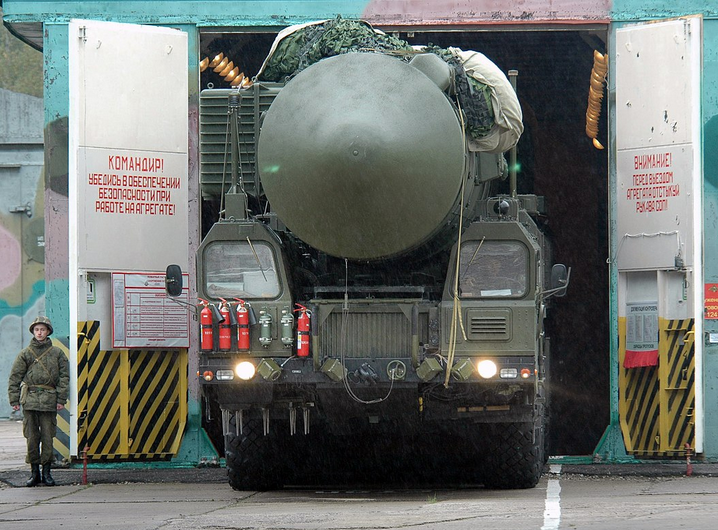
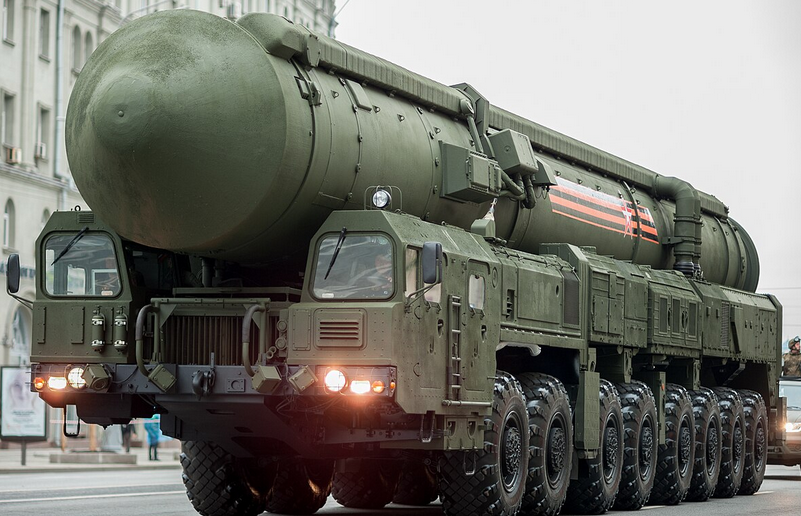

### Kalustotiedot

## RS-28 Sarmat
### Kuvamateriaali
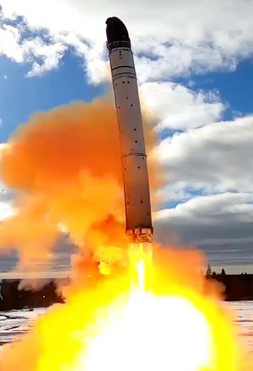
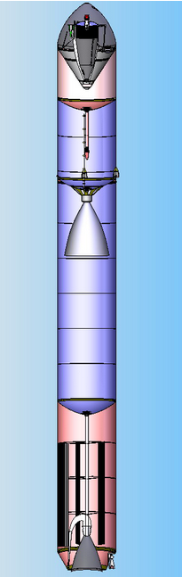

### Kalustotiedot

## RT-2PM Topol
### Kuvamateriaali
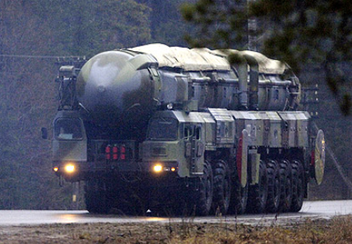
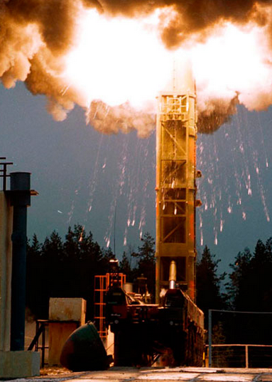

### Kalustotiedot

## RT-2PM2 Topol-M
### Kuvamateriaali
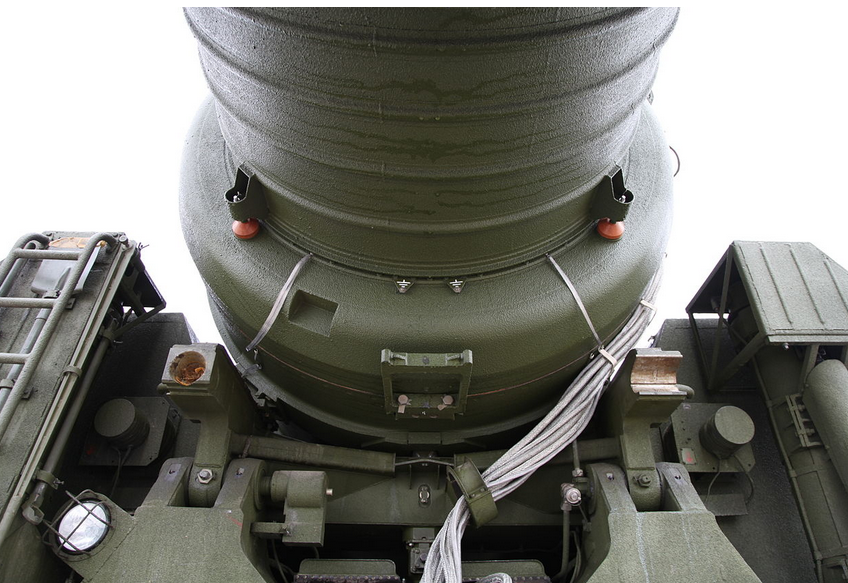
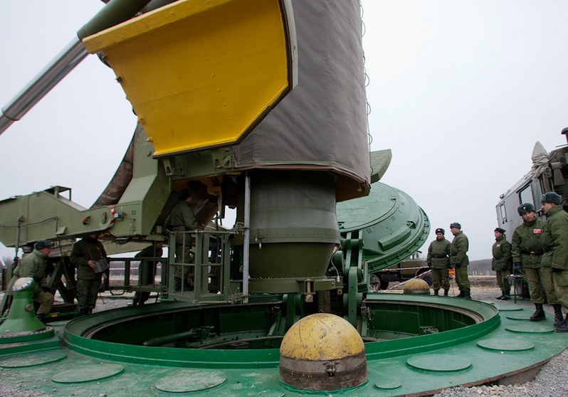

### Kalustotiedot

## UR-100NUTTKh (SS-19 Stiletto) / UR-100N
### Kuvamateriaali
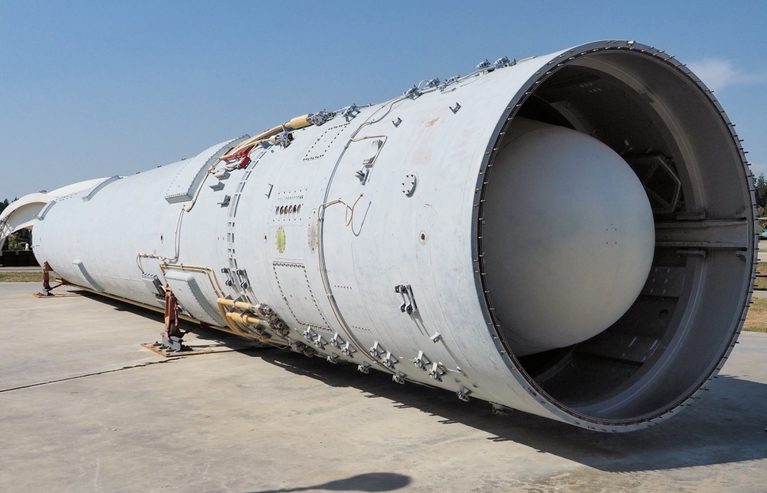
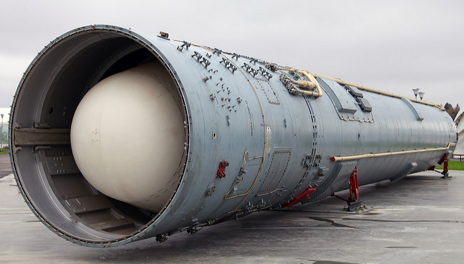

### Kalustotiedot

